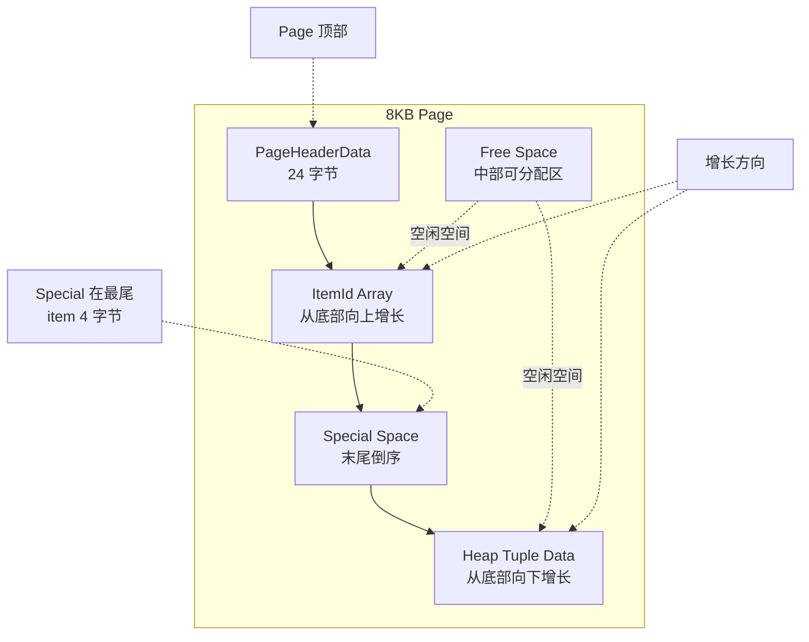
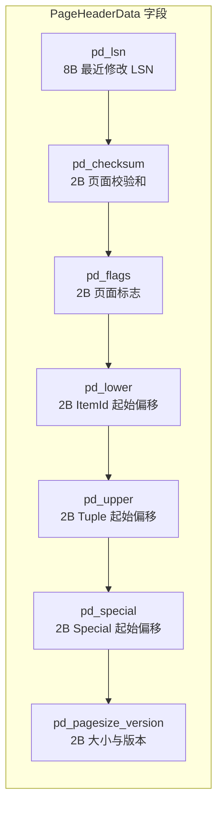
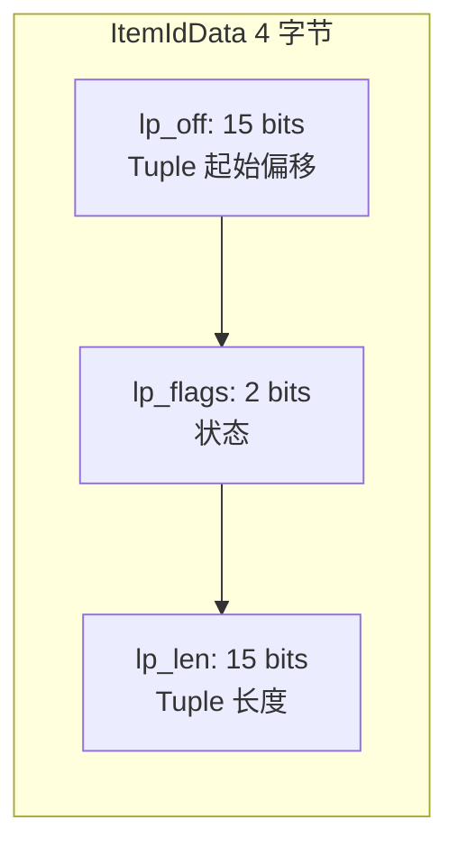
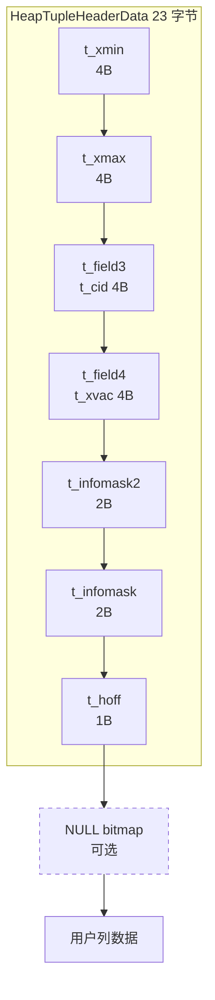
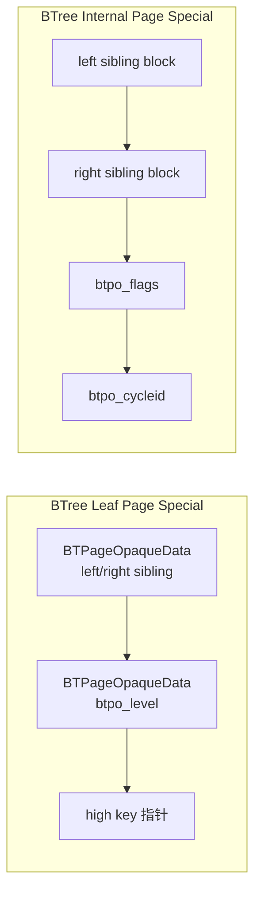
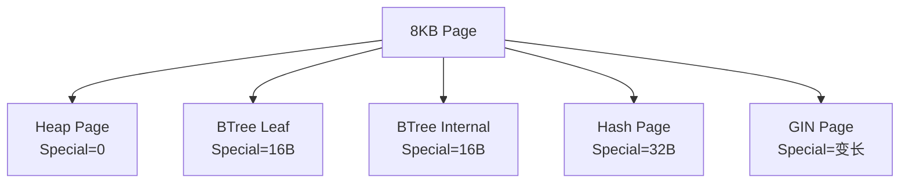
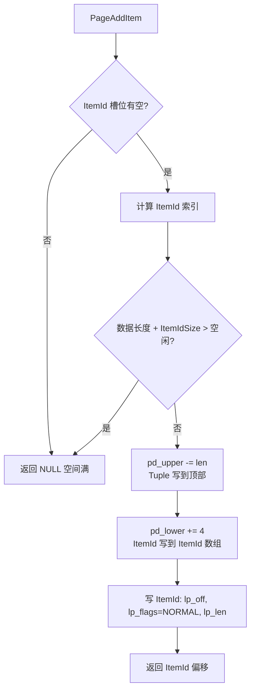
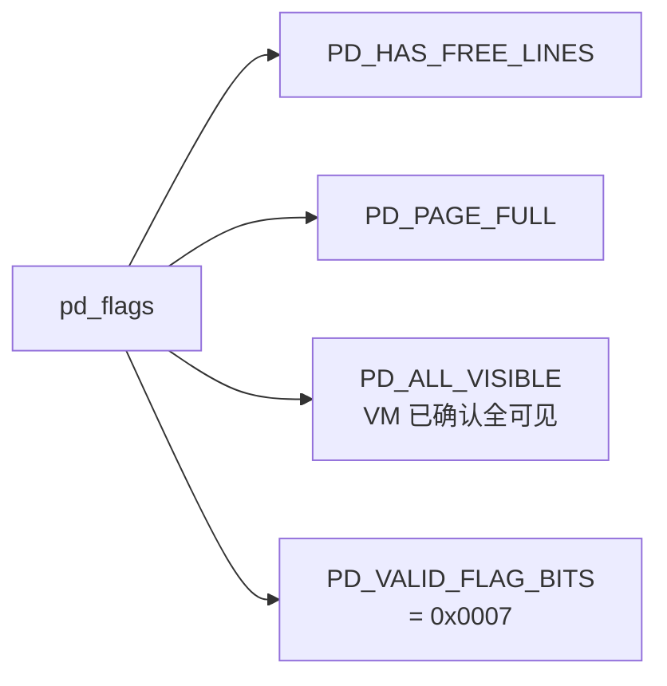
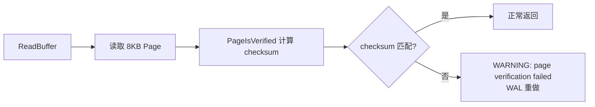
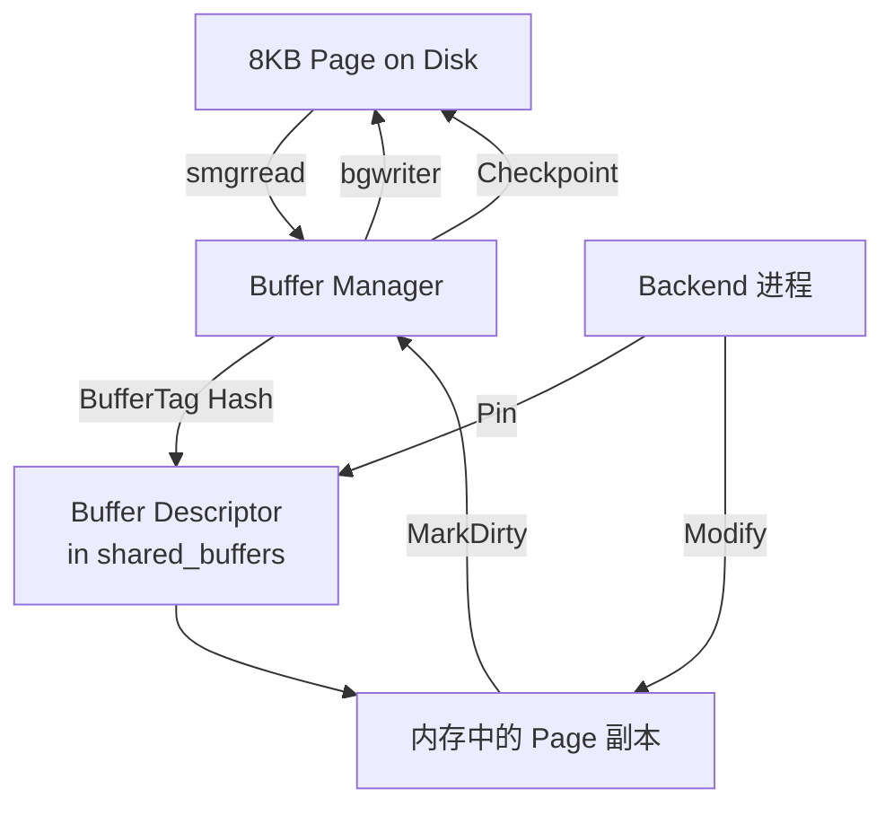

# Page 页面结构

## 学习目标

- 掌握 PostgreSQL 8KB 页面（Heap/BTree 通用）的内部布局
- 理解 PageHeader、ItemId、Tuple、Special Space 四段的作用
- 熟悉 Heap、BTree 页面变体的差异

## 核心概念

- **Page**：PG 最小的磁盘 I/O 与缓存单位，默认 8KB（`SHOW block_size`）
- **PageHeaderData（pd_*）**：页面级元数据（LSN、checksum、flags、空闲指针等）
- **ItemIdData（Line Pointer）**：每行 4 字节，存 Tuple 在页内的偏移与长度
- **HeapTuple**：用户数据 + HeapTupleHeader
- **Special Space**：BTree/Hash 等索引页面的尾部结构（存左右兄弟指针等）
- **Page Prune / Page Repair**：删除后通过修复回收 ItemId 空间

## 整体页面布局



**关键设计**：ItemId 从底部向下、Tuple 从顶部向下、中间是 Free Space。这是一种典型的"双端增长"结构，避免指针失效。

## PageHeaderData

页面级头部，固定 24 字节（包含可选 checksum 共 24 字节，无 checksum 时 16 字节）：



**关键字段**：

| 字段 | 偏移 | 含义 |
|------|------|------|
| `pd_lsn` | 0 | 最近一次写入的 LSN（与 WAL 对齐） |
| `pd_checksum` | 8 | 整页校验和（`initdb --data-checksums` 启用） |
| `pd_flags` | 10 | PD_HAS_FREE_LINES / PD_PAGE_FULL / PD_ALL_VISIBLE 等 |
| `pd_lower` | 12 | ItemId 数组的结束偏移（Free Space 下边界） |
| `pd_upper` | 14 | Tuple 区域的开始偏移（Free Space 上边界） |
| `pd_special` | 16 | Special Space 的开始偏移 |
| `pd_pagesize_version` | 18 | 页面大小（8192）+ 页面格式版本号 |

**空闲空间计算**：

```c
PageGetFreeSpace(page) = pd_special - pd_lower - pd_upper
```

## ItemIdData（Line Pointer）

每个 ItemId 4 字节，存 Tuple 在页内的位置：



`lp_flags` 取值：

| 值 | 含义 |
|---|------|
| `LP_UNUSED` (0) | 未使用条目 |
| `LP_NORMAL` (1) | 正常 Tuple |
| `LP_REDIRECT` (2) | HOT 重定向到其他 ItemId |
| `LP_DEAD` (3) | 已死 Tuple，可被 Prune 回收 |

**HOT（Heap-Only Tuple）机制**：当 UPDATE 不涉及索引列时，老 Tuple 通过 `LP_REDIRECT` 指向新 Tuple，省去索引更新。

## Tuple 数据区

Tuple 从 `pd_upper` 向下增长。Heap Tuple 的布局：



`HeapTupleHeaderData` 在 PG 12 之前是 23 字节，PG 13+ 增加了 `t_xmin` 字段的可选存储区域（如 xid_base 切片），但基本结构一致。

## Special Space

Special Space 仅在索引页（BTREE/HASH/...）和序列页等存在：



**Heap 页的 Special** 通常大小为 0（`pd_special == pd_upper`），所有可用空间都给 Tuple。

## 三种页面变体



### BTree Leaf Page

与 Heap 几乎相同，但有 16B Special（`BTPageOpaqueData`）：

- `btpo_prev` / `btpo_next`：左右兄弟页号
- `btpo_level`：0 表示叶节点，>0 表示内部节点
- `btpo_flags`：BTP_LEAF / BTP_ROOT / BTP_DELETED / BTP_HALF_DEAD / BTP_SPLIT_END / BTP_HAS_GARBAGE
- `btpo_cycleid`：用于并发页扫描

### BTree Internal Page

与 Leaf 类似，但 ItemId 指向的不是 Tuple，而是 Posting List（索引项 + child blocknum）。

### Hash Page

Hash 索引使用 4 种页面类型：
- **Bucket**：哈希桶（默认初始 2 个）
- **Overflow**：桶满时溢出
- **Bitmap**：位图跟踪已分配桶
- **Meta**：元数据页（桶数、填充因子等）

Hash Special 32B，存 bucket/overflow 相关指针。

## 页面操作

### 页面分配与初始化

新页由 `PageInit` 初始化：

```c
void PageInit(Page page, Size pageSize, Size specialSize) {
    PageHeader p = (PageHeader) page;
    p->pd_lsn = InvalidXLogRecPtr;
    p->pd_upper = pageSize - specialSize;
    p->pd_special = pageSize - specialSize;
    p->pd_flags = 0;
    p->pd_lower = SizeOfPageHeaderData;
    p->pd_prune_xid = InvalidTransactionId;
    // ... 初始化 ItemId 区域
}
```

### 写入 Tuple

`PageAddItem` 完成 INSERT 的物理写入：



### 删除与 Pruning

DELETE 不立即回收空间，而是设置 `lp_flags = LP_DEAD`：

```mermaid
flowchart TD
    A[DELETE Tuple] --> B[置 lp_flags = LP_DEAD<br/>t_infomask |= HEAP_XMAX_*]
    B --> C{其他活跃事务需要旧版本?}
    C -->|是| D[保留, 等 VACUUM]
    C -->|否| E[PageRepairFragmentation<br/>或 Prune]
    E --> F[压缩 ItemId 数组<br/>回收 LP_DEAD 槽位]
```

**Page Prune** 是轻量级回收，会整理页内 ItemId 顺序；**VACUUM** 是更重量级的清理，会跨页扫描。

## 页内遍历与可见性

### Heap Scan

```c
HeapScan -> for each page in relation:
    LockBuffer(buf, BUFFER_LOCK_SHARE)
    for each ItemId in pd_lower..pd_upper:
        if lp_flags == LP_NORMAL:
            tuple = PageGetItem(page, itemid)
            if HeapTupleSatisfiesMVCC(tuple, snapshot):
                return tuple
```

### Page Header Flags



`PD_ALL_VISIBLE` 是关键优化标志：被设置后表示该页所有 Tuple 对所有事务都可见，可以跳过 MVCC 判断，配合 Index Only Scan 大幅加速。

## 页面校验与崩溃恢复

PG 12+ 默认开启 `data checksums`：



页面校验失败的常见原因：
- 写入过程中崩溃（部分写）
- 磁盘介质损坏
- OS Page Cache 与磁盘不一致

WAL 恢复时会先尝试用最近的完整页面镜像（FPW）覆盖损坏页，再应用后续 WAL。

## 页面与缓存的关系



注意：**backend 修改的是内存中的 Page**，并不是直接写磁盘。只有 bgwriter 或 checkpointer 才会把脏页落盘。

## 要点总结

- PG 默认 8KB Page，由 PageHeader / ItemId / Tuple / Special 四段构成
- ItemId 从底部向上、Tuple 从顶部向下"双端增长"
- `pd_lsn` / `pd_checksum` / `pd_lower` / `pd_upper` 是核心字段
- BTree 在 Heap 基础上加 16B Special（sibling 指针 + level）
- Pruning 与 VACUUM 是页面空间回收的两条路径
- 页面校验（checksum）是检测磁盘损坏的关键防线

## 思考题

1. 为什么 ItemId 和 Tuple 数据从两端向中间增长？这样设计有什么好处？
2. 假设一张表的所有 Tuple 都被更新过 10 次，理想情况下页面空间应该还有多少空闲？为什么？
3. PG 默认 8KB 的页面大小，对 OLTP 与 OLAP 工作负载分别有什么影响？