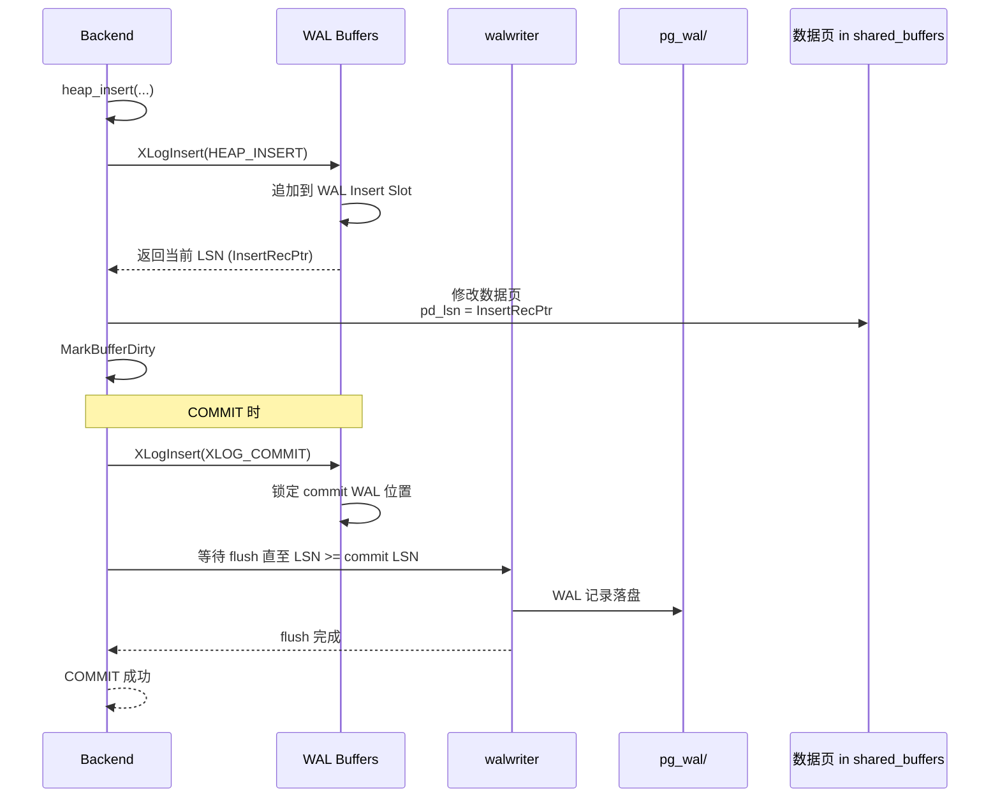
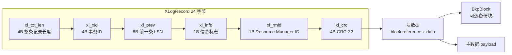
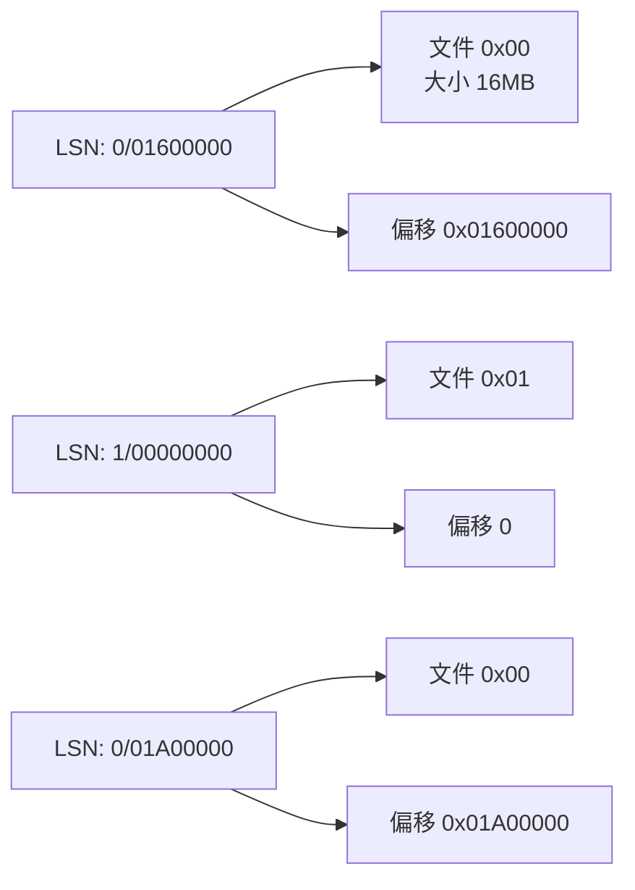
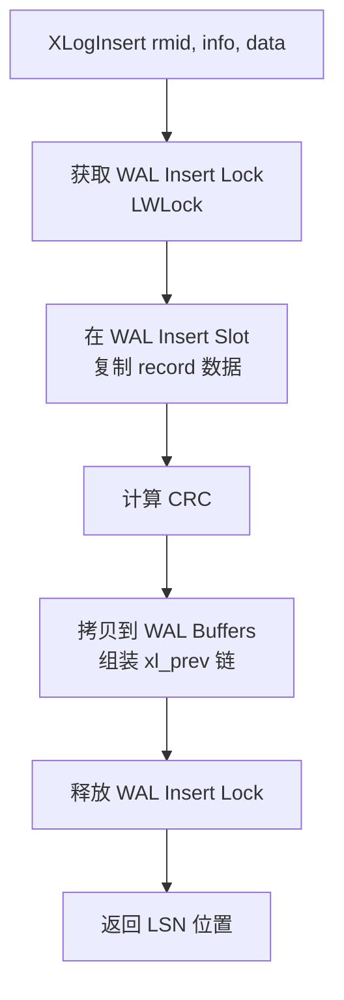
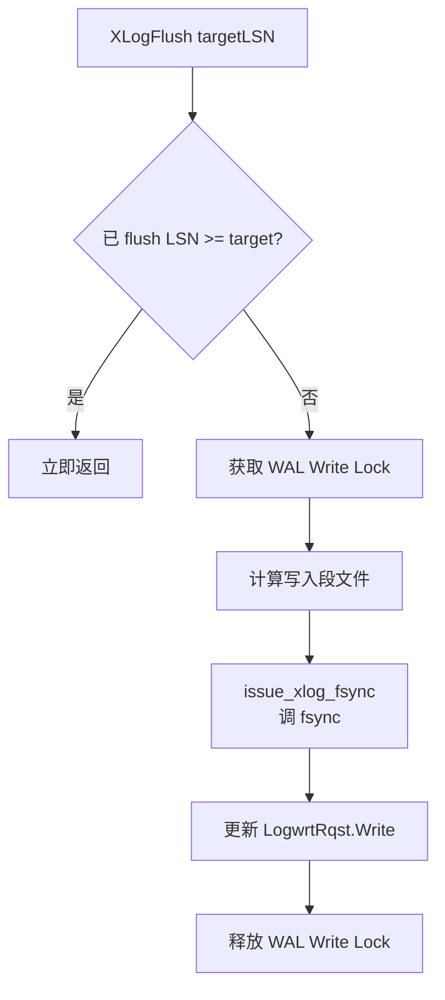
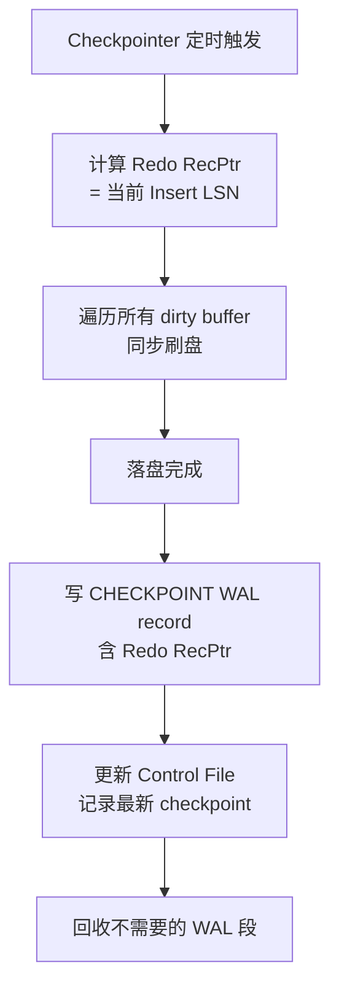
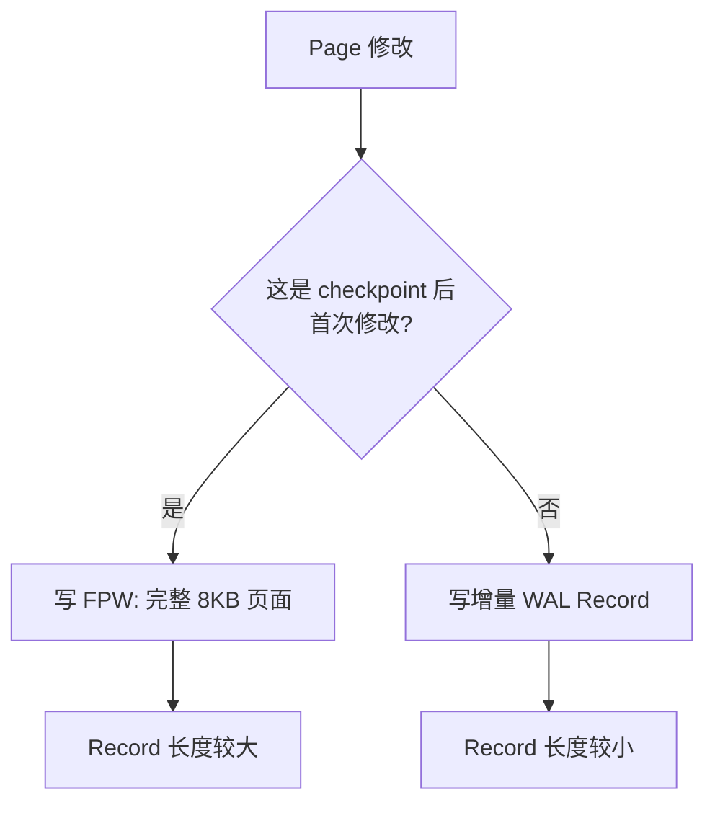
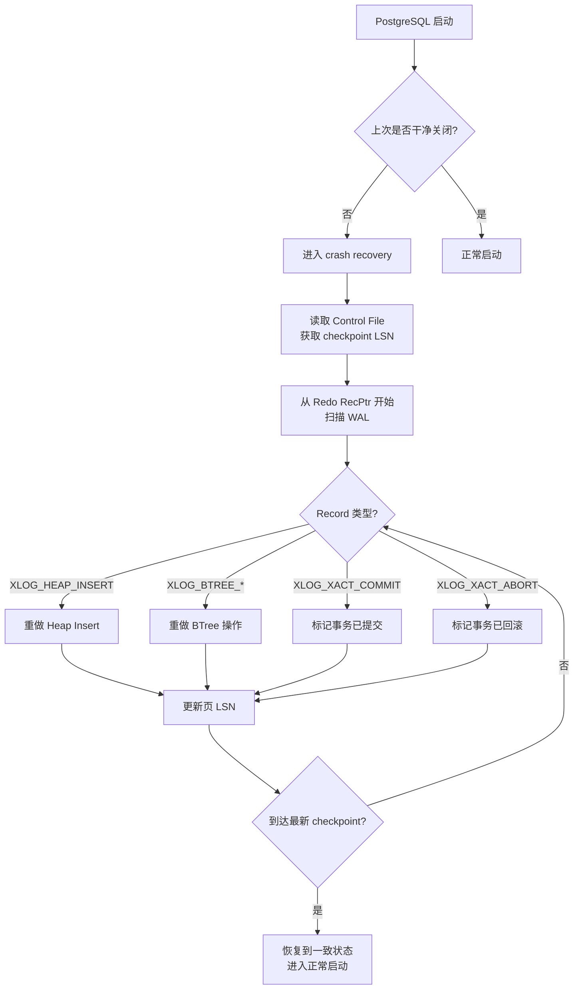
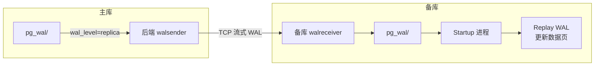
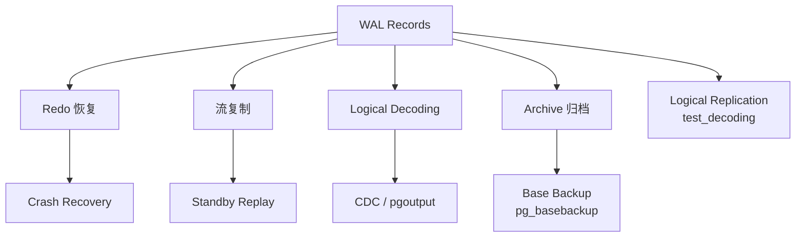

# WAL 预写日志

## 学习目标

- 理解 PostgreSQL WAL 的写入协议与持久化机制
- 掌握 LSN、Checkpoint、Redo 恢复的基本原理
- 熟悉 WAL Records、Full Page Writes、Replication 的关系

## 核心概念

- **WAL（Write-Ahead Logging）**：写前日志，所有数据页修改前必须先写日志
- **LSN（Log Sequence Number）**：WAL 中的逻辑位置，64 位单调递增
- **WAL Record**：单条日志项，包含 xl_prev、xl_xid、xl_info、xl_len 等头部
- **XLogInsert**：向 WAL Buffer 写入记录的接口
- **Full Page Writes (FPW)**：checkpoint 后第一次修改页时写入完整页面镜像
- **Checkpoint**：周期性触发，把所有脏页落盘，截断旧的 WAL
- **pg_wal/**：WAL 文件目录，文件名 16 进制 LSN，每 16MB 一个 segment
- **walwriter / checkpointer**：负责刷盘的辅助进程

## 写入路径

PG 的 WAL 协议核心规则：**在修改数据页之前，先把 WAL 记录刷盘**。



## WAL 记录结构

每条 WAL Record 由头部 + 数据组成：



**Resource Manager ID（rmid）** 区分日志来源：

- `RM_HEAP`：Heap AM 操作（INSERT/UPDATE/DELETE）
- `RM_BTREE`：BTree 索引
- `RM_XLOG`：WAL 内部操作（CHECKPOINT_SHUTDOWN、LOGICAL_MESSAGE 等）
- `RM_XACT`：事务 COMMIT/ABORT
- `RM_STANDBY`：备库相关
- `RM_REPLORIGIN`：复制起点

## LSN 与 pg_wal

LSN 是 64 位逻辑位置，高 32 位是文件号，低 32 位是文件内偏移：



**pg_wal 文件命名**：

- 文件名 24 字符 16 进制（如 `000000010000000000000001`）
- 默认大小 16MB（`--wal-segsize` 编译期配置）
- 历史文件由 checkpoint 触发回收

## 关键流程

### WAL Insert

`XLogInsert` 是写入入口，内部步骤：



**WAL Insert Lock** 是 WAL 写入的关键临界区，PG 13+ 用 `WALInsertLockUpdateContributors` 等机制优化。

### WAL Flush

`XLogFlush(LSN)` 确保指定 LSN 之前的所有 WAL 都落盘：



### Checkpoint

Checkpoint 是"一致性快照"事件，由 checkpointer 进程触发：



**触发条件**：

- `checkpoint_timeout`（默认 5 分钟）
- `max_wal_size`（默认 1GB）
- 手动 `CHECKPOINT` 命令
- 关闭时 `smart` 或 `fast` 模式

**Full Page Writes**：checkpoint 之后**每个页面的第一次修改**会把完整页面镜像写入 WAL：



`wal_compression = on` 可以压缩 FPW，节省空间但消耗 CPU。

## 恢复（Recovery）

启动时如果发现 `pg_control` 与 `pg_wal/` 不一致，进入恢复模式：



**ARIES 风格**：PG 用 `xl_prev` 链表 + Record-level redo，崩溃后只需从最近 checkpoint 重做。

## 复制（WAL Streaming）

WAL 是物理复制的"事实来源"：



**关键参数**：

- `wal_level`：`minimal` / `replica` / `logical`
- `max_wal_senders`：流复制连接数
- `wal_keep_size` / `max_slot_wal_keep_size`：保留 WAL
- `synchronous_commit`：是否同步复制

## WAL 配置参数

| 参数 | 默认值 | 推荐 | 说明 |
|------|--------|------|------|
| `wal_level` | replica | replica | 复制级别 |
| `wal_buffers` | 16MB | 16MB-64MB | WAL 缓冲区 |
| `wal_compression` | off | on (压缩盘) | FPW 压缩 |
| `checkpoint_timeout` | 5min | 15-30min | Checkpoint 间隔 |
| `checkpoint_completion_target` | 0.9 | 0.9 | 写盘目标时间比例 |
| `max_wal_size` | 1GB | 4GB-16GB | 触发 checkpoint 的 WAL 量 |
| `min_wal_size` | 80MB | 1GB-2GB | WAL 段文件保留下限 |
| `fsync` | on | on | 必须开启！ |
| `synchronous_commit` | on | on (强持久化) | 提交时刷盘 |
| `full_page_writes` | on | on | FPW 开启 |

## LSN 监控

```sql
-- 当前 Insert 位置
SELECT pg_current_xlog_insert_location(); -- PG 12 之前
SELECT pg_current_wal_insert_lsn();       -- PG 13+

-- 当前 Flush 位置
SELECT pg_current_wal_lsn();

-- WAL 状态视图
SELECT * FROM pg_stat_wal;

-- WAL 文件列表
SELECT * FROM pg_ls_waldir() LIMIT 20;
```

## WAL 与其他组件的协同



## 要点总结

- WAL 是 PG 持久化的核心：**数据页修改前必须先写日志**
- LSN 是 64 位逻辑位置，由 WAL Insert / Write / Flush 三个指针推进
- Checkpoint + Full Page Writes 保证崩溃后可恢复
- WAL 同时支撑流复制、归档、逻辑解码
- `synchronous_commit = on` 与 `fsync = on` 是持久性的最低保障

## 思考题

1. 为什么 checkpoint 后第一次页面修改必须写入完整页面（FPW）？如果不写会怎样？
2. `synchronous_commit = on/off` 的取舍是什么？在哪些场景下值得关闭？
3. WAL 段文件过大（16MB）和过小（1MB）各有什么影响？