# Isolation 隔离级别

## 学习目标

- 理解 PostgreSQL 支持的四种隔离级别及其实现差异
- 掌握 Read Committed 与 Repeatable Read 在 MVCC 快照获取时机上的区别
- 了解 Serializable 隔离级别的 SSI（可串行化快照隔离）实现原理

## 核心概念

- **Read Uncommitted**：PG 不支持——实际上映射为 Read Committed
- **Read Committed**（默认）：每条语句执行前获取独立快照
- **Repeatable Read**：事务开始时获取快照，整个事务复用
- **Serializable**：基于 SSI（Serializable Snapshot Isolation）检测写冲突
- **Predicate Lock**：谓词锁，用于 SSI 检测幻读冲突
- **SSI（Serializable Snapshot Isolation）**：通过 SIREAD 锁检测读/写冲突，实现真正的可串行化

## 隔离级别概览

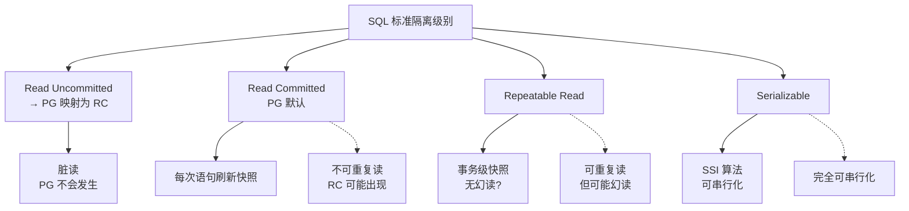

**PG 的实际行为**：

| 隔离级别 | PG 实际 | 脏读 | 不可重复读 | 幻读 | 写倾斜 |
|----------|---------|------|------------|------|--------|
| Read Uncommitted | Read Committed | 不可能 | 可能 | 可能 | 可能 |
| Read Committed（默认） | Read Committed | 不可能 | 可能 | 可能 | 可能 |
| Repeatable Read | 快照隔离 | 不可能 | 不可能 | 可能 | 可能 |
| Serializable | SSI | 不可能 | 不可能 | 不可能 | 不可能 |

## Read Committed（默认）

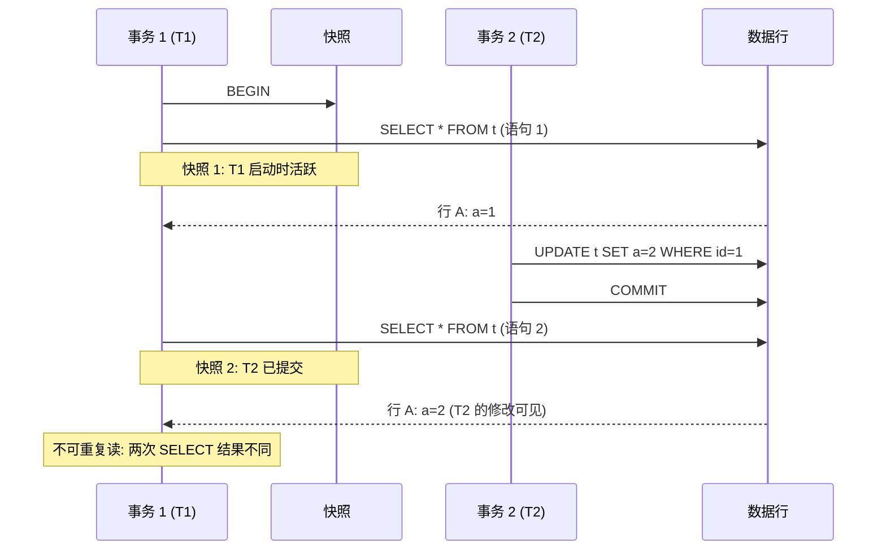

**Read Committed 规则**：

- 每条 SQL 语句开始时获取新 Snapshot
- 读到的数据是"该语句启动时刻的最新已提交数据"
- **不可重复读**：同一个事务内两次 SELECT 可能不同

**PG 的 RC 实现**：

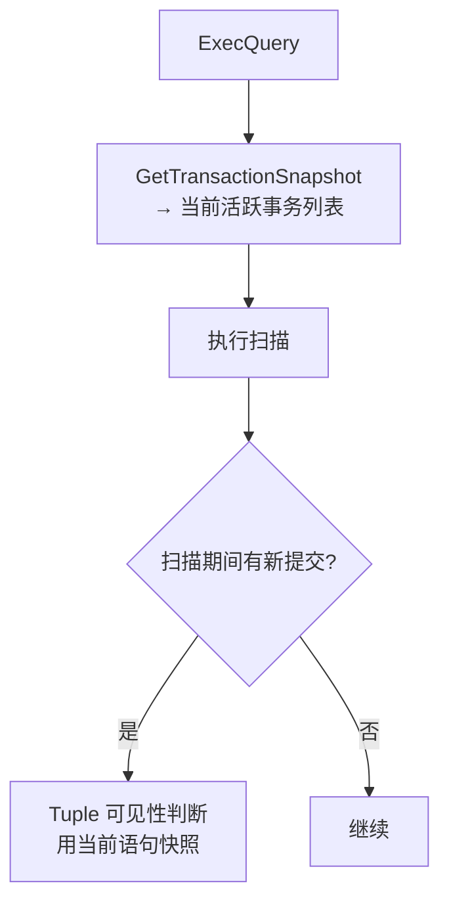

## Repeatable Read

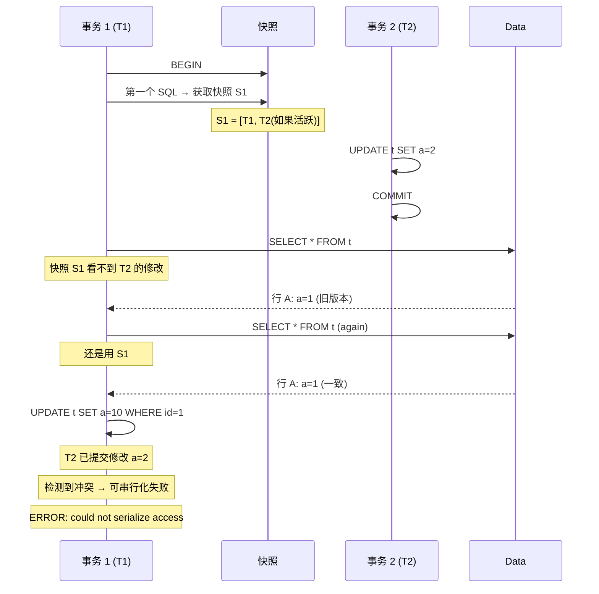

**Repeatable Read 规则**：

- 事务第一个 SQL 时获取 Snapshot，整个事务**不再刷新**
- 看到的事务状态始终是事务开始时的快照
- 写操作检测"先写后写"冲突 → 检测到则 abort

## Serializable（SSI）

PG 的 Serializable 不是简单的锁升级，而是基于 **SSI（Serializable Snapshot Isolation）** 算法：

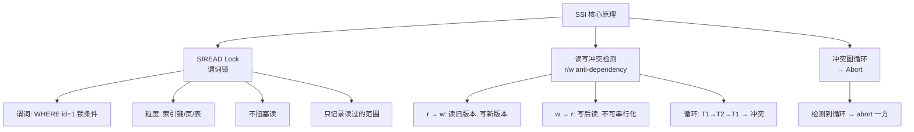

### SSI 的三种依赖

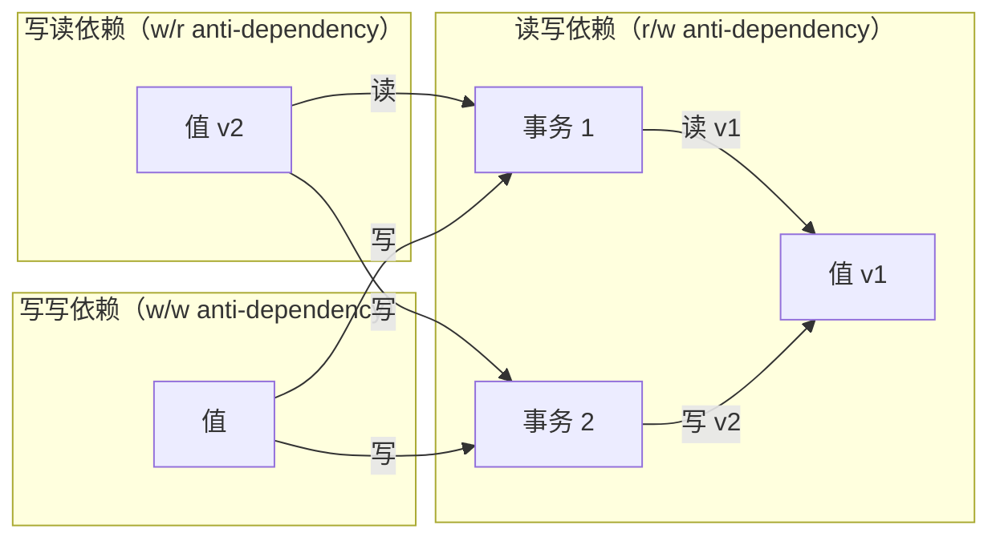

**冲突图**：

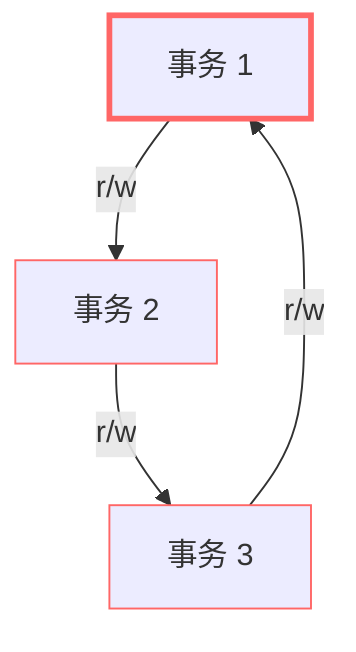

循环检测到后，abort 最晚提交的事务。

### Predicate Lock（谓词锁）

谓词锁是 SSI 的基础：

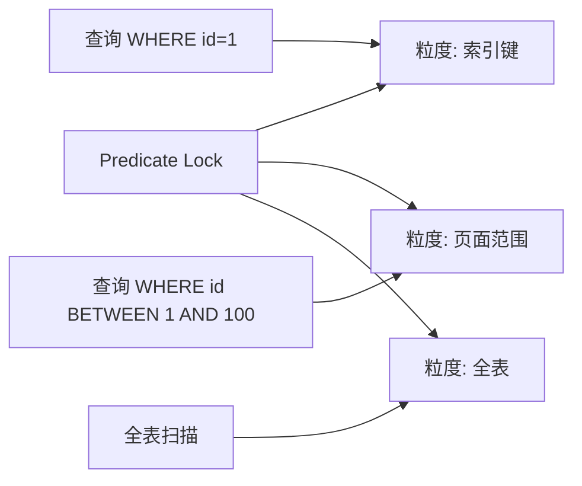

**锁存储**：Predicate Lock 存储在共享内存中，每个 SIREAD Lock 记录 `(xid, relation, key/range/tag)`。内存不足时会提升粒度（coarsen）。

### SSI 写冲突示例

```sql
-- 会话 1                              -- 会话 2
BEGIN ISOLATION LEVEL SERIALIZABLE;     BEGIN ISOLATION LEVEL SERIALIZABLE;
SELECT * FROM t WHERE id=1;             SELECT * FROM t WHERE id=1;
-- 读到 a=1                             -- 读到 a=1
UPDATE t SET a=2 WHERE id=1;            UPDATE t SET a=3 WHERE id=1;
-- 等待...                              -- COMMIT;
-- ERROR: could not serialize access
```

## 隔离级别对比

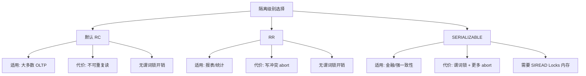

## 快照获取时机

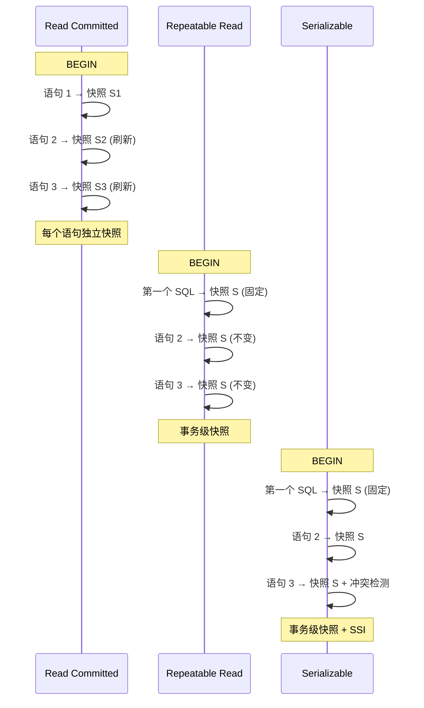

## 隔离级别的配置与查看

```sql
-- 设置隔离级别
BEGIN ISOLATION LEVEL READ COMMITTED;
BEGIN ISOLATION LEVEL REPEATABLE READ;
BEGIN ISOLATION LEVEL SERIALIZABLE;

-- 查看当前隔离级别
SHOW transaction_isolation;

-- 查看死锁/abort 信息
SELECT * FROM pg_stat_database WHERE datname = 'mydb';
```

## 性能影响

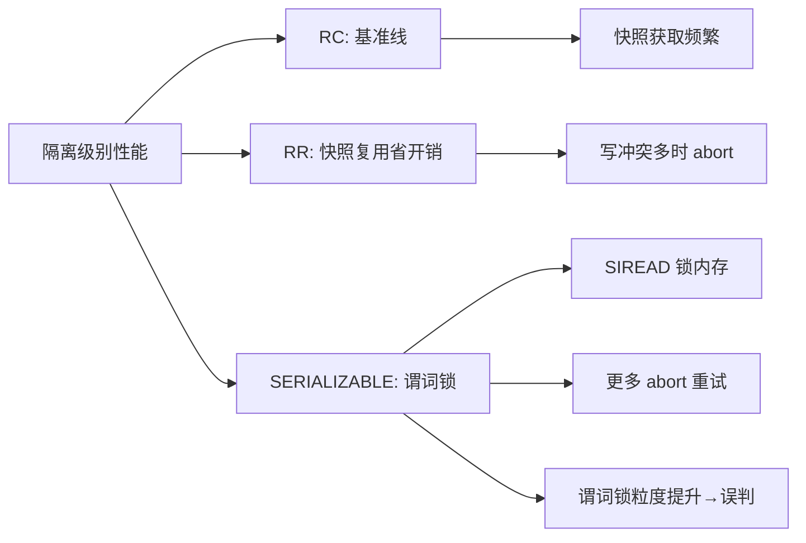

**生产环境建议**：

- 绝大多数应用使用默认 **Read Committed**
- 需要报表一致性时使用 **Repeatable Read**（快照隔离已经很强）
- 只有强一致性需求（金融、库存）才用 **Serializable**
- Serializable 下 abort 率高，应用需要设计重试逻辑

## 与 MySQL/InnoDB 对比

| 维度 | PostgreSQL | MySQL InnoDB |
|------|-----------|--------------|
| 默认隔离级别 | Read Committed | Repeatable Read |
| RR 实现 | 快照隔离（无幻读） | 快照隔离 + gap lock（防幻读） |
| Serializable | SSI（谓词锁） | `SELECT ... LOCK IN SHARE MODE` |
| 幻读保护 | RR 无幻读保护，SERIALIZABLE 有 | RR 有 gap lock 保护 |
| 写冲突 | abort | 等待锁释放 |
| gap lock | 无 | 有（行锁之间的间隙） |

## 要点总结

- PG 的 Read Committed 是默认级别，每语句独立快照 → **不可重复读**
- Repeatable Read 使用事务级快照 → **快照隔离**（可重复读，但可能幻读）
- Serializable 使用 **SSI 算法**，谓词锁 + 冲突图检测 → 完全可串行化
- SSI 需要额外内存存 SIREAD 锁，abort 率会上升
- 与 MySQL RR 相比，PG 没有 gap lock，写冲突靠 abort 而非阻塞

## 思考题

1. PG 的 Repeatable Read 为什么不防幻读？这和 MySQL RR 用 gap lock 防幻读的设计理念有何不同？
2. Serializable 隔离级别下 abort 率较高，实际业务场景中应该如何处理 abort 后的重试？
3. 为什么 PG 不把 Read Uncommitted 实现为真正的脏读？这个设计决策背后的权衡是什么？