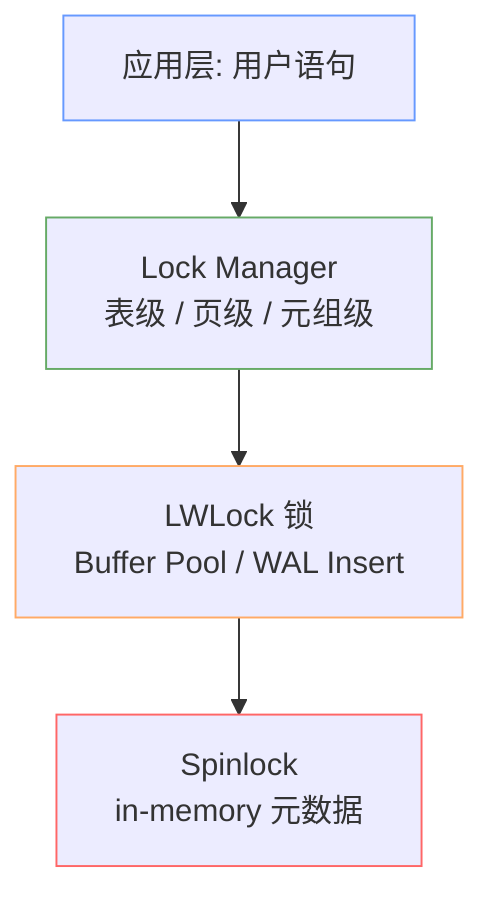
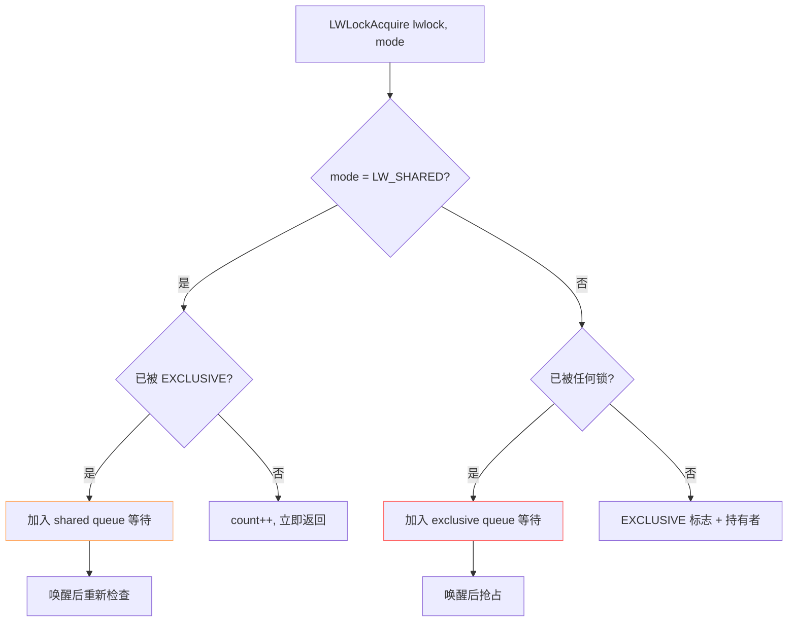
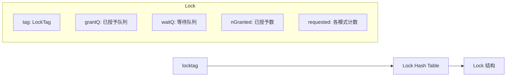
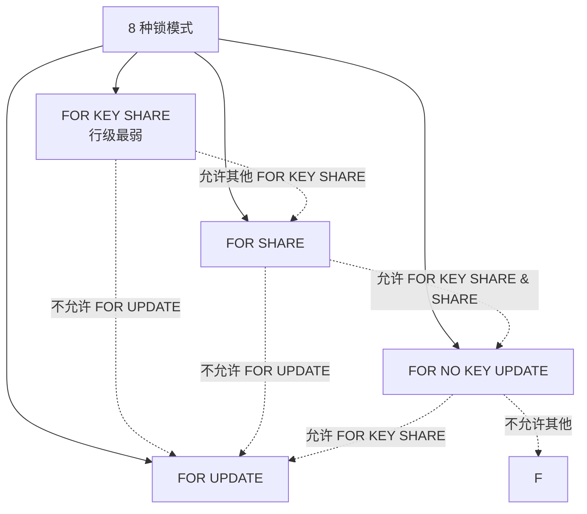
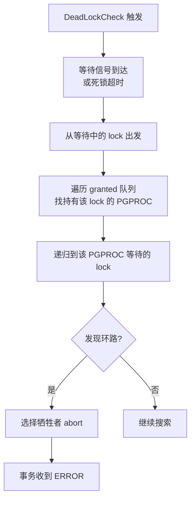
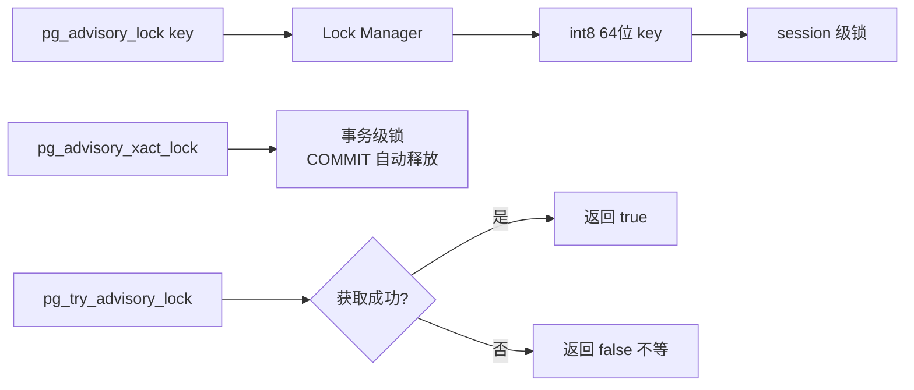
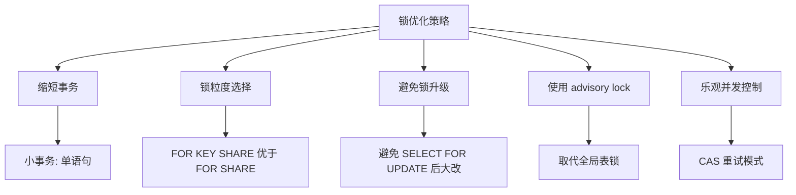
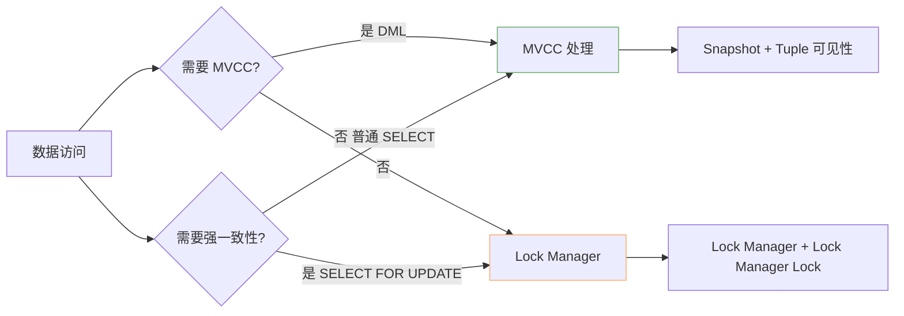
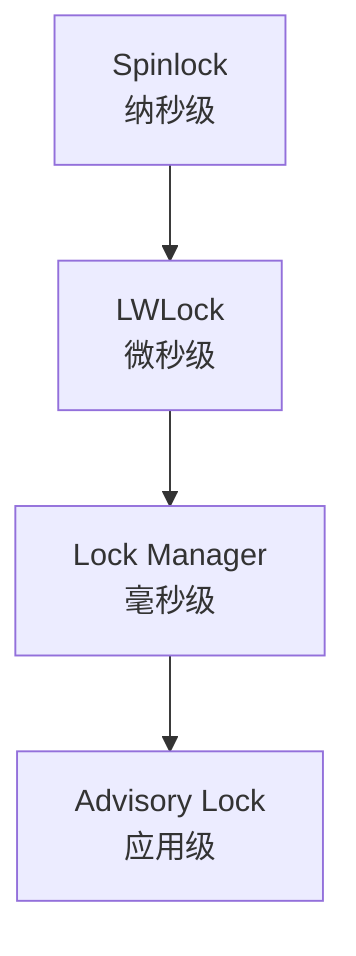

# Locking 锁机制

## 学习目标

- 理解 PostgreSQL 锁的三层粒度（表级 / 页级 / 元组级）
- 掌握 Lock Manager 与 Spinlock/LWLock 的协作关系
- 熟悉死锁检测、锁等待、锁升级策略

## 核心概念

- **Spinlock**：极短临界区，硬件级 CAS（Compare-And-Swap），自旋实现
- **LWLock（Light-weight Lock）**：轻量级锁，保护共享内存结构，自旋+等待队列
- **Lock Manager**：表级 / 页级 / 元组级锁的中央管理器
- **Lock Method**：8 种锁模式（SELECT FOR UPDATE/SHARE 等）
- **Deadlock Detection**：周期性构建等待图，检测环路并 abort 一方
- **Advisory Lock**：用户自定义的命名锁
- **Two-phase Locking (2PL)**：典型 8 锁模式兼容矩阵

## 锁的层次结构

PG 的锁机制从底层到上层分四层：



**从上到下，锁粒度越细、生命周期越短**。

## Spinlock 自旋锁

```c
typedef struct slock_t {
    slock_t     tag;       // 原子变量
} slock_t;

void SpinLockAcquire(s_lock *lock) {
    while (1) {
        // 等待锁释放（自旋）
        while (lock->tag != 0)
            ;
        // CAS 抢占
        if (pg_atomic_test_set(&lock->tag, 1))
            break;
    }
}
```

**特点**：

- 持有时间极短（纳秒级）
- 不可被中断（不可 sleep）
- 不可递归
- PG 中用于 `XLogCtl`、`ProcArray` 等热点

## LWLock 轻量级锁

LWLock 位于共享内存，保护较长时间但仍较短的临界区：



**核心 LWLock 列表**：

| LWLock | 作用 |
|--------|------|
| `BufMappingLock` | Buffer Lookup Hash Table |
| `WALInsertLock` | WAL 写入串行化 |
| `LockMgrLock` | 全局锁表 |
| `ProcArrayLock` | 进程数组 / Snapshot |
| `CLogControlLock` | CLOG 读写 |

PG 13+ 把部分 LWLock 拆成"分区版本"（如 `BufMappingLock` → `NUM_BUFFER_PARTITIONS` 个），减少争用。

## Lock Manager 表/页/元组锁

Lock Manager 维护全局锁表（`LockHash`），按 `locktag` 索引：



**locktag 五元组**：

```c
typedef struct LOCKTAG {
    uint32      locktag_field1;   // relation OID / etc
    uint32      locktag_field2;   // database / etc
    uint32      locktag_field3;   // page/block / etc
    uint16      locktag_field4;   // tuple offset
    uint8       locktag_type;     // TABLE / PAGE / TUPLE / OBJECT / ...
    uint8       locktag_lockmethodid;
} LOCKTAG;
```

**锁类型枚举**：

| `locktag_type` | 含义 |
|----------------|------|
| `LOCKTAG_RELATION` | 表级锁 |
| `LOCKTAG_RELATION_EXTEND` | 表扩展锁 |
| `LOCKTAG_PAGE` | 页级锁（PG 9.4+ 已弱化） |
| `LOCKTAG_TUPLE` | 元组级锁（极轻量） |
| `LOCKTAG_TRANSACTION` | 事务等待 |
| `LOCKTAG_OBJECT` | 通用对象锁 |
| `LOCKTAG_USERLOCK` | 用户/会话锁 |
| `LOCKTAG_ADVISORY` | 应用层 advisory lock |

## 8 种锁模式

PG 在表级实现 **Two-Phase Locking（2PL）** 的 8 模式：



**兼容矩阵**（横向 = 持有，纵向 = 请求）：

| 持有\\请求 | KEY SHARE | SHARE | NO KEY UPDATE | UPDATE |
|------------|-----------|-------|---------------|--------|
| **KEY SHARE** | OK | OK | OK | CONFLICT |
| **SHARE** | OK | OK | CONFLICT | CONFLICT |
| **NO KEY UPDATE** | OK | CONFLICT | CONFLICT | CONFLICT |
| **UPDATE** | CONFLICT | CONFLICT | CONFLICT | CONFLICT |

**自动锁模式映射**：

| SQL | 锁模式 |
|-----|--------|
| `SELECT` | 无（依赖 MVCC） |
| `SELECT FOR KEY SHARE` | FOR KEY SHARE |
| `SELECT FOR SHARE` | FOR SHARE |
| `SELECT FOR NO KEY UPDATE` | FOR NO KEY UPDATE |
| `SELECT FOR UPDATE` | FOR UPDATE |
| `UPDATE`（非键列） | FOR NO KEY UPDATE |
| `UPDATE`（键列） | FOR UPDATE |
| `DELETE` | FOR UPDATE |
| `INSERT ... ON CONFLICT` | FOR NO KEY UPDATE |

## 死锁检测

Lock Manager 周期性运行 `DeadLockCheck`：



**死锁参数**：

- `deadlock_timeout`：默认 1s，触发检查的等待时长
- `lock_timeout`：默认 0（无限），单个锁的最大等待时间

```sql
-- 防止死锁无限等待
SET lock_timeout = '5s';
SET statement_timeout = '30s';
```

## Advisory Lock 应用层锁

Advisory Lock 允许应用自定义的命名锁：



**应用场景**：

- 分布式锁（基于数据库的协调）
- 防止并发 cron 任务
- 限流器 / 单实例执行

```sql
-- session 级 advisory lock
SELECT pg_advisory_lock(42);
-- ... 关键逻辑 ...
SELECT pg_advisory_unlock(42);

-- 事务级（COMMIT 自动释放）
BEGIN;
SELECT pg_advisory_xact_lock(42);
-- ...
COMMIT;
```

## 锁监控

```sql
-- 当前所有锁
SELECT pg_class.relname, pg_locks.mode, pg_locks.granted,
       pg_stat_activity.query, pg_stat_activity.pid
FROM pg_locks
JOIN pg_class ON pg_locks.relation = pg_class.oid
JOIN pg_stat_activity ON pg_locks.pid = pg_stat_activity.pid
WHERE pg_locks.granted = false;

-- 锁等待
SELECT blocked.pid, blocked.usename, blocked.query AS blocked_query,
       blocking.pid AS blocking_pid, blocking.query AS blocking_query
FROM pg_stat_activity blocked
JOIN pg_locks bl ON bl.pid = blocked.pid
JOIN pg_locks kl ON kl.locktype = bl.locktype AND ...
JOIN pg_stat_activity blocking ON blocking.pid = kl.pid
WHERE NOT bl.granted;
```

## 锁优化建议



**关键实践**：

1. **永远不要在交互式应用里做 `SELECT FOR UPDATE` + 长业务**：锁持有时间长易死锁
2. **优先使用 `FOR KEY SHARE` / `FOR NO KEY UPDATE`**：保留与多数读操作的兼容
3. **设置 `lock_timeout`**：避免长等待拖垮连接池
4. **避免 `LOCK TABLE`**：MVCC 下通常不必要

## 锁与 MVCC 的关系



MVCC 让大多数 SELECT 不需要锁；只有显式 `FOR UPDATE/SHARE` 或 DDL 才用 Lock Manager。

## 锁层级交互



**关键规则**：

- Spinlock 内**不能**申请 LWLock
- LWLock 内**不能**申请 Lock Manager 锁
- Lock Manager 锁可嵌套持有

## 要点总结

- PG 锁分四层：Spinlock → LWLock → Lock Manager → Advisory Lock
- 表级锁实现 2PL 4 模式（KEY SHARE / SHARE / NO KEY UPDATE / UPDATE）
- 元组级锁是极轻量的 in-page 锁（PG 9.4+）
- 死锁检测周期性运行，`lock_timeout` 防止无限等待
- 大多数 SELECT 通过 MVCC 不持锁，Lock Manager 主要服务 DML/DDL

## 思考题

1. 为什么 PG 把"读"和"写"的锁分得这么细（4 个级别），而不是统一用 `READ` / `WRITE`？这样设计对性能有什么影响？
2. 如果你的应用出现大量 `Lock wait` 事件，从锁机制角度应该怎么排查？
3. Advisory Lock 在分布式场景下是否是合适的分布式锁实现？为什么？