# MVCC 多版本并发控制

## 学习目标

- 理解 PostgreSQL MVCC 的核心机制：Heap 多版本 + xmin/xmax + Snapshot
- 掌握快照隔离下的行可见性判断流程
- 熟悉 VACUUM / HOT 等清理与优化策略

## 核心概念

- **MVCC（Multi-Version Concurrency Control）**：每个写操作产生新版本，读操作基于 Snapshot 选择可见版本
- **xmin / xmax**：Tuple 头部的两个事务 ID
- **Snapshot**：事务开始时获取的一致性视图，含 xmin/xmax/active_xip 数组
- **Hint Bits**：Tuple 头部的标志位，缓存"已提交/未提交"判断
- **CLOG（Commit Log）**：所有事务提交状态的位图
- **VACUUM**：清理死元组、回收空间
- **HOT（Heap-Only Tuples）**：原地 UPDATE 优化，省去索引更新

## MVCC 的核心理念

PG 的 MVCC 不是"在数据上锁"，而是"每个 Tuple 都是一个版本"。

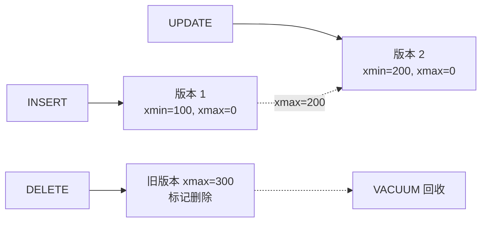

**核心规则**：对于一个事务而言，每个 Tuple 的可见性独立判断。

## Tuple 头部关键字段

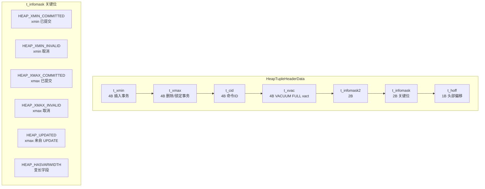

**关键状态位**：

| 标志 | 含义 |
|------|------|
| `HEAP_XMIN_COMMITTED` | xmin 事务已提交 |
| `HEAP_XMIN_INVALID` | xmin 事务回滚 |
| `HEAP_XMAX_COMMITTED` | xmax 事务已提交（行已删除） |
| `HEAP_XMAX_INVALID` | xmax 事务回滚或为 0（行未删除） |
| `HEAP_UPDATED` | xmax 是另一个 UPDATE 操作 |
| `HEAP_MARKED_FOR_UPDATE` | SELECT FOR UPDATE 标记 |
| `HEAP_KEYS_UPDATED` | UPDATE 修改了索引列 |

## Snapshot 快照

每个事务在第一次执行 SQL 时（`GetSnapshotData`）创建一个 Snapshot：

```mermaid
graph LR
    subgraph "SnapshotData"
        S1[xmin: 32B<br/>下边界]
        S2[xmax: 32B<br/>上边界]
        S3[xcnt: int<br/>active_xip 长度]
        S4[active_xip: xid[]<br/>活跃事务]
        S5[subxcnt: int]
        S6[subxip: xid[]<br/>子事务]
        S7[suboverflowed: bool]
        S8[takenDuringRecovery: bool]
        S9[curcid: int<br/>命令ID]
    end

    S1 --> S2
    S2 --> S3
    S3 --> S4
    S4 --> S5
    S5 --> S6
    S6 --> S7
    S7 --> S8
    S8 --> S9
```

**Snapshot 含义**：

- `xmin` < `xact` < `xmax`：在这个范围内的事务
- `xact` < `xmin`：`xact` 在快照前已提交 → 可见
- `xact` >= `xmax`：`xact` 在快照后启动 → 不可见
- `xact` 在 `active_xip` 中：活跃 → 不可见

## 可见性判断流程

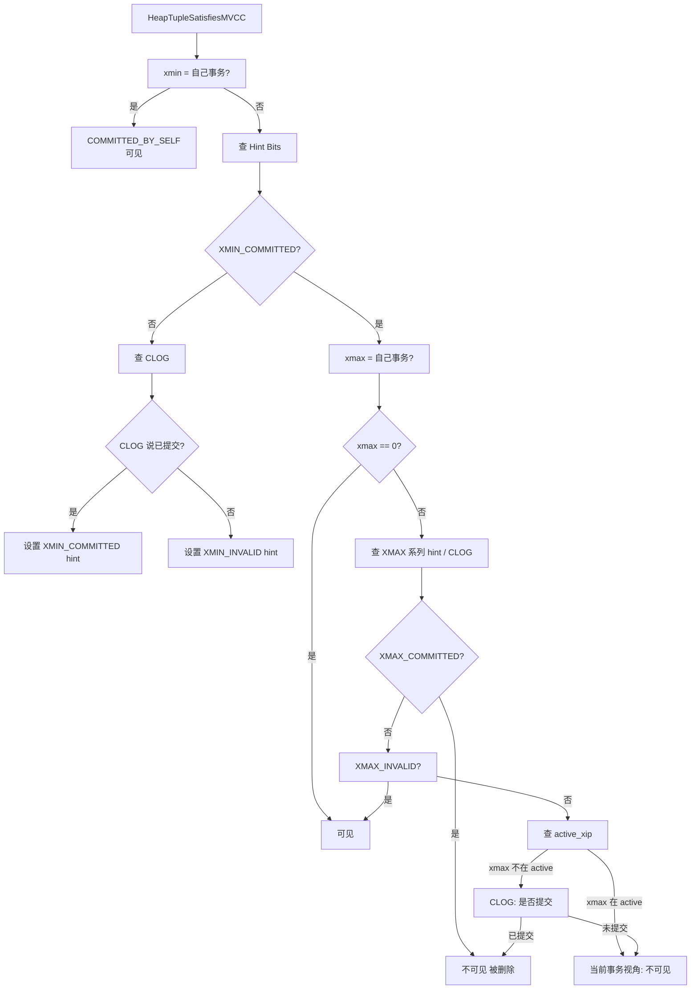

**简化版规则**：

```sql
visible(tuple) = 
    (xmin committed) AND
    (xmax == 0 OR xmax == self OR 
     (xmax != committed AND xmax not in active_xip))
```

## MVCC 写路径

### INSERT

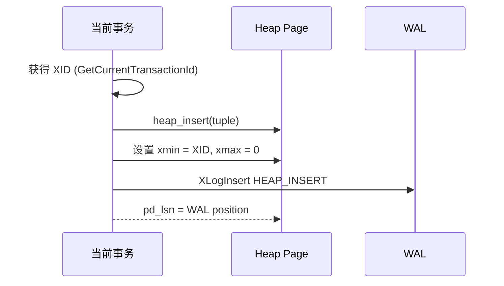

### UPDATE

PG 的 UPDATE 是 "DELETE + INSERT" 的语义：

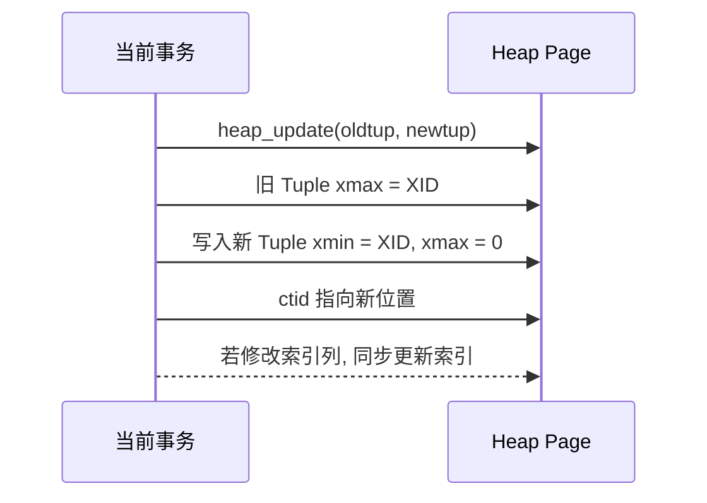

如果**只更新非索引列**，PG 启用 **HOT**（Heap-Only Tuple）：

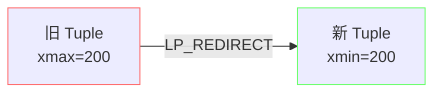

HOT 优化：省去索引更新、版本在同一页内、减小 WAL。

### DELETE

```mermaid
flowchart TD
    A[heap_delete] --> B[找到目标 Tuple]
    B --> C[设置 xmax = current XID]
    C --> D[t_infomask |= HEAP_MARKED_FOR_UPDATE]
    D --> E[XLogInsert HEAP_DELETE]
    E --> F[Tuple 物理保留<br/>等 VACUUM]
```

## Snapshot 类型

PG 有四种 Snapshot，分别用于不同场景：

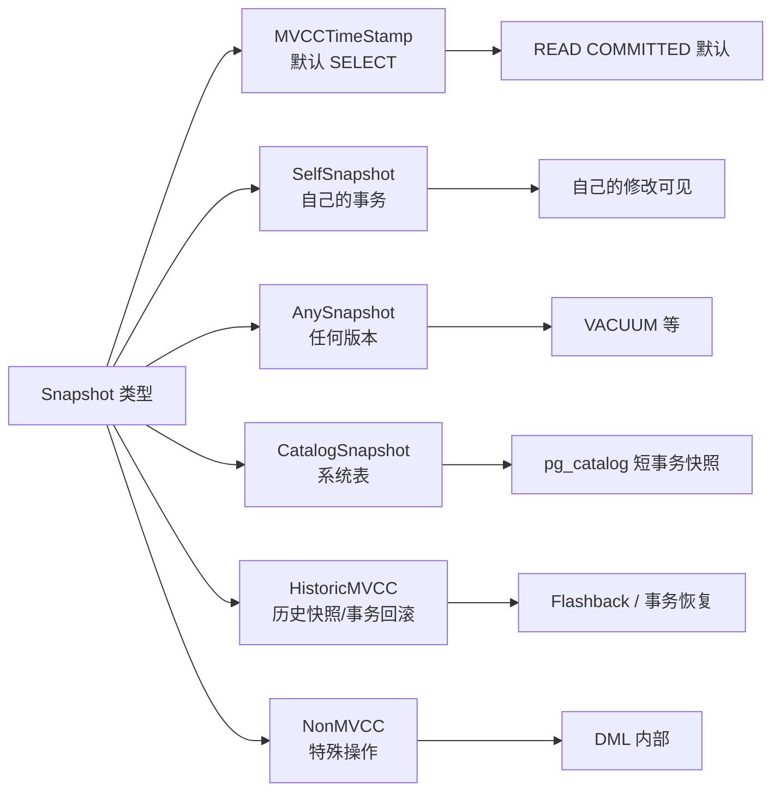

## CLOG 与 Hint Bits

### CLOG（Commit Log）

每个事务提交/回滚状态用 2 bit 存储在 CLOG 中：

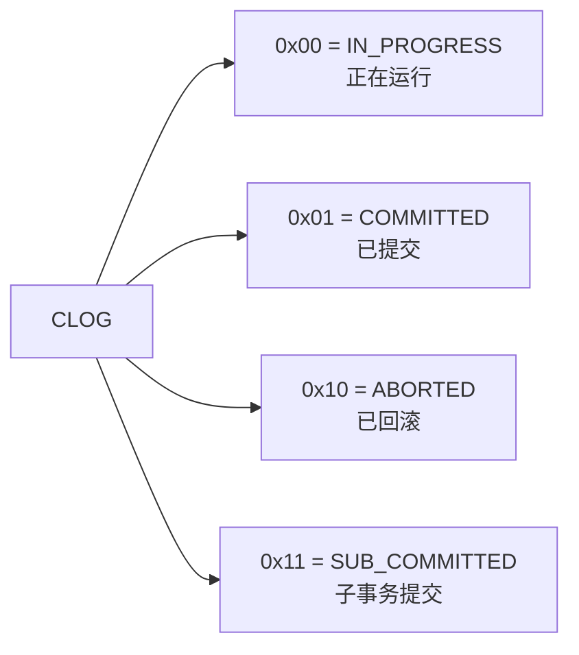

CLOG 位置：`pg_xact/` 目录，文件名 8KB 一个，分页存储。

### Hint Bits

CLOG 查询是 IO 操作，PG 通过 Hint Bits 把结果缓存到 Tuple 头部：

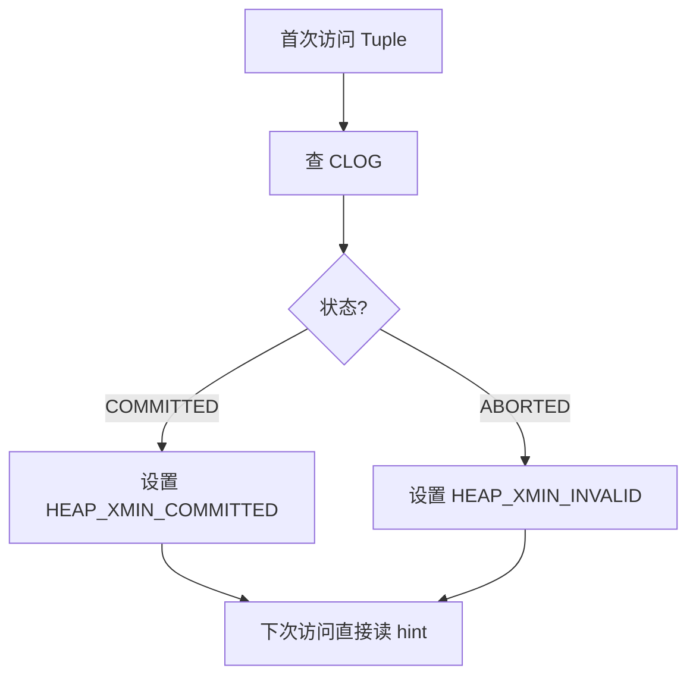

Hint Bits 一旦设置，几乎不会失效，访问效率极高。

## VACUUM 机制

### 为什么需要 VACUUM

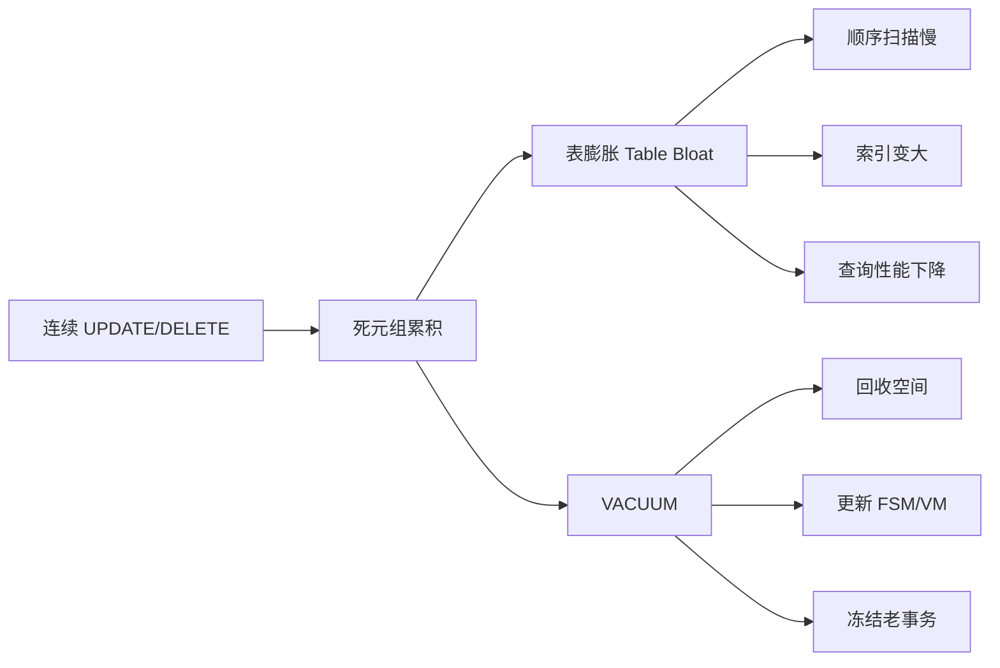

### VACUUM 流程

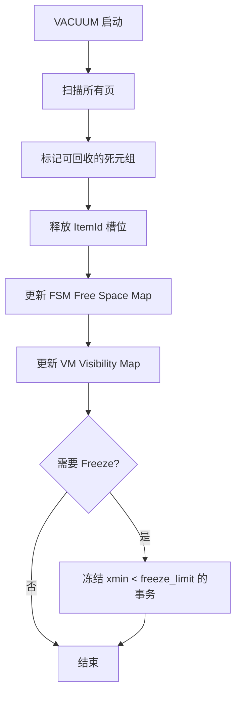

**autovacuum** 守护进程会自动触发，参数：

- `autovacuum_vacuum_threshold`：默认 50
- `autovacuum_vacuum_scale_factor`：默认 0.2（表 20% 变化触发）
- `autovacuum_naptime`：默认 1 分钟检查间隔

### HOT（Heap-Only Tuple）

当 UPDATE 不修改索引列，新版本与旧版本在同一页面：

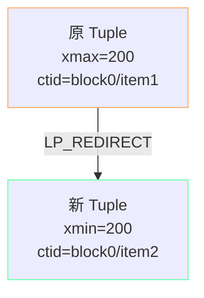

HOT 收益：
- 无索引更新（关键）
- 旧版本通过 ctid 链找到新版本
- VACUUM 时一次性回收

PG 10+ 的 **Pruning** 进一步优化：在 HOT Update 后页面接近满时主动回收死元组。

## MVCC 与锁的关系

MVCC 提供读不阻塞写、写不阻塞读；但 DDL 与特定操作仍需锁：

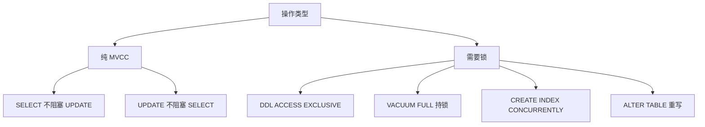

## MVCC 的代价

| 收益 | 代价 |
|------|------|
| 读不阻塞写 | 写不删除旧版本 |
| UPDATE 是新版本 | 死元组膨胀 |
| 快照隔离简单 | 需要 VACUUM |
| 行级并发 | Tuple 比纯行大（23B header） |
| 高并发写 | Update 触发索引更新 |

## 与其他数据库的对比

| 维度 | PostgreSQL | MySQL InnoDB | Oracle |
|------|-----------|--------------|--------|
| 版本存储 | Heap Tuple | 聚簇索引 + undo | undo tablespace |
| 回滚段 | 无（用 VACUUM 清理） | undo log | undo segment |
| 快照粒度 | 语句级（默认） | 语句级（默认） | 语句级 |
| 旧版本清理 | VACUUM + autovacuum | purge 线程 | SMON 后台 |
| 可见性依据 | xmin/xmax + Snapshot | trx_id + read view | SCN + undo |
| 行 header | 23 字节 | 5 字节事务ID + 6B roll ptr | 大 |

## 要点总结

- PG 用 **Heap 多版本 + Snapshot 隔离** 实现 MVCC
- Tuple 头部携带 `xmin` / `xmax` / `t_infomask`，可见性靠 Hint Bits + CLOG 缓存
- **UPDATE = DELETE + INSERT**，老版本由 VACUUM 异步清理
- HOT 优化省去索引更新，Pruning 让页内回收更轻量
- autovacuum 是 PG 健康运行的关键，调优 `autovacuum_*` 参数至关重要

## 思考题

1. 为什么 PG 没有像 InnoDB 那样用 undo log 来回滚，而是直接保留多版本？两种设计在哪些场景下差异最大？
2. 一个超长事务（如 pg_dump）长时间持有 Snapshot，会对 VACUUM 产生什么影响？
3. 如果表上频繁做 UPDATE，但没有 VACUUMM 介入，会出现什么状况？autovacuum 调优的常见手段有哪些？