# Executor 执行器

## 学习目标

- 理解 PostgreSQL Volcano 火山模型执行器的核心架构
- 掌握 TupleTableSlot、ExprContext、ExprState 的作用与协作
- 熟悉 ExecProcNode 递归调用、并行执行、JIT 编译优化

## 核心概念

- **Volcano Model**：迭代器模型，每个节点实现 `ExecProcNode` 接口
- **TupleTableSlot（TTS）**：存储一行数据的槽位
- **ExprContext**：表达式执行上下文（参数、内存、快照）
- **ExprState**：编译后的表达式状态
- **ExecProcNode**：节点执行函数指针
- **PlanState**：运行时的 Plan 状态
- **Parallel Executor**：并行执行框架（Gather / Gather Merge）

## 火山模型架构

PG 的执行器采用经典的 Volcano 火山模型，每个节点实现统一接口：

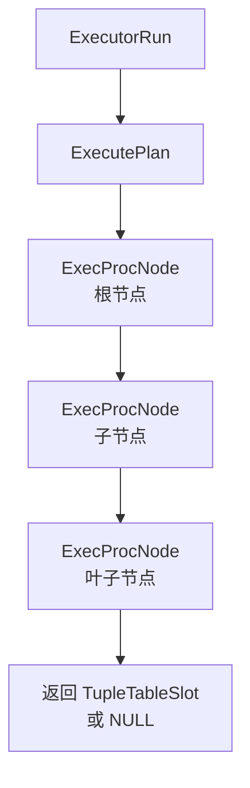

**核心接口**：

```c
// 每个节点实现此接口
TupleTableSlot *ExecProcNode(PlanState *node);
```

## Plan 节点与 PlanState

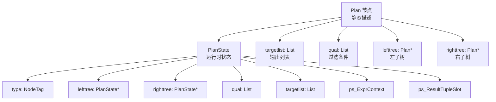

## TupleTableSlot（TTS）

TTS 是执行器中的"一行数据容器"：

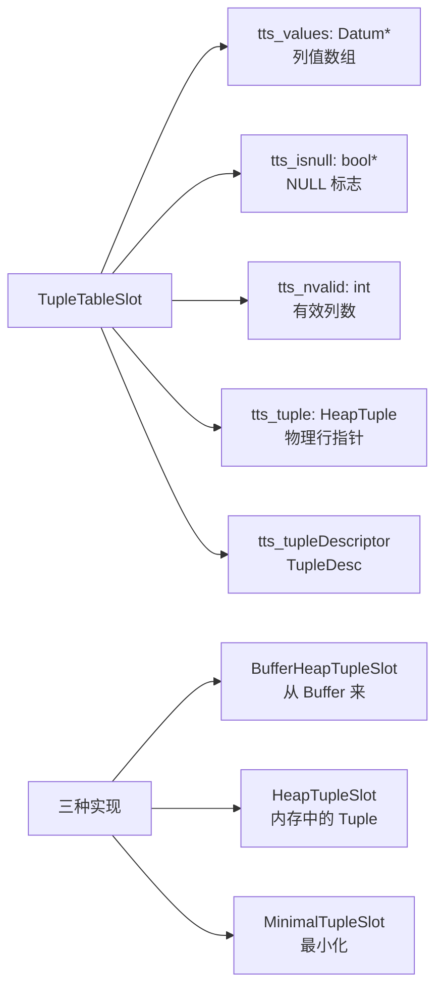

**生命周期**：

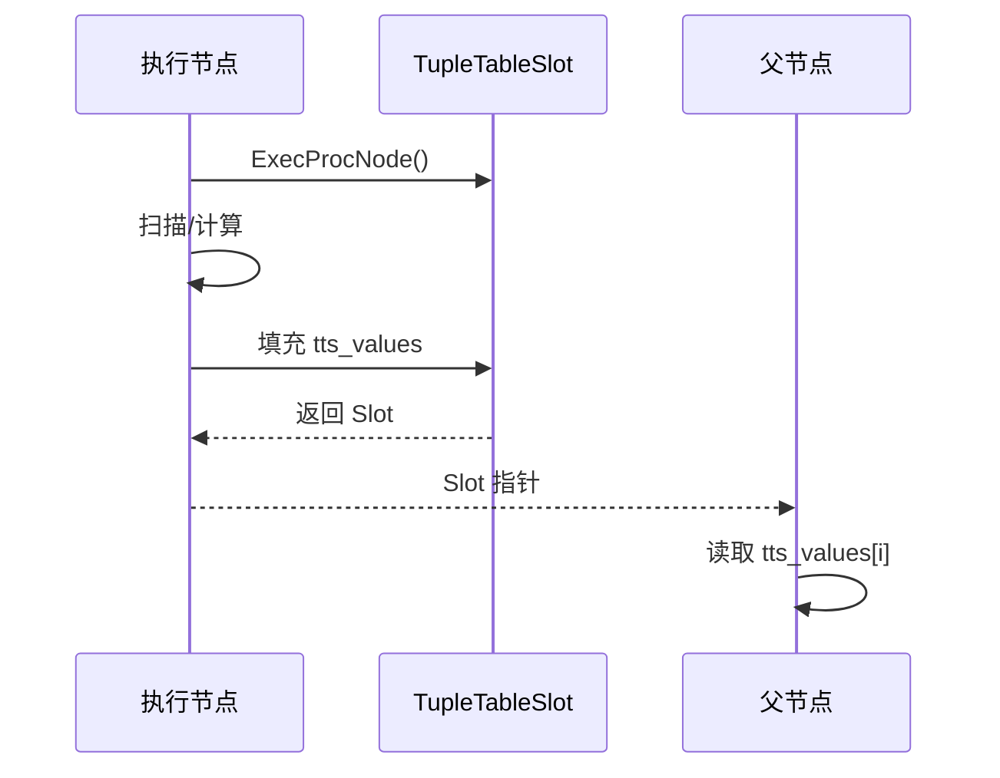

## ExprContext 表达式上下文

每个 PlanState 有一个 `ps_ExprContext`，存储表达式执行所需环境：

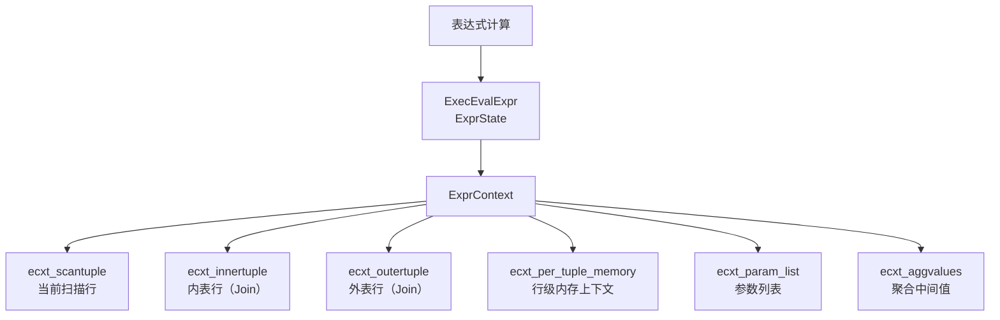

## ExprState 表达式状态

ExprState 是编译后的表达式：

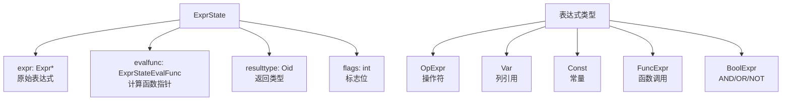

## 执行流程详解

### SeqScan 执行

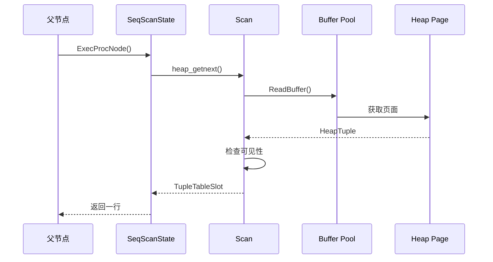

### IndexScan 执行

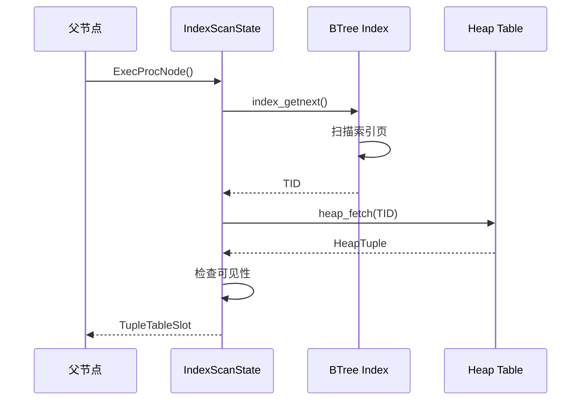

### Hash Join 执行

```mermaid
sequenceSequence
    participant Parent as 父节点
    participant HJ as HashJoinState
    participant Hash as HashState
    participant Outer as 外表扫描
    participant Inner as 内表扫描

    Parent->>HJ: ExecHashJoin()

    Note over HJ: Build Phase
    HJ->>Inner: ExecProcNode() 内表行
    Inner-->>HJ: Tuple
    HJ->>Hash: 插入 Hash Table

    Note over HJ: Probe Phase
    HJ->>Outer: ExecProcNode() 外表行
    Outer-->>HJ: Tuple
    HJ->>Hash: Hash 查找匹配
    Hash-->>HJ: 匹配行
    HJ-->>Parent: 连接结果
```

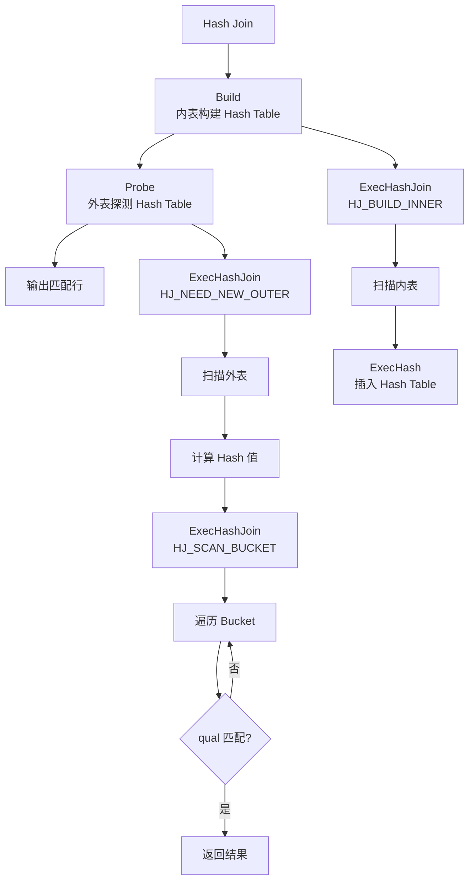

## 并行执行

PG 9.6+ 支持并行查询：

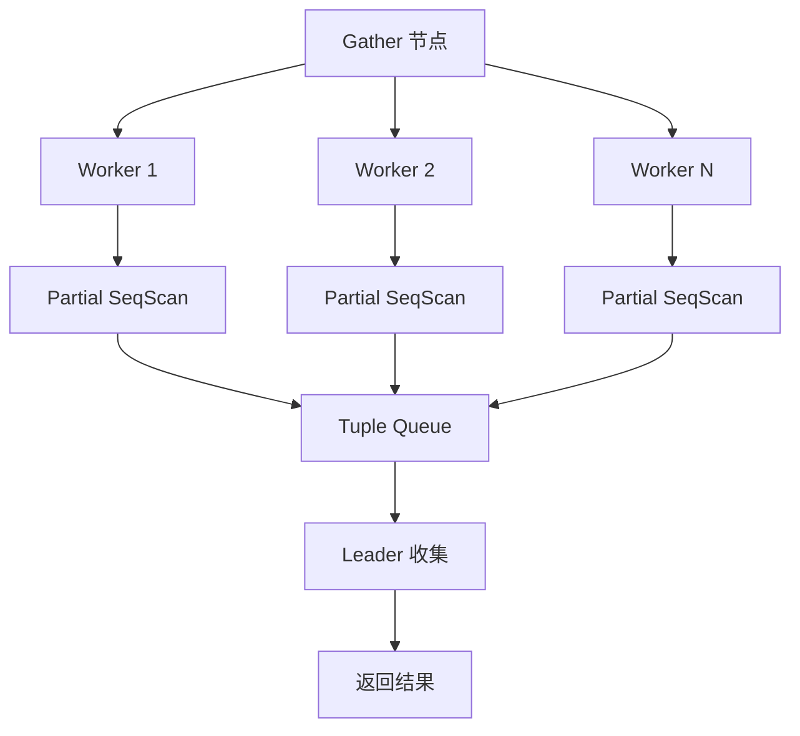

**并行执行关键结构**：

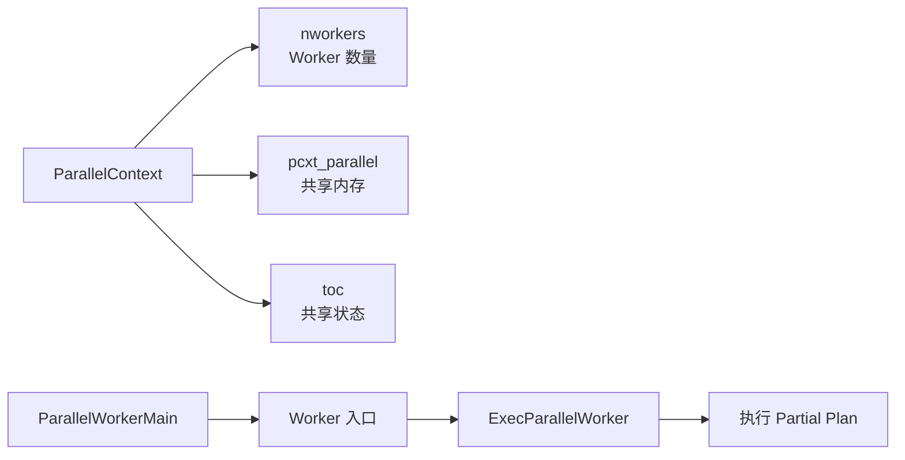

## JIT 编译

PG 11+ 支持 LLVM JIT 编译：

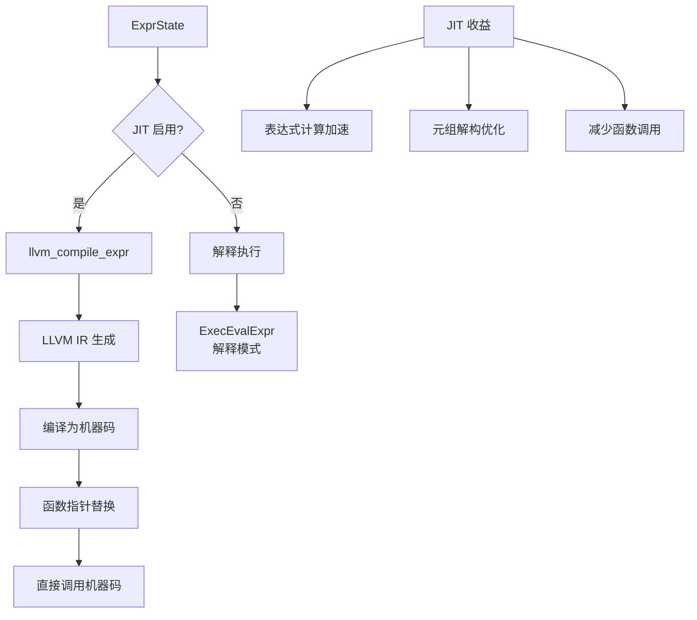

**JIT 参数**：

- `jit`：默认 off（PG 12+ 默认 on）
- `jit_above_cost`：默认 100000
- `jit_inline_above_cost`：默认 500000
- `jit_optimize_above_cost`：默认 500000

## Agg 聚合执行

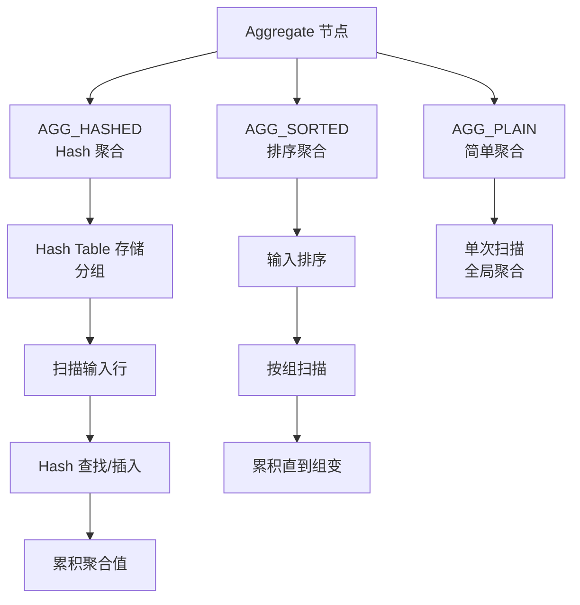

## Sort 排序执行

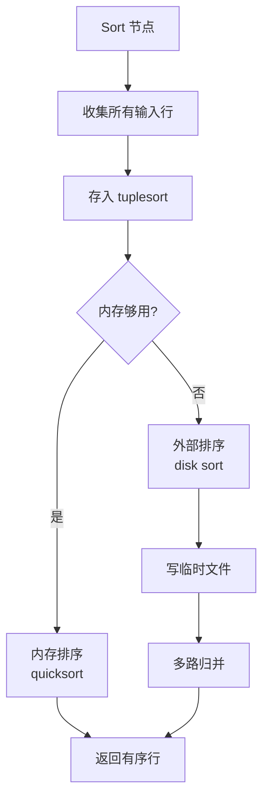

**关键参数**：

- `work_mem`：默认 4MB，控制内存排序上限
- `maintenance_work_mem`：VACUUM / CREATE INDEX 的排序内存

## Limit 执行

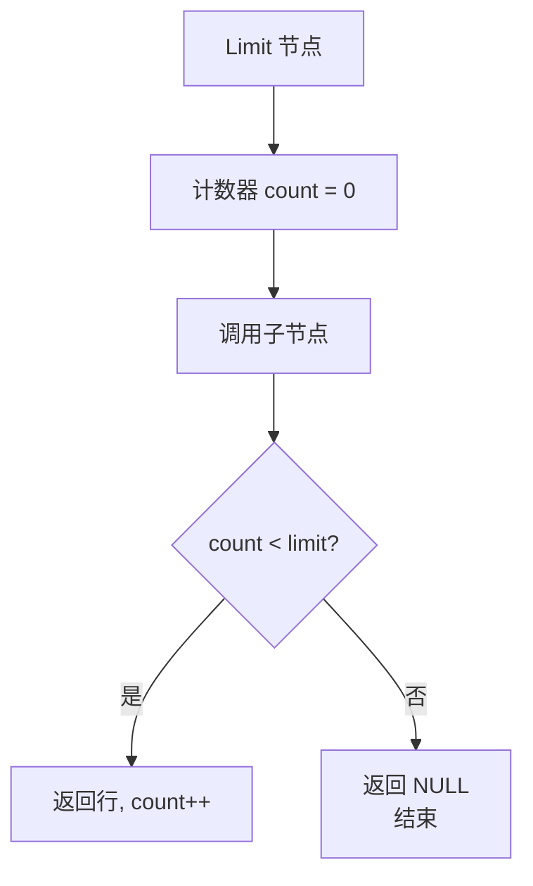

## 执行器监控

```sql
-- 当前执行中的查询
SELECT * FROM pg_stat_activity WHERE state = 'active';

-- 执行器统计
SELECT * FROM pg_stat_statements;

-- 等待事件
SELECT query, wait_event_type, wait_event
FROM pg_stat_activity
WHERE wait_event IS NOT NULL;
```

## 要点总结

- PG 使用 Volcano 火山模型，每个节点实现 `ExecProcNode` 接口
- TupleTableSlot 存储一行数据，ExprContext 提供表达式执行环境
- 并行执行通过 Gather 节点协调多个 Worker
- JIT 编译把表达式编译成机器码，加速计算
- work_mem 控制排序、Hash 的内存上限

## 思考题

1. 火山模型每次调用返回一行，函数调用开销大。相比向量化执行（batch 返回多行），PG 为什么坚持火山模型？
2. Hash Join 的 Build 阶段需要全部内表数据，如果内表太大怎么办？
3. `work_mem` 设置过大会导致什么问题？过小会怎样？如何选择合适的值？