# Parser SQL 解析器

## 学习目标

- 理解 PostgreSQL SQL 解析器的实现架构（lex/yacc → parse tree → query tree）
- 掌握 gram.y 与 scan.l 的工作方式与扩展点
- 了解解析器、分析器、重写器的关系与职责划分

## 核心概念

- **Scanner（lex）**：词法分析，把 SQL 文本切分成 Token
- **Parser（yacc）**：语法分析，构建 Parse Tree
- **Parse Tree（原始语法树）**：gram.y 规则生成的结构体（`SelectStmt`、`InsertStmt` 等）
- **Analyze（语义分析）**：绑定列名、类型检查、权限检查
- **Query Tree**：经过 `transformStmt` 转换后的查询结构（`Query` 结构体）
- **Rewrite（重写）**：应用规则系统（视图、规则）

## 解析流程总览

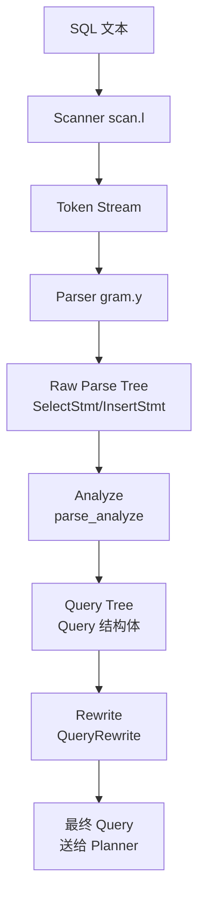

## Scanner（词法分析）

`scan.l` 是 Flex 的输入文件，定义 Token：

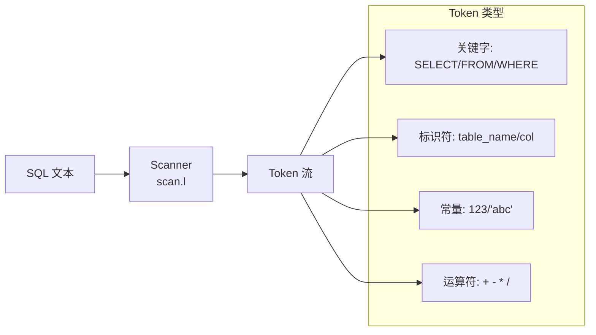

**关键 Token 定义**（简化）：

```c
// scan.l 片段
%{
#include "parser/gramparse.h"
%}

%option 8bit noyywrap
%x xui xus xs xusval

KEYWORD     1100
IDENT       1200

%%

"SELECT"    { return SELECT; }
"FROM"      { return FROM; }
"WHERE"     { return WHERE; }
[0-9]+      { yylval.ival = atoi(yytext); return ICONST; }
[a-zA-Z_][a-zA-Z0-9_]*  {
                yylval.str = pstrdup(yytext);
                return IDENT;
            }
```

## Parser（语法分析）

`gram.y` 是 Bison 的输入文件，定义语法规则：

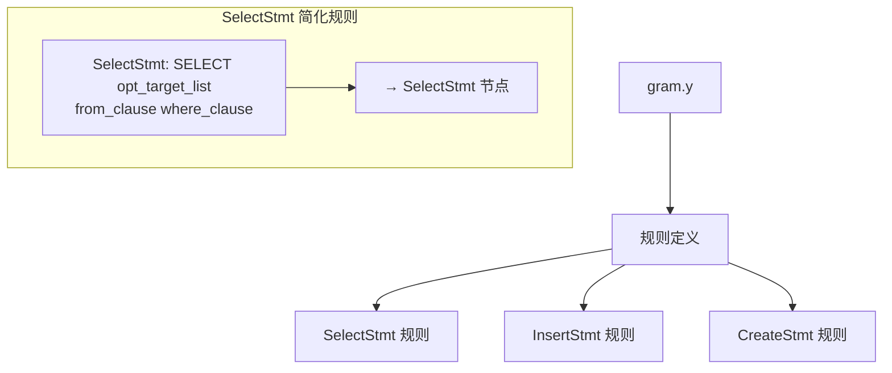

**简化规则示例**：

```yacc
// gram.y 片段
SelectStmt:
            select_no_parens                    { $$ = $1; }
        |   select_with_parens                  { $$ = $1; }
        ;

select_no_parens:
            simple_select                       { $$ = $1; }
        |   set_clause                          { $$ = $1; }
        ;

simple_select:
            SELECT opt_distinct target_list
            from_clause where_clause
            group_clause having_clause
            window_clause
            {
                SelectStmt *n = makeNode(SelectStmt);
                n->distinctClause = $2;
                n->targetList = $3;
                n->fromClause = $4;
                n->whereClause = $5;
                n->groupClause = $6;
                n->havingClause = $7;
                n->windowClause = $8;
                $$ = (Node *)n;
            }
        ;
```

**Parse Tree 结构体**：

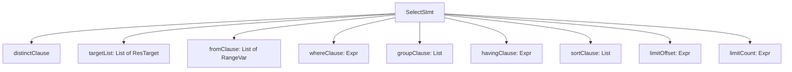

## Parse Tree → Query Tree

`parse_analyze` 把 Parse Tree 转换成 Query Tree：

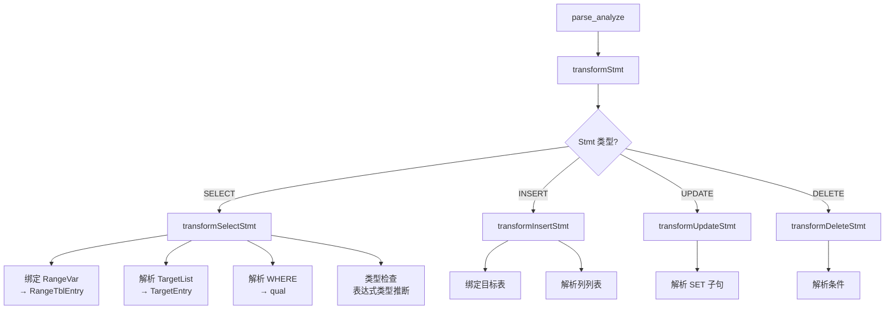

**Query 结构体关键字段**：

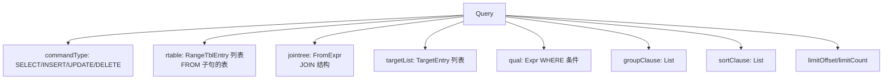

## RangeTblEntry（范围表条目）

每个表、子查询、函数调用都会生成一个 `RangeTblEntry`：

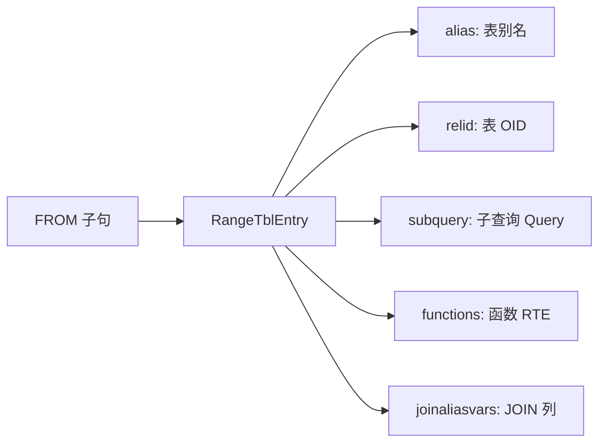

**绑定过程**：

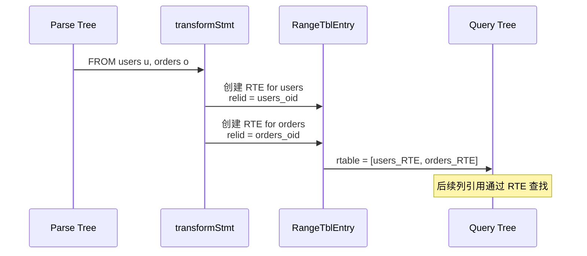

## 重写器（Rewrite）

Query Tree 生成后进入重写阶段：

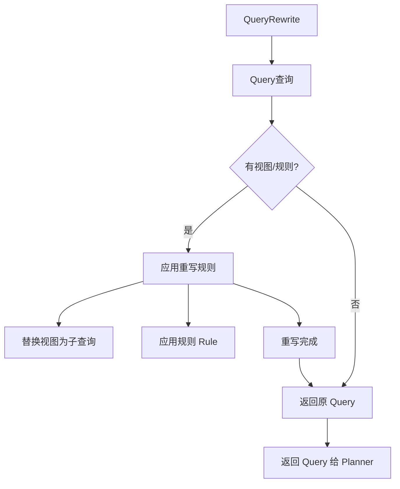

**视图展开示例**：

```sql
CREATE VIEW v_users AS SELECT id, name FROM users WHERE status = 'active';

SELECT * FROM v_users WHERE id > 100;
```

重写后：

```sql
SELECT id, name FROM (SELECT id, name FROM users WHERE status = 'active') v_users WHERE id > 100;
```

## Parser Hook 扩展点

PG 提供多个 Hook 允许扩展解析器：

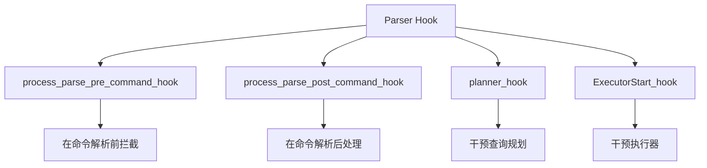

**Hook 使用场景**：

- 审计：记录所有 SQL
- 权限增强：实现行级安全
- 查询改写：自动添加 WHERE 条件
- 自定义命令：识别非标准语法

## 解析错误处理

```mermaid
flowchart TD
    A[解析错误] --> B[语法错误]
    A --> C[语义错误]
    A --> D[权限错误]

    B --> E[yyerror 报错<br/>ERROR: syntax error]
    B --> F[位置指示]

    C --> G[列不存在<br/>ERROR: column "xyz" does not exist]
    C --> H[类型不匹配]

    D --> I[ERROR: permission denied]
```

**错误信息结构**：

```c
typedef struct ErrorData {
    int         elevel;         // ERROR / WARNING / NOTICE
    char       *message;        // 错误消息
    char       *detail;         // 详细信息
    char       *hint;           // 提示
    int         cursorpos;      // 光标位置
    const char *funcname;       // 函数名
    const char *filename;       // 文件名
    int         lineno;         // 行号
} ErrorData;
```

## 解析流程与缓存

PG 会缓存解析结果：

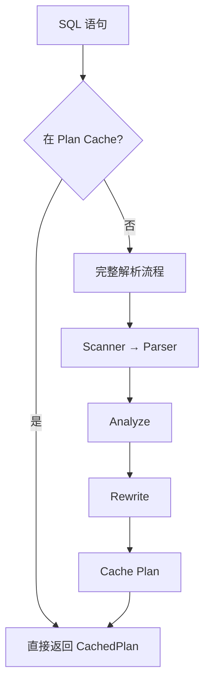

**Plan Cache 好处**：

- 避免重复解析（ Prepared Statement）
- 绑定变量参数化执行

## 要点总结

- Scanner（scan.l）负责词法分析，生成 Token 流
- Parser（gram.y）负责语法分析，构建 Parse Tree（SelectStmt 等）
- `parse_analyze` 把 Parse Tree 转成 Query Tree，绑定表名、列名、类型
- Rewrite 阶段展开视图、应用规则
- 解析过程可被 Hook 拦截，用于审计、权限等扩展
- Plan Cache 缓存解析结果，避免重复开销

## 思考题

1. 为什么 PG 把 Scanner 和 Parser 分开实现？直接用 yacc 处理文本有什么问题？
2. Parse Tree 和 Query Tree 的区别是什么？为什么需要两个阶段？
3. 如果要扩展 PG 支持自定义 SQL 语法（如 `SELECT ... USING INDEX hint`），应该修改哪个环节？