# Planner 查询规划器

## 学习目标

- 理解 PostgreSQL Planner 的三阶段架构（逻辑规划 → 物理规划 → 代价估算）
- 掌握路径生成、路径选择、GEQO 遗传算法的工作原理
- 熟悉统计信息（pg_statistic）在代价估算中的作用

## 核心概念

- **Planner**：查询优化器，把 Query Tree 转成 Plan Tree
- **Path**：一种可能的执行方式（顺序扫描、索引扫描、Hash Join 等）
- **Plan**：最终选定的执行计划节点（SeqScan、IndexScan、HashJoin 等）
- **Cost**：执行代价估算（startup_cost + total_cost）
- **Statistics**：表级、列级统计信息，用于估算行数
- **GEQO**：遗传算法优化器，处理多表 JOIN 顺序
- **EquivalenceClass**：等价类，用于推导等值条件

## Planner 三阶段

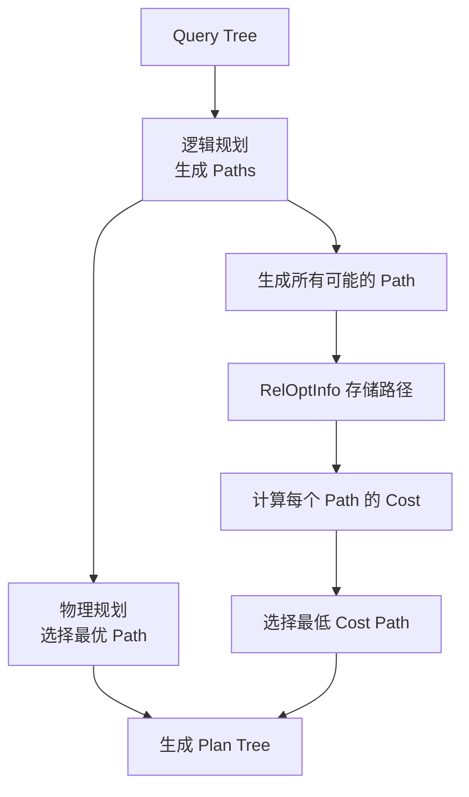

### 阶段 1：逻辑规划

`query_planner` 负责生成所有可能的 Path：

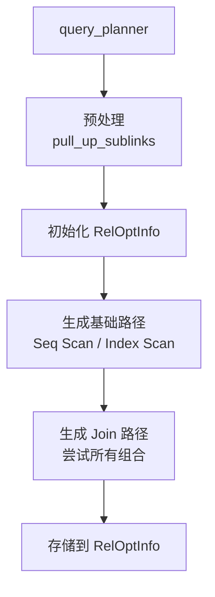

### 阶段 2：物理规划

`make_one_rel` 选择最优 Path：

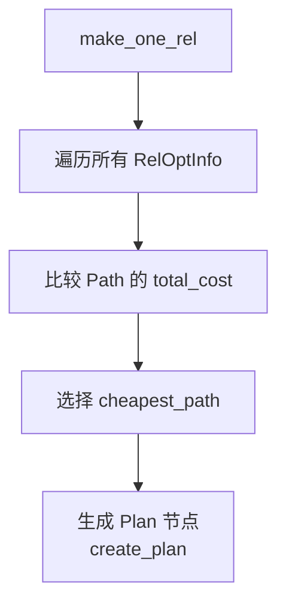

### 阶段 3：代价估算

`cost_qual` 计算每个操作的开销：

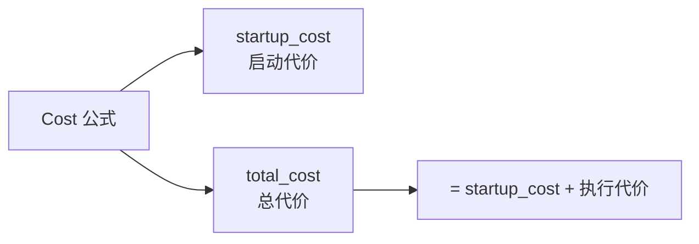

## Path 类型

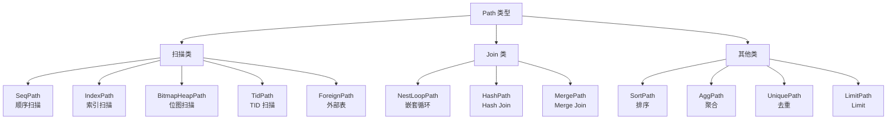

## 路径生成示例

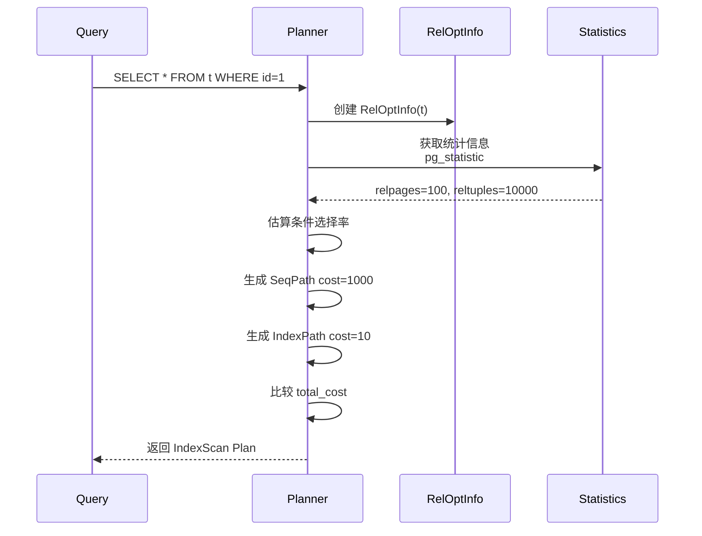

## 代价估算公式

PG 使用 CPU + IO 双维度估算：

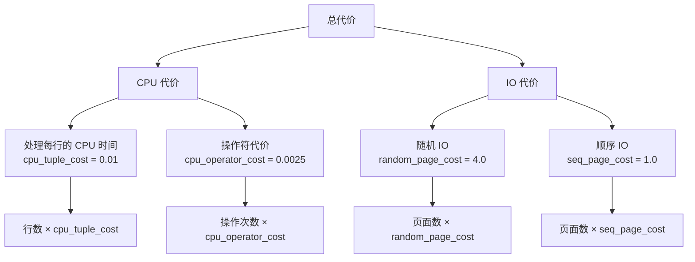

**核心参数**：

| 参数 | 默认值 | 说明 |
|------|--------|------|
| `seq_page_cost` | 1.0 | 顺序读取一个页面的代价 |
| `random_page_cost` | 4.0 | 随机读取一个页面的代价 |
| `cpu_tuple_cost` | 0.01 | 处理一行数据的 CPU 代价 |
| `cpu_index_tuple_cost` | 0.005 | 处理一个索引项的代价 |
| `cpu_operator_cost` | 0.0025 | 处理一个操作符的代价 |
| `parallel_tuple_cost` | 0.1 | 并行传递一行的代价 |
| `parallel_setup_cost` | 1000 | 并行初始化代价 |

## Join 顺序选择

PG 对 JOIN 采用动态规划 + 遗传算法（GEQO）：

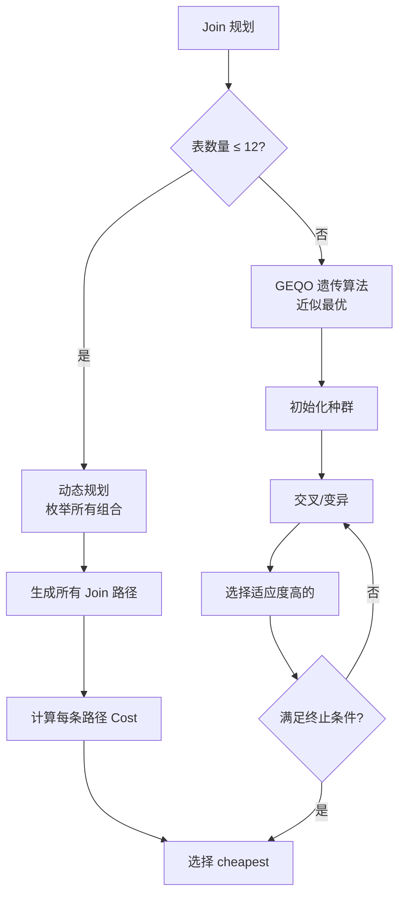

### GEQO 遗传算法

GEQO 用于处理多表 JOIN（>12 表）：

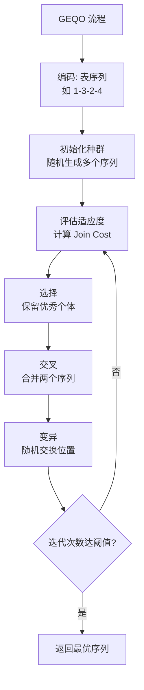

**关键参数**：

- `geqo_threshold`：默认 12，触发 GEQO 的表数量阈值
- `geqo_effort`：默认 5，搜索努力程度（1-10）
- `geqo_pool_size`：种群大小
- `geqo_generations`：迭代代数

## 统计信息

PG 存储表级和列级统计信息：

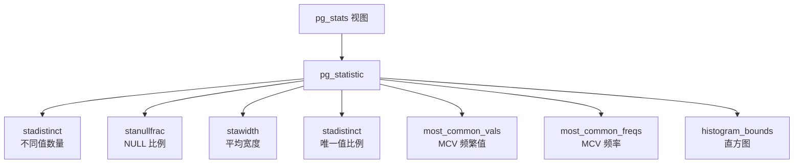

**选择率估算示例**：

```sql
-- 假设 id 列有 100 个唯一值
SELECT * FROM t WHERE id = 1;
-- 选择率 ≈ 1/100 = 0.01（如果 id 均匀分布）
-- 或从 MCV 读取频率（如果分布不均匀）

SELECT * FROM t WHERE id > 50;
-- 选择率 ≈ (100-50)/100 = 0.5（使用直方图估算）
```

```mermaid
flowchart TD
    A[估算选择率] --> B{有 MCV?}
    B -->|是| C[查 MCV 频率]
    B -->|否| D{有 histogram?}
    D -->|是| E[从 histogram 估算]
    D -->|否| F[用默认选择率<br/>如 = 条件: 0.003]

    C --> G[选择率 = MCV_freq]
    E --> H[选择率 = (边界比例)]
```

## 等价类（EquivalenceClass）

等价类用于推导等值条件：

```sql
SELECT * FROM t1 JOIN t2 ON t1.id = t2.id WHERE t1.id = 100;
-- 等价类: {t1.id, t2.id, 100}
-- 推导: t2.id = 100
```

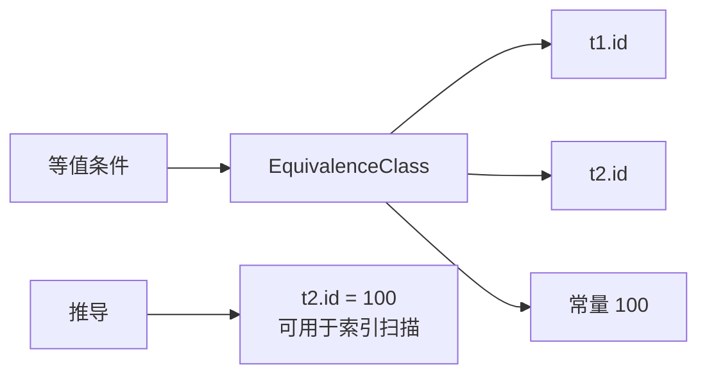

## Plan Tree 结构

选定的 Path 转换成 Plan 节点：

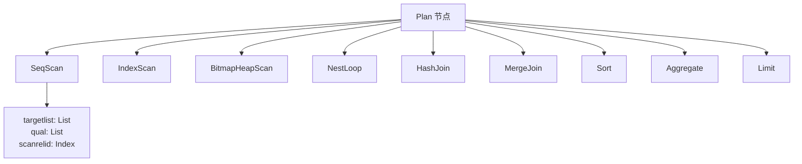

**Plan Tree 示例**：

```sql
EXPLAIN SELECT * FROM users WHERE id = 100;

Index Scan using users_pkey on users  (cost=0.28..8.29 rows=1 width=100)
  Index Cond: (id = 100)
```

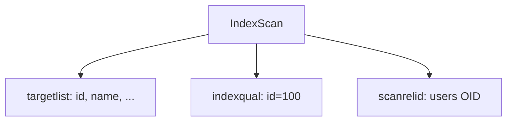

## 并行查询

PG 9.6+ 支持并行执行：

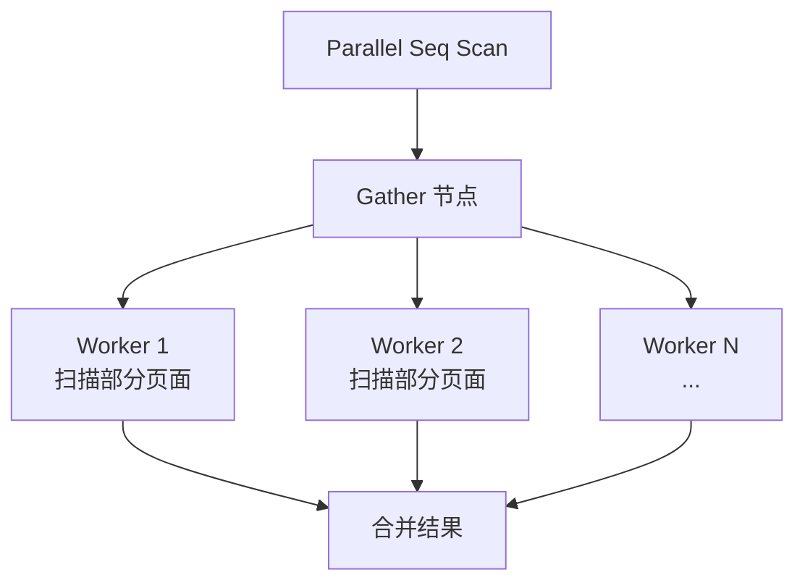

**并行参数**：

- `max_parallel_workers_per_gather`：默认 2
- `parallel_setup_cost`：默认 1000
- `parallel_tuple_cost`：默认 0.1

## Planner Hint

PG 默认不支持 Hint，但可通过 `pg_hint_plan` 扩展：

```sql
/*+ SeqScan(users) IndexScan(users_pkey) */
SELECT * FROM users WHERE id = 100;
```

## 要点总结

- Planner 分三阶段：逻辑规划（生成 Path）→ 物理规划（选 Path）→ 生成 Plan
- Cost = CPU 代价 + IO 代价，基于 `pg_statistic` 统计信息估算
- 多表 JOIN 使用动态规划（≤12 表）或 GEQO 遗传算法（>12 表）
- 等价类用于推导等值条件，传递常量到其他表
- 并行查询通过 Gather 节点协调多个 Worker

## 思考题

1. 为什么 PG 选择基于代价的优化器（CBO）而非基于规则的优化器（RBO）？两种方案各有什么优劣？
2. GEQO 遗传算法是近似算法，不保证全局最优。为什么 PG 选择 GEQO 而不是穷举？
3. `random_page_cost = 4.0` 是默认值，在 SSD 上是否应该调小？为什么？