# BTree 索引

## 学习目标

- 理解 PostgreSQL BTree 索引的 Lehman & Yao 高并发算法
- 掌握 BTree 页面分裂、合并、扫描的实现细节
- 熟悉 BTree 与 InnoDB B+Tree 的关键差异

## 核心概念

- **BTree（B-Tree）**：自平衡树，保持有序，支持 O(log n) 查找/插入/删除
- **Lehman & Yao 算法**：高并发 BTree，使用"右链接 + 标记删除"实现无锁读
- **Page Split**：页面分裂，节点满时分裂为两个节点
- **Page Merge**：页面合并，节点过空时合并到兄弟
- **Fastpath**：最右路径优化，减少根到叶的遍历层数
- **Vacuum BTree**：清理索引中的死元组

## BTree 结构

PG 的 BTree 是标准的 B-Tree（不是 B+Tree），叶子节点和内部节点结构相同：

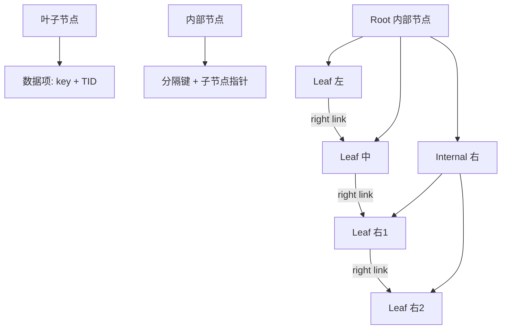

## Lehman & Yao 高并发算法

传统 BTree 的写操作需要锁定整棵树，导致并发性能差。Lehman & Yao 算法通过以下技术实现高并发：

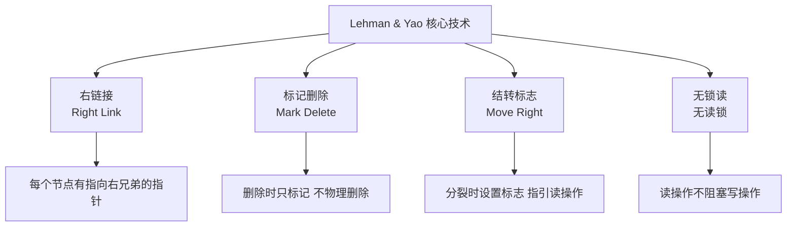

### 读操作（无锁）

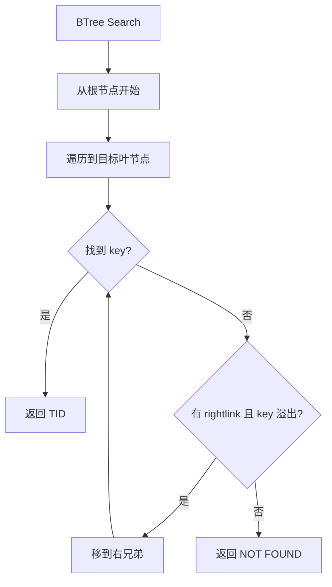

**关键点**：读操作不持有任何读锁，只靠页面级右链接导航。

### 写操作（分裂）

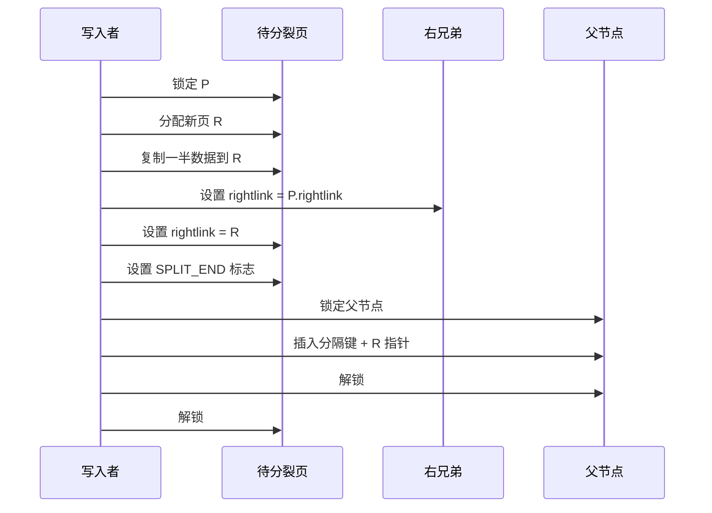

**分裂后的状态**：

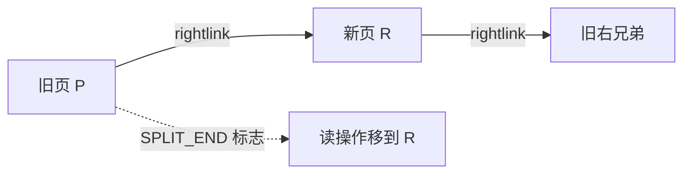

## 页面结构

BTree 页面在 Heap 页面基础上增加 16 字节 Special：

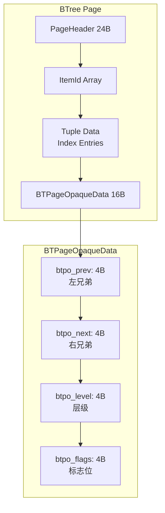

**关键标志**：

| 标志 | 含义 |
|------|------|
| `BTP_LEAF` | 叶节点 |
| `BTP_ROOT` | 根节点 |
| `BTP_DELETED` | 已删除页 |
| `BTP_HALF_DEAD` | 半死页（等待回收） |
| `BTP_SPLIT_END` | 分裂完成（读操作应右移） |

## 索引项结构

BTree 的索引项（Index Tuple）结构：

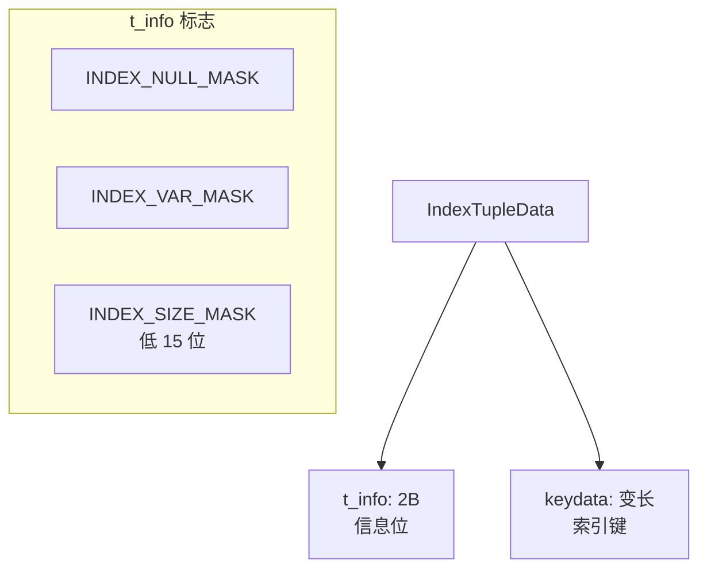

**键值存储**：

- 固定长度键：直接存储
- 变长长度键：TOAST 外存或内联
- `INCLUDE` 列：存储在叶节点，不参与比较

## 扫描操作

### 唯一键查找

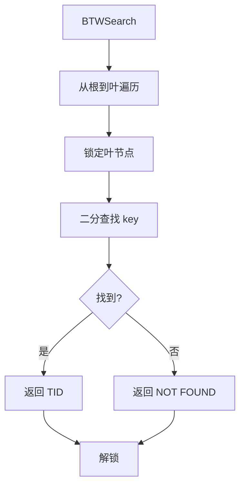

### 范围扫描

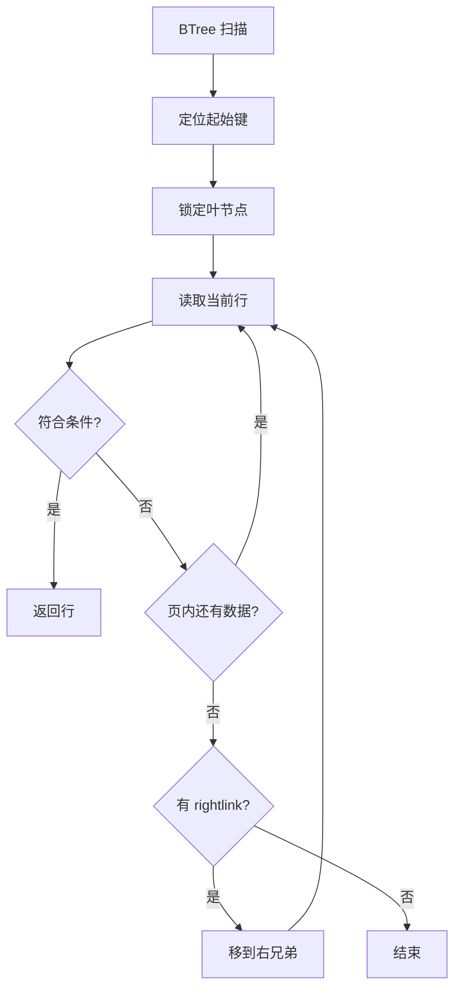

## 插入操作

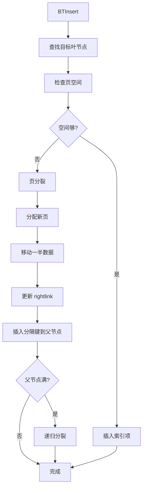

## 删除操作

PG 不直接物理删除索引项，而是标记删除（等待 VACUUM）：

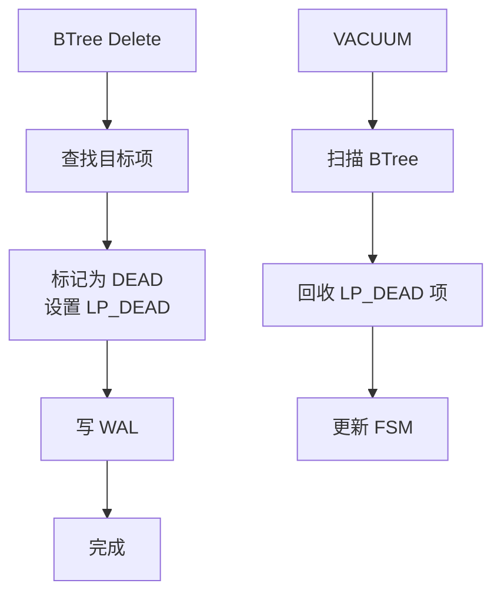

**Page Merge（合并）**：

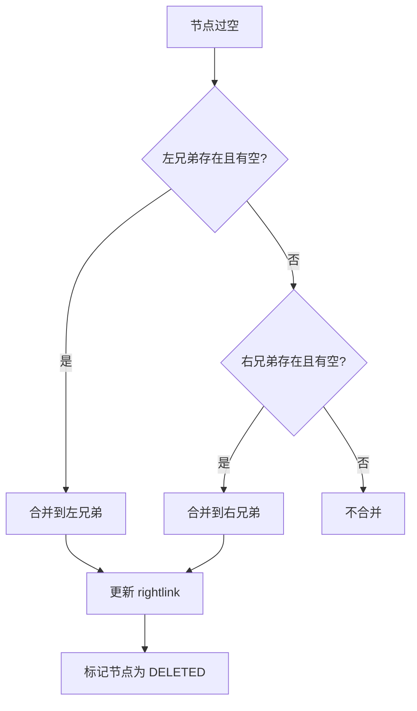

## Vacuum BTree

VACUUM 处理 BTree 索引中的死元组：

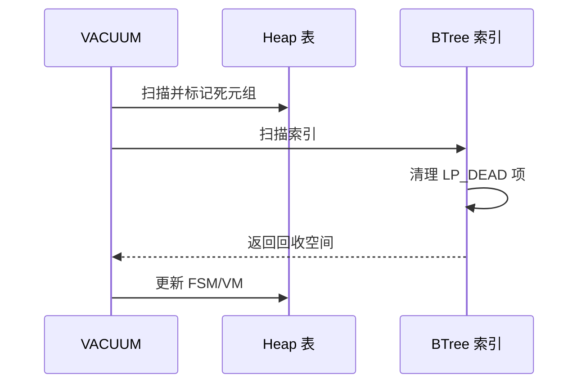

## BTree vs InnoDB B+Tree

| 维度 | PostgreSQL BTree | InnoDB B+Tree |
|------|------------------|---------------|
| 树类型 | B-Tree（叶和内部相同） | B+Tree（只有叶存数据） |
| 叶节点存储 | 键 + TID | 键 + 行数据（聚簇） |
| 兄弟链接 | 右链接（rightlink） | 双向链表（prev/next） |
| 并发控制 | Lehman & Yao 无锁读 | Latch + 范围锁 |
| 分裂策略 | 50% 分裂 | 50% 或 批量分裂 |
| 合并策略 | 惰性（VACUUM 时） | 惰性合并 |

## 性能优化

### Fastpath 优化

最右路径缓存，减少层数遍历：

### 批量加载

`CREATE INDEX` 使用排序 + 批量构建：

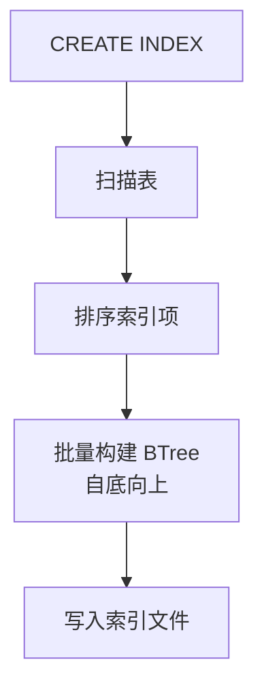

## 配置参数

| 参数 | 默认值 | 说明 |
|------|--------|------|
| `maintenance_work_mem` | 64MB | CREATE INDEX 内存 |
| `max_parallel_maintenance_workers` | 2 | 并行创建索引 |

## 要点总结

- PG BTree 使用 **Lehman & Yao 高并发算法**，实现无锁读、右链接导航
- 页面分裂时设置 SPLIT_END 标志，引导读操作右移
- 删除操作只标记 LP_DEAD，由 VACUUM 回收
- 与 InnoDB B+Tree 相比，PG BTree 是 B-Tree，叶节点存 TID 而非行数据
- Fastpath 优化加速单调递增插入

## 思考题

1. 为什么 PG 选择 B-Tree 而非 B+Tree？两者在存储效率和查询性能上有何差异？
2. Lehman & Yao 算法的"无锁读"在什么情况下会失效？分裂中的页如何保证读正确？
3. 如果一张表的插入模式是随机键（如 UUID），BTree 会有什么性能问题？如何优化？