# Hash 索引

## 学习目标

- 理解 PostgreSQL Hash 索引的 Linear Hashing 实现
- 掌握 Hash 索引的碰撞处理、扩展、收缩机制
- 熟悉 Hash 索引的适用场景与限制

## 核心概念

- **Hash 索引**：基于哈希表的索引，O(1) 等值查询
- **Linear Hashing**：动态哈希，渐进式扩展
- **Bucket**：哈希桶，存储键值对
- **Overflow Page**：桶溢出页，桶满时链式扩展
- **Split**：桶分裂，哈希表扩展
- **Hash Code**：32 位哈希值，用于定位桶

## Hash 索引结构

PG 的 Hash 索引采用 Linear Hashing（线性哈希），支持渐进式扩展：

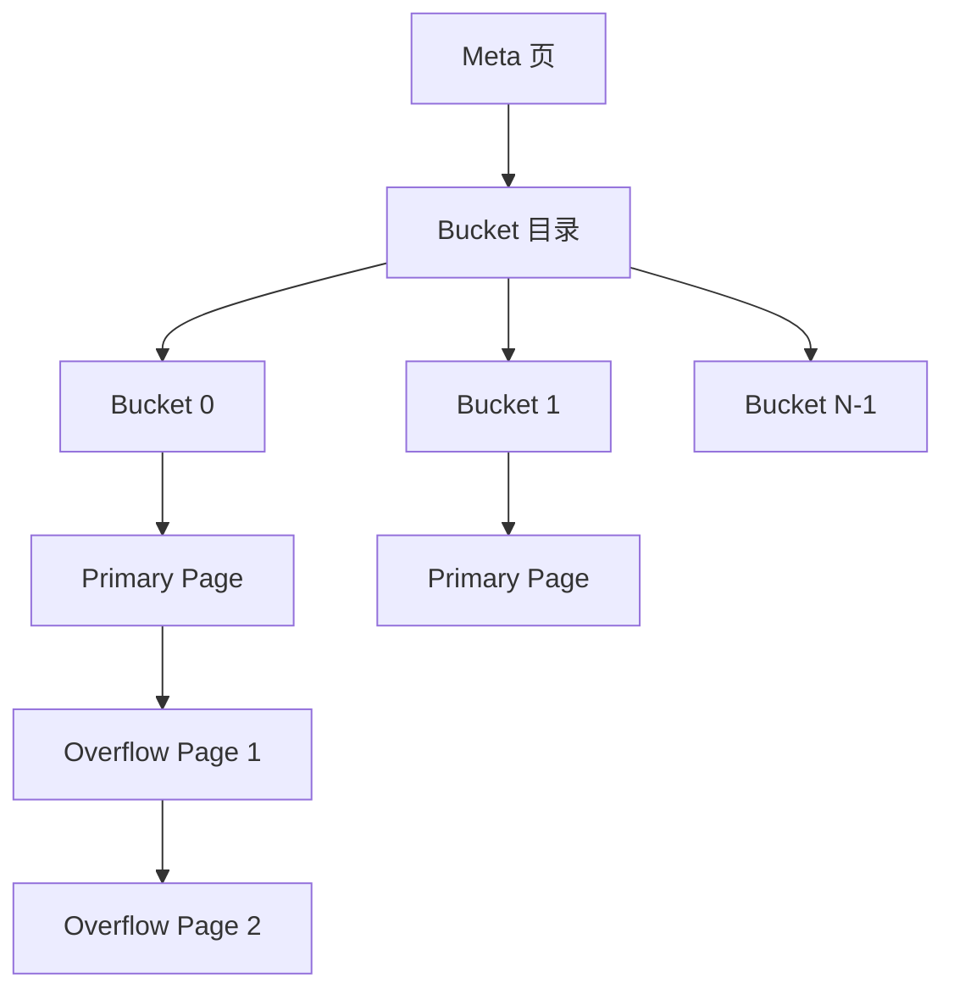

## Linear Hashing 原理

Linear Hashing 允许哈希表渐进式扩展，避免一次性重哈希：

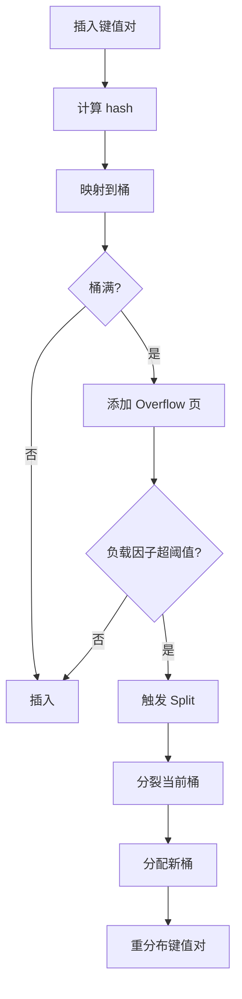

**桶编号计算**：

```c
// 当前桶数 = 2^level * buckets_per_level
bucket = hashcode % (2^level)
// 如果 bucket < splitpoint，可能已分裂
if (bucket < current_splitpoint) {
    bucket = hashcode % (2^(level+1))
}
```

## 页面类型

Hash 索引有 4 种页面类型：

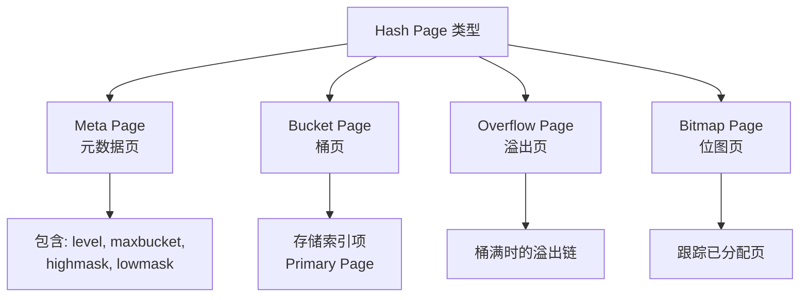

## 索引项结构

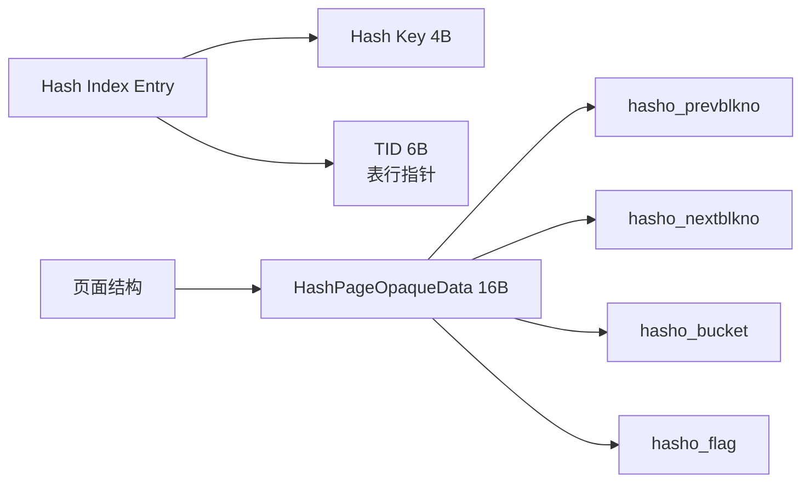

## 插入流程

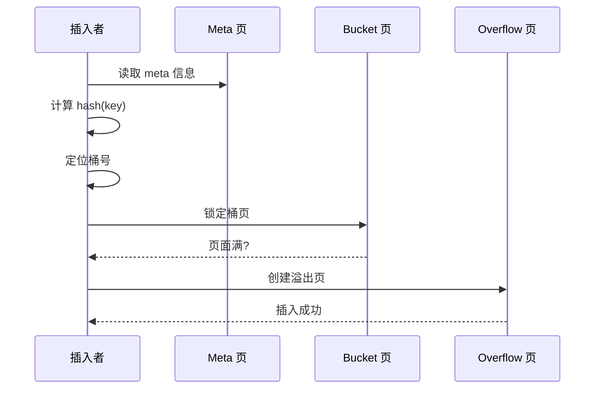

**详细流程**：

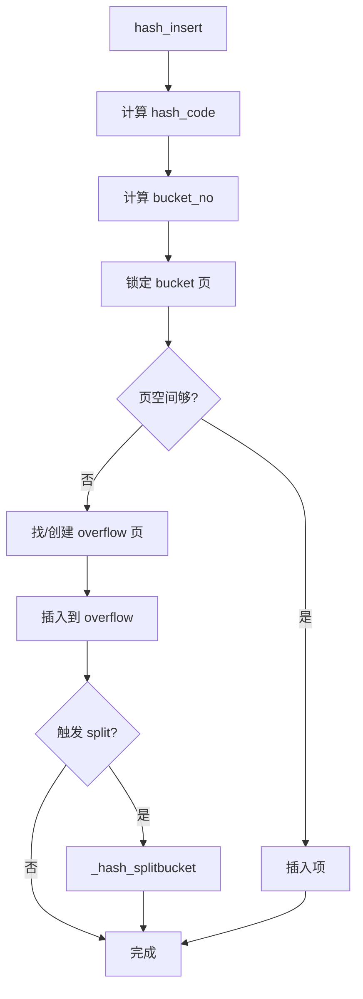

## 扩展（Split）

当负载因子超过阈值时，触发桶分裂：

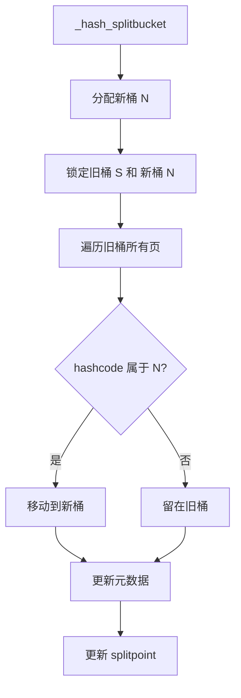

**分裂示例**：

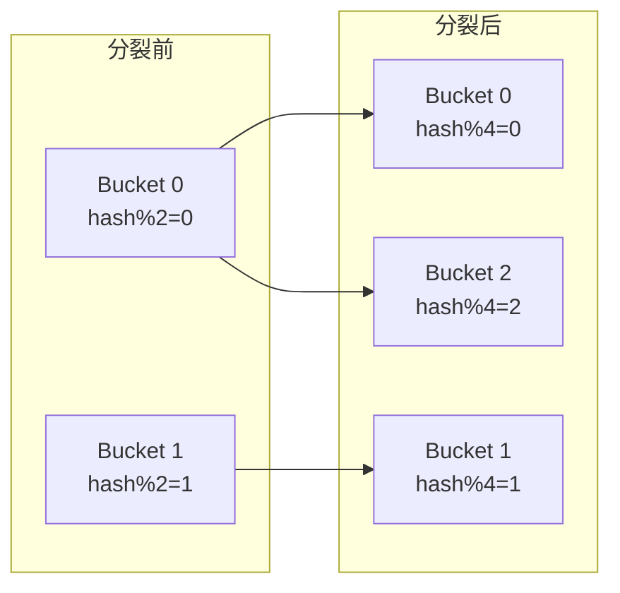

## 收缩

VACUUM 可以收缩 Hash 索引：

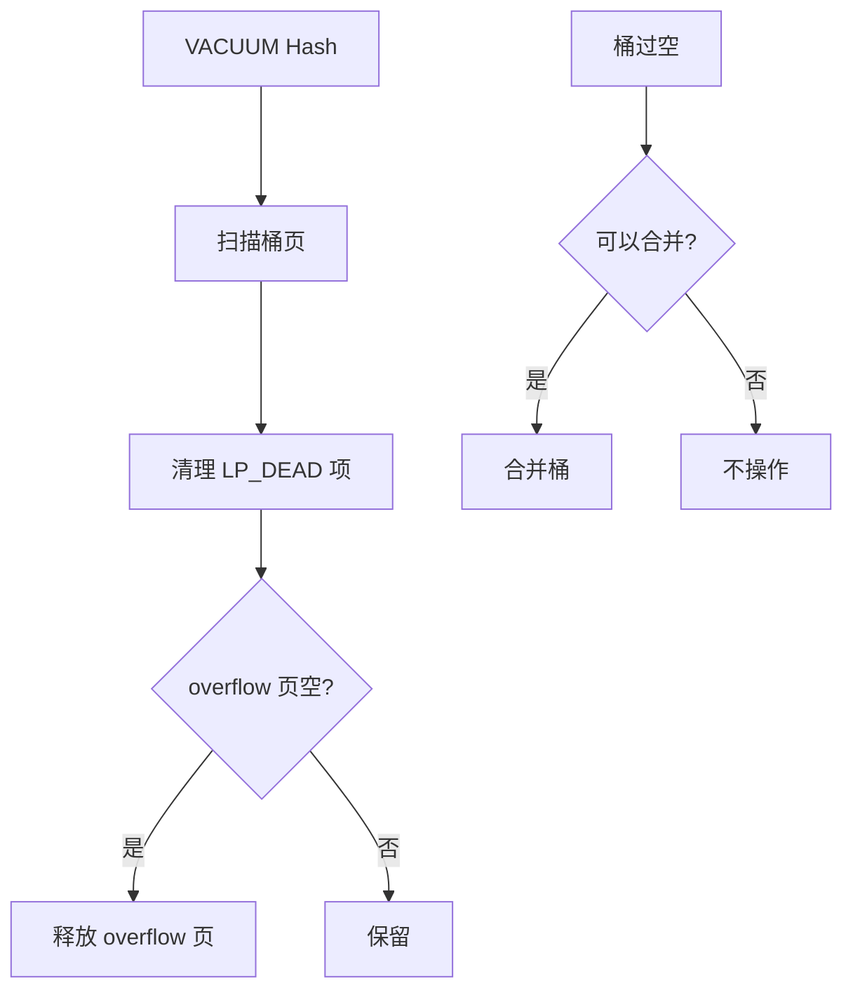

## 查询流程

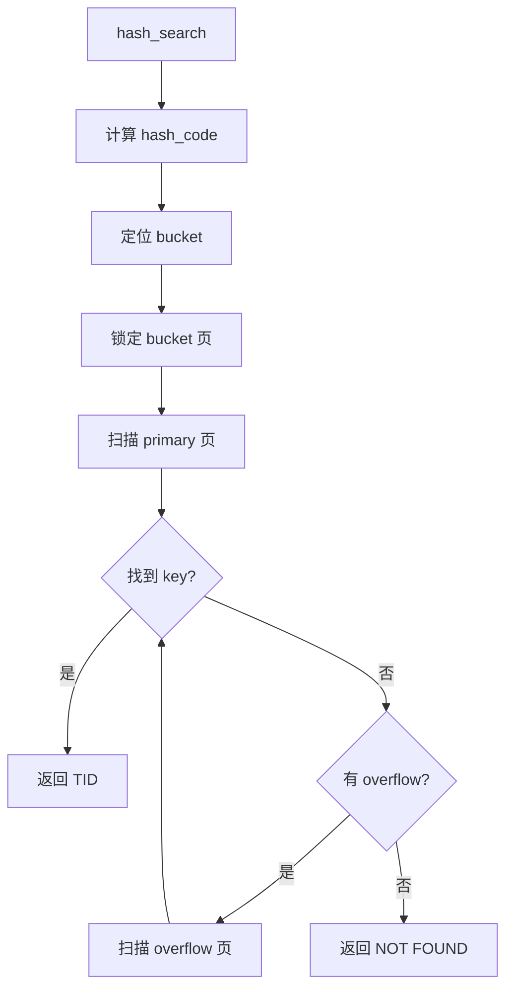

## 死元组处理

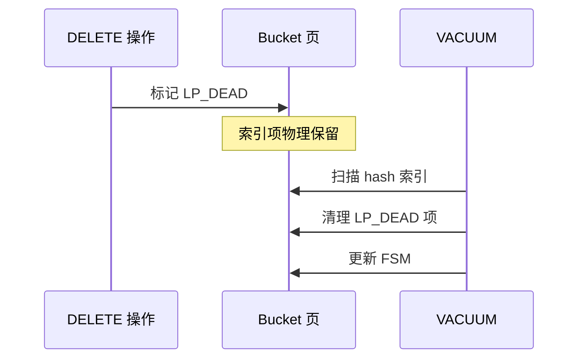

## Hash 索引限制

PG 10 之前 Hash 索引不支持 WAL，不推荐用于生产环境。PG 10+ 已支持 WAL：

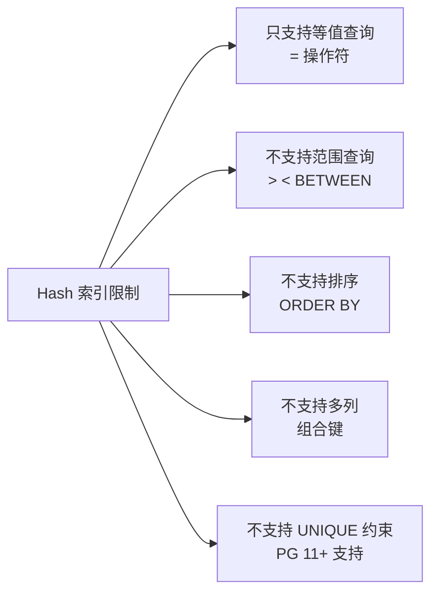

## 性能特点

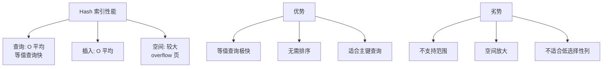

## 与 BTree 对比

| 维度 | Hash 索引 | BTree 索引 |
|------|-----------|------------|
| 查询类型 | 仅等值 | 等值 + 范围 + 排序 |
| 查询复杂度 | O(1) 平均 | O(log n) |
| 空间效率 | 较低（overflow） | 较高 |
| 范围查询 | 不支持 | 支持 |
| 排序输出 | 不支持 | 支持 |
| 多列索引 | 不支持 | 支持 |
| UNIQUE | PG 11+ 支持 | 支持 |
| WAL 支持 | PG 10+ | 一直支持 |

## 使用建议

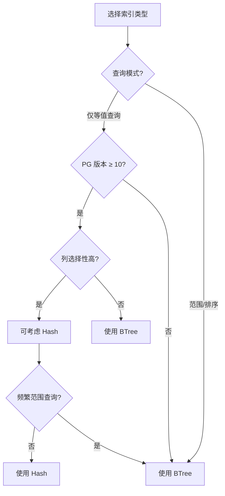

## 配置参数

| 参数 | 说明 |
|------|------|
| `hash_mem_utilization` | Hash 内存利用率（内部） |

## 要点总结

- Hash 索引使用 Linear Hashing，支持渐进式扩展
- 桶满时使用 Overflow 页，负载因子超阈值时触发 Split
- PG 10+ 支持 WAL，生产可用
- 仅支持等值查询，不支持范围/排序/多列
- 空间效率低于 BTree，适合纯等值查询场景

## 思考题

1. 为什么 PG 长期不推荐使用 Hash 索引（直到 PG 10）？WAL 支持对 Hash 索引有什么特殊挑战？
2. Linear Hashing 相比传统可扩展哈希（Extendible Hashing）有什么优势？
3. 什么情况下 Hash 索引比 BTree 索引更适合？给出一个具体场景。