# 其他索引类型

## 学习目标

- 理解 GiST、GIN、BRIN、SP-GiST 四种扩展索引的原理与适用场景
- 掌握每种索引的存储结构、查询方式、优缺点
- 熟悉索引选择策略

## 核心概念

- **GiST（Generalized Search Tree）**：通用搜索树，支持自定义数据类型和查询语义
- **GIN（Generalized Inverted Index）**：通用倒排索引，用于数组、全文检索
- **BRIN（Block Range Index）**：块范围索引，存储每块的摘要信息
- **SP-GiST（Space-Partitioned GiST）**：空间分区 GiST，支持四叉树、radix tree 等

## GiST（通用搜索树）

GiST 是一个"索引框架"，允许开发者定义自己的索引方法：

```mermaid
graph TD
    A[GiST 树结构] --> B[内部节点<br/>存储 Union 键]
    A --> C[叶节点<br/>存储实际键]

    D[GiST 支持的类型] --> E[几何类型<br/>点/线/多边形]
    D --> F[范围类型<br/>int4range/...]
    D --> G[自定义类型<br/>通过扩展]

    H[GiST 关键特性] --> I[支持任意查询语义<br/>如"包含"、"相交"]
    H --> J[自定义一致性函数<br/>consistent(key, query)]
    H --> K[自定义联合函数<br/>union(keys)]
```

### GiST 结构

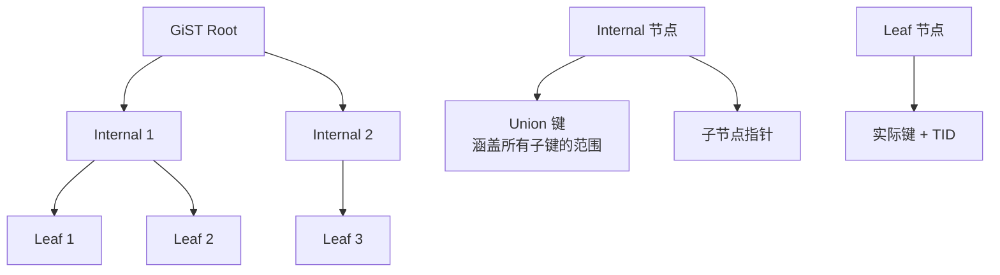

### GiST 操作

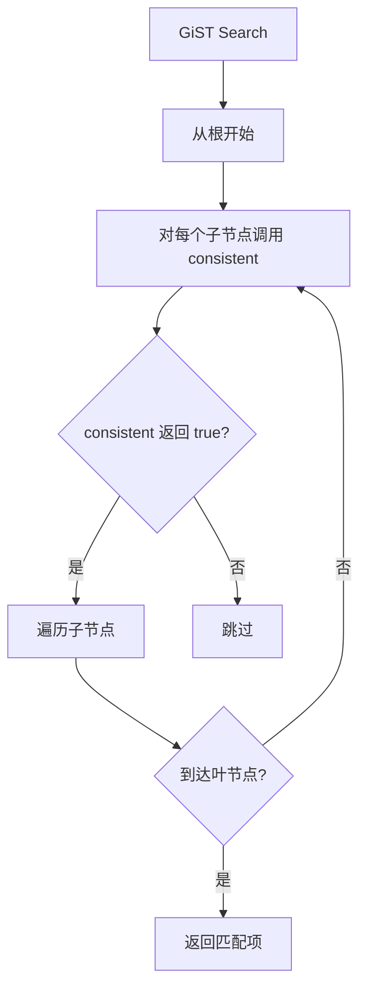

**一致性函数示例（范围包含）**：

```c
// key: 索引键（范围）
// query: 查询范围
bool range_contains_consistent(Range *key, Range *query) {
    return key->lower <= query->lower && key->upper >= query->upper;
}
```

### GiST 应用

```sql
-- 几何查询
CREATE INDEX idx_geom ON points USING gist(location);
SELECT * FROM points WHERE location <@ box '((0,0),(10,10))';

-- 范围查询
CREATE INDEX idx_range ON reservations USING gist(during);
SELECT * FROM reservations WHERE during && daterange('2024-01-01', '2024-12-31');
```

## GIN（通用倒排索引）

GIN 是倒排索引，适合数组、JSON、全文检索：

```mermaid
graph TD
    A[GIN 结构] --> B[Entry Tree<br/>存储所有元素]
    B --> C[Posting List<br/>元素对应的行ID]

    D[GIN 支持的类型] --> E[数组<br/>text[]/int[]]
    D --> F[全文检索<br/>tsvector]
    D --> G[JSONB<br/>jsonb_path_ops]

    H[GIN 特点] --> I[高选择性的元素<br/>如关键词]
    H --> J[写入慢<br/>需要更新 posting list]
    H --> K[查询快<br/>倒排直接定位]
```

### GIN 结构

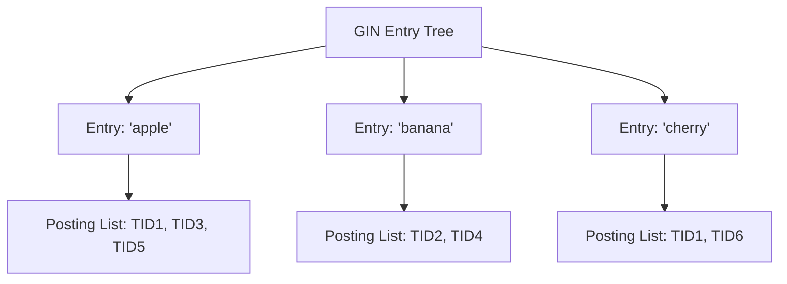

### GIN 查询

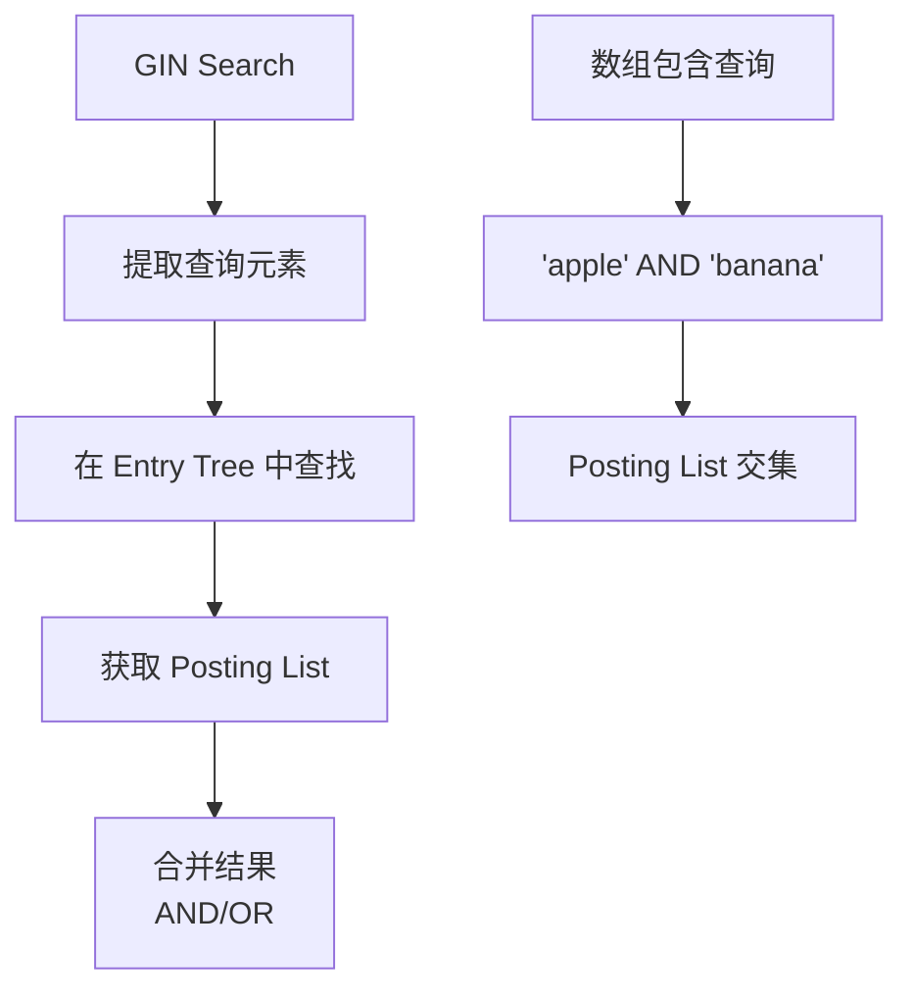

### GIN 应用

```sql
-- 全文检索
CREATE INDEX idx_fts ON documents USING gin(to_tsvector('english', content));
SELECT * FROM documents WHERE to_tsvector('english', content) @@ to_tsquery('english', 'postgresql');

-- 数组包含
CREATE INDEX idx_tags ON articles USING gin(tags);
SELECT * FROM articles WHERE tags @> ARRAY['tech', 'database'];

-- JSONB 查询
CREATE INDEX idx_data ON events USING gin(data jsonb_path_ops);
SELECT * FROM events WHERE data @> '{"type": "click"}';
```

### GIN Fast Path

PG 14+ 引入 `fastupdate`，延迟合并 posting list：

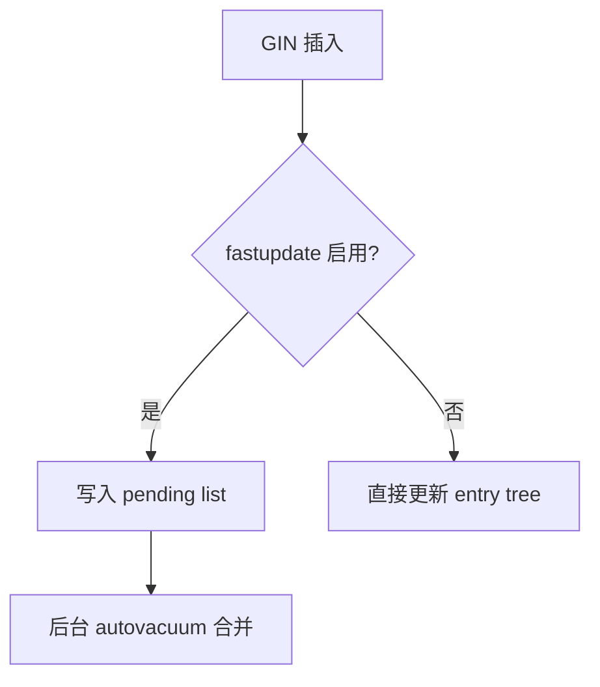

## BRIN（块范围索引）

BRIN 存储每个数据块的摘要信息，空间极小：

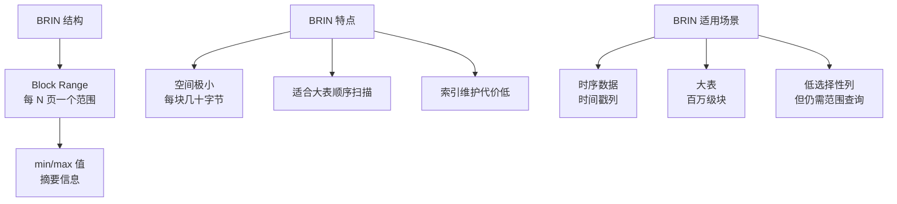

### BRIN 结构

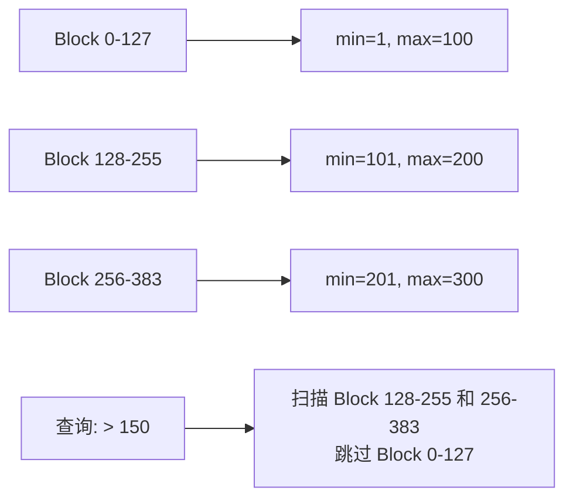

### BRIN 查询

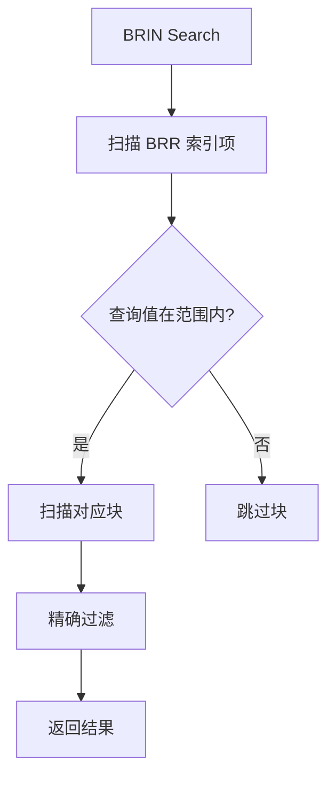

### BRIN 应用

```sql
-- 时序数据
CREATE INDEX idx_time ON events USING brin(created_at WITH (pages_per_range = 128));
SELECT * FROM events WHERE created_at BETWEEN '2024-01-01' AND '2024-12-31';

-- 大表范围查询
CREATE INDEX idx_value ON metrics USING brin(value);
SELECT * FROM metrics WHERE value > 1000;
```

## SP-GiST（空间分区 GiST）

SP-GiST 支持四叉树、radix tree 等空间分区结构：

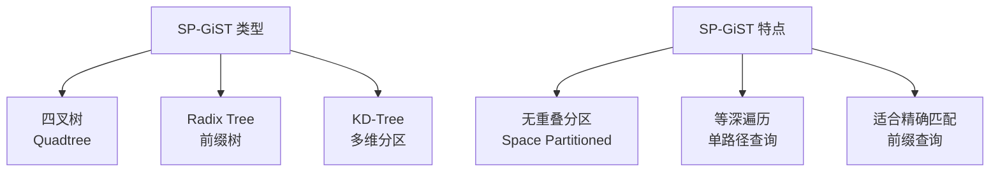

### SP-GiST 结构

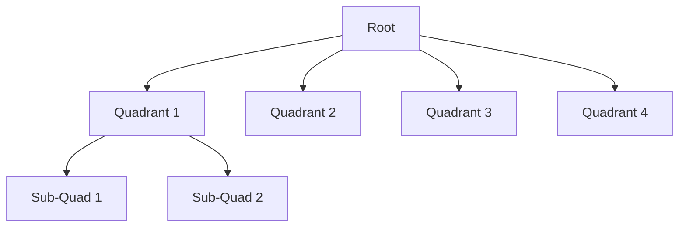

### SP-GiST 应用

```sql
-- 前缀匹配（radix tree）
CREATE INDEX idx_name ON users USING spgist(name text_ops);
SELECT * FROM users WHERE name LIKE 'John%';

-- 二维点（四叉树）
CREATE INDEX idx_point ON locations USING spgist(point);
SELECT * FROM locations WHERE point <@ box '((0,0),(10,10))';
```

## 索引类型对比

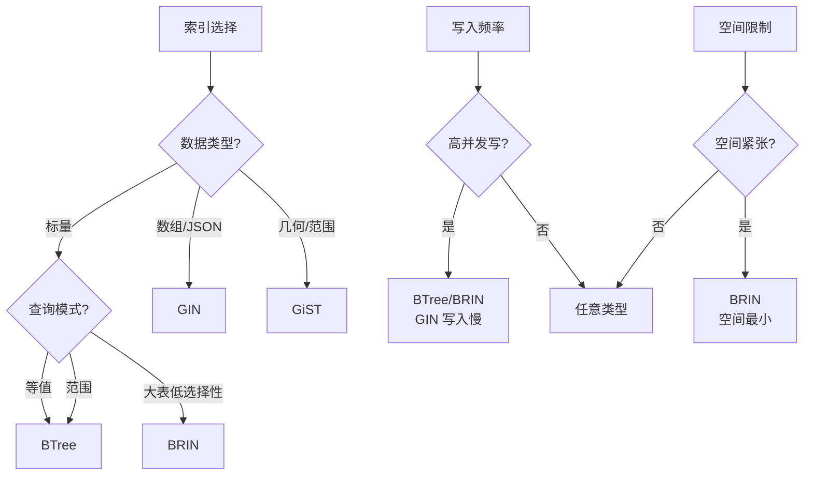

## 各索引类型总结

| 索引类型 | 适用数据 | 查询类型 | 空间 | 写入代价 | 典型场景 |
|----------|----------|----------|------|----------|----------|
| **BTree** | 标量 | 等值、范围、排序 | 中 | 中 | 默认选择 |
| **Hash** | 标量 | 等值 | 中 | 中 | 纯等值查询 |
| **GiST** | 几何、范围 | 包含、相交 | 中 | 高 | GIS、范围 |
| **GIN** | 数组、JSONB、全文 | 包含、匹配 | 高 | 高 | 全文检索 |
| **BRIN** | 标量（大表） | 范围 | 极小 | 极低 | 时序数据 |
| **SP-GiST** | 文本、几何 | 前缀匹配 | 中 | 中 | 前缀查询 |

## 索引组合使用

```sql
-- 多索引组合
CREATE INDEX idx_btree ON users(id);
CREATE INDEX idx_gin ON users USING gin(tags);
CREATE INDEX idx_brin ON users USING brin(created_at);

-- 查询优化器会自动选择最合适的索引
SELECT * FROM users
WHERE id = 100
  AND tags @> ARRAY['admin']
  AND created_at > '2024-01-01';
```

## 要点总结

- **GiST**：通用搜索树，支持自定义查询语义（几何、范围）
- **GIN**：倒排索引，适合数组、全文检索、JSONB
- **BRIN**：块范围索引，空间极小，适合大表范围查询
- **SP-GiST**：空间分区 GiST，适合前缀匹配、四叉树
- 选择索引需考虑数据类型、查询模式、写入频率、空间限制

## 思考题

1. 为什么 GIN 索引写入性能较差？如何优化 GIN 索引的写入性能？
2. BRIN 索引存储的是块范围摘要信息，如果数据分布不均匀（如时间戳有大量重复值），BRIN 还有效吗？
3. GiST 和 SP-GiST 的核心区别是什么？为什么 GiST 支持更灵活的查询语义？