# 关键特性

## 学习目标

- 了解 PostgreSQL 的核心特性与扩展能力
- 掌握 MVCC、流复制、逻辑复制、分区表、并行查询等特性
- 理解 FDW（外部数据包装器）与扩展机制的应用场景

## 核心概念

- **MVCC**：多版本并发控制，读不阻塞写
- **流复制（Streaming Replication）**：物理复制，基于 WAL
- **逻辑复制（Logical Replication）**：基于 pgoutput 插件，订阅发布模型
- **分区表（Partitioning）**：声明式分区（Range/List/Hash）
- **并行查询（Parallel Query）**：多 Worker 并行扫描、Join、聚合
- **FDW（Foreign Data Wrapper）**：外部数据包装器，访问异构数据源
- **扩展机制（Extensions）**：`CREATE EXTENSION` 加载自定义功能

## 特性总览

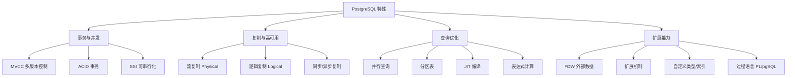

## MVCC 多版本并发控制

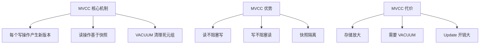

详见 `03_transaction/mvcc.md`。

## 流复制（Streaming Replication）

流复制是物理复制，主库把 WAL 流式发送到备库：

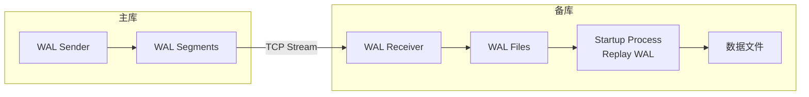

### 流复制类型

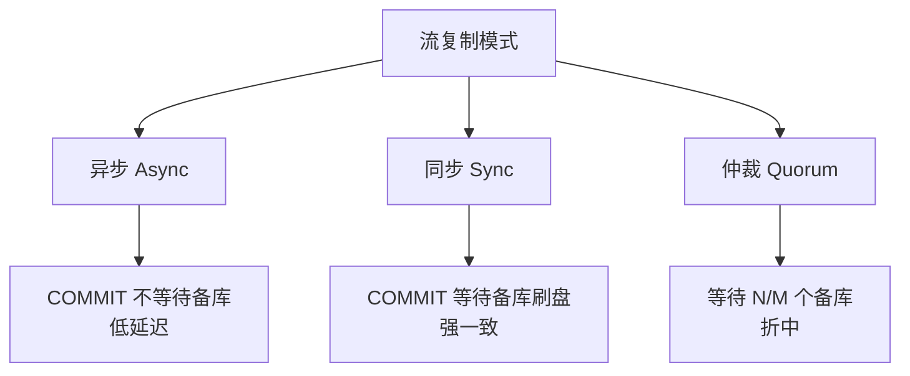

### 配置示例

```ini
# postgresql.conf (主库)
wal_level = replica
max_wal_senders = 10
wal_keep_size = 1GB
synchronous_standby_names = 'standby1,standby2'

# pg_hba.conf
host replication replicator 192.168.1.0/24 md5

# recovery.conf (备库)
primary_conninfo = 'host=primary port=5432 user=replicator password=...'
```

## 逻辑复制（Logical Replication）

逻辑复制基于发布/订阅模型，复制数据变更而非物理 WAL：

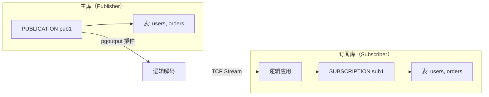

### 逻辑复制优势

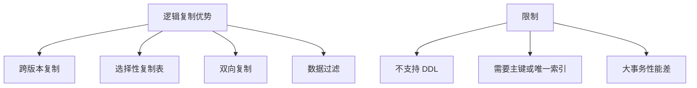

### 配置示例

```sql
-- 主库：创建发布
CREATE PUBLICATION mypub FOR TABLE users, orders;

-- 备库：创建订阅
CREATE SUBSCRIPTION mysub
    CONNECTION 'host=primary port=5432 dbname=mydb'
    PUBLICATION mypub;
```

## 分区表（Partitioning）

PG 10+ 支持声明式分区，支持 Range/List/Hash：

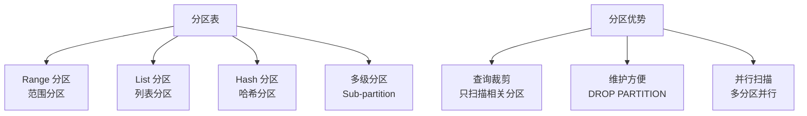

### 分区表示例

```sql
CREATE TABLE orders (
    id          BIGSERIAL,
    user_id     INT,
    created_at  TIMESTAMP
) PARTITION BY RANGE (created_at);

CREATE TABLE orders_2024_01 PARTITION OF orders
    FOR VALUES FROM ('2024-01-01') TO ('2024-02-01');

CREATE TABLE orders_2024_02 PARTITION OF orders
    FOR VALUES FROM ('2024-02-01') TO ('2024-03-01');

-- 查询自动裁剪到相关分区
EXPLAIN SELECT * FROM orders WHERE created_at >= '2024-01-15';
-- ->  Scan orders_2024_01
```

### 分区裁剪

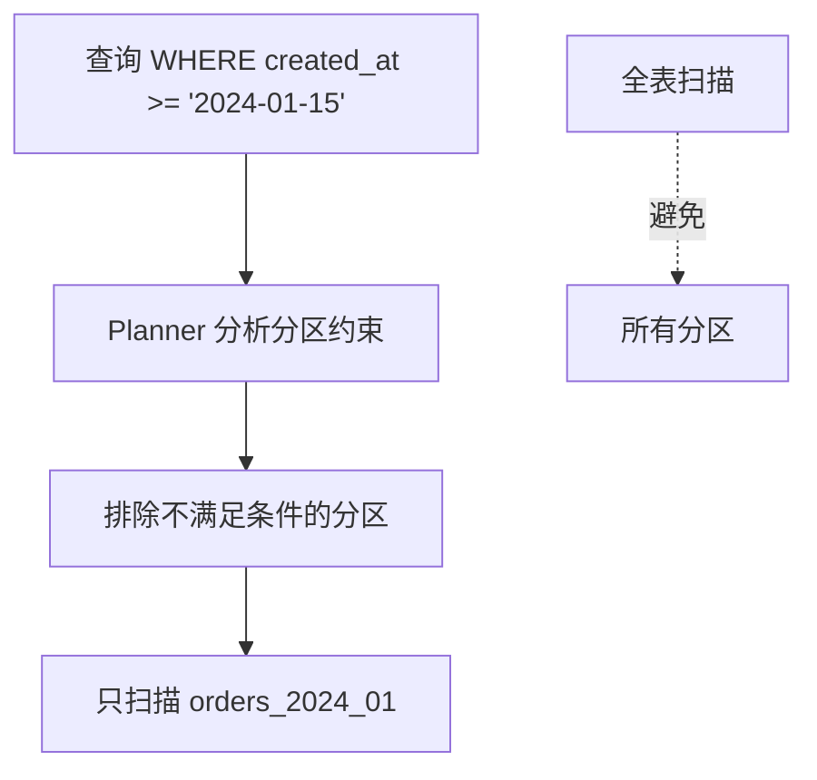

## 并行查询（Parallel Query）

PG 9.6+ 支持并行执行，多个 Worker 协作：

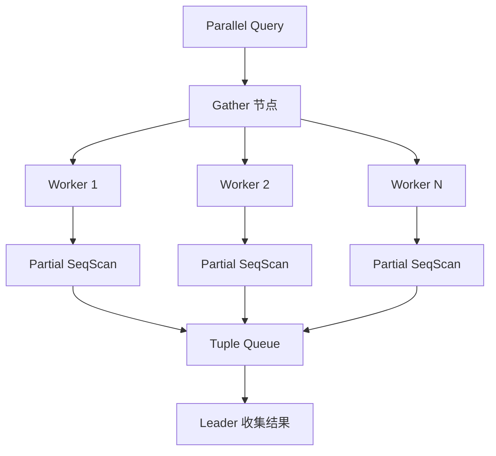

### 并行操作类型

```sql
-- 并行顺序扫描
EXPLAIN ANALYZE SELECT COUNT(*) FROM large_table;
-- ->  Gather (workers=4)
--       ->  Partial SeqScan

-- 并行 Join
EXPLAIN ANALYZE SELECT * FROM t1 JOIN t2 ON t1.id = t2.id;
-- ->  Gather
--       ->  Hash Join
--             ->  Parallel SeqScan on t1

-- 并行聚合
EXPLAIN ANALYZE SELECT COUNT(*), user_id FROM events GROUP BY user_id;
-- ->  Finalize HashAggregate
--       ->  Gather
--             ->  Partial HashAggregate
```

### 并行参数

| 参数 | 默认值 | 说明 |
|------|--------|------|
| `max_parallel_workers_per_gather` | 2 | 每个 Gather 最大 Worker 数 |
| `max_parallel_workers` | 8 | 全局最大并行 Worker 数 |
| `parallel_setup_cost` | 1000 | 并行启动代价 |
| `parallel_tuple_cost` | 0.1 | 并行传递一行代价 |

## JIT 编译

PG 11+ 支持 LLVM JIT，编译表达式为机器码：

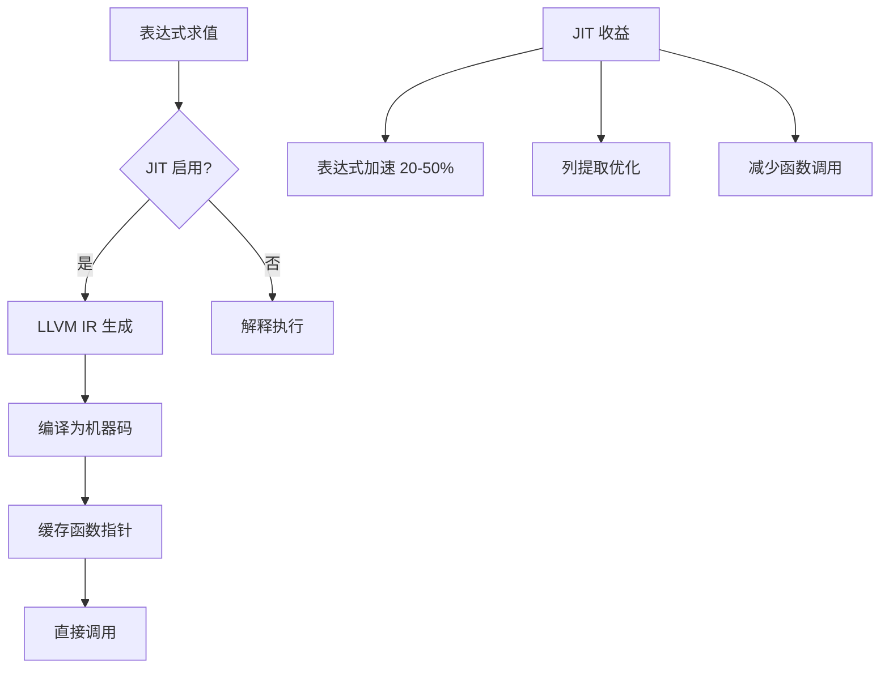

### JIT 配置

```ini
# postgresql.conf
jit = on
jit_above_cost = 100000
jit_inline_above_cost = 500000
jit_optimize_above_cost = 500000
```

## FDW（外部数据包装器）

FDW 允许 PG 访问外部数据源：

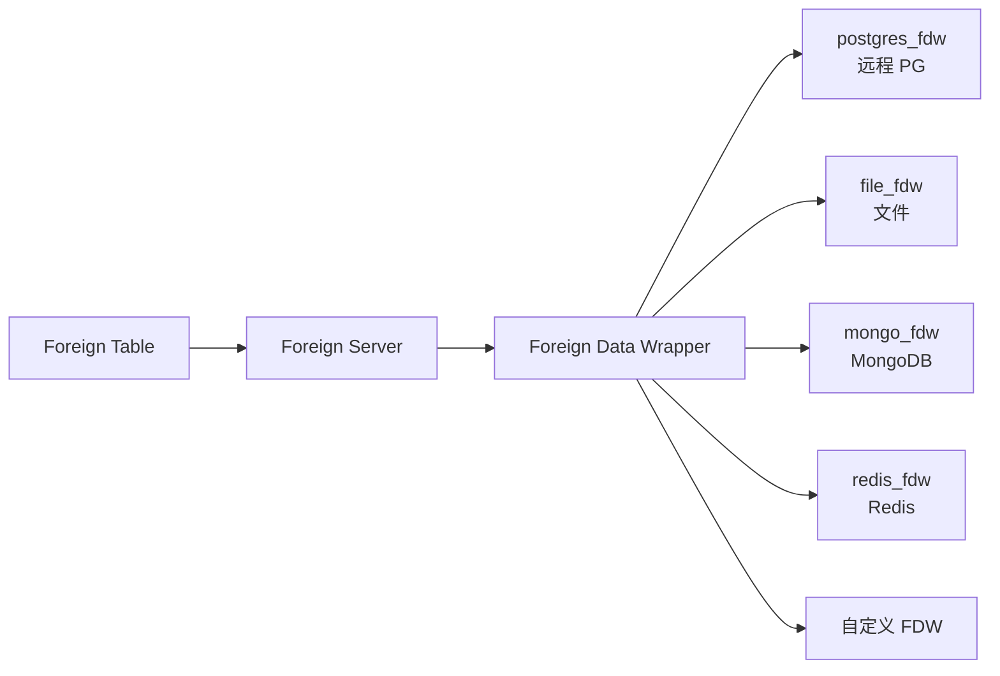

### FDW 示例

```sql
-- 创建扩展
CREATE EXTENSION postgres_fdw;

-- 创建外部服务器
CREATE SERVER remote_db
    FOREIGN DATA WRAPPER postgres_fdw
    OPTIONS (host 'remote.example.com', port '5432', dbname 'mydb');

-- 创建用户映射
CREATE USER MAPPING FOR current_user
    SERVER remote_db
    OPTIONS (user 'remote_user', password 'secret');

-- 创建外部表
CREATE FOREIGN TABLE remote_users (
    id      INT,
    name    TEXT
) SERVER remote_db
    OPTIONS (schema_name 'public', table_name 'users');

-- 直接查询外部表
SELECT * FROM remote_users;
```

## 扩展机制

PG 的扩展机制允许加载自定义功能：

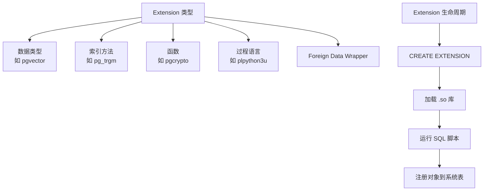

### 常用扩展

```sql
-- 向量索引
CREATE EXTENSION pgvector;

-- 三元组相似度
CREATE EXTENSION pg_trgm;

-- 加密函数
CREATE EXTENSION pgcrypto;

-- 全文检索增强
CREATE EXTENSION unaccent;

-- 定时任务
CREATE EXTENSION pg_cron;
```

## 过程语言

PG 支持多种过程语言：

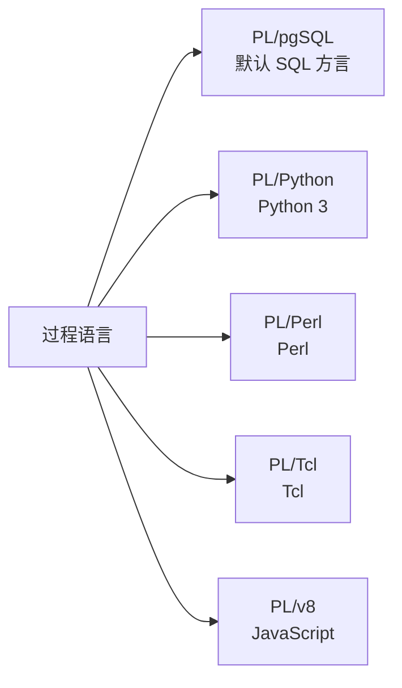

### PL/pgSQL 示例

```sql
CREATE OR REPLACE FUNCTION update_modified_column()
RETURNS TRIGGER AS $$
BEGIN
    NEW.modified_at = NOW();
    RETURN NEW;
END;
$$ LANGUAGE plpgsql;

CREATE TRIGGER update_modtime
    BEFORE UPDATE ON users
    FOR EACH ROW
    EXECUTE FUNCTION update_modified_column();
```

## 要点总结

- **MVCC** 是 PG 并发控制的核心，读不阻塞写
- **流复制** 是物理复制，基于 WAL，支持同步/异步
- **逻辑复制** 是发布/订阅模型，支持跨版本、选择性复制
- **分区表** 支持 Range/List/Hash，自动分区裁剪
- **并行查询** 通过多 Worker 加速扫描、Join、聚合
- **FDW** 让 PG 访问外部数据源
- **扩展机制** 支持自定义类型、索引、函数、语言

## 思考题

1. 流复制与逻辑复制各适合什么场景？为什么逻辑复制不支持 DDL？
2. 分区表的分区裁剪在什么情况下会失效？如何确保裁剪生效？
3. JIT 编译有启动开销，为什么 PG 设置 `jit_above_cost = 100000`？什么样的查询值得 JIT？