# 使用场景与选型

## 学习目标

- 掌握 PostgreSQL 的核心适用场景
- 理解 PG 与 MySQL、MongoDB、Redis、Elasticsearch 的选型差异
- 熟悉不同场景下的 PG 配置与优化建议

## 核心概念

- **OLTP（Online Transaction Processing）**：在线事务处理，强事务、高并发
- **OLAP（Online Analytical Processing）**：在线分析处理，复杂查询、聚合
- **GIS（Geographic Information System）**：地理信息系统
- **全文检索**：文本搜索、模糊匹配
- **时序数据**：时间序列，按时间分区、聚合
- **数据中台**：数据集成、数据仓库

## 适用场景总览

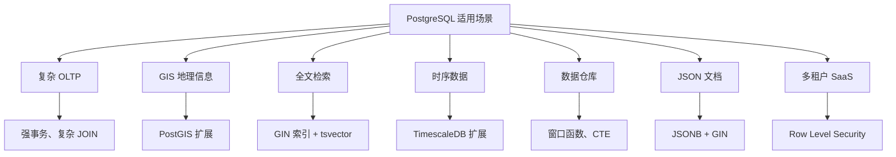

## 场景 1：复杂 OLTP

PG 在复杂 OLTP 场景表现出色：

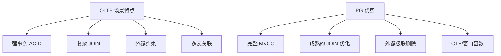

**典型业务**：

- ERP 系统（财务、库存、订单）
- CRM 系统（客户管理、销售）
- 订单系统（订单、支付、退款）

**配置建议**：

```ini
shared_buffers = 4GB
work_mem = 64MB
maintenance_work_mem = 1GB
effective_cache_size = 12GB
max_connections = 200
```

## 场景 2：GIS 地理信息

通过 PostGIS 扩展，PG 成为最强大的开源 GIS 数据库：

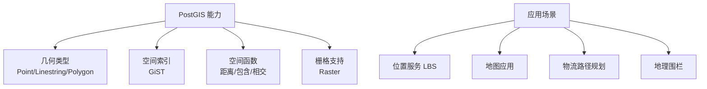

**示例**：

```sql
-- 创建 PostGIS 扩展
CREATE EXTENSION postgis;

-- 创建地理列
ALTER TABLE locations ADD COLUMN geom GEOMETRY(Point, 4326);
CREATE INDEX idx_geom ON locations USING gist(geom);

-- 查询附近 5km 的点
SELECT * FROM locations
WHERE ST_DWithin(
    geom,
    ST_MakePoint(116.4, 39.9)::GEOMETRY(Point, 4326),
    5000
);
```

## 场景 3：全文检索

PG 内置全文检索能力：

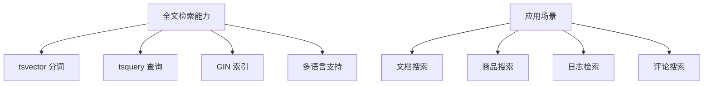

**示例**：

```sql
-- 创建全文索引
CREATE INDEX idx_content_fts ON documents USING gin(to_tsvector('english', content));

-- 搜索包含 'postgresql' 和 'database' 的文档
SELECT * FROM documents
WHERE to_tsvector('english', content) @@ to_tsquery('english', 'postgresql & database');

-- 模糊搜索
SELECT * FROM documents
WHERE to_tsvector('english', content) @@ to_tsquery('english', 'post:*');
```

## 场景 4：时序数据

通过 TimescaleDB 扩展，PG 成为时序数据库：

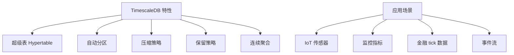

**示例**：

```sql
-- 创建 TimescaleDB 扩展
CREATE EXTENSION timescaledb;

-- 创建超级表
CREATE TABLE sensor_data (
    time        TIMESTAMP NOT NULL,
    sensor_id   INT,
    temperature DOUBLE PRECISION
);

SELECT create_hypertable('sensor_data', 'time');

-- 连续聚合（实时物化视图）
CREATE MATERIALIZED VIEW sensor_hourly
    WITH (timescaledb.continuous) AS
SELECT sensor_id,
       time_bucket('1 hour', time) AS bucket,
       AVG(temperature) AS avg_temp
FROM sensor_data
GROUP BY sensor_id, bucket;

-- 自动压缩策略
SELECT add_compression_policy('sensor_data', INTERVAL '7 days');
```

## 场景 5：数据仓库

PG 的分析能力适合中小规模数据仓库：

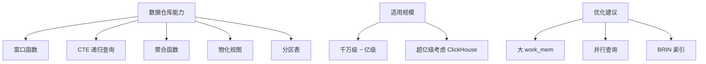

**示例**：

```sql
-- 窗口函数：计算移动平均
SELECT
    date,
    revenue,
    AVG(revenue) OVER (ORDER BY date ROWS BETWEEN 6 PRECEDING AND CURRENT ROW) AS moving_avg_7d
FROM daily_revenue;

-- CTE 递归：层级查询
WITH RECURSIVE org_tree AS (
    SELECT id, name, parent_id, 1 AS level
    FROM employees WHERE parent_id IS NULL
    UNION ALL
    SELECT e.id, e.name, e.parent_id, t.level + 1
    FROM employees e
    JOIN org_tree t ON e.parent_id = t.id
)
SELECT * FROM org_tree;
```

## 与竞品对比

### PostgreSQL vs MySQL

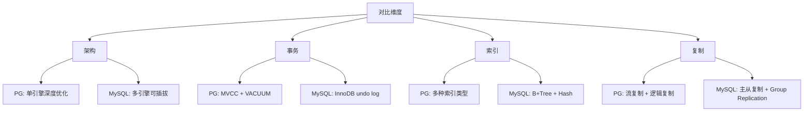

| 维度 | PostgreSQL | MySQL |
|------|-----------|-------|
| 默认隔离级别 | Read Committed | Repeatable Read |
| MVCC | 多版本 + VACUUM | Undo log + purge |
| JSON | JSONB（二进制） | JSON（文本） |
| GIS | PostGIS（强） | 空间函数（弱） |
| 全文检索 | 内置 GIN | 全文索引（弱） |
| 窗口函数 | 完善 | 8.0+ 支持 |
| 复制 | 流复制 + 逻辑复制 | 主从 + Group Replication |
| 集群 | 无原生（需 Patroni） | InnoDB Cluster |

### PostgreSQL vs MongoDB

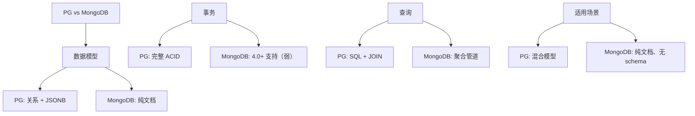

### PostgreSQL vs Redis

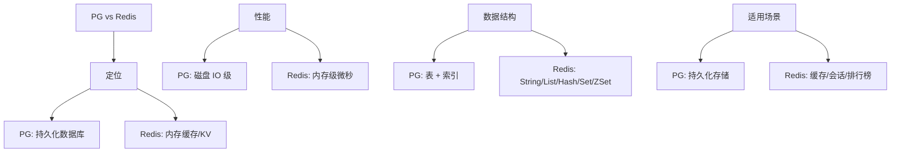

### PostgreSQL vs Elasticsearch

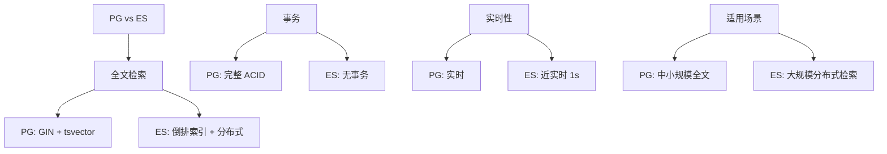

## 选型决策树

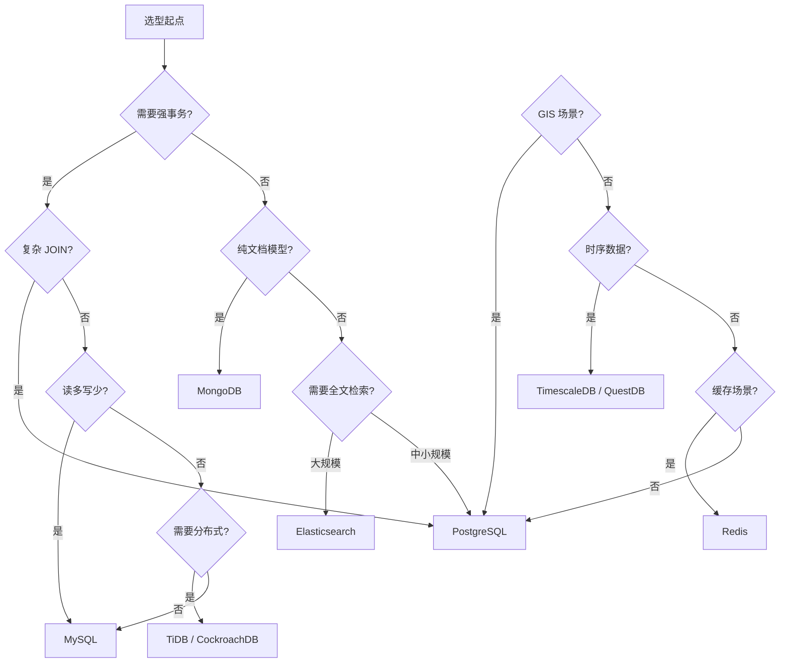

## 典型案例

### 案例 1：电商订单系统

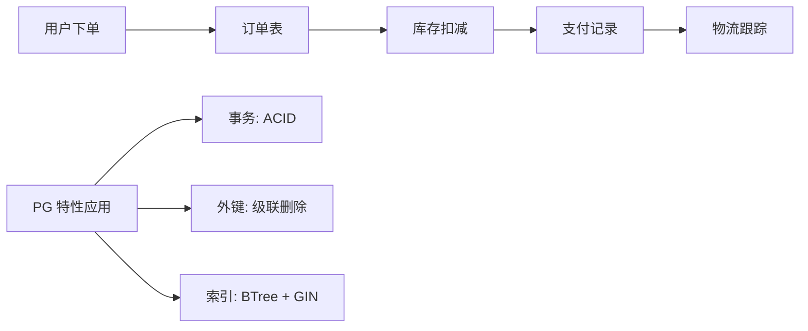

### 案例 2：物联网平台

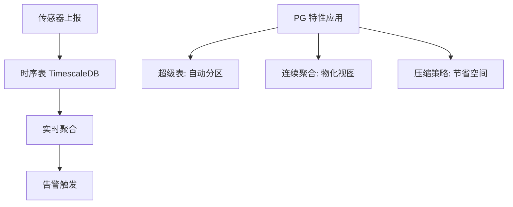

### 案例 3：内容管理系统

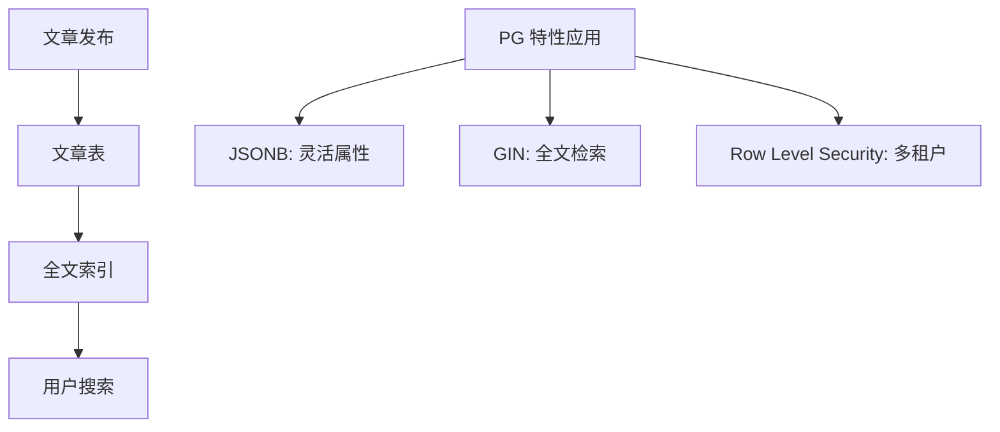

## 要点总结

- PG 适合**复杂 OLTP、GIS、全文检索、时序数据、数据仓库**
- 与 MySQL 相比，PG 在 SQL 兼容性、GIS、全文检索上更强
- 与 MongoDB 相比，PG 支持 ACID + JSONB 混合模型
- 与 Redis 相比，PG 是持久化存储，Redis 是缓存
- 与 ES 相比，PG 适合中小规模全文检索，ES 适合大规模分布式

## 思考题

1. 为什么 PG 的 JSONB 比 MySQL 的 JSON 更适合存储 JSON 文档？
2. TimescaleDB 在什么数据规模下比 InfluxDB 更有优势？
3. 如果业务需要"强事务 + 分布式"，应该选择 PG + Patroni 还是 TiDB？各有什么权衡？