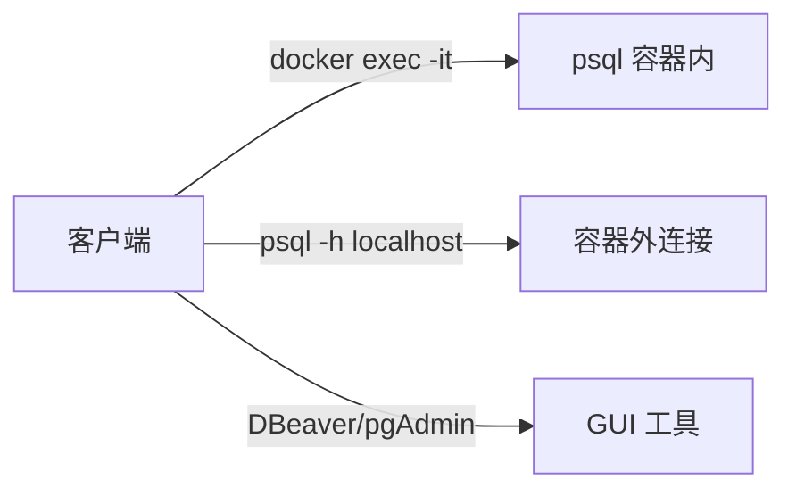
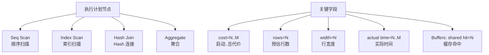

# 动手实验

## 学习目标

- 掌握 PostgreSQL 的 Docker 部署方式
- 熟悉数据库创建、表管理、CRUD 操作
- 学习使用 EXPLAIN 分析查询计划
- 了解 pgbench 性能测试与 pg_stat_* 监控

## 核心概念

- **Docker 部署**：容器化快速启动 PG 实例
- **DDL/DML**：数据定义语言（CREATE/ALTER/DROP）和数据操作语言（INSERT/UPDATE/DELETE/SELECT）
- **EXPLAIN**：显示查询执行计划
- **pgbench**：PG 官方基准测试工具
- **pg_stat_activity**：活跃连接与查询状态
- **pg_stat_statements**：SQL 执行统计

## 实验 1：Docker 部署 PostgreSQL

### 启动容器

```bash
# 拉取镜像
docker pull postgres:16

# 启动容器
docker run -d \
    --name pg-lab \
    -e POSTGRES_PASSWORD=postgres \
    -e POSTGRES_USER=postgres \
    -e POSTGRES_DB=testdb \
    -p 5432:5432 \
    -v pg_data:/var/lib/postgresql/data \
    postgres:16

# 查看日志
docker logs -f pg-lab

# 进入容器
docker exec -it pg-lab bash

# 连接数据库
docker exec -it pg-lab psql -U postgres -d testdb
```

### 连接方式



## 实验 2：创建数据库与表

### 创建数据库

```sql
-- 查看现有数据库
\l

-- 创建数据库
CREATE DATABASE mydb ENCODING 'UTF8';

-- 切换数据库
\c mydb

-- 创建 schema
CREATE SCHEMA app;
```

### 创建表

```sql
-- 创建用户表
CREATE TABLE users (
    id          BIGSERIAL PRIMARY KEY,
    username    VARCHAR(50) NOT NULL UNIQUE,
    email       VARCHAR(100) NOT NULL,
    created_at  TIMESTAMP DEFAULT NOW(),
    updated_at  TIMESTAMP DEFAULT NOW()
);

-- 创建订单表
CREATE TABLE orders (
    id          BIGSERIAL PRIMARY KEY,
    user_id     BIGINT NOT NULL REFERENCES users(id),
    total_amount DECIMAL(10,2) NOT NULL,
    status      VARCHAR(20) DEFAULT 'pending',
    created_at  TIMESTAMP DEFAULT NOW()
);

-- 创建索引
CREATE INDEX idx_orders_user_id ON orders(user_id);
CREATE INDEX idx_orders_created_at ON orders(created_at);

-- 查看表结构
\d users
\d orders
```

## 实验 3：CRUD 操作

### 插入数据（INSERT）

```sql
-- 插入单条
INSERT INTO users (username, email)
VALUES ('alice', 'alice@example.com');

-- 批量插入
INSERT INTO users (username, email) VALUES
    ('bob', 'bob@example.com'),
    ('charlie', 'charlie@example.com'),
    ('david', 'david@example.com');

-- 插入订单
INSERT INTO orders (user_id, total_amount, status) VALUES
    (1, 100.50, 'completed'),
    (2, 250.00, 'pending'),
    (1, 75.25, 'completed');

-- 返回插入的行
INSERT INTO users (username, email)
VALUES ('eve', 'eve@example.com')
RETURNING *;
```

### 查询数据（SELECT）

```sql
-- 全表查询
SELECT * FROM users;

-- 条件查询
SELECT * FROM users WHERE username = 'alice';

-- JOIN 查询
SELECT u.username, o.id AS order_id, o.total_amount
FROM users u
JOIN orders o ON u.id = o.user_id
WHERE o.status = 'completed';

-- 聚合查询
SELECT user_id, COUNT(*) AS order_count, SUM(total_amount) AS total_spent
FROM orders
GROUP BY user_id
ORDER BY total_spent DESC;

-- 分页查询
SELECT * FROM users
ORDER BY id
LIMIT 10 OFFSET 0;
```

### 更新数据（UPDATE）

```sql
-- 更新单条
UPDATE users
SET email = 'alice.new@example.com'
WHERE username = 'alice';

-- 批量更新
UPDATE orders
SET status = 'shipped'
WHERE status = 'pending' AND created_at < NOW() - INTERVAL '7 days';

-- 返回更新的行
UPDATE orders
SET total_amount = total_amount * 1.1
WHERE user_id = 1
RETURNING *;
```

### 删除数据（DELETE）

```sql
-- 删除单条
DELETE FROM users WHERE username = 'david';

-- 批量删除
DELETE FROM orders
WHERE status = 'cancelled'
  AND created_at < NOW() - INTERVAL '30 days';

-- 返回删除的行
DELETE FROM users
WHERE username = 'eve'
RETURNING *;
```

## 实验 4：EXPLAIN 分析

### 查看执行计划

```sql
-- 不执行，只看计划
EXPLAIN SELECT * FROM users WHERE username = 'alice';

-- 执行并显示实际统计
EXPLAIN ANALYZE SELECT * FROM users WHERE username = 'alice';

-- 详细输出
EXPLAIN (ANALYZE, BUFFERS, FORMAT TEXT)
SELECT u.username, COUNT(*) AS order_count
FROM users u
JOIN orders o ON u.id = o.user_id
GROUP BY u.username;
```

### 执行计划解读



**示例解读**：

```
Index Scan using users_username_idx on users  (cost=0.28..8.29 rows=1 width=100)
  Index Cond: ((username)::text = 'alice'::text)
  Buffers: shared hit=3
```

- `cost=0.28..8.29`：启动代价 0.28，总代价 8.29
- `rows=1`：预估返回 1 行
- `Index Scan`：使用索引扫描
- `Buffers: shared hit=3`：缓存命中 3 个页面

### 强制使用索引

```sql
-- 关闭顺序扫描（测试用）
SET enable_seqscan = off;
EXPLAIN SELECT * FROM users WHERE username = 'alice';

-- 恢复
SET enable_seqscan = on;
```

## 实验 5：pgbench 性能测试

### 初始化测试数据

```bash
# 初始化 pgbench 表
docker exec -it pg-lab pgbench -U postgres -i -s 10 testdb

# -s 10 表示 10 倍缩放因子（约 100 万行）
```

### 运行基准测试

```bash
# 单线程测试
docker exec -it pg-lab pgbench -U postgres -c 10 -t 1000 testdb

# -c 10: 10 个并发连接
# -t 1000: 每个连接执行 1000 个事务

# 持续 60 秒测试
docker exec -it pg-lab pgbench -U postgres -c 20 -T 60 testdb
```

### 结果解读

```
transaction type: <builtin: TPC-B (sort of)>
scaling factor: 10
query mode: simple
number of clients: 20
number of threads: 1
maximum number of tries: 1
duration: 60 s
number of transactions actually processed: 45678
number of failed transactions: 0 (0.000%)
latency average = 26.264 ms
initial connection time = 45.123 ms
tps = 761.300000 (without initial connection time)
```

- `tps = 761`：每秒 761 个事务
- `latency average = 26.264 ms`：平均延迟 26ms

## 实验 6：监控与统计

### pg_stat_activity

```sql
-- 查看活跃连接
SELECT pid, usename, application_name, state, query, query_start
FROM pg_stat_activity
WHERE state = 'active';

-- 查看等待事件
SELECT pid, wait_event_type, wait_event, query
FROM pg_stat_activity
WHERE wait_event IS NOT NULL;

-- 终止长时间运行的查询
SELECT pg_cancel_backend(pid);
```

### pg_stat_statements

```sql
-- 启用扩展
CREATE EXTENSION pg_stat_statements;

-- 查看最慢的 SQL
SELECT query, calls, total_exec_time, mean_exec_time, rows
FROM pg_stat_statements
ORDER BY mean_exec_time DESC
LIMIT 10;

-- 查看最频繁的 SQL
SELECT query, calls, total_exec_time
FROM pg_stat_statements
ORDER BY calls DESC
LIMIT 10;
```

### 其他统计视图

```sql
-- 表级统计
SELECT relname, n_live_tup, n_dead_tup, last_vacuum, last_autovacuum
FROM pg_stat_user_tables
ORDER BY n_dead_tup DESC;

-- 索引使用统计
SELECT indexrelname, idx_scan, idx_tup_read, idx_tup_fetch
FROM pg_stat_user_indexes
ORDER BY idx_scan DESC;

-- 缓存命中率
SELECT
    sum(heap_blks_read) AS heap_read,
    sum(heap_blks_hit) AS heap_hit,
    sum(heap_blks_hit) * 100.0 / (sum(heap_blks_hit) + sum(heap_blks_read)) AS ratio
FROM pg_statio_user_tables;
```

## 实验 7：备份与恢复

### 逻辑备份（pg_dump）

```bash
# 备份单个数据库
docker exec pg-lab pg_dump -U postgres testdb > testdb_backup.sql

# 备份所有数据库
docker exec pg-lab pg_dumpall -U postgres > all_backup.sql

# 恢复
docker exec -i pg-lab psql -U postgres testdb < testdb_backup.sql
```

### 物理备份（pg_basebackup）

```bash
# 创建基础备份
docker exec pg-lab pg_basebackup -U postgres -D /var/lib/postgresql/backup -Ft -z -P
```

## 实验 8：VACUUM 分析

```sql
-- 查看表的死元组数量
SELECT relname, n_live_tup, n_dead_tup
FROM pg_stat_user_tables
WHERE relname = 'users';

-- 手动 VACUUM
VACUUM users;

-- 完整 VACUUM（回收空间）
VACUUM FULL users;

-- 分析统计信息
ANALYZE users;

-- 组合操作
VACUUM ANALYZE users;
```

## 要点总结

- Docker 部署 PG 简单快速，适合实验环境
- EXPLAIN ANALYZE 是分析查询性能的关键工具
- pgbench 可用于基准测试，评估 TPS 和延迟
- pg_stat_* 系列视图提供丰富的运行时统计
- 定期 VACUUM 和 ANALYZE 保持数据库健康

## 思考题

1. `EXPLAIN` 与 `EXPLAIN ANALYZE` 的区别是什么？为什么生产环境要慎用 `EXPLAIN ANALYZE`？
2. pgbench 的 TPS 数值受哪些因素影响？如何提高 TPS？
3. `VACUUM` 与 `VACUUM FULL` 的区别是什么？什么情况下必须用 `VACUUM FULL`？