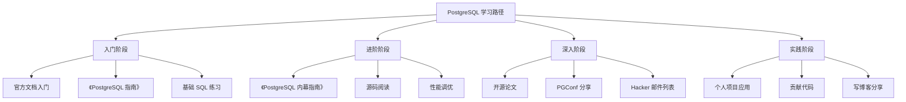
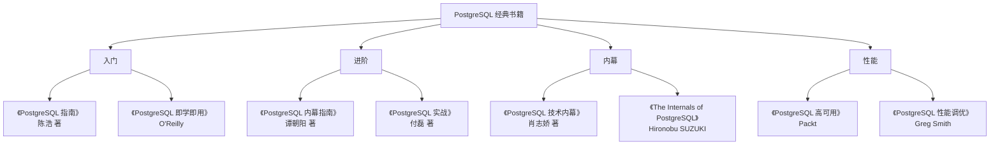
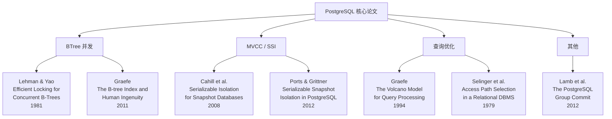
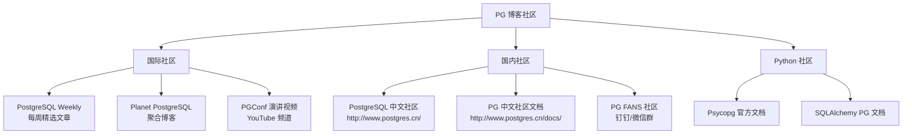
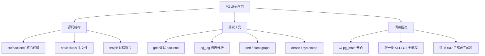
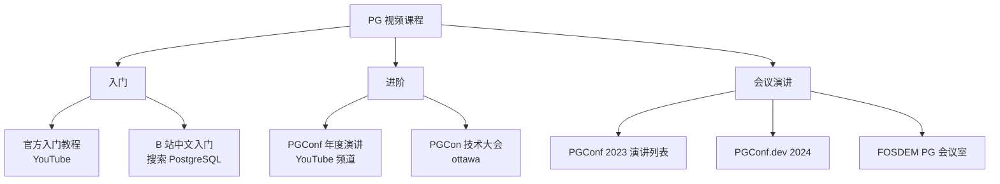
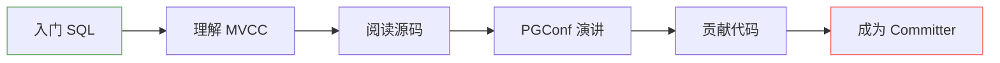

# 学习资源

## 学习目标

- 掌握 PostgreSQL 学习的最佳路径与资源清单
- 了解官方文档、书籍、论文、博客、课程等资源
- 建立持续学习 PostgreSQL 的体系

## 核心概念

- **官方文档**：最权威、最全面的学习资料
- **经典书籍**：系统化学习 PostgreSQL 内部原理
- **技术论文**：了解 PostgreSQL 的设计思想与算法
- **博客与社区**：跟踪最新动态与最佳实践
- **视频课程**：可视化学习 PostgreSQL

## 学习路径

## 官方文档

| 资源 | 说明 | 链接 |
|------|------|------|
| 官方手册 | 最全面的参考文档，含 SQL 语法、管理、内部 | https://www.postgresql.org/docs/ |
| 教程 | 官方入门教程，适合初学者 | https://www.postgresql.org/docs/current/tutorial.html |
| Wiki | 社区维护的 FAQ、指南、配置 | https://wiki.postgresql.org/ |
| Git 仓库 | 源码，学习实现的最佳参考 | https://github.com/postgres/postgres |
| 官方博客 | 发布公告、版本更新 | https://www.postgresql.org/about/news/ |

## 经典书籍

### 推荐书目

**入门**：

1. **《PostgreSQL 指南》**（陈浩）：适合初学者，覆盖 SQL 基础、管理、备份恢复
2. **《PostgreSQL 即学即用》**（O'Reilly）：快速上手，适合有经验的开发人员

**进阶**：

3. **《PostgreSQL 实战》**（付磊）：DBA 视角，覆盖备份、复制、高可用、监控
4. **《PostgreSQL 内幕指南》**（谭朝阳）：深入源码，讲解存储引擎、事务、查询优化

**内幕**：

5. **《The Internals of PostgreSQL》**（Hironobu SUZUKI）：最著名的 PG 内幕书籍，免费在线阅读
6. **《PostgreSQL 技术内幕》**（肖志娇）：中文版内幕讲解，覆盖存储、事务、索引

**性能**：

7. **《PostgreSQL 性能调优》**（Greg Smith）：实践导向的性能优化指南

## 技术论文

PostgreSQL 的许多核心算法来自学术论文：

### 必读论文

| 论文 | 作者 | 年份 | 关联 PG 特性 |
|------|------|------|-------------|
| *Efficient Locking for Concurrent B-Trees* | Lehman & Yao | 1981 | BTree 索引高并发 |
| *The Volcano Model for Query Processing* | Graefe | 1994 | 火山模型执行器 |
| *Serializable Isolation for Snapshot Databases* | Cahill et al. | 2008 | SSI 可串行化隔离 |
| *The B-tree Index and Human Ingenuity* | Graefe | 2011 | BTree 历史与实现 |
| *Serializable Snapshot Isolation in PostgreSQL* | Ports & Grittner | 2012 | PG SSI 实现 |

## 博客与社区

### 推荐博客

- **PG Weekly**：每周一封邮件，精选 PG 文章、工具、新闻
- **Planet PostgreSQL**：聚合全球 PG 博客
- **PGConf**：年度会议，含大量技术演讲视频
- **PostgreSQL 中文社区**：国内最大 PG 社区，含翻译文档、论坛

## 源码学习资源

### 源码阅读路径

1. 从 `main()` 入口（`src/backend/main/main.c`）
2. postmaster 循环（`src/backend/postmaster/postmaster.c`）
3. backend 进程初始化（`src/backend/tcop/postgres.c`）
4. 解析器（`src/backend/parser/`）
5. 规划器（`src/backend/optimizer/`）
6. 执行器（`src/backend/executor/`）
7. 存储引擎（`src/backend/storage/`）
8. 事务（`src/backend/access/transam/`）

## 视频课程

## 在线工具

| 工具 | 说明 | 链接 |
|------|------|------|
| PostgreSQL Playground | 在线运行 SQL | https://www.db-fiddle.com/ |
| pgAdmin | 官方 GUI 管理工具 | https://www.pgadmin.org/ |
| DBeaver | 通用数据库管理工具 | https://dbeaver.io/ |
| EXPLAIN.depesz.com | 可视化执行计划 | https://explain.depesz.com/ |
| PGXN | PostgreSQL 扩展网络 | https://pgxn.org/ |

## 认证与考试

| 认证 | 提供方 | 说明 |
|------|--------|------|
| PostgreSQL Certified Associate | EDB | 初级认证 |
| PostgreSQL Certified Professional | EDB | 高级认证 |
| PostgreSQL Certified Master | EDB | 大师级认证 |

## 能量提升路径

## 要点总结

- **官方文档**是最权威的学习资源，应该作为第一参考
- 经典书籍推荐《PostgreSQL 内幕指南》和《The Internals of PostgreSQL》
- 核心论文包括 Lehman & Yao (BTree)、Graefe (Volcano)、Cahill (SSI)
- 源码阅读从 `main()` 开始，跟踪一条 SELECT 的全流程
- PGConf 演讲视频是了解最新技术动态的好途径

## 思考题

1. 在阅读 PG 源码时，应该从哪个模块开始？为什么？
2. 为什么 Lehman & Yao 的 BTree 论文（1981）至今仍是 PG 的核心算法？这个算法解决了什么问题？
3. 如果你是 PG 的初学者，你会按照什么顺序学习这些资源？