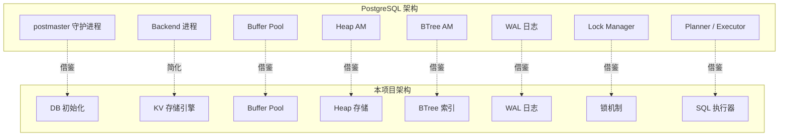
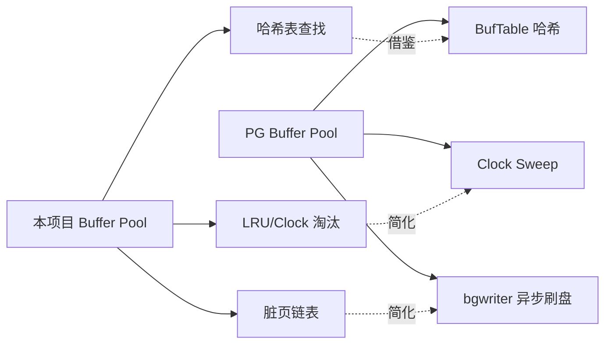
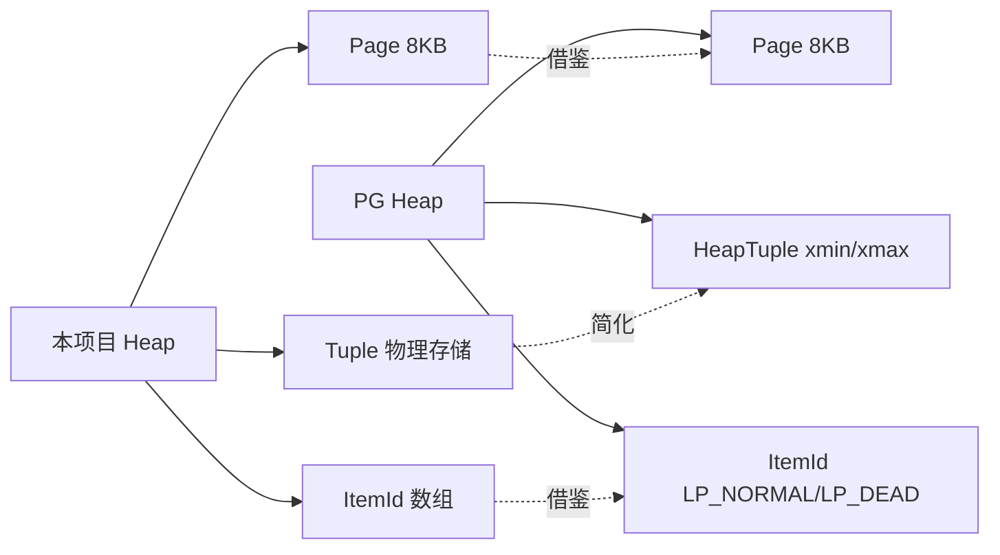
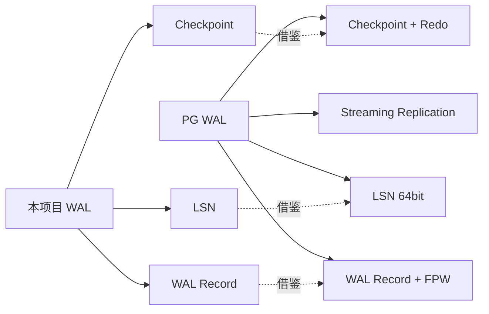
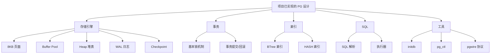
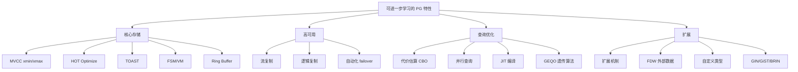
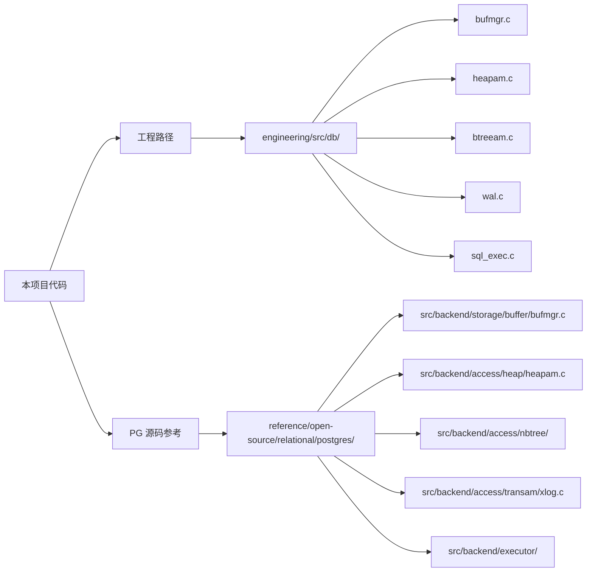
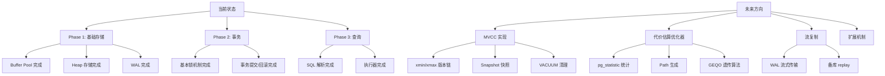

# 项目关联

## 学习目标

- 理解本书项目存储引擎与 PostgreSQL 架构的对应关系
- 明确已在项目中借鉴的 PG 设计，以及可以进一步学习的点
- 为后续项目演进提供 PostgreSQL 参考方向

## 核心概念

- **本项目存储引擎**：本书项目实现的简化版 PostgreSQL 风格存储引擎
- **PG 参考映射**：本项目各模块与 PG 源码的对应关系
- **已借鉴的设计**：已经在项目中实现的 PG 核心设计
- **可进一步学习的点**：PG 中尚未实现但值得深入的部分

## 架构对比

## 模块对应关系

### 1. 数据库初始化

| 项目 | PG 对应 | 说明 |
|------|---------|------|
| `initdb.c` | `initdb` | 初始化数据库集群 |
| `pg_ctl.c` | `pg_ctl` | 服务器控制工具 |
| `db_server.c` | postmaster | 简化版守护进程 |
| `postgresql.conf` | `postgresql.conf` | 配置参数 |

**已借鉴**：PG 风格的 initdb 初始化流程，包括数据目录创建、系统表初始化、配置生成。

**可进一步学习**：
- PG 的 WAL 初始化流程
- 系统表（pg_database/pg_class）的创建与维护
- `pg_hba.conf` 认证配置

### 2. Buffer Pool

| 项目 | PG 对应 | 说明 |
|------|---------|------|
| `bufmgr.c` | `bufmgr.c` | 缓冲池管理器 |
| `buf.h` | `buf.h` | 页面缓存头文件 |
| `replacer.c` | Clock Sweep | 淘汰策略 |

**已借鉴**：
- Buffer Tag 概念（`<tablespace, database, relfilenode, fork, blocknum>`）
- Pin/Unpin 机制
- 脏页标记与刷盘策略

**可进一步学习**：
- PG 的 ring buffer 策略（大顺序扫描保护）
- `strategy_get` 与 `buffer_alloc` 的拆分
- hint bits 与 buffer 的协作

### 3. Heap 存储

| 项目 | PG 对应 | 说明 |
|------|---------|------|
| `heapam.c` | `heapam.c` | 堆表访问方法 |
| `rel.c` | `rel.c` | Relation 抽象 |
| `page.c` | `page.c` | 页面管理 |

**已借鉴**：
- 页面结构（PageHeader + ItemId + Tuple）
- 堆表存储（无序堆，非聚簇索引）
- Tuple 的物理布局

**可进一步学习**：
- MVCC 版本链（xmin/xmax）
- HOT（Heap-Only Tuple）
- TOAST（大字段外存）
- FSM（Free Space Map）与 VM（Visibility Map）

### 4. BTree 索引

| 项目 | PG 对应 | 说明 |
|------|---------|------|
| `btreeam.c` | `btreeam.c` | BTree 索引访问方法 |
| `btree.c` | `nbtinsert.c` / `nbtsearch.c` | BTree 操作 |

**已借鉴**：
- B-Tree 平衡树结构
- 页面分裂与合并
- 叶子节点 sibling 指针

**可进一步学习**：
- Lehman & Yao 高并发算法
- 右链接（rightlink）与无锁读
- SPLIT_END 标志与结转
- Fastpath 优化（最右路径缓存）

### 5. WAL 日志

| 项目 | PG 对应 | 说明 |
|------|---------|------|
| `wal.c` | `xlog.c` | WAL 日志管理 |
| `wal_buf.c` | WAL Buffers | WAL 缓冲区 |

**已借鉴**：
- 预写日志（Write-Ahead Logging）原则
- LSN 逻辑序列号
- 检查点（Checkpoint）

**可进一步学习**：
- Full Page Writes（FPW）
- 流复制协议
- Logical Decoding
- 组提交（Group Commit）

### 6. 锁机制

| 项目 | PG 对应 | 说明 |
|------|---------|------|
| `lock.c` | `lock.c` | 锁管理器 |
| 轻量级锁 | LWLock | 轻量级锁 |

**已借鉴**：
- 表级锁概念
- 读锁/写锁分离

**可进一步学习**：
- PG 8 种锁模式兼容矩阵
- LWLock 与 Spinlock 的分层设计
- 死锁检测算法
- Advisory Lock

### 7. SQL 执行器

| 项目 | PG 对应 | 说明 |
|------|---------|------|
| `sql_exec.c` | `executor/` | SQL 执行器 |
| `pgwire.c` | libpq 协议 | 前端/后端协议 |

**已借鉴**：
- 解析 → 优化 → 执行 三阶段
- 火山模型执行器

**可进一步学习**：
- PG 的 Planner 代价估算
- 并行查询框架
- JIT 编译（LLVM）

## 已实现的 PG 核心设计

## 可进一步学习的 PG 特性

## 代码参考路径

## 项目演进路线

## 要点总结

- 本项目已实现 PG 存储引擎的核心模块：Buffer Pool、Heap、BTree、WAL
- 已借鉴的设计包括：8KB 页面、Clock Sweep、BTree 分裂、WAL 预写日志
- 可进一步学习的核心特性：MVCC 版本链、代价估算优化器、流复制、扩展机制
- PG 源码路径 `src/backend/` 是学习 PG 实现的最佳参考

## 思考题

1. 本项目最核心的模块（Buffer Pool、Heap、BTree、WAL）中，哪个与 PG 的差异最大？为什么？
2. 如果把 MVCC 集成到本项目，需要修改哪些模块？优先级如何？
3. 相比 PG 的完整实现，本项目在架构上做的最大的简化是什么？这个简化合理吗？