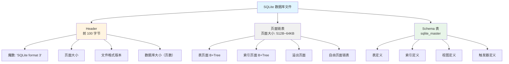
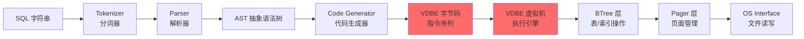
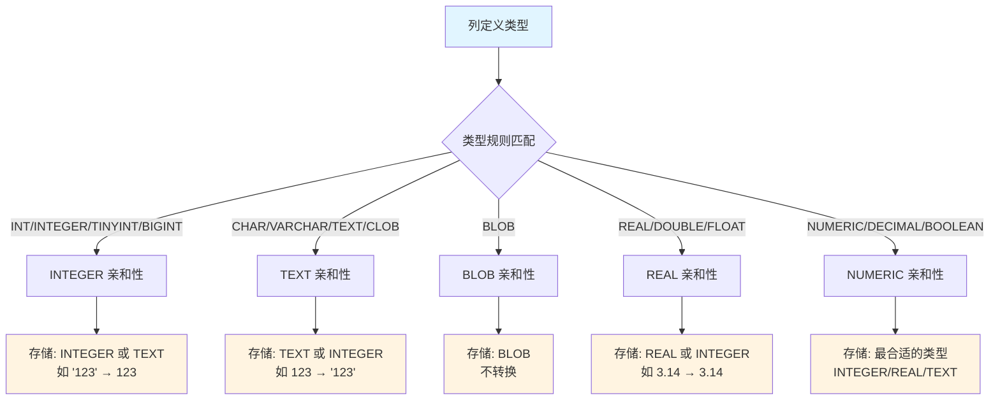
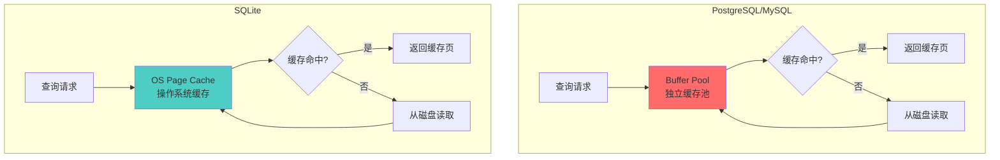

# SQLite3 学习 Wiki

## 学习目标

1. 理解 SQLite3 作为**嵌入式数据库**的独特架构（无独立进程、无网络层）
2. 掌握 SQLite3 的**单文件存储**模型（`.db` + `-wal` + `-shm`）
3. 深入理解 **VDBE 虚拟机**执行模型（SQL → 字节码 → 执行）
4. 熟悉 SQLite3 的**动态类型系统**（Manifest Typing）
5. 了解 SQLite3 的**极致简洁**设计哲学（零配置、无依赖）

---

## 核心概念

### 1. 嵌入式数据库（Embedded Database）

**定义**：SQLite3 不像 PostgreSQL/MySQL 那样运行独立的服务器进程，而是作为库直接链接到宿主应用程序中，在宿主进程内运行。

**对比**：

| 特性 | PostgreSQL/MySQL | SQLite3 |
|------|------------------|---------|
| 架构 | 客户端-服务器 | 嵌入式（库） |
| 进程模型 | 独立服务器进程 | 宿主进程内 |
| 网络层 | 有（监听端口） | 无 |
| 连接方式 | TCP/IP 或 Unix Socket | 函数调用（`sqlite3_open`） |
| 并发模型 | 多进程/多线程 | 单写者 + 多读者 |
| 部署复杂度 | 需安装/配置服务 | 零配置（一个库文件） |

**优势**：
- **零配置**：无需安装、无需启动服务、无需管理员权限
- **零依赖**：核心库约 250KB（压缩后），无外部依赖
- **跨平台**：Windows/macOS/Linux/Android/iOS 全支持
- **极致性能**：无网络往返，函数调用直接执行

**劣势**：
- **无网络访问**：客户端必须能访问文件系统
- **并发写入受限**：同一时刻只有一个写者（WAL 模式下可并发读）
- **无法跨机器访问**：不支持远程连接

**典型应用场景**：
- 移动应用（Android/iOS 本地存储）
- 桌面应用（浏览器、编辑器、IDE）
- IoT 设备（嵌入式系统）
- 中小型网站（日访问量 < 10 万）
- 测试/原型开发

---

### 2. 单文件数据库（Single-File Database）

**核心设计**：整个数据库存储在一个 `.db` 文件中（理论上最大 281TB，实际受 OS 限制）。

**实际文件组成**：
- **`database.db`**：主数据库文件，包含所有表和索引
- **`database.db-wal`**：WAL（Write-Ahead Logging）文件，仅在 WAL 模式下存在
- **`database.db-shm`**：共享内存索引文件，配合 WAL 使用

**文件结构**：



**页面组织**：
- 所有数据以**页面**为单位组织（默认 4KB，可配置 512B~64KB）
- 页面编号从 1 开始（Page 1 是数据库根页）
- 页面类型由页头标识：表页、索引页、溢出页、自由页、指针页

**单文件优势**：
- **备份简单**：拷贝一个文件即可
- **版本控制友好**：可直接纳入 Git 管理
- **零配置**：无需配置数据目录、日志目录等

**单文件限制**：
- **跨文件系统事务**：不支持
- **数据库大小上限**：理论上 281TB（2^48 页面 × 64KB/页），实际受 OS 文件系统限制
- **单文件性能瓶颈**：所有表/索引共用一个文件，I/O 竞争

---

### 3. VDBE 虚拟机（Virtual Database Engine）

**核心创新**：SQLite 将 SQL 编译成**字节码**（VDBE 程序），由虚拟机执行。这是 SQLite 与 PostgreSQL/MySQL 的根本区别。

**执行流程**：



**VDBE 指令示例**：

```sql
-- SQL 查询
SELECT name, age FROM users WHERE age > 18;
```

编译后的 VDBE 字节码（简化版）：

```
0:  OpenRead      0  2  0     # 打开表 users（rootpage=2）用于读取
1:  Rewind       0  10 0     # 定位到第一行，若空跳到指令 10
2:  Column       0  2  1     # 读取第 2 列（age）到寄存器 r1
3:  Integer      18  2  0    # 常量 18 放入寄存器 r2
4:  Lt           2  1  9     # 若 r1 < r2，跳到指令 9（不满足条件）
5:  Column       0  1  3     # 读取第 1 列（name）到寄存器 r3
6:  Column       0  2  4     # 读取第 2 列（age）到寄存器 r4
7:  ResultRow    3  2  0     # 返回结果行（r3, r4）
8:  Next         0  2  0     # 移到下一行，跳到指令 2
9:  Close        0  0  0     # 关闭表
10: Halt         0  0  0     # 结束执行
```

**对比 PostgreSQL/MySQL**：

| 维度 | PostgreSQL/MySQL | SQLite VDBE |
|------|------------------|-------------|
| 执行模型 | Volcano 模型（迭代器树） | 虚拟机（字节码解释） |
| 执行单元 | 算子（Scan/Join/Sort 等） | 指令（OpenRead/Column/Next 等） |
| 中间表示 | 逻辑计划 → 物理计划 | AST → 字节码 |
| 灵活性 | 算子组合有限 | 指令可任意组合 |
| 优化时机 | 逻辑优化 + 物理优化 | 字节码优化（较少） |
| 性能特点 | 算子调用开销 | 指令解释开销 |

**VDBE 优势**：
- **极致简洁**：所有表/索引操作统一为指令
- **高度可移植**：字节码跨平台一致
- **易于扩展**：新增功能只需添加新指令
- **易于调试**：`EXPLAIN` 输出字节码

---

### 4. 动态类型系统（Manifest Typing）

**核心概念**：SQLite 的列不强制类型，值的类型存储在值本身中（与 PostgreSQL/MySQL 的静态类型系统截然不同）。

**对比**：

```sql
-- PostgreSQL/MySQL（静态类型）
CREATE TABLE users (
    id INT,
    name VARCHAR(100),
    age INT
);
INSERT INTO users VALUES (1, 'Alice', 30);  -- 类型必须匹配

-- SQLite（动态类型）
CREATE TABLE users (
    id INTEGER,
    name TEXT,
    age INTEGER
);
INSERT INTO users VALUES (1, 'Alice', 30);      -- 正常
INSERT INTO users VALUES ('2', 12345, 'Bob');  -- 也允许！
```

**SQLite 类型亲和性（Type Affinity）**：



**存储类（Storage Classes）**：

| 存储类 | 说明 | 大小 |
|--------|------|------|
| `NULL` | 空值 | 0 字节 |
| `INTEGER` | 有符号整数 | 1/2/3/4/6/8 字节 |
| `REAL` | IEEE 754 浮点数 | 8 字节 |
| `TEXT` | UTF-8/UTF-16 字符串 | 可变长 |
| `BLOB` | 二进制数据 | 可变长 |

**优势**：
- **灵活性**：同一列可存储不同类型
- **无迁移成本**：修改列类型无需重建表
- **JSON 友好**：天然支持半结构化数据

**劣势**：
- **类型安全缺失**：编译期无法发现类型错误
- **性能隐患**：类型转换可能产生额外开销
- **存储空间浪费**：类型元信息占用额外空间

---

### 5. 无独立 Buffer Pool

**设计哲学**：SQLite 不实现独立的 Buffer Pool，而是**依赖 OS 页面缓存**（page cache）。

**对比**：



**自定义缓存接口**：

虽然默认依赖 OS 缓存，SQLite 提供了 `sqlite3_pcache` 接口，允许应用实现自己的缓存策略：

```c
// 自定义 Page Cache 接口（简化）
typedef struct sqlite3_pcache_methods {
    int (*xInit)(void *pArg);               // 初始化
    void (*xShutdown)(void *pArg);          // 关闭
    sqlite3_pcache *(*xCreate)(int szPage); // 创建缓存
    void (*xDestroy)(sqlite3_pcache *pCache); // 销毁缓存
    // ... 更多方法
} sqlite3_pcache_methods;

// 注册自定义缓存
sqlite3_config(SQLITE_CONFIG_PCACHE, &custom_pcache_methods);
```

**优势**：
- **简化实现**：无需管理复杂的缓存淘汰算法
- **复用 OS 优化**：OS 的 page cache 经过充分优化
- **跨平台一致性**：不依赖特定平台特性

**劣势**：
- **缺乏控制**：应用无法精细控制缓存策略
- **无法统计**：难以获取缓存命中率等指标
- **跨进程共享问题**：多进程访问同一文件时，OS 缓存可能不一致

---

## 要点总结

1. **嵌入式架构**：SQLite 是库而非服务器，直接在宿主进程内运行
2. **单文件存储**：整个数据库一个 `.db` 文件（+ WAL 文件）
3. **VDBE 虚拟机**：SQL → 字节码 → 执行，与 PG/MySQL 的 Volcano 模型截然不同
4. **动态类型**：列不强制类型，值的类型存储在值本身中
5. **依赖 OS 缓存**：无独立 Buffer Pool，依赖 OS page cache
6. **零配置**：无需安装、无依赖、开箱即用
7. **极致便携**：跨平台、跨语言、跨设备

---

## 思考题

1. **架构对比**：SQLite 的嵌入式架构 vs PostgreSQL/MySQL 的客户端-服务器架构，各自的适用场景是什么？
2. **VDBE vs Volcano**：为什么 SQLite 选择 VDBE 而不是 Volcano 模型？这两种执行模型的性能差异在哪里？
3. **动态类型权衡**：SQLite 的动态类型系统在哪些场景下是优势，哪些场景下是劣势？
4. **单文件限制**：SQLite 的单文件存储模型有哪些潜在问题？（提示：并发、大小、跨文件系统）
5. **OS 缓存依赖**：依赖 OS page cache 的设计哲学是否符合 SQLite 的定位？如果需要高性能缓存控制，该如何扩展？

---

## 参考资源

- [SQLite 官方文档](https://www.sqlite.org/docs.html)
- [SQLite 文件格式](https://www.sqlite.org/fileformat.html)
- [SQLite VDBE 引擎](https://www.sqlite.org/opcode.html)
- [SQLite 事务模式](https://www.sqlite.org/wal.html)
- [SQLite 类型系统](https://www.sqlite.org/datatype3.html)
