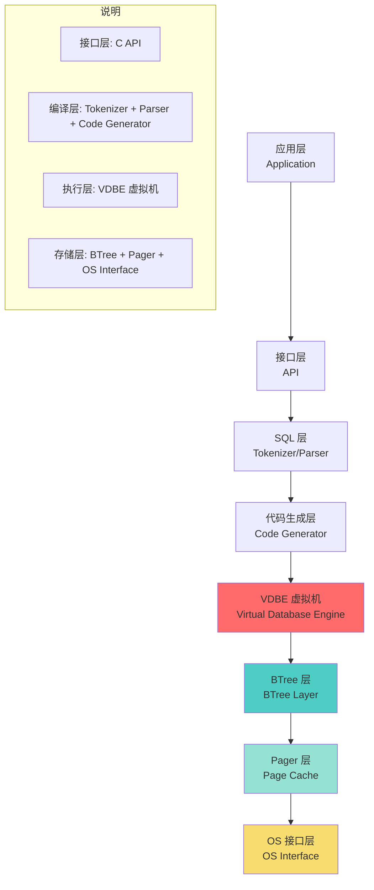
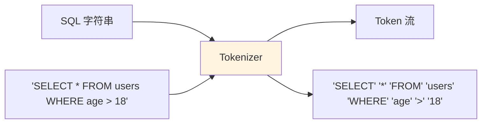
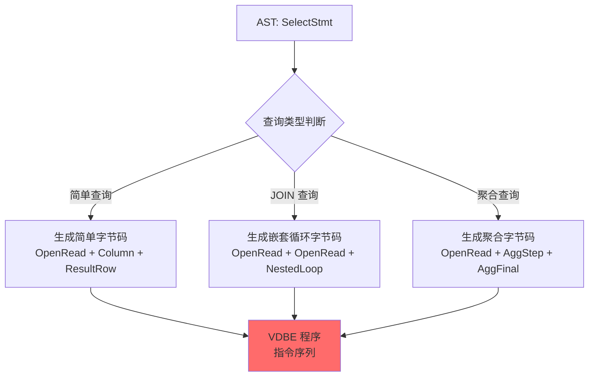
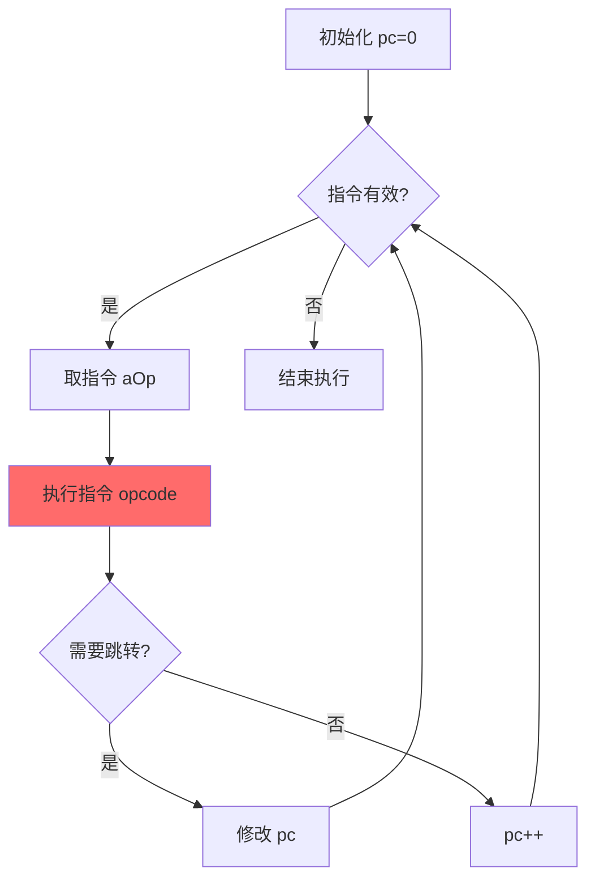

# SQLite3 架构层次

## 学习目标

1. 理解 SQLite3 的**分层架构**（8 个层次）
2. 掌握每层的**核心职责**与**关键接口**
3. 理解 VDBE 在架构中的**中心地位**
4. 熟悉 SQLite 的**编译流水线**（SQL → 字节码）
5. 对比 PostgreSQL/MySQL 的架构差异

---

## 核心概念

### 1. 架构总览（8 层）



**关键特点**：
- **VDBE 是核心**：所有表/索引操作都通过 VDBE 字节码执行
- **无网络层**：与 PG/MySQL 不同，SQLite 没有网络协议层
- **依赖 OS 缓存**：Pager 层不实现独立缓存，依赖 OS page cache
- **BTree 统一存储**：表和索引都是 BTree，没有 PG 的 Heap/BTree 分离

---

### 2. 接口层（API Layer）

**核心 API**：

```c
// 打开/关闭数据库
int sqlite3_open(const char *filename, sqlite3 **ppDb);
int sqlite3_close(sqlite3 *db);

// 执行 SQL（简化接口）
int sqlite3_exec(
    sqlite3 *db,
    const char *sql,
    int (*callback)(void*, int, char**, char**),
    void *arg,
    char **errmsg
);

// 准备语句（推荐接口）
sqlite3_stmt *sqlite3_prepare_v2(
    sqlite3 *db,
    const char *sql,
    int nByte,
    sqlite3_stmt **ppStmt,
    const char **pzTail
);

// 绑定参数 + 执行
int sqlite3_bind_int(sqlite3_stmt *stmt, int col, int value);
int sqlite3_bind_text(sqlite3_stmt *stmt, int col, const char *value, int n, void(*del)(void*));
int sqlite3_step(sqlite3_stmt *stmt);

// 获取结果
int sqlite3_column_int(sqlite3_stmt *stmt, int col);
const char *sqlite3_column_text(sqlite3_stmt *stmt, int col);

// 释放语句
int sqlite3_finalize(sqlite3_stmt *stmt);
```

**对比 PostgreSQL/MySQL**：

| 维度 | PostgreSQL/MySQL | SQLite |
|------|------------------|--------|
| 连接方式 | TCP/IP 或 Unix Socket | 函数调用 |
| 协议 | 二进制协议（Wire Protocol） | C API |
| 连接池 | 必需（连接开销大） | 不需要（零开销） |
| 预编译语句 | 支持（服务器端） | 支持（客户端） |

---

### 3. SQL 层（Tokenizer + Parser）

**Tokenizer（分词器）**：



**Parser（解析器）**：

SQLite 使用 **Lemon 解析器生成器**（而非 YACC/Bison），生成 LALR(1) 解析器。

```mermaid
graph LR
    A[Token 流] --> B[Parser]
    B --> C[AST 抽象语法树]

    A1['SELECT' '*' 'FROM' 'users' 'WHERE' 'age' '>' '18'] --> B
    B --> C1[SelectStmt<br/>- target_list: [Wildcard]<br/>- from_clause: [Table: users]<br/>- where_clause: BinaryOp(>, age, 18)]

    style B fill:#fff4e1
    style C1 fill:#e1f5ff
```

**Lemon 解析器特点**：
- **无全局状态**：解析器对象可创建多个实例
- **可重入**：适合多线程环境
- **错误恢复**：提供更好的错误消息
- **内存安全**：避免内存泄漏

---

### 4. 代码生成层（Code Generator）

**核心职责**：将 AST 转换为 VDBE 字节码。

**生成策略**：



**生成示例**：

```sql
-- SQL 查询
SELECT id, name FROM users WHERE age > 18;
```

生成的 VDBE 字节码：

```
addr  opcode         p1    p2    p3    p4             p5  comment
----  -------------  ----  ----  ----  -------------  --  -------
0     OpenRead       0     2     0     3              0   # 打开表 users (rootpage=2)
1     Rewind         0     8     0                    0   # 定位到第一行
2     Column         0     2     1                    0   # 读取 age 列到 r1
3     Integer        18    2     0                    0   # 常量 18 → r2
4     Le             2     1     7                    0   # 若 r1 <= r2，跳到 7
5     Column         0     0     3                    0   # 读取 id 列 → r3
6     Column         0     1     4                    0   # 读取 name 列 → r4
7     ResultRow      3     2     0                    0   # 返回结果行 (r3, r4)
8     Next           0     2     0                    0   # 移到下一行
9     Close          0     0     0                    0   # 关闭表
10    Halt           0     0     0                    0   # 结束执行
```

**对比 PostgreSQL/MySQL**：

| 维度 | PostgreSQL/MySQL | SQLite |
|------|------------------|--------|
| 中间表示 | 逻辑计划 → 物理计划 | AST → 字节码 |
| 优化层次 | 多层优化（逻辑+物理） | 单层优化（代码生成时） |
| 优化器复杂度 | 高（上千行规则） | 低（简单启发式） |
| 可扩展性 | 高（自定义算子） | 低（指令固定） |

---

### 5. VDBE 虚拟机（Virtual Database Engine）

**核心地位**：VDBE 是 SQLite 的**心脏**，所有表/索引操作都通过 VDBE 字节码执行。

**关键数据结构**：

```c
// VDBE 虚拟机状态（简化）
struct Vdbe {
    Op *aOp;              // 指令数组
    int nOp;              // 指令数量
    int pc;               // 程序计数器（当前执行位置）
    Mem *aMem;            // 寄存器数组（存储中间结果）
    int nMem;             // 寄存器数量
    VdbeCursor **apCsr;   // 游标数组（打开的表/索引）
    int nCursor;          // 游标数量
    // ... 更多字段
};

// 单条指令
struct Op {
    u8 opcode;      // 操作码（如 OpenRead, Column）
    int p1;         // 参数 1
    int p2;         // 参数 2
    int p3;         // 参数 3
    union p4 {      // 参数 4（可变类型）
        int i;
        void *p;
        const char *z;
    };
};
```

**执行循环**：



**关键指令类型**：

| 类别 | 示例指令 | 说明 |
|------|----------|------|
| 表操作 | `OpenRead`, `OpenWrite`, `Close` | 打开/关闭表 |
| 游标移动 | `Rewind`, `Next`, `Prev`, `Seek` | 移动游标 |
| 数据读取 | `Column`, `Rowid` | 读取列值/行 ID |
| 数据写入 | `Insert`, `Delete`, `Update` | 插入/删除/更新行 |
| 算术运算 | `Add`, `Subtract`, `Multiply` | 加减乘除 |
| 比较运算 | `Eq`, `Lt`, `Le`, `Gt` | 等于/小于/大于 |
| 逻辑运算 | `And`, `Or`, `Not` | 与或非 |
| 聚合运算 | `AggStep`, `AggFinal` | 聚合函数 |
| 排序 | `Sort`, `SorterInsert`, `SorterData` | 排序操作 |
| 事务控制 | `Transaction`, `Commit`, `Rollback` | 事务开始/提交/回滚 |

**对比 Volcano 模型**：


---

### 6. BTree 层（BTree Layer）

**核心职责**：提供表和索引的 BTree 接口。

**关键特点**：
- **统一抽象**：表和索引都是 BTree，API 统一
- **页面组织**：每个 BTree 对应一个根页面（root page）
- **并发控制**：通过 BTree 锁实现并发访问

**关键 API**：

```c
// 打开 BTree
int sqlite3BtreeOpen(const char *filename, Btree **ppBtree);

// 创建 BTree（表或索引）
int sqlite3BtreeCreateTable(Btree *pBtree, int *piTable);

// 插入/删除
int sqlite3BtreeInsert(BtCursor *pCur, ...);
int sqlite3BtreeDelete(BtCursor *pCur);

// 游标操作
int sqlite3BtreeFirst(BtCursor *pCur, int *pRes);
int sqlite3BtreeNext(BtCursor *pCur, int *pRes);
int sqlite3BtreeData(BtCursor *pCur, u32 offset, u32 amt, void *buf);
```

**对比 PostgreSQL**：

| 维度 | PostgreSQL | SQLite |
|------|------------|--------|
| 表存储 | Heap 表（顺序页） | BTree 表（按键组织） |
| 索引存储 | BTree（Lehman & Yao） | BTree（SQLite 实现） |
| 行定位 | TID（BlockNumber + Offset） | Rowid（INTEGER PRIMARY KEY） |
| 主键 | 可选（可无主键） | 每个表必有 Rowid 或主键 |

---

### 7. Pager 层（Page Cache）

**核心职责**：页面读写、日志管理、事务隔离。

**关键特点**：
- **不缓存数据**：依赖 OS page cache
- **提供锁机制**：5 级锁状态机
- **管理 WAL**：Write-Ahead Log 写入与回放

**关键 API**：

```c
// 页面读写
int sqlite3PagerGet(Pager *pPager, Pgno pgno, DbPage **ppPage);
int sqlite3PagerWrite(DbPage *pPage);

// 事务控制
int sqlite3PagerBegin(Pager *pPager);
int sqlite3PagerCommit(Pager *pPager);
int sqlite3PagerRollback(Pager *pPager);

// 锁控制
int sqlite3PagerLock(Pager *pPager);
int sqlite3PagerUnlock(Pager *pPager);
```

**对比 PostgreSQL Buffer Pool**：

| 维度 | PostgreSQL Buffer Pool | SQLite Pager |
|------|------------------------|--------------|
| 缓存策略 | Clock-Sweep 算法 | 依赖 OS page cache |
| 缓存大小 | 配置参数（`shared_buffers`） | OS 决定 |
| 脏页管理 | 后台刷盘（bgwriter） | 事务提交时刷盘 |
| 锁粒度 | 页面锁（轻量锁） | 文件锁（5 级锁） |

---

### 8. OS 接口层（OS Interface）

**核心职责**：跨平台文件操作抽象。

**关键特点**：
- **VFS 抽象**：Virtual File System（虚拟文件系统）
- **跨平台**：Windows/macOS/Linux/Android/iOS 统一接口
- **可扩展**：应用可自定义 VFS

**关键 API**：

```c
// VFS 抽象接口（简化）
typedef struct sqlite3_vfs {
    int iVersion;           // 版本号
    int szOsFile;           // sqlite3_file 结构大小
    int mxPathname;         // 最大路径长度
    sqlite3_vfs *pNext;     // 下一个 VFS（链表）
    const char *zName;      // VFS 名称

    // 核心方法
    int (*xOpen)(sqlite3_vfs *pVfs, const char *zPath, sqlite3_file *pFile, int flags, int *pOutFlags);
    int (*xDelete)(sqlite3_vfs *pVfs, const char *zPath, int syncDir);
    int (*xAccess)(sqlite3_vfs *pVfs, const char *zPath, int flags, int *pResOut);
    int (*xFullPathname)(sqlite3_vfs *pVfs, const char *zPath, int nOut, char *zOut);
    // ... 更多方法
} sqlite3_vfs;

// 注册自定义 VFS
int sqlite3_vfs_register(sqlite3_vfs *pVfs, int makeDefault);
```

**典型应用**：
- **嵌入式设备**：自定义 VFS 访问特殊存储介质
- **加密数据库**：在 VFS 层加解密数据
- **网络存储**：通过 VFS 访问远程文件系统

---

## 要点总结

1. **分层清晰**：8 层架构，职责明确
2. **VDBE 核心**：所有操作通过 VDBE 字节码执行
3. **无网络层**：与 PG/MySQL 不同，直接嵌入宿主进程
4. **依赖 OS 缓存**：Pager 层不实现缓存，依赖 OS
5. **VFS 抽象**：跨平台文件操作统一接口
6. **代码生成器**：AST → VDBE 字节码（与 PG 的逻辑计划 → 物理计划不同）

---

## 思考题

1. **VDBE vs Volcano**：SQLite 为什么选择 VDBE 而不是 Volcano 模型？两种模型的性能差异在哪里？
2. **依赖 OS 缓存**：SQLite 不实现独立 Buffer Pool 的设计哲学是什么？有哪些优缺点？
3. **BTree 统一存储**：SQLite 的表和索引都是 BTree，与 PG 的 Heap + BTree 分离设计相比，有什么优劣？
4. **VFS 可扩展性**：在什么场景下需要自定义 VFS？能否举出具体应用示例？
5. **代码生成优化**：SQLite 的代码生成器优化空间有限，如何改进？（提示：LLVM JIT、向量化执行）

---

## 参考资源

- [SQLite 架构](https://www.sqlite.org/arch.html)
- [SQLite VDBE 引擎](https://www.sqlite.org/opcode.html)
- [SQLite VFS 接口](https://www.sqlite.org/vfs.html)
- [SQLite BTree 层](https://www.sqlite.org/btreemodule.html)
- [SQLite 文件格式](https://www.sqlite.org/fileformat.html)