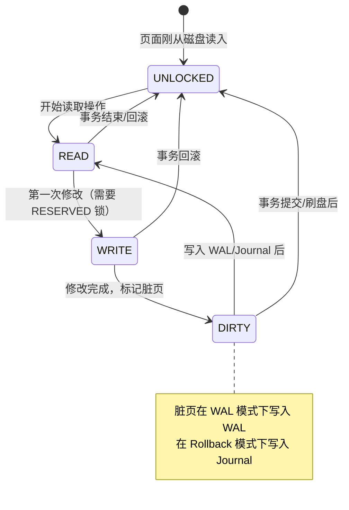
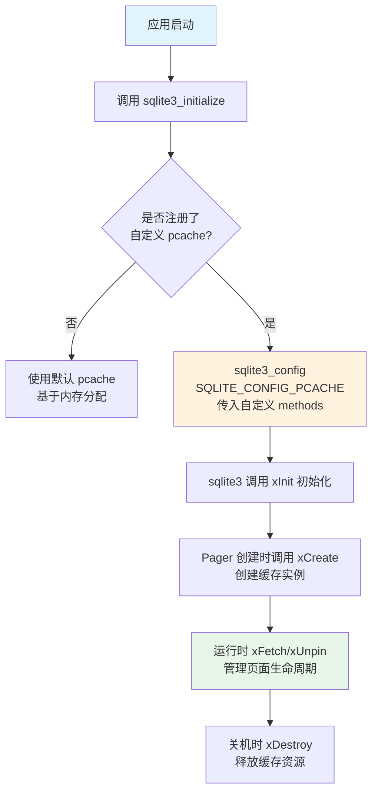

# SQLite3 页面缓存机制

## 学习目标

- 理解 SQLite 为什么没有独立 Buffer Pool 及这一设计决策背后的考量
- 掌握 Pager 层的页面读写流程和页面状态机
- 理解 `sqlite3_pcache` 自定义缓存接口的设计与注册方式
- 对比 PostgreSQL/MySQL 的缓存策略，理解各自优劣

## 核心概念

| 概念 | 说明 |
|------|------|
| Pager 层 | SQLite 存储引擎中负责页面读写的中间层，介于 VDBE 与 OS 文件系统之间 |
| OS Page Cache | 操作系统内核提供的文件缓存，SQLite 默认依赖其进行页面缓存 |
| sqlite3_pcache | 可插拔的自定义页面缓存接口，允许第三方实现替代策略 |
| PgHdr | Pager 层管理的页面控制结构，记录页面元数据（页号、引用计数、脏标志等） |
| Page State | 页面在当前事务中的状态：UNLOCKED / READ / WRITE / DIRTY |

## 主体内容

### 1. SQLite 没有独立 Buffer Pool 的设计决策

SQLite 与 PostgreSQL、MySQL 最根本的区别之一：**SQLite 没有独立实现的 Buffer Pool**。

**为什么这么设计？**

1. **嵌入式数据库定位**：SQLite 设计为嵌入式库，与应用进程共享地址空间。在嵌入式场景下，操作系统已经提供了文件缓存（Page Cache），再实现一个用户态 Buffer Pool 会造成双重缓存，浪费内存。

2. **简化架构**：去掉 Buffer Pool 意味着去掉一套页面置换算法（Clock-Sweep / LRU）、脏页刷盘策略、内存管理逻辑，大幅降低代码复杂度。SQLite 整个 Pager 模块约 10000 行 C 代码，而 PG 的 Buffer Manager 约 15000 行。

3. **适用场景决定**：SQLite 面向低并发、嵌入式、移动端、桌面应用，无法承受独立 Buffer Pool 带来的额外内存开销和管理复杂性。

**OS Page Cache 依赖的优缺点：**

| 优点 | 缺点 |
|------|------|
| 零维护成本 — OS 自动管理 | 无法精细控制置换策略 |
| 内存压力下 OS 全局协调 | 不可预测的刷盘时机 |
| 系统级优化（预读、回写） | 跨平台行为不一致（Windows/Linux/macOS） |
| 进程间共享缓存 | 断电时无法保证 crash safe（需 fsync/FlushFileBuffers） |

### 2. Pager 层页面读写流程

Pager 层是 SQLite 存储引擎的核心枢纽，负责所有页面的读写操作。

```
┌──────────────────────────────────────────────────────────────┐
│                     VDBE (虚拟机执行层)                        │
│      请求页号 Pgno，指定读写意图                              │
└──────────────────────────┬───────────────────────────────────┘
                           │
                           ▼
┌──────────────────────────────────────────────────────────────┐
│                     Pager 层                                   │
│                                                               │
│  ┌──────────────────┐    ┌──────────────────┐                │
│  │  Pager Cache      │    │  自定义 pcache   │                │
│  │  (PgHdr 链表)     │◄──►│  (如果已注册)     │                │
│  └────────┬─────────┘    └──────────────────┘                │
│           │                                                    │
│           ▼                                                    │
│  ┌──────────────────────────────────────────┐                │
│  │        页面命中判定                        │                │
│  │  Pager Cache 命中 → 直接返回                │                │
│  │  Pager Cache 未命中 → 从 OS 读入            │                │
│  └──────────────────────────────────────────┘                │
│           │                                                    │
│           ▼                                                    │
│  ┌──────────────────────────────────────────┐                │
│  │        OS 文件系统                          │                │
│  │    read() / pread() / mmap()              │                │
│  │    依赖 OS Page Cache 做缓存               │                │
│  └──────────────────────────────────────────┘                │
│           │                                                    │
│           ▼                                                    │
│  ┌──────────────────┐    ┌──────────────────┐                │
│  │  磁盘             │    │  WAL (WAL模式)   │                │
│  │  (数据库文件)     │    │  (WAL 帧)        │                │
│  └──────────────────┘    └──────────────────┘                │
└──────────────────────────────────────────────────────────────┘
```

**Pager 页面读取流程：**

```mermaid
flowchart TD
    A[VDBE 请求页面 Pgno] --> B{Pager Cache 中已有?}
    B -->|是| C[返回 PgHdr 指针<br>引用计数+1]
    B -->|否| D{自定义 pcache 已注册?}
    D -->|是| E[调用 pcache.xFetch 获取页面]
    D -->|否| F[通过 OS read() 读取页面]
    E --> G{pcache 返回成功?}
    G -->|是| C
    G -->|否| F
    F --> H[分配 PgHdr 结构体]
    H --> I[填充页面数据到缓存]
    I --> J[返回 PgHdr 指针]
    C --> K[VDBE 操作页面数据]
    K --> L{页面被修改?}
    L -->|是| M[标记 PgHdr.dirty = 1<br>记录到脏页链表]
    L -->|否| N[释放引用<br>引用计数-1]
    M --> N
```

### 3. 页面状态机

Pager 层维护页面在事务中的状态转换：



**关键状态说明：**

- **UNLOCKED**：页面在缓存中但未被任何事务使用，可以被置换
- **READ**：页面被当前事务读取，处于只读状态
- **WRITE**：页面被修改，修改尚未提交
- **DIRTY**：页面修改已写入 WAL 或 Journal，但尚未写回数据库主文件

### 4. sqlite3_pcache 自定义缓存接口

SQLite 提供了 `sqlite3_pcache` 接口，允许第三方实现自定义页面缓存策略。

**接口定义：**

```c
typedef struct sqlite3_pcache sqlite3_pcache;
typedef struct sqlite3_pcache_methods sqlite3_pcache_methods;

struct sqlite3_pcache_methods {
    void *pArg;                              // 用户自定义参数
    int (*xInit)(void *pArg);                // 初始化缓存
    void (*xShutdown)(void *pArg);           // 关闭缓存
    sqlite3_pcache *(*xCreate)(int szPage, int szExtra, int bPurgeable);
    void (*xCachesize)(sqlite3_pcache*, int nCacheSize);  // 设置缓存大小
    int (*xPagecount)(sqlite3_pcache*);      // 当前缓存页数
    sqlite3_pcache_page *(*xFetch)(sqlite3_pcache*, unsigned key, int createFlag);
    void (*xUnpin)(sqlite3_pcache*, sqlite3_pcache_page*, int discard);
    void (*xRekey)(sqlite3_pcache*, sqlite3_pcache_page*, unsigned oldKey, unsigned newKey);
    void (*xTruncate)(sqlite3_pcache*, unsigned iLimit);
    void (*xDestroy)(sqlite3_pcache*);
};
```

**自定义缓存注册流程：**



**注册示例：**

```c
// 1. 定义自定义 pcache 方法
static sqlite3_pcache_methods my_pcache_methods = {
    0,                        // pArg
    my_pcache_init,           // xInit
    my_pcache_shutdown,       // xShutdown
    my_pcache_create,         // xCreate
    my_pcache_cachesize,      // xCachesize
    my_pcache_pagecount,      // xPagecount
    my_pcache_fetch,          // xFetch
    my_pcache_unpin,          // xUnpin
    my_pcache_rekey,          // xRekey
    my_pcache_truncate,       // xTruncate
    my_pcache_destroy         // xDestroy
};

// 2. 在 sqlite3 初始化前注册
sqlite3_config(SQLITE_CONFIG_PCACHE, &my_pcache_methods);

// 3. 正常初始化并打开数据库
sqlite3_initialize();
sqlite3_open("test.db", &db);
```

### 5. PgHdr 结构

Pager 层的每个缓存页面由一个 `PgHdr` 结构管理：

```c
struct PgHdr {
    sqlite3_pcache_page *pPage;    // 指向 pcache 管理的页面数据
    Pgno pgno;                      // 页号（从 1 开始）
    Pager *pPager;                  // 所属 Pager 实例
    PgHdr *pNextHash, *pPrevHash;  // Hash 链表指针
    PgHdr *pNextFree, *pPrevFree;  // 空闲链表指针
    PgHdr *pNextAll;               // 所有页面的全局链表
    u8 flags;                       // 标志位（脏页、引用等）
    i16 nRef;                       // 引用计数
    u8 dirty;                       // 脏页标志
};
```

### 6. 三大数据库缓存策略对比


**详细对比表：**

| 维度 | PostgreSQL | MySQL (InnoDB) | SQLite3 |
|------|-----------|----------------|---------|
| 缓存层 | 独立共享内存 | 独立共享内存 | 依赖 OS Page Cache |
| 置换算法 | Clock-Sweep | LRU 中点插入 | 由 OS 决定（LRU近似） |
| 脏页刷盘 | BgWriter 后台线程 | Page Cleaner 线程 | Pager 在事务提交时刷盘 |
| 内存管理 | 共享内存（固定大小） | 缓冲池（可动态调整） | 无独立管理（OS 负责） |
| 自定义策略 | 不支持 | 不支持 | 支持 sqlite3_pcache 接口 |
| 粒度 | 8KB 页面 | 16KB 页面（默认） | 通常 4KB 页面 |
| 并发访问 | 多进程共享 | 多线程共享 | 单进程/单线程 |
| 预读 | 有（ring buffer） | 有（线性预读） | 无（按需读取） |

## 要点总结

1. **SQLite 没有独立 Buffer Pool**，这是嵌入式数据库设计的核心决策 — 避免双重缓存，减少代码复杂度
2. **Pager 层**是页面读写的编排中心，负责命中判定、缓存管理、脏页追踪
3. **页面状态机**：UNLOCKED → READ → WRITE → DIRTY → UNLOCKED，事务生命周期驱动状态转换
4. **sqlite3_pcache 接口**允许第三方实现自定义缓存策略，这是 PG/MySQL 不具备的灵活性
5. **OS Page Cache 依赖**带来零维护成本，但也带来跨平台一致性问题和不可预测的刷盘行为
6. 与 PG 的 Clock-Sweep 和 MySQL 的 LRU 中点插入相比，SQLite 的 OS 依赖策略更适合低并发、轻量级场景

## 思考题

1. 为什么 SQLite 在嵌入式场景下选择依赖 OS Page Cache 而不是自己实现 Buffer Pool？如果用于高并发服务器场景，这个设计会带来什么问题？
2. 如果你要实现一个自定义 `sqlite3_pcache`，你会选择什么置换算法？为什么？
3. SQLite 的 Pager 层在 WAL 模式下和 Rollback Journal 模式下，页面读写流程有什么关键差异？
4. 对比 PG 的 PostgreSQL Shared Buffers（shared_buffers=1GB）和 SQLite 的默认配置，在 1GB 内存的嵌入式设备上，谁更适合？为什么？