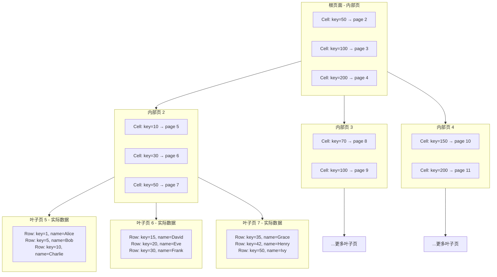
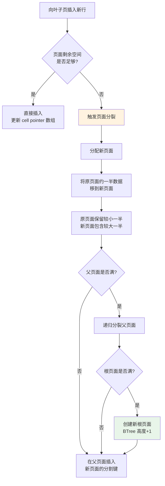
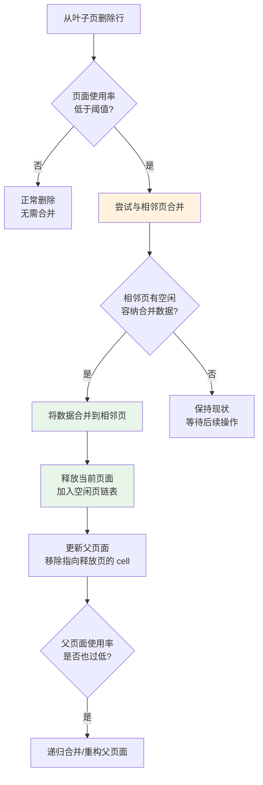
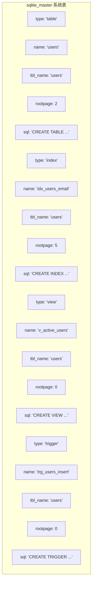

# SQLite3 表存储结构

## 学习目标

- 理解 SQLite 用 BTree 存储所有表的核心设计，与 PG 堆表和 MySQL 聚簇索引对比
- 掌握 Rowid 表和 WITHOUT ROWID 表的结构差异
- 理解 BTree 页面分裂与合并的触发条件和过程
- 掌握 sqlite_master 系统表的结构和作用

## 核心概念

| 概念 | 说明 |
|------|------|
| Rowid 表 | 默认表类型，使用隐式 64 位有符号整数主键，存储为 B+Tree |
| WITHOUT ROWID 表 | 显式指定主键的表，存储为索引组织表（IOT） |
| BTree 页面 | SQLite 的最小存储单元，包含表数据或索引数据 |
| 叶子页面 | BTree 的最底层页面，存储实际数据行 |
| 内部页面 | BTree 的非叶子页面，存储路由键和子页面指针 |
| sqlite_master | 系统表，记录数据库中所有表、索引、视图、触发器的元数据 |
| page split | 页面满时触发的分裂操作，将页面数据分布到两个页面 |

## 主体内容

### 1. 核心设计：BTree 存储一切

**SQLite 没有堆表（Heap Table）概念。** 每一张表都是一棵 B+Tree。

这与 PostgreSQL 和 MySQL 有本质区别：

| 数据库 | 表存储方式 | 索引存储方式 |
|--------|-----------|-------------|
| PostgreSQL | 堆表（Heap）+ 独立的 BTree 索引 | BTree 索引指向 (ctid) |
| MySQL InnoDB | 聚簇索引组织表（IOT） | 辅助索引指向主键值 |
| **SQLite3** | **BTree 表（Rowid/WITHOUT ROWID）** | **BTree 索引指向 rowid** |

```mermaid
flowchart TD
    subgraph PG[PostgreSQL 表存储]
        PG1[堆表 Heap]
        PG2[页内行数组<br>行通过 ctid 定位]
        PG3[BTree 索引<br>指向 (page, offset)]
        PG1 --> PG2
    end

    subgraph MYSQL[MySQL InnoDB 表存储]
        MY1[聚簇索引 Clustered Index]
        MY2[主键 B+Tree<br>叶子页包含完整行数据]
        MY3[辅助索引<br>叶子页包含主键值]
        MY1 --> MY2 --> MY3
    end

    subgraph SQLITE[SQLite3 表存储]
        SQ1[Rowid B+Tree 表]
        SQ2[叶子页包含完整行数据<br>按 rowid 排序]
        SQ3[索引 B+Tree<br>叶子页包含 (key, rowid)]
        SQ1 --> SQ2 --> SQ3
    end
```

### 2. Rowid 表

**Rowid 表是 SQLite 的默认表类型。** 当创建表时未指定 `WITHOUT ROWID`，自动创建为 Rowid 表。

**核心特性：**

- 每个 Rowid 表拥有一个隐式 64 位有符号整数主键 `rowid`
- 表的 B+Tree 按 rowid 排序
- 叶子页面存储完整的数据行
- `INTEGER PRIMARY KEY` 列是 rowid 的别名

```sql
-- 创建 Rowid 表（默认）
CREATE TABLE users (
    id INTEGER PRIMARY KEY,   -- 实际上是 rowid 的别名
    name TEXT NOT NULL,
    email TEXT
);

-- 上面的 id 列是 rowid 的别名，等价于：
CREATE TABLE users (
    name TEXT NOT NULL,
    email TEXT
);
-- 此时 rowid 隐式存在，但不可见
```

**Rowid 分配策略：**

```mermaid
flowchart TD
    A[插入新行] --> B{INSERT 中指定了<br>rowid/INTEGER PK?}
    B -->|是| C{指定的 rowid<br>大于当前最大值?}
    C -->|是| D[使用指定的 rowid]
    C -->|否| E{指定的 rowid<br>是否已存在?}
    E -->|是| F[返回 SQLITE_CONSTRAINT<br>主键冲突]
    E -->|否| G[使用指定的 rowid<br>填充空洞]
    B -->|否| H[使用 max(rowid) + 1]
    H --> I{max(rowid) + 1<br>溢出?}
    I -->|未溢出| J[分配成功]
    I -->|溢出| K[尝试在 1 到最大 rowid<br>间寻找未使用的值]
    K --> L{找到空闲值?}
    L -->|是| J
    L -->|否| M[返回 SQLITE_FULL<br>表已满]

    style H fill:#fff3e0
    style J fill:#e8f5e9
    style F fill:#ffebee
    style M fill:#ffebee
```

**AUTOINCREMENT 关键字：**

```sql
CREATE TABLE t1 (id INTEGER PRIMARY KEY AUTOINCREMENT, name TEXT);
```

`AUTOINCREMENT` 改变 rowid 分配行为：
- 保证分配的 rowid 严格单调递增
- 即使删除了最大 rowid 的行，也不会重用
- 使用 sqlite_sequence 表记录最大值
- 当 rowid 达到 9223372036854775807 时返回 SQLITE_FULL

### 3. WITHOUT ROWID 表

**WITHOUT ROWID 表是显式声明主键的索引组织表（IOT）。**

```sql
CREATE TABLE t2 (
    id INTEGER PRIMARY KEY,
    name TEXT NOT NULL,
    age INTEGER
) WITHOUT ROWID;
```

**与 Rowid 表的区别：**

| 特性 | Rowid 表 | WITHOUT ROWID 表 |
|------|---------|-----------------|
| 主键 | 隐式 rowid | 显式 PRIMARY KEY |
| 排序 | 按 rowid 排序 | 按 PRIMARY KEY 排序 |
| 叶子页数据 | 完整行数据 | 完整行数据 |
| 索引 | 独立 BTree 索引 | 无额外主键索引 |
| 空间 | 需要额外索引空间 | 主键即索引 |
| 适用场景 | 通用场景 | 复合主键、宽表 |

**为什么使用 WITHOUT ROWID？**

```mermaid
flowchart TD
    A[创建表] --> B{是否使用<br>WITHOUT ROWID?}
    B -->|否| C[Rowid 表<br>创建隐式 rowid BTree]
    C --> D[创建索引时<br>索引 BTree 存 (key, rowid)]
    D --> E[查询通过索引找到 rowid<br>再通过 rowid BTree 找数据]
    B -->|是| F[WITHOUT ROWID 表<br>主键 BTree 存完整行]
    F --> G[创建索引时<br>索引 BTree 存 (key, pk_value)]
    G --> H[查询通过索引找到 pk<br>再通过 pk BTree 找数据<br>少一次 BTree 查找]

    note right of D
        Rowid 表需要两次
        BTree 查找
    end note

    note right of H
        WITHOUT ROWID 表
        同样需要两次查找
    end note
```

**WITHOUT ROWID 的优势：**

1. 复合主键表更高效 — 主键即存储顺序，无需额外索引
2. 减少存储空间 — 不需要额外的 rowid 列
3. 主键聚集 — 相关数据物理相邻

**限制：**
- 必须有 PRIMARY KEY
- 表不能包含超过 32 列
- 不支持 AUTOINCREMENT

### 4. 表 BTree 结构

**Rowid 表的 BTree 结构：**



**内部页与叶子页的区别：**

| 维度 | 内部页 | 叶子页 |
|------|--------|--------|
| 页类型值 | 0x05 (interior table) | 0x0D (leaf table) |
| 存储内容 | (左子页号, 键值) 对 | 完整数据行 |
| 右指针 | 页头最后一个指针 | 无 |
| 数据量 | 较少（仅键值） | 较多（完整行数据） |
| 深度 | 除最底层外的所有层 | 最底层 |

### 5. BTree 页面分裂

当插入数据导致页面满时，SQLite 触发页面分裂：



**分裂策略关键点：**

1. **分裂点选择**：在页面中间分裂，保持两个页面大致相等的数据量
2. **分裂传播**：新页面需要插入到父页面中，如果父页面也满则继续向上传播
3. **根页面特殊处理**：如果根页面也满了，创建新根页面，树高度加 1
4. **分裂后的 cell pointer 重组**：原页面需要重建 cell pointer 数组

### 6. BTree 页面合并

当删除数据导致页面使用率过低时，SQLite 可能触发页面合并（重构）：



### 7. sqlite_master 系统表

每个 SQLite 数据库都有一个隐藏的系统表 `sqlite_master`，存储数据库的 Schema 元数据。



**sqlite_master 表结构：**

| 列名 | 类型 | 说明 |
|------|------|------|
| type | TEXT | 对象类型：'table', 'index', 'view', 'trigger' |
| name | TEXT | 对象名称 |
| tbl_name | TEXT | 所属表名称（对索引和触发器有用） |
| rootpage | INTEGER | 根页面号（表和索引使用，视图和触发器为 0） |
| sql | TEXT | 创建该对象的 SQL 语句 |

**关键点：**

- sqlite_master 本身也是一张 Rowid 表，存储在第 1 页（数据库头页）
- rootpage 字段指向每个表/索引的 BTree 根页面
- `SELECT * FROM sqlite_master` 可以查询所有 Schema 信息
- 在 SQLite 3.33.0 之后，引入了 `sqlite_schema` 作为 `sqlite_master` 的别名

### 8. 三大数据库表存储对比

| 维度 | PostgreSQL | MySQL InnoDB | SQLite3 |
|------|-----------|-------------|---------|
| 基本结构 | 堆表 (Heap) | 聚簇索引 (IOT) | BTree 表 |
| 行存储 | 页内行数组 | B+Tree 叶子页 | B+Tree 叶子页 |
| 主键处理 | 无隐式主键 | 必须指定/隐式生成 | 隐式 rowid |
| 无主键表 | 可以 | 创建隐式 rowid | 使用隐式 rowid |
| 索引指向 | ctid (page, offset) | 主键值 | rowid |
| 行唯一标识 | ctid（可变） | 主键值 | rowid（不变） |
| 数据排序 | 按插入顺序 | 按主键顺序 | 按 rowid/主键顺序 |
| VACUUM | VACUUM FULL | OPTIMIZE TABLE | VACUUM |
| 物理存储 | 多个文件 | 多个文件 | 单文件 |

## 要点总结

1. **SQLite 没有堆表** — 每一张表都是一棵 B+Tree，这是与 PG 和 MySQL 最根本的区别
2. **Rowid 表**是默认类型，隐式 64 位 rowid 作为排序键，`INTEGER PRIMARY KEY` 是 rowid 的别名
3. **WITHOUT ROWID 表**是索引组织表，显式 PRIMARY KEY 作为排序键，适合复合主键场景
4. **页面分裂**从叶子页触发，向上传播，根页面满时 BTree 高度加 1
5. **页面合并**在删除导致页面使用率过低时触发，与相邻页合并后释放页面
6. **sqlite_master** 是数据库的元数据中心，记录所有表、索引、视图、触发器的根页面和创建 SQL

## 思考题

1. SQLite 为什么选择 BTree 存储所有表而不是堆表？这个设计在嵌入式场景下有什么优势？
2. WITHOUT ROWID 表在什么场景下比 Rowid 表性能更好？为什么 SQLite 不是默认使用 WITHOUT ROWID？
3. 如果一张 Rowid 表删除了大量数据，rowid 会重用吗？AUTOINCREMENT 对此有什么影响？
4. 对比 PG 的堆表 + 索引和 SQLite 的 BTree 表，在范围查询（BETWEEN）场景下，谁的 I/O 更优？为什么？