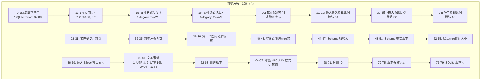

# SQLite3 页面布局

## 学习目标

- 理解 SQLite 数据库文件的整体布局：100 字节头部 + 页面序列
- 掌握不同页面类型（内部表、叶子表、内部索引、叶子索引）的结构差异
- 理解 cell pointer 数组的排序机制和页面内的二分查找过程
- 掌握溢出页面链的工作原理和触发条件
- 理解空闲页面的链表管理方式

## 核心概念

| 概念 | 说明 |
|------|------|
| 数据库头 | 数据库文件前 100 字节，包含文件全局元数据 |
| 页面 (Page) | 最小 I/O 单元，默认 4096 字节，范围 512-65536 |
| Cell | 页面内的数据单元，包含键值和/或数据负载 |
| Cell Pointer 数组 | 页面尾部存储的 2 字节偏移数组，按键值排序 |
| 溢出页面 | 当 cell 数据超过页面可用空间的 ~1/4 时使用的链式页面 |
| 空闲页面 | 已释放的可重用页面，通过链表管理 |
| Pointer Map | 增量 VACUUM 使用的反向指针页面 |

## 主体内容

### 1. 数据库文件整体布局

SQLite 数据库是一个单文件，结构如下：

```mermaid
flowchart TD
    subgraph FILE[数据库文件（单文件）]
        HDR[数据库头<br>100 字节]
        PG1[页面 1<br>根页面<br>（含 sqlite_master）]
        PG2[页面 2<br>第一个表/索引的根页面]
        PG3[页面 3<br>数据页面]
        PG4[页面 4<br>数据页面]
        ELLIP[...]
        PGN[页面 N<br>最后一个页面]
    end

    subgraph WAL_COMPANION[伴随文件（WAL 模式）]
        WAL_FILE[-wal 文件<br>WAL 帧序列]
        SHM_FILE[-shm 文件<br>WAL-index 哈希表]
    end

    FILE --> WAL_COMPANION

    note right of FILE
        页面从 1 开始编号
        页面 1 是根页面
        包含数据库头 100 字节
    end note
```

**页面编号规则：**
- 页面从 1 开始编号（非 0 基）
- 页面 1 的前 100 字节是数据库头，后面 4096-100=3996 字节是页面 1 的内容
- 页面 2 及之后是完整页面

### 2. 数据库头布局（100 字节）

数据库头仅存在于页面 1 的前 100 字节：



**关键头部字段说明：**

| 偏移 | 大小 | 字段 | 说明 |
|------|------|------|------|
| 0 | 16 | 魔数 | `SQLite format 3\000` |
| 16 | 2 | 页面大小 | 大端，512-65536 间的 2 的幂 |
| 18 | 1 | 写版本 | 1=传统, 2=WAL |
| 19 | 1 | 读版本 | 1=传统, 2=WAL |
| 20 | 1 | 保留空间 | 每页末尾保留字节数（加密用） |
| 28 | 4 | 变更计数器 | 每次修改数据库文件时递增 |
| 32 | 4 | 数据库页面数 | 文件包含的总页面数 |
| 36 | 4 | 空闲链表树干页 | 0 表示没有空闲页 |
| 40 | 4 | 空闲链表总页数 | |
| 44 | 4 | Schema 校验和 | schema cookie，用于缓存失效 |
| 48 | 4 | Schema 格式版本 | 1-4，控制解析规则 |
| 52 | 4 | 默认页面缓存大小 | 推荐缓存页数 |
| 56 | 4 | 最大 BTree 根页 | 最大的根页面编号 |
| 60 | 2 | 文本编码 | 1=UTF-8 |
| 64 | 4 | 增量 VACUUM | 0=禁用，非0=每页保留的指针映射项数 |

### 3. 页面通用结构

每个页面由三部分组成：

```mermaid
flowchart LR
    subgraph PAGE[通用页面结构 - 4096 字节]
        A[页面头<br>8-12 字节]
        B[Unallocated<br>未分配空间]
        C[Cell Pointer 数组<br>从尾部向前增长]
        D[Reserved<br>保留空间（通常 0）]
    end

    A --> B --> C --> D

    note right of PAGE
        页面头: 8 字节（叶子页）
                或 12 字节（内部页）
        Cell Pointer: 2 字节偏移量
                     指向页内 cell 的起始位置
        Cell Pointer 数组:
                     从页面尾部向前分配
                     按键值升序排列
    end note
```

**页面头格式（8 字节 / 12 字节）：**

| 偏移 | 大小 | 说明 |
|------|------|------|
| 0 | 1 | 页面类型标志 |
| 1 | 2 | 首个空闲块偏移（页面内碎片管理） |
| 3 | 2 | cell 数量 |
| 5 | 2 | cell 内容起始偏移 |
| 7 | 1 | 碎片空闲字节数 |
| 8 | 4 | **内部页专用**：最右子页面号 |

**页面类型标志：**

| 值 | 类型 | 说明 |
|----|------|------|
| 0x02 | 内部索引页 (interior index) | BTree 内部节点，存储索引键 |
| 0x05 | 内部表页 (interior table) | BTree 内部节点，存储 rowid 路由 |
| 0x0A | 叶子索引页 (leaf index) | BTree 叶子节点，存储索引条目 |
| 0x0D | 叶子表页 (leaf table) | BTree 叶子节点，存储实际行数据 |

### 4. 叶子表页结构

**叶子表页（0x0D）是存储实际数据行的页面：**

```mermaid
flowchart TD
    subgraph LEAF_PAGE[叶子表页 - 4096 字节]
        LH[页头 8 字节<br>type=0x0D, cell 数量, 内容偏移]
        DATA[数据区域<br>Cell 1: (rowid=1, payload)<br>Cell 2: (rowid=5, payload)<br>...]
        UNUSED[未分配空间<br>可被 cell 和 cell pointer 使用]
        CP[Cell Pointer 数组<br>从后向前增长<br>0: offset=100<br>1: offset=200<br>2: offset=350]
        RES[保留空间<br>通常 0 字节]
    end

    LH --> DATA --> UNUSED --> CP --> RES
```

**表叶子页的 Cell 格式：**

```
┌──────────────────────────────────────────────────────────────┐
│ 表叶子页 Cell                                                 │
├────────────┬──────────────┬──────────────────┬───────────────┤
│ payload    │ rowid        │ payload          │ overflow      │
│ 总长度     │ (varint)     │ (实际数据)        │ 页号          │
│ (varint)   │              │                  │ (4 字节)      │
├────────────┴──────────────┴──────────────────┴───────────────┤
│ 如果 payload 总长度 <= 可用空间，overflow 页号为 0              │
│ 否则部分 payload 存储在 cell，剩余存储在 overflow 页面链       │
└──────────────────────────────────────────────────────────────┘
```

### 5. 内部表页结构

**内部表页（0x05）存储路由键和子页面指针：**

```mermaid
flowchart TD
    subgraph INT_PAGE[内部表页 - 4096 字节]
        IH[页头 12 字节<br>type=0x05, cell 数量<br>最右子页面号]
        IDATA[Cell 区域<br>Cell: (左子页号, rowid)]
        IUNUSED[未分配空间]
        ICP[Cell Pointer 数组<br>按 rowid 升序]
    end

    IH --> IDATA --> IUNUSED --> ICP
```

**表内部页的 Cell 格式：**

```
┌──────────────────────────────────────────────┐
│ 表内部页 Cell                                 │
├──────────────┬───────────────────────────────┤
│ 左子页号     │ rowid (varint)                │
│ (4 字节)     │ 该 cell 中最大 rowid          │
├──────────────┴───────────────────────────────┤
│ 最右子页面号存在页头（不是 cell 的一部分）    │
│ 查找时：                                      │
│ 如果 key <= cell.rowid → 去 cell.左子页       │
│ 如果 key > 所有 cell.rowid → 去最右子页      │
└──────────────────────────────────────────────┘
```

### 6. 索引页结构

**叶子索引页（0x0A）和内部索引页（0x02）：**

```mermaid
flowchart TD
    subgraph IDX_LEAF[叶子索引页 0x0A]
        ILH[页头 8 字节]
        ILDATA[索引条目<br>Cell: (key_columns, rowid)]
        ILCP[Cell Pointer 数组]
    end

    subgraph IDX_INT[内部索引页 0x02]
        IIH[页头 12 字节<br>含最右子页号]
        IIDATA[路由条目<br>Cell: (左子页号, key_columns)]
        IICP[Cell Pointer 数组]
    end

    IDX_LEAF --> IDX_INT
```

**索引 Cell 格式：**

| 页类型 | Cell 内容 |
|--------|----------|
| 叶子索引 (0x0A) | payload 长度(varint) + 索引列值 + 可选 overflow 页号 |
| 内部索引 (0x02) | 左子页号(4字节) + payload 长度(varint) + 索引列值 |

### 7. 溢出页面链

当一行数据太大无法完全放入一个页面时，SQLite 使用溢出页面链存储多余部分：

```mermaid
flowchart TD
    subgraph MAIN[主页面]
        CELL[原始 Cell<br>Payload 头部<br>部分数据]
        OV_PTR[溢出指针<br>→ 页面 100]
    end

    subgraph OV1[溢出页面 100]
        OV1_HDR[页头 4 字节<br>指向下一页: 101]
        OV1_DATA[数据 1<br>前 4088 字节]
    end

    subgraph OV2[溢出页面 101]
        OV2_HDR[页头 4 字节<br>指向下一页: 102]
        OV2_DATA[数据 2<br>前 4088 字节]
    end

    subgraph OV3[溢出页面 102]
        OV3_HDR[页头 4 字节<br>指向下一页: 0]
        OV3_DATA[剩余数据<br>≤ 4088 字节]
    end

    CELL --> OV_PTR --> OV1 --> OV2 --> OV3

    note right of OV3
        下一页为 0 表示
        这是最后一个溢出页
    end note
```

**溢出触发条件：**

```
可用空间 = 页面大小 - 页头大小 - 保留空间
payload 阈值 ≈ 可用空间 / 4

如果 payload 总长度 > 可用空间 - 35:
    → 使用溢出页面
    → 主 cell 存储 payload 头部（约可用空间 - 35 字节）
    → 剩余部分存储在溢出页面链中
```

**溢出页面格式：**

| 偏移 | 大小 | 说明 |
|------|------|------|
| 0 | 4 | 下一个溢出页面的页号（0 表示最后一个） |
| 4 | 页面大小 - 4 | 实际数据 |

### 8. 空闲页面链表

SQLite 使用空闲页面链表管理被释放的页面，实现空间重用：

```mermaid
flowchart TD
    subgraph TRUNK[空闲链表树干页 - 页 10]
        TRUNK_HDR[页头: 4 字节<br>→ 下一个树干页: 页 50]
        TRUNK_COUNT[4 字节<br>本树干管理的叶子页数: 3]
        TRUNK_L1[叶子页 1: 页 11]
        TRUNK_L2[叶子页 2: 页 12]
        TRUNK_L3[叶子页 3: 页 13]
        TRUNK_MORE[...更多叶子页]
    end

    subgraph TRUNK2[空闲链表树干页 - 页 50]
        T2_HDR[页头: 4 字节<br>→ 下一个树干页: 0]
        T2_COUNT[4 字节<br>本树干管理的叶子页数: 2]
        T2_L1[叶子页 1: 页 51]
        T2_L2[叶子页 2: 页 52]
    end

    TRUNK --> TRUNK2

    subgraph FREEPAGE1[空闲叶子页 11]
        FP1[(空页面<br>内容无效)]
    end

    subgraph FREEPAGE2[空闲叶子页 12]
        FP2[(空页面)]
    end

    subgraph FREEPAGE3[空闲叶子页 13]
        FP3[(空页面)]
    end

    TRUNK --- FREEPAGE1
    TRUNK --- FREEPAGE2
    TRUNK --- FREEPAGE3

    note left of TRUNK
        树干页 = 空闲页面的索引页
        数据库头中记录第一个树干页号
        树干页本身也是空闲页面的一部分
    end note
```

**空闲链表结构：**

- **树干页 (Trunk Page)**：空闲链表的索引页面，存储指向叶子页的指针
  - 页头 4 字节：下一个树干页号（0=无）
  - 4-7 字节：本树干管理的叶子页数量
  - 8 字节起：叶子页号数组（每项 4 字节）
- **叶子页 (Leaf Page)**：实际空闲页面，内容无效
- **根树干页**：数据库头偏移 36-39 字节记录第一个树干页号

### 9. Pointer Map 页面

Pointer Map 页面用于支持增量 VACUUM（`PRAGMA incremental_vacuum`）：

```mermaid
flowchart TD
    subgraph PM[Pointer Map 页 - 每 2048 页一个]
        PM_ENTRY1[条目 1: (子页类型, 父页号)]
        PM_ENTRY2[条目 2: (子页类型, 父页号)]
        PM_ENTRY3[条目 3: (子页类型, 父页号)]
        PM_ELLIP[...]
    end

    subgraph DATA_PAGE[数据页 100]
        D100[(页面内容)]
    end

    subgraph PARENT_PAGE[父页 50]
        P50[Cell 指向页面 100]
    end

    PM_ENTRY1 -- 类型: table_leaf<br>父页: 50 --> D100
    D100 -.-> PARENT_PAGE

    note right of PM
        Pointer Map 记录每个页面的
        反向指针（谁指向这个页面）
        用于增量 VACUUM 时快速定位
    end note
```

### 10. 碎片与未使用空间

页面内部存在多种类型的未使用空间：


**空闲块链表：**
- 每个空闲块前 2 字节指向下一个空闲块的偏移
- 再 2 字节记录空闲块大小
- 页头偏移 3-4 字节指向第一个空闲块

### 11. 三大数据库页面布局对比

| 维度 | PostgreSQL | MySQL InnoDB | SQLite3 |
|------|-----------|-------------|---------|
| 页面大小 | 8KB（默认） | 16KB（默认） | 4KB（默认） |
| 页面编号 | 0 基 | 0 基（space id + page no） | 1 基 |
| 页头 | PageHeaderData (24 字节) | FIL Header (38 字节) | 8-12 字节 |
| 行存储 | 行数组 + 空闲空间映射 | 聚簇索引叶子页 | BTree 叶子页 |
| 行标识 | ctid (page, offset) | 主键值 | rowid |
| 溢出机制 | TOAST（单独存储） | 外部存储页 | 溢出页面链 |
| 空闲空间管理 | FSM（单独文件） | 页面内 Free Space | 空闲块链表 |
| 页面类型 | 多种（数据、FSM、VM） | 索引页、数据页、Undo 等 | 4 种 BTree 类型 |
| 页面校验 | Full Page Writes | Checksum | 无（3.x 早期版本） |

## 要点总结

1. **数据库头 100 字节**位于页面 1 开头，包含页面大小、版本号、空闲链表信息、Schema 校验和等全局元数据
2. **4 种页面类型**：叶子表(0x0D)、内部表(0x05)、叶子索引(0x0A)、内部索引(0x02)
3. **Cell Pointer 数组**从页面尾部向前增长，按键值排序支持二分查找
4. **溢出页面链**在单行数据超过页面可用空间 ~1/4 时触发，通过 4 字节指针链式连接
5. **空闲页面链表**通过树干页 + 叶子页结构管理已释放页面，树干页在数据库头中记录
6. **Pointer Map** 用于增量 VACUUM，每 2048 个页面插入一个，记录反向指针

## 思考题

1. Cell Pointer 数组为什么设计为从页面尾部向前增长而不是从页面头部向后增长？
2. 为什么 SQLite 的溢出页面阈值是 "可用空间 - 35" 而不是直接使用页面大小的一半？
3. 空闲页面链表的树干页和叶子页的二分设计有什么好处？为什么不直接用简单的单链表？
4. 对比 PG 的 TOAST 机制和 SQLite 的溢出页面链，在存储大字段（如 1MB 的 BLOB）时，谁的方案更优？
5. 如果你要设计一个自定义页面大小，对于以 TEXT 为主的应用，应该选择大页面还是小页面？为什么？