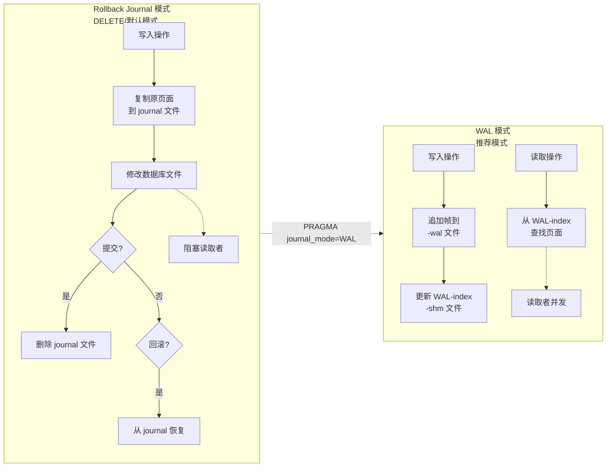
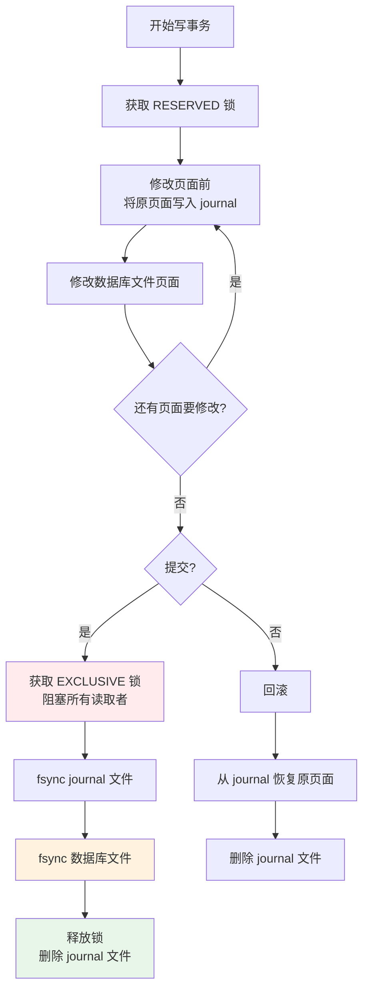
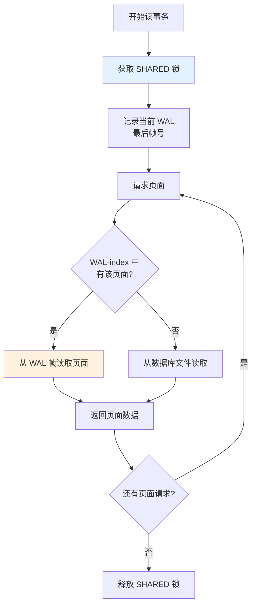
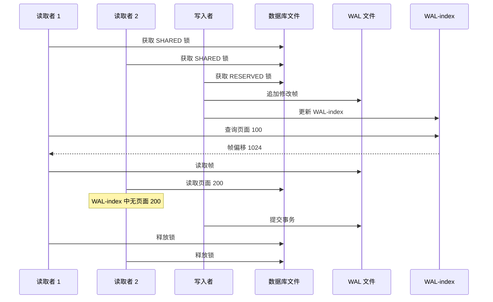
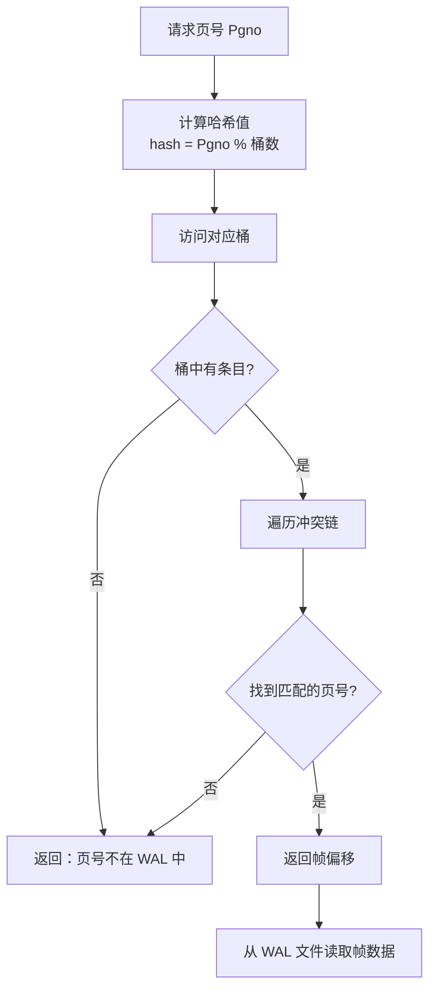
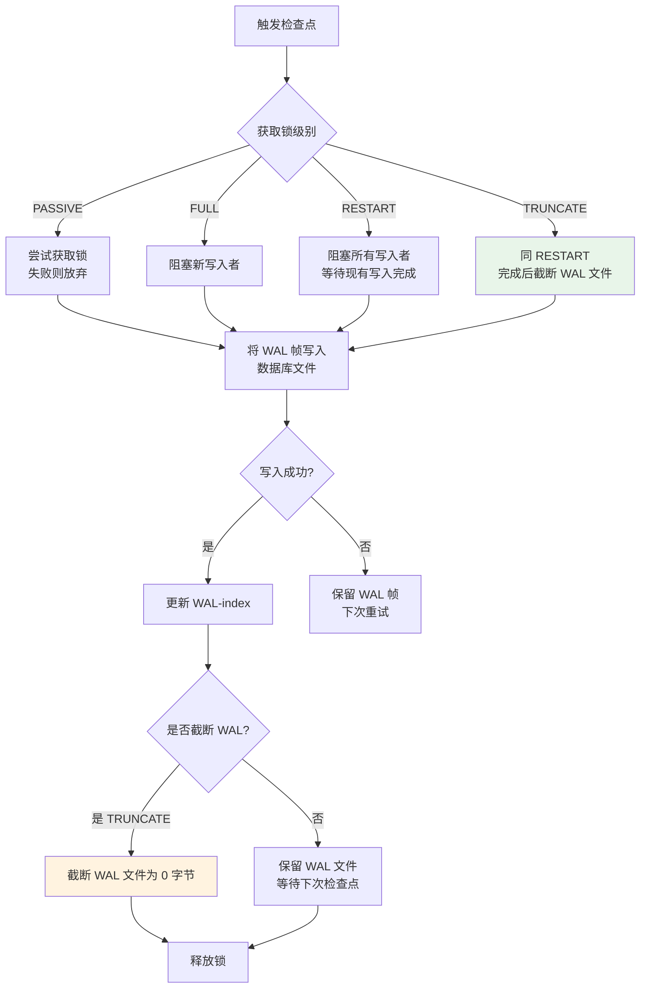
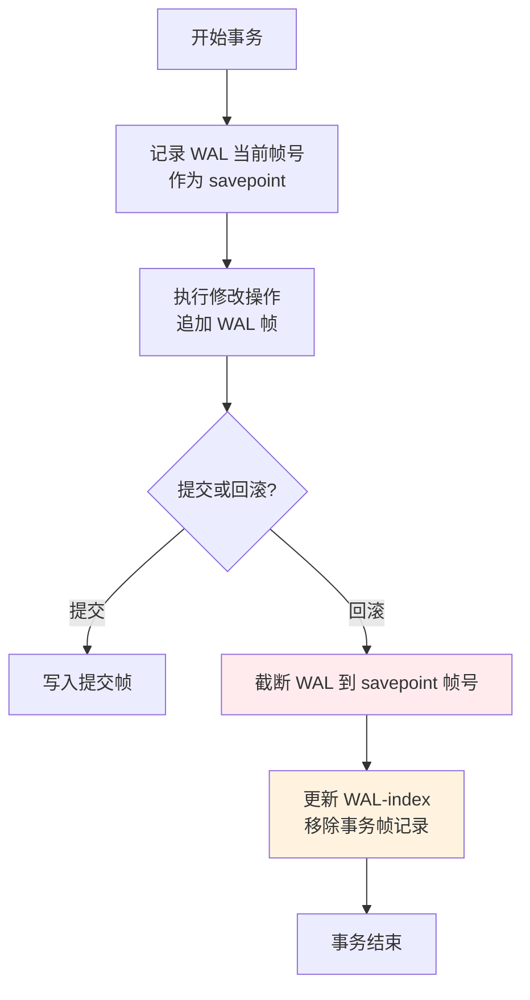
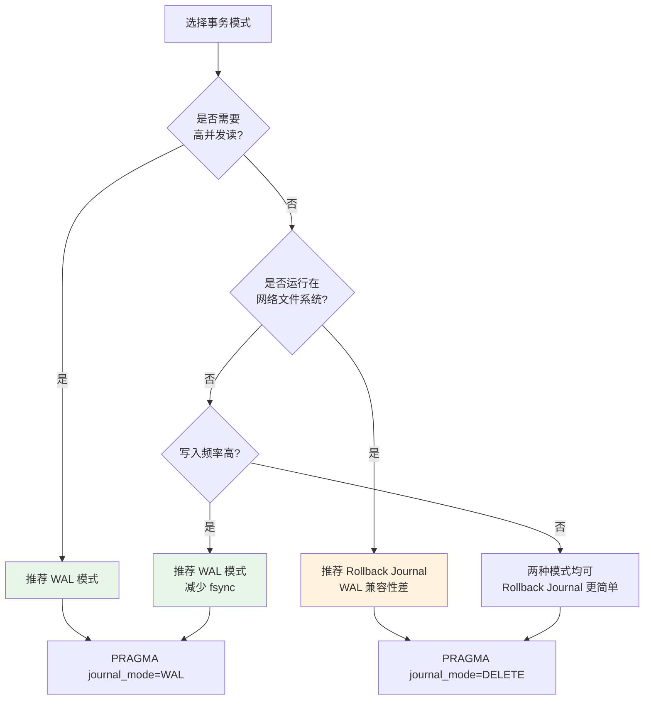

# SQLite3 写前日志（WAL）

## 学习目标

- 理解 SQLite 两种事务模式的根本区别：Rollback Journal（DELETE 模式）和 WAL
- 掌握 WAL 文件格式：头部 + 帧序列，每个帧包含页面号、页面数据、提交记录
- 理解 WAL-index（-shm 文件）的哈希表结构和快速页面版本定位机制
- 掌握检查点（Checkpoint）的 4 种模式和触发时机
- 对比 PostgreSQL WAL 和 MySQL Redo Log，理解三者的设计差异

## 核心概念

| 概念 | 说明 |
|------|------|
| Rollback Journal | 传统事务模式，修改前复制原页面到日志文件，回滚时恢复，提交时删除日志 |
| WAL (Write-Ahead Log) | 新式事务模式，修改追加到日志文件，读取时从日志优先获取，定期检查点写回主文件 |
| WAL 帧 | WAL 文件中的最小存储单元，包含页号、页面数据、提交计数器 |
| WAL-index (-shm) | 共享内存中的哈希表，加速 WAL 帧的查找，避免全量扫描 |
| Checkpoint | 将 WAL 中的修改页面写回数据库主文件，清空 WAL 的过程 |
| 检查点模式 | PASSIVE / FULL / RESTART / TRUNCATE 四种级别，影响读写阻塞 |

## 主体内容

### 1. 两种事务模式概述

SQLite 支持两种事务处理机制：



**关键区别：**

| 维度 | Rollback Journal | WAL |
|------|-----------------|-----|
| 修改位置 | 直接修改数据库文件 | 追加到 -wal 文件 |
| 原数据保护 | 复制原页面到 journal | 修改前后页面都保留在 WAL |
| 读并发 | 写事务阻塞读取者 | 读写可并发 |
| 回滚方式 | 从 journal 恢复 | 截断 WAL 或使用 savepoint |
| 提交开销 | 删除 journal 文件 | 刷盘 WAL 帧 |
| 文件数量 | 1 个 journal（临时） | 2 个伴随文件（-wal, -shm） |
| 网络文件系统 | 兼容性好 | 兼容性差（需禁用 -shm） |

### 2. Rollback Journal 模式详解

**Rollback Journal 工作流程：**



**Rollback Journal 的缺点：**

1. **读阻塞**：写事务持有 PENDING/EXCLUSIVE 锁时，读取者被阻塞
2. **随机写**：修改数据库文件时产生随机写 I/O
3. **同步开销**：每次提交需要 fsync 数据库文件
4. **回滚恢复慢**：需要从 journal 文件恢复所有修改的页面

### 3. WAL 模式工作原理

**WAL 模式写入流程：**

```mermaid
flowchart TD
    A[开始写事务] --> B[获取 RESERVED 锁]
    B --> C[修改页面数据]
    C --> D[将页面追加到 WAL 帧]
    D --> E[更新 WAL-index<br>记录 (页号 → WAL 帧偏移)]
    E --> F{还有页面要修改?}
    F -->|是| C
    F -->|否| G{提交?}
    G -->|是| H[写入提交帧<br>设置 commit 记录]
    H --> I[fsync WAL 文件]
    I --> J[释放锁]
    G -->|否| K[回滚]
    K --> L[截断 WAL 到<br>事务开始位置]

    style I fill:#e8f5e9
    style J fill:#e8f5e9
```

**WAL 模式读取流程：**



**并发读写示意：**



### 4. WAL 文件格式

WAL 文件由头部和帧序列组成：

```mermaid
flowchart TD
    subgraph WAL_FILE[WAL 文件格式]
        HDR[WAL 头部 - 32 字节]
        FRAME1[帧 1<br>页号=2, 数据, 校验和]
        FRAME2[帧 2<br>页号=3, 数据, 校验和]
        FRAME3[帧 3<br>页号=2, 数据, 校验和<br>提交计数器=1]
        FRAME4[帧 4<br>页号=5, 数据, 校验和]
        FRAME5[帧 5<br>页号=3, 数据, 校验和<br>提交计数器=2]
        ELLIP[...]
    end

    HDR --> FRAME1 --> FRAME2 --> FRAME3 --> FRAME4 --> FRAME5 --> ELLIP

    note right of FRAME3
        同一页面可能多次出现
        每次修改追加新帧
        commit 记录标记事务边界
    end note
```

**WAL 头部格式（32 字节）：**

| 偏移 | 大小 | 字段 | 说明 |
|------|------|------|------|
| 0 | 4 | 魔数 | 0x377f0682 或 0x377f0683 |
| 4 | 4 | 文件格式版本 | 当前为 3007000 |
| 8 | 4 | 页面大小 | 与数据库文件一致 |
| 12 | 4 | 检查点序号 | 每次 checkpoint 递增 |
| 16 | 4 | 盐值 1 | 随机数，用于校验 |
| 20 | 4 | 盐值 2 | 随机数，用于校验 |
| 24 | 4 | 校验和 1 | 头部校验 |
| 28 | 4 | 校验和 2 | 头部校验 |

**WAL 帧格式：**

```
┌──────────────────────────────────────────────────────────────┐
│ WAL 帧                                                        │
├───────────────────────────────────────────────────────────────┤
│ 帧头（24 字节）                                               │
│ ├── 页号（4 字节）                                            │
│ ├── 数据库大小（4 字节，提交帧有效）                          │
│ ├── 盐值 1（4 字节，复制自 WAL 头部）                         │
│ ├── 盐值 2（4 字节，复制自 WAL 头部）                         │
│ ├── 校验和 1（4 字节）                                        │
│ └── 校验和 2（4 字节）                                        │
├───────────────────────────────────────────────────────────────┤
│ 页面数据（页面大小，通常 4096 字节）                          │
└──────────────────────────────────────────────────────────────┘
```

**提交记录：**
- 当一个事务提交时，最后一个帧的 "数据库大小" 字段被设置为数据库页面数
- 读取者通过检查帧头的数据库大小字段判断哪些帧属于已提交事务

### 5. WAL-index（-shm 文件）

WAL-index 是共享内存中的哈希表，加速 WAL 帧查找：

```mermaid
flowchart TD
    subgraph SHM[WAL-index 结构 - -shm 文件]
        SHM_HDR[头部区域<br>WAL 头部副本<br>最后帧号等信息]
        SHM_HASH[哈希表区域<br>页号 → WAL 帧偏移]
        SHM_REGION1[区域 0]
        SHM_REGION2[区域 1]
        SHM_ELLIP[...]
    end

    subgraph HASH_DETAIL[哈希表详细结构]
        H_BUCKET[桶数组<br>每个桶: 页号 + 帧偏移]
        H_CHAIN[冲突链<br>相同哈希值形成链表]
    end

    SHM_HASH --> HASH_DETAIL

    note right of SHM
        -shm 文件是 mmap 映射
        允许多进程/线程共享访问
        查找复杂度 O(1) 平均
    end note
```

**WAL-index 查找过程：**



### 6. 检查点（Checkpoint）

检查点是将 WAL 中的修改写回数据库主文件的过程：



**四种检查点模式：**

| 模式 | 锁行为 | 写入阻塞 | 特点 |
|------|--------|---------|------|
| PASSIVE | 不阻塞任何人 | 不阻塞 | 尽力而为，可能不完整 |
| FULL | 阻塞新写入者 | 旧写入可继续 | 确保检查点完整 |
| RESTART | 阻塞所有写入者 | 等待写入完成 | 检查点后 WAL 可重用 |
| TRUNCATE | 阻塞所有写入者 | 同 RESTART | 检查点后截断 WAL 文件 |

**自动检查点触发：**

```sql
-- 设置自动检查点阈值（WAL 页面数）
PRAGMA wal_autocheckpoint = 1000;  -- 默认 1000 页

-- 手动触发检查点
PRAGMA wal_checkpoint;              -- PASSIVE 模式
PRAGMA wal_checkpoint(FULL);        -- FULL 模式
PRAGMA wal_checkpoint(RESTART);     -- RESTART 模式
PRAGMA wal_checkpoint(TRUNCATE);    -- TRUNCATE 模式
```

### 7. WAL 模式配置

```sql
-- 启用 WAL 模式
PRAGMA journal_mode = WAL;

-- 设置 WAL 文件大小限制
PRAGMA journal_size_limit = 100000000;  -- 100MB，0 表示无限制

-- 设置自动检查点阈值
PRAGMA wal_autocheckpoint = 1000;  -- 每 1000 页检查点

-- 查询 WAL 状态
PRAGMA wal_checkpoint;  -- 返回 (busy, log, checkpointed)
```

### 8. WAL 模式回滚

**WAL 模式下的回滚机制：**



**SQLite 回滚特点：**

- WAL 模式下回滚极快（只需截断 WAL 文件）
- 不需要从日志恢复数据到数据库文件
- 支持嵌套 savepoint（`SAVEPOINT` 命令）

### 9. 三大数据库 WAL 对比

```mermaid
flowchart TD
    subgraph PG_WAL[PostgreSQL WAL (XLOG)]
        PG1[顺序追加写入<br>Redo 日志]
        PG2[Full Page Writes<br>检查点后首次修改写完整页]
        PG3[LSN (Log Sequence Number)<br>全局递增的日志位置]
        PG4[WAL 段文件<br>每个 16MB]
        PG5[恢复: 从检查点重放 LSN]
    end

    subgraph MYSQL_LOG[MySQL Redo Log]
        MY1[循环写入<br>固定大小（如 2GB）]
        MY2[LSN + Checkpoint LSN<br>两个指针循环追赶]
        MY3[Mini Transaction (mtr)<br>原子日志单元]
        MY4[ib_logfile0/1<br>两个固定文件]
        MY5[恢复: 从 Checkpoint LSN 重放]
    end

    subgraph SQLITE_WAL[SQLite WAL]
        SQ1[追加写入<br>无循环（持续增长）]
        SQ2[WAL-index 哈希表<br>快速查找页面版本]
        SQ3[检查点手动/自动<br>写回数据库文件]
        SQ4[-wal + -shm 伴随文件]
        SQ5[恢复: 从 WAL-index 查找<br>或从检查点重放]
    end

    PG1 --> PG2 --> PG3 --> PG4 --> PG5
    MY1 --> MY2 --> MY3 --> MY4 --> MY5
    SQ1 --> SQ2 --> SQ3 --> SQ4 --> SQ5
```

**详细对比表：**

| 维度 | PostgreSQL WAL | MySQL Redo Log | SQLite WAL |
|------|---------------|----------------|-----------|
| 写入模式 | 追加写（段轮换） | 循环写（固定大小） | 追加写（持续增长） |
| 文件管理 | 段文件 16MB 自动删除 | 固定 ib_logfile0/1 | -wal 文件（动态） |
| 页面定位 | LSN 二分查找 | LSN 顺序扫描 | WAL-index 哈希表 O(1) |
| 检查点机制 | 后台进程周期刷盘 | 后台线程周期刷盘 | 手动/自动检查点 |
| 读并发 | MVCC（快照隔离） | MVCC（Undo Log） | WAL-index 查找 |
| 恢复机制 | 从检查点 LSN 重放 | 从 Checkpoint LSN 重放 | WAL 帧直接可见 |
| Full Page Writes | 必须（防止页撕裂） | 无 | 无 |
| 性能优化 | 组提交、并行恢复 | 组提交、双缓冲 | 批量帧追加 |

### 10. WAL vs Rollback Journal 选择



**WAL 模式的优势：**

1. **读并发**：写事务不阻塞读取者
2. **写入性能**：追加写比随机写快，减少 fsync 开销
3. **快速回滚**：截断 WAL 比恢复 journal 更快
4. **崩溃恢复**：WAL 帧天然支持恢复

**WAL 模式的劣势：**

1. **文件数量**：需要额外的 -wal 和 -shm 文件
2. **网络文件系统兼容性**：-shm 文件依赖 mmap，在 NFS 上可能失败
3. **WAL 文件增长**：如果不及时检查点，WAL 文件会持续增长
4. **内存占用**：WAL-index 需要共享内存

## 要点总结

1. **两种事务模式**：Rollback Journal（DELETE 模式，写阻塞读）和 WAL（追加写，读写并发）
2. **WAL 文件结构**：32 字节头部 + 帧序列，每帧包含页号、页面数据、校验和
3. **WAL-index**：共享内存中的哈希表，O(1) 复杂度定位页面在 WAL 中的位置
4. **检查点四模式**：PASSIVE（不阻塞）、FULL（阻塞新写）、RESTART（阻塞所有写）、TRUNCATE（截断 WAL）
5. **与 PG/MySQL 对比**：SQLite WAL 无循环写、无 Full Page Writes、依赖 WAL-index 而非 LSN
6. **选择依据**：高并发读选 WAL，网络文件系统选 Rollback Journal

## 思考题

1. 为什么 SQLite 的 WAL 采用追加写而非 MySQL 的循环写设计？这带来了什么优缺点？
2. WAL-index 的哈希表设计在进程崩溃后会发生什么？如何保证一致性？
3. 为什么 WAL 模式下不支持多写入者并发（多个写事务同时进行）？
4. 对比 PostgreSQL 的 Full Page Writes 机制，SQLite 为什么不需要这个机制？这是否意味着 SQLite 可能出现页撕裂？
5. 如果你的应用场景是「每秒 1000 次写入，每次写入 10 行，页面大小 4KB」，应该设置多大的 `wal_autocheckpoint` 阈值？为什么？