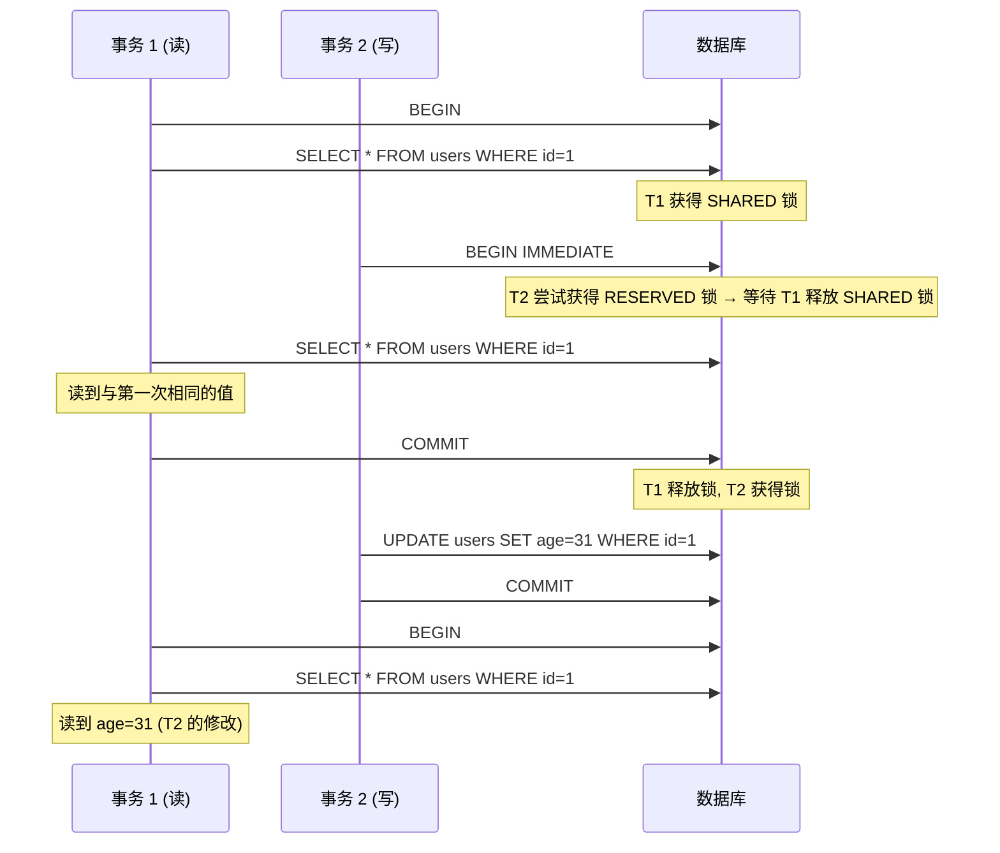
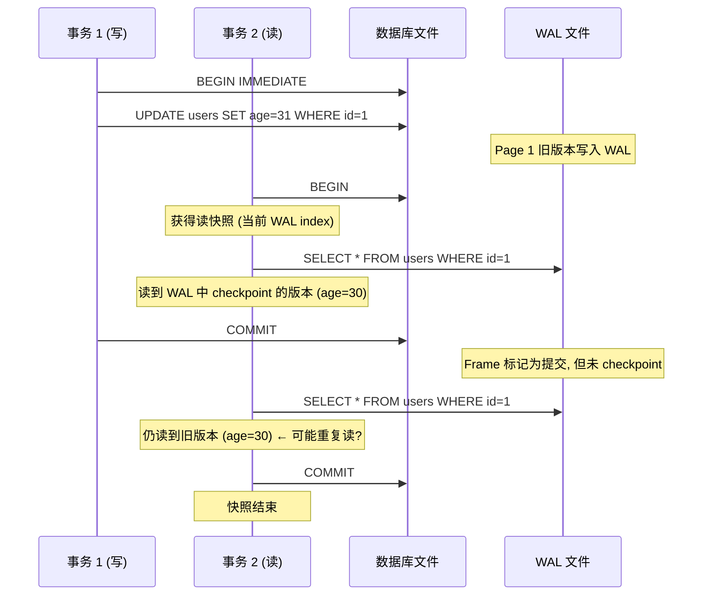
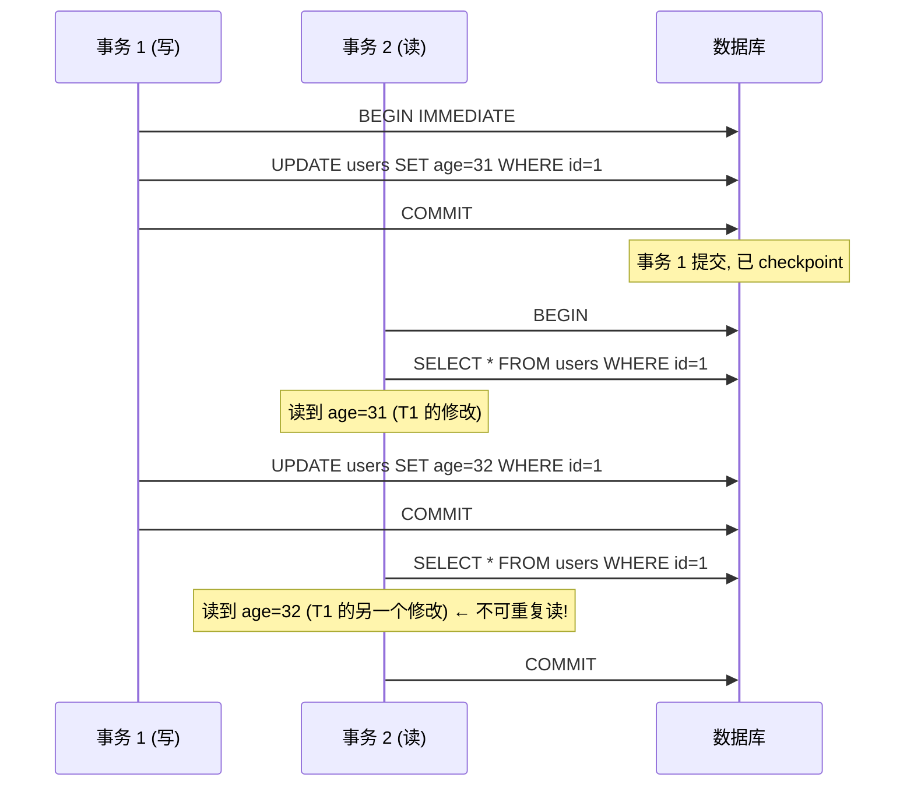
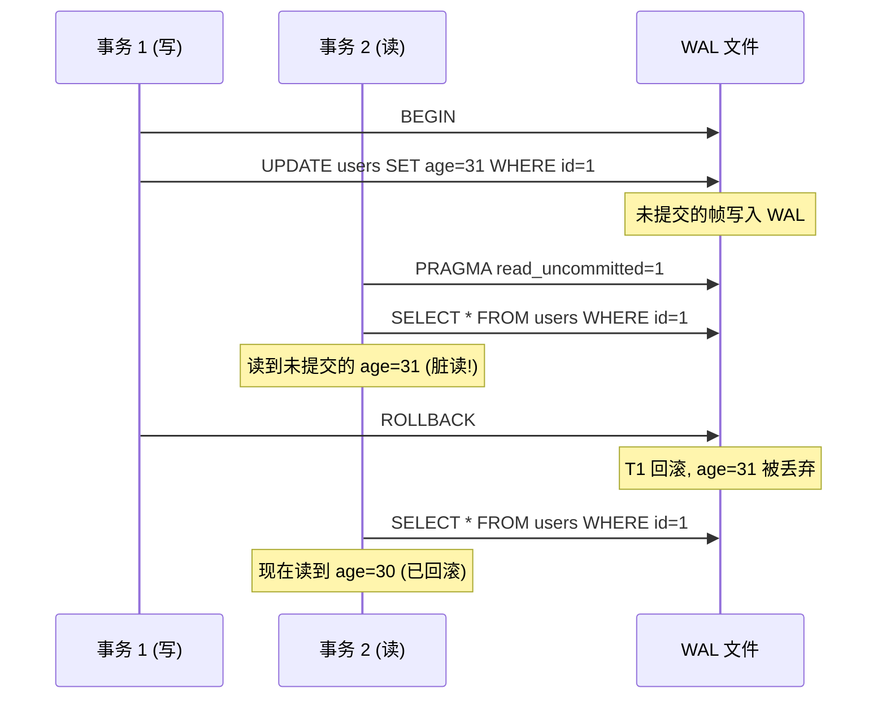
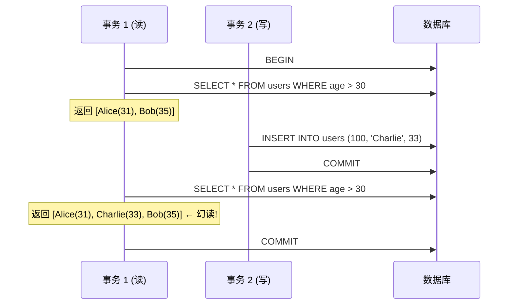
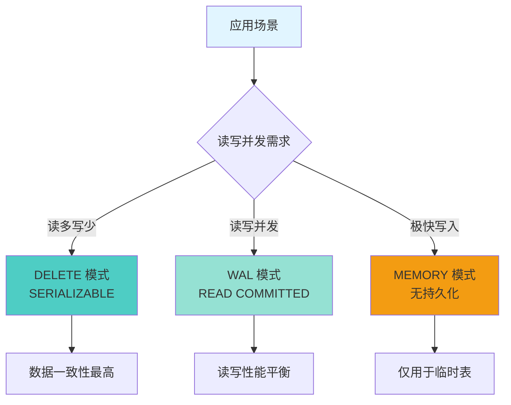
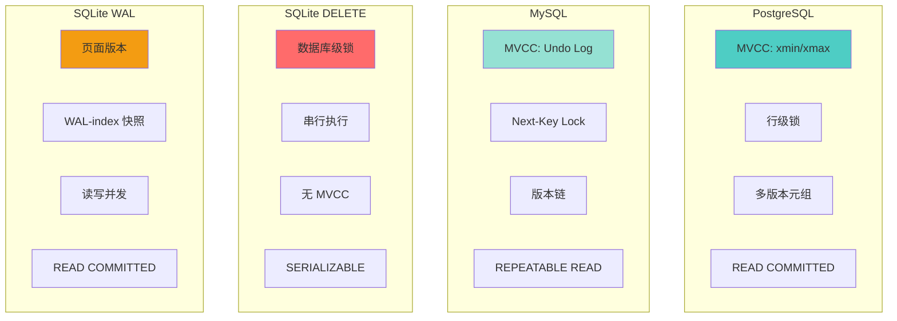

# SQLite3 隔离级别

## 学习目标

1. 理解 SQLite3 的**隔离级别**（与标准 SQL 的差异）
2. 掌握 SQLite3 的**SERIALIZABLE**（DELETE 模式）和 **READ COMMITTED**（WAL 模式）实现
3. 理解 SQLite3 的**脏读、不可重复读、幻读**现象
4. 熟悉 SQLite3 的**隔离级别配置**方法
5. 对比 PG/MySQL 与 SQLite 的隔离级别差异

---

## 核心概念

### 1. SQLite3 的隔离级别概览

**标准 SQL 隔离级别**：

| 隔离级别 | 脏读 | 不可重复读 | 幻读 |
|---------|------|-----------|------|
| READ UNCOMMITTED | 可能 | 可能 | 可能 |
| READ COMMITTED | 不可能 | 可能 | 可能 |
| REPEATABLE READ | 不可能 | 不可能 | 可能 |
| SERIALIZABLE | 不可能 | 不可能 | 不可能 |

**SQLite 的实际隔离级别**：

| 事务模式 | 实际隔离级别 | 脏读 | 不可重复读 | 幻读 |
|---------|-------------|------|-----------|------|
| DELETE 模式 | SERIALIZABLE | 不可能 | 不可能 | 不可能 |
| WAL 模式 | READ COMMITTED | 不可能 | 可能 | 可能 |
| WAL + wal_autocheckpoint=0 | SNAPSHOT | 不可能 | 不可能 | 可能 |

---

### 2. DELETE 模式：SERIALIZABLE

**DELETE 模式下，事务串行化执行**：



**DELETE 模式特点**：

- 读操作获得 **SHARED 锁**
- 写操作需要 **RESERVED 锁**（必须等待 SHARED 锁释放）
- 互斥锁定 → 事务串行化 → 完全隔离

**对比 PostgreSQL/MySQL**：

| 维度 | PostgreSQL | MySQL (InnoDB) | SQLite (DELETE) |
|------|------------|----------------|-----------------|
| 隔离级别 | READ COMMITTED | REPEATABLE READ | SERIALIZABLE |
| 实现机制 | MVCC (xmin/xmax) | MVCC (Undo Log) | 数据库级锁 |
| 读写并发 | 读不阻塞写 | 读不阻塞写 | 写阻塞读 |
| 写写并发 | 行锁 + MVCC | 行锁 + MVCC | 串行 |

---

### 3. WAL 模式：READ COMMITTED

**WAL 模式下，读写可并发**：



**WAL 模式下的不可重复读**：



**WAL 模式特点**：

- 读事务获得**读快照**（基于 WAL index 当前状态）
- 每次读操作都检查 WAL 文件
- 如果 WAL 被 checkpoint，读操作看到最新版本
- 多次读可能看到不同版本 → 不可重复读

---

### 4. 脏读可能性

**WAL 模式下的脏读**：

```sql
-- 设置读取未提交
PRAGMA read_uncommitted = 1;

-- 仅 WAL 模式下有效
-- 读者可以看到未提交的写入
```



**SQLite 默认禁止脏读**：

```sql
PRAGMA read_uncommitted;
-- 默认值: 0 (禁止脏读)
```

---

### 5. 幻读可能性

**DELETE 模式不可能幻读**（串行化）：
- 表级锁防止其他事务插入新行

**WAL 模式可能幻读**：

```sql
-- WAL 模式下
-- 事务 1 查询年龄 > 30 的用户
SELECT * FROM users WHERE age > 30;
-- 结果: [Alice (31), Bob (35)]

-- 事务 2 插入新用户
INSERT INTO users VALUES (100, 'Charlie', 33);
COMMIT;

-- 事务 1 再次查询
SELECT * FROM users WHERE age > 30;
-- 结果: [Alice (31), Bob (35), Charlie (33)] ← 幻读!
```

**幻读 Mermaid 图**：



---

### 6. 隔离级别配置

**查看当前隔离级别**：

```sql
-- 查看事务模式
PRAGMA journal_mode;
-- wal / delete / memory

-- 查看 read_uncommitted 设置
PRAGMA read_uncommitted;
-- 0 (禁止脏读, 默认)
-- 1 (允许脏读, 仅 WAL 模式有效)
```

**配置隔离级别**：

```sql
-- 1. 设置事务模式（影响隔离级别）
PRAGMA journal_mode = DELETE;  -- SERIALIZABLE
PRAGMA journal_mode = WAL;     -- READ COMMITTED

-- 2. 控制脏读（仅 WAL 模式）
PRAGMA read_uncommitted = 0;   -- 禁止脏读（默认）
PRAGMA read_uncommitted = 1;   -- 允许脏读

-- 3. 控制 WAL 自动检查点
PRAGMA wal_autocheckpoint = 0;  -- 禁用自动检查点 → 类似 SNAPSHOT
PRAGMA wal_autocheckpoint = 1000;  -- 每 1000 页检查点

-- 4. 控制同步模式
PRAGMA synchronous = FULL;    -- 最安全
PRAGMA synchronous = NORMAL;  -- 平衡
PRAGMA synchronous = OFF;     -- 最快
```

**隔离级别选择指南**：



---

### 7. SQLite 与 PG/MySQL 隔离级别对比

**统一对比表**：

| 维度 | PostgreSQL | MySQL (InnoDB) | SQLite (DELETE) | SQLite (WAL) |
|------|------------|----------------|-----------------|--------------|
| 默认隔离级别 | READ COMMITTED | REPEATABLE READ | SERIALIZABLE | READ COMMITTED |
| 脏读 | 不可能 | 不可能 | 不可能 | 可能（需配置） |
| 不可重复读 | 可能 | 不可能 | 不可能 | 可能 |
| 幻读 | 可能 | 不可能（Next-Key Lock） | 不可能 | 可能 |
| 实现机制 | MVCC (xmin/xmax) | MVCC (Undo Log) | 数据库级锁 | 页面版本 (WAL) |
| 读写并发 | 读不阻塞写 | 读不阻塞写 | 写阻塞读 | 读写并发 |
| 写写并发 | 行锁 | 行锁 | 串行 | 串行 |
| 配置方式 | SET TRANSACTION | SET TRANSACTION | PRAGMA journal_mode | PRAGMA journal_mode |

**架构差异总结图**：



---

## 要点总结

1. **DELETE 模式 = SERIALIZABLE**：数据库级锁，事务串行，完全隔离
2. **WAL 模式 = READ COMMITTED**：页面版本控制，读写可并发
3. **脏读**：默认禁止（WAL 模式需显式配置 `read_uncommitted=1`）
4. **不可重复读**：WAL 模式下可能发生
5. **幻读**：WAL 模式下可能发生（无 Gap Lock/Next-Key Lock）
6. **隔离级别配置**：通过 `PRAGMA journal_mode` 控制
7. **与 PG/MySQL 差异显著**：SQLite 的隔离级别通过锁机制实现，而非 MVCC

---

## 思考题

1. **隔离级别选择**：在什么场景下选择 DELETE 模式（SERIALIZABLE），什么场景下选择 WAL 模式（READ COMMITTED）？
2. **脏读风险**：WAL 模式下启用脏读（`read_uncommitted=1`）有哪些实际应用场景？风险是什么？
3. **幻读处理**：SQLite 没有 Next-Key Lock，如何防止幻读？
4. **快照隔离**：WAL 模式下的读快照是如何维护的？与 PostgreSQL 的快照有什么异同？
5. **性能权衡**：SERIALIZABLE 隔离级别在性能上付出的代价是什么？如何通过应用层设计缓解？

---

## 参考资源

- [SQLite 隔离级别](https://www.sqlite.org/isolation.html)
- [SQLite 事务](https://www.sqlite.org/transaction.html)
- [SQLite WAL 模式](https://www.sqlite.org/wal.html)
- [SQLite 锁机制](https://www.sqlite.org/lockingv3.html)
- [PostgreSQL 隔离级别](https://www.postgresql.org/docs/current/transaction-iso.html)
- [MySQL 隔离级别](https://dev.mysql.com/doc/refman/8.0/en/innodb-transaction-isolation.html)