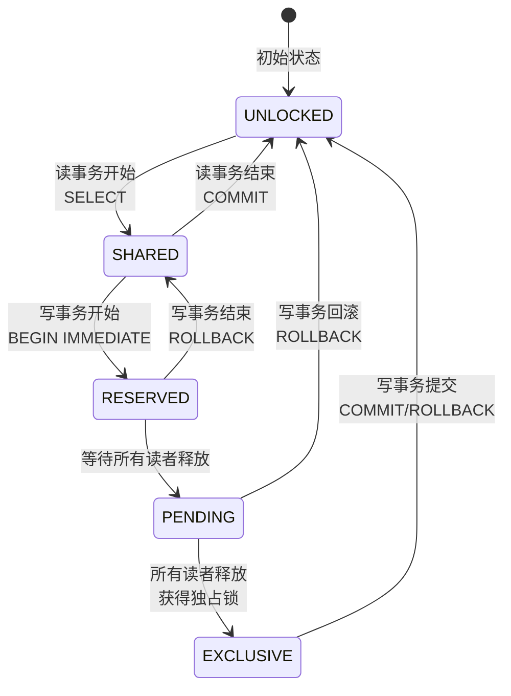
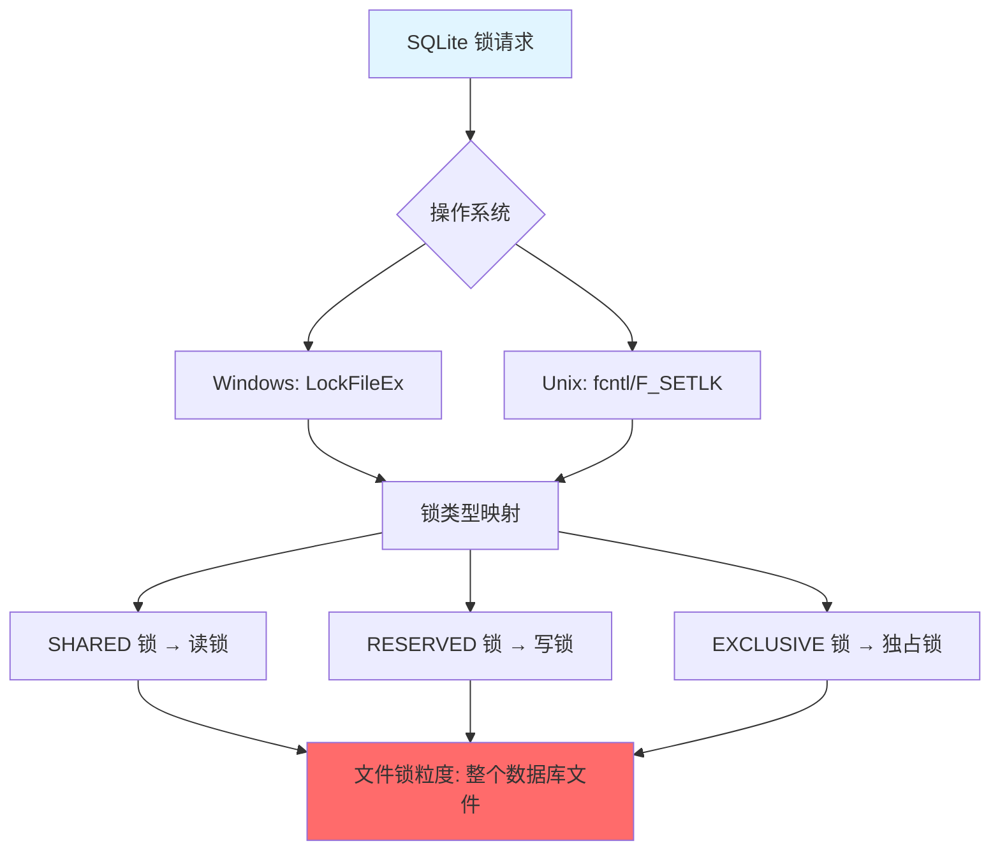
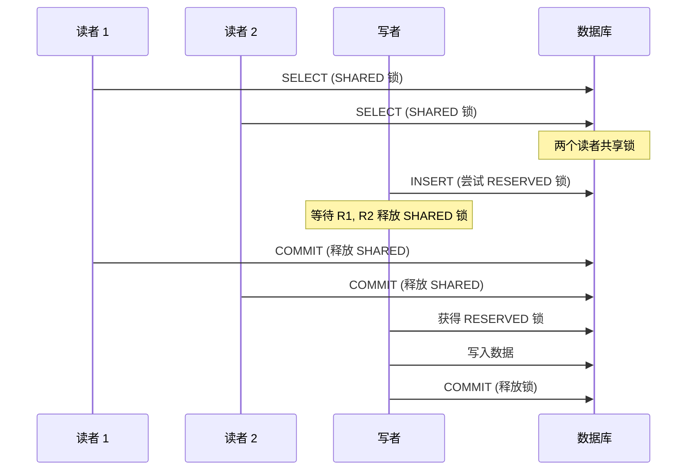
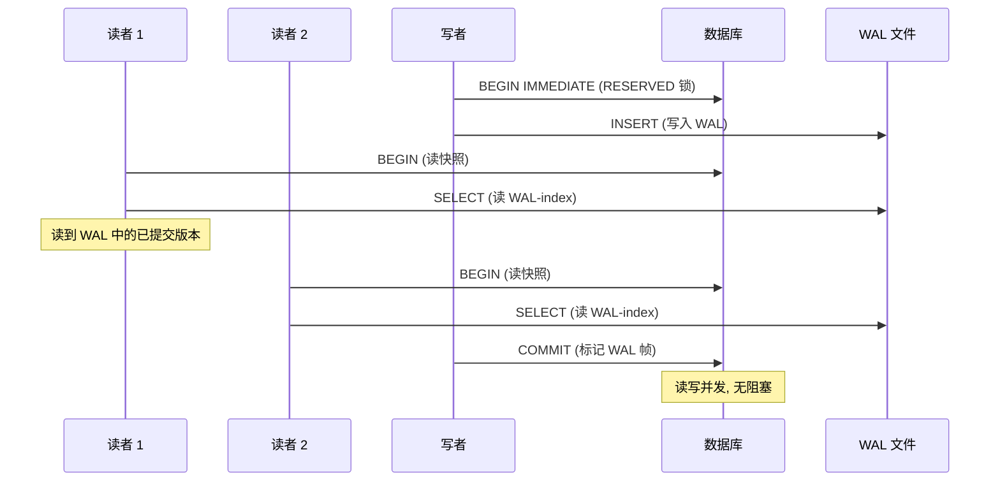
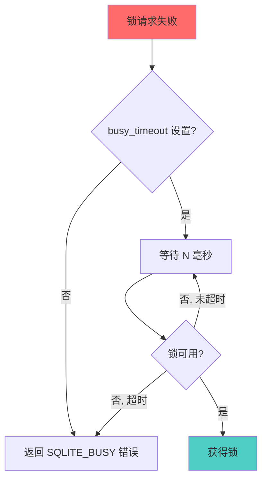
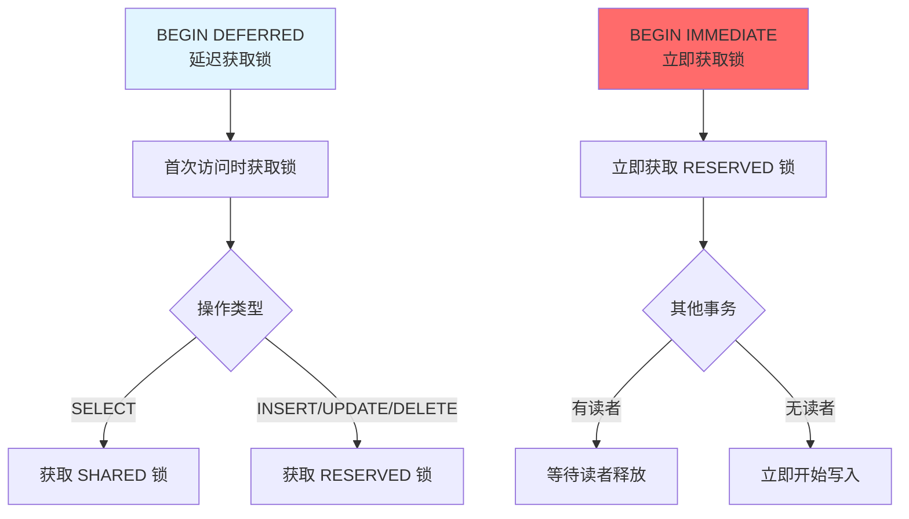

# SQLite3 锁机制

## 学习目标

1. 理解 SQLite3 的 **5 级锁状态机**（UNLOCKED → SHARED → RESERVED → PENDING → EXCLUSIVE）
2. 掌握 SQLite3 的**文件锁**实现（与 PG/MySQL 的差异）
3. 理解 SQLite3 的**读写并发控制**机制
4. 熟悉 SQLite3 的**死锁检测**与**busy_timeout**
5. 对比三种数据库的锁策略

---

## 核心概念

### 1. SQLite3 的 5 级锁状态机

**核心设计**：SQLite 使用数据库级文件锁（而非行级锁或表级锁），通过 5 级状态机控制并发访问。



**锁级别详解**：

| 锁级别 | 说明 | 允许操作 | 典型场景 |
|--------|------|----------|----------|
| UNLOCKED | 无锁 | 无操作 | 数据库未打开 |
| SHARED | 共享锁 | 并发读、阻塞写 | SELECT 查询 |
| RESERVED | 预留锁 | 单个写者 + 多个读者 | BEGIN IMMEDIATE |
| PENDING | 待定锁 | 等待读者释放 | 写事务准备阶段 |
| EXCLUSIVE | 独占锁 | 独占读写 | COMMIT 写入 |

---

### 2. 文件锁实现

**SQLite 使用操作系统文件锁**：



**文件锁特点**：

1. **数据库级锁**：锁住整个 `.db` 文件（不是表级，不是行级）
2. ** advisory 锁**：建议性锁（非强制），依赖进程协作
3. **锁文件区域**：
   - SHARED 锁：锁定字节 0 ~ 文件末尾
   - RESERVED 锁：锁定字节 0（仅一个字节）
   - PENDING 锁：锁定字节 1（仅一个字节）
   - EXCLUSIVE 锁：锁定字节 0 ~ 文件末尾

**代码示例**：

```c
// SQLite 内部实现（简化）
static int sqlite3UnixLock(sqlite3_file *id, int locktype) {
    struct flock lock;
    memset(&lock, 0, sizeof(lock));
    lock.l_type = (locktype == SHARED) ? F_RDLCK : F_WRLCK;
    lock.l_whence = SEEK_SET;
    lock.l_start = 0;
    lock.l_len = 0;  // 锁到文件末尾

    return fcntl(id->fd, F_SETLK, &lock);
}
```

---

### 3. 读写并发控制

**DELETE 模式下的读写互斥**：



**WAL 模式下的读写并发**：



**并发规则总结**：

| 场景 | DELETE 模式 | WAL 模式 |
|------|-------------|----------|
| 多个读者 | 允许（SHARED 共享） | 允许 |
| 读者 + 写者 | 互斥（写等待读） | 并发（读 WAL） |
| 多个写者 | 互斥（串行写） | 互斥（串行写） |
| 写者 + 读者 | 互斥（读等待写） | 并发（读写隔离） |

---

### 4. 死锁检测与 busy_timeout

**SQLite 不会死锁**：

SQLite 使用**数据库级锁**，不会出现死锁（死锁需要循环等待，数据库级锁无法形成环）。

**busy_timeout 机制**：



**配置 busy_timeout**：

```c
// C API
sqlite3_busy_timeout(db, 5000);  // 等待 5 秒

// SQL PRAGMA
PRAGMA busy_timeout = 5000;  // 毫秒
```

**处理 SQLITE_BUSY 错误**：

```c
// 重试逻辑
int rc;
int retries = 0;
do {
    rc = sqlite3_exec(db, "INSERT INTO t VALUES (1)", NULL, NULL, NULL);
    if (rc == SQLITE_BUSY) {
        sqlite3_sleep(100);  // 等待 100ms
        retries++;
    }
} while (rc == SQLITE_BUSY && retries < 10);

if (rc != SQLITE_OK) {
    fprintf(stderr, "插入失败: %s\n", sqlite3_errmsg(db));
}
```

---

### 5. BEGIN IMMEDIATE vs BEGIN DEFERRED

**事务开始时机**：



**对比**：

| 维度 | BEGIN DEFERRED | BEGIN IMMEDIATE | BEGIN EXCLUSIVE |
|------|----------------|-----------------|-----------------|
| 锁获取时机 | 首次操作时 | 立即 | 立即 |
| 初始锁级别 | 无锁 | RESERVED | EXCLUSIVE |
| 适用场景 | 读多写少 | 写事务确定 | 大批量写入 |
| 并发友好度 | 高 | 中 | 低 |
| 冲突概率 | 低（延迟获取） | 中 | 高 |

**代码示例**：

```sql
-- DEFERRED 事务
BEGIN;  -- 无锁
SELECT * FROM users;  -- 获得 SHARED 锁
UPDATE users SET age = 31;  -- 升级为 RESERVED 锁
COMMIT;

-- IMMEDIATE 事务
BEGIN IMMEDIATE;  -- 立即获得 RESERVED 锁
UPDATE users SET age = 31;  -- 已有锁, 无需升级
COMMIT;

-- EXCLUSIVE 事务
BEGIN EXCLUSIVE;  -- 立即获得 EXCLUSIVE 锁
-- ... 大批量写入 ...
COMMIT;
```

---

### 6. 锁性能优化

**1. 减少锁持有时间**：

```sql
-- 劣：锁持有时间长
BEGIN;
-- 长时间计算
SELECT * FROM large_table;  -- SHARED 锁持有
-- 处理数据（Python 代码）
UPDATE result_table SET ...;
COMMIT;

-- 优：快速提交事务
BEGIN;
SELECT * FROM large_table;  -- SHARED 锁
COMMIT;  -- 立即释放

-- 在应用层处理数据

BEGIN;
UPDATE result_table SET ...;
COMMIT;
```

**2. 批量操作**：

```sql
-- 劣：多次事务
INSERT INTO t VALUES (1);  -- 自动提交
INSERT INTO t VALUES (2);  -- 自动提交
INSERT INTO t VALUES (3);  -- 自动提交

-- 优：单次事务
BEGIN;
INSERT INTO t VALUES (1);
INSERT INTO t VALUES (2);
INSERT INTO t VALUES (3);
COMMIT;  -- 一次锁获取
```

**3. WAL 模式**：

```sql
-- 启用 WAL 模式
PRAGMA journal_mode = WAL;

-- 读写并发
-- 读者不阻塞写者
-- 写者不阻塞读者
```

---

## 要点总结

1. **5 级锁状态机**：UNLOCKED → SHARED → RESERVED → PENDING → EXCLUSIVE
2. **数据库级锁**：锁住整个文件（非行级、非表级）
3. **文件锁实现**：依赖 OS 文件锁（fcntl/LockFileEx）
4. **读写并发**：DELETE 模式互斥，WAL 模式并发
5. **无死锁**：数据库级锁无法形成循环等待
6. **busy_timeout**：等待锁超时，避免 SQLITE_BUSY 错误
7. **事务优化**：减少锁持有时间、批量操作、WAL 模式

---

## 思考题

1. **锁粒度权衡**：SQLite 使用数据库级锁而非行级锁，这种设计的优劣是什么？在什么场景下是优势，什么场景下是劣势？
2. **WAL 并发原理**：WAL 模式如何实现读写并发？与 PostgreSQL 的 MVCC 有什么本质区别？
3. **busy_timeout 设置**：busy_timeout 设置多长时间合适？如何根据应用场景调优？
4. **BEGIN 选择**：在什么场景下使用 BEGIN DEFERRED，什么场景下使用 BEGIN IMMEDIATE？
5. **跨平台锁**：Windows 和 Unix 的文件锁实现有什么差异？SQLite 如何处理跨平台兼容性？

---

## 参考资源

- [SQLite 锁机制](https://www.sqlite.org/lockingv3.html)
- [SQLite 文件锁](https://www.sqlite.org/filelock.html)
- [SQLite 并发控制](https://www.sqlite.org/concurrency.html)
- [SQLite WAL 模式](https://www.sqlite.org/wal.html)
- [SQLite 事务](https://www.sqlite.org/transaction.html)