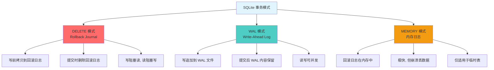
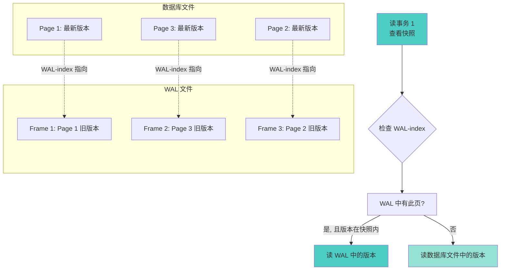
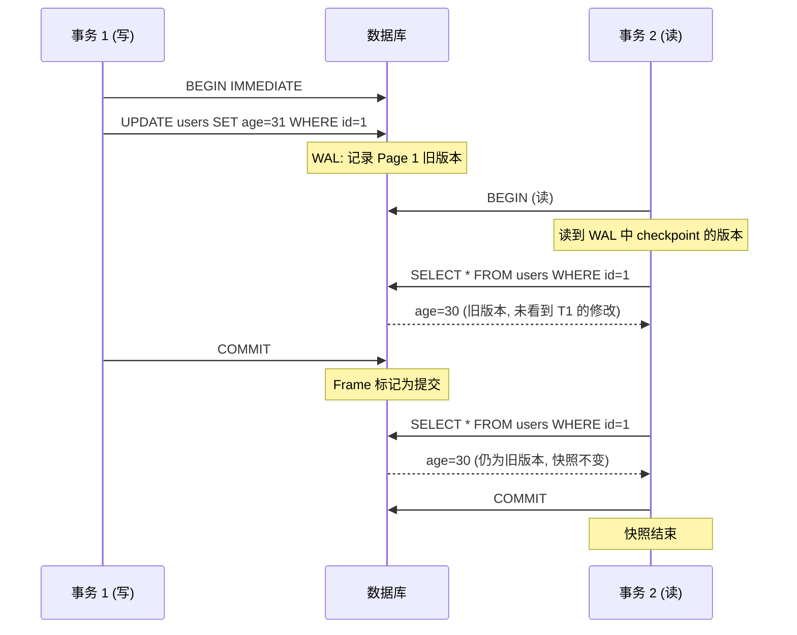
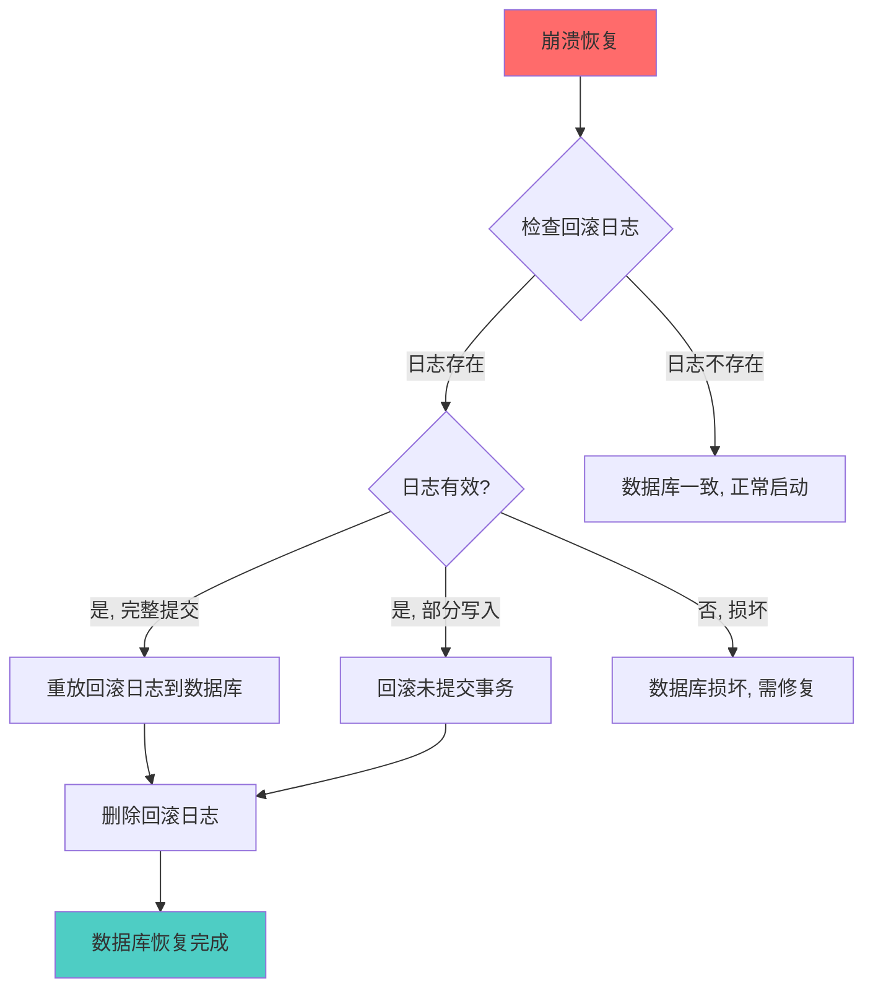
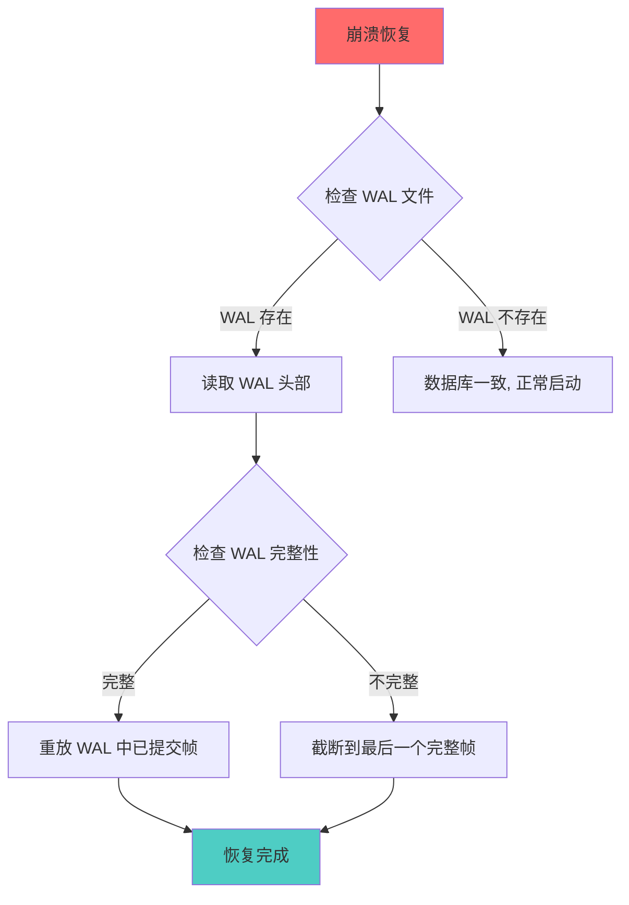

# SQLite3 事务与 MVCC

## 学习目标

1. 理解 SQLite3 的**事务模型**（DELETE vs WAL vs MEMORY）
2. 掌握 SQLite3 的**MVCC 实现**（与 PostgreSQL/MySQL 的差异）
3. 理解 SQLite3 的**快照隔离**与**读提交**语义
4. 熟悉 SQLite3 的**崩溃恢复**机制
5. 对比三种数据库的事务实现差异

---

## 核心概念

### 1. SQLite3 的事务模型

**SQLite3 支持三种事务模式**：



**事务控制命令**：

```sql
-- 开始事务（三种模式）
BEGIN;                    -- 隐式 DEFERRED
BEGIN DEFERRED;           -- 延迟获取锁（默认）
BEGIN IMMEDIATE;          -- 立即获取 RESERVED 锁
BEGIN EXCLUSIVE;          -- 立即获取 EXCLUSIVE 锁

-- 提交事务
COMMIT;

-- 回滚事务
ROLLBACK;

-- 事务存储点（Savepoint）
SAVEPOINT sp1;
-- ... 操作 ...
ROLLBACK TO sp1;          -- 回滚到保存点
RELEASE sp1;               -- 释放保存点
```

---

### 2. SQLite3 的 MVCC 实现

**核心特点**：SQLite3 的 MVCC 不依赖 xmin/xmax（PG）或 Undo Log（MySQL），而是通过**页面版本控制**实现。

**MVCC 机制（WAL 模式）**：



**MVCC 实现步骤**：

1. **写事务修改页面**：将原始页面内容追加到 WAL 文件（作为旧版本）
2. **WAL-index 记录**：在 `-shm` 文件中记录页面版本映射
3. **读事务检查**：通过 WAL-index 找到对应版本的页面
4. **快照隔离**：读事务看到的是 WAL 中某个 checkpoint 时的版本

**MVCC 对比**：

| 维度 | PostgreSQL | MySQL (InnoDB) | SQLite |
|------|------------|----------------|--------|
| 实现机制 | xmin/xmax 元组头 | Undo Log 版本链 | 页面版本（WAL） |
| 版本存储 | 元组内（Heap 表） | Undo Log 段 | WAL 文件帧 |
| 旧版本清理 | VACUUM | Purge 线程 | Checkpoint |
| 可见性判断 | 快照比较 | Read View | WAL-index 检查 |
| 回滚实现 | 还原旧元组 | Undo Log 回滚 | 删除 WAL 帧 |
| 并发控制 | 行级锁 + MVCC | 行级锁 + MVCC | 数据库级锁 + MVCC |

---

### 3. 快照隔离（Snapshot Isolation）

**SQLite 的快照隔离**：



**隔离级别**：

| 隔离级别 | SQLite 实现 | 说明 |
|---------|-------------|------|
| READ UNCOMMITTED | 不支持（WAL 模式除外） | 在 WAL 模式下可读未提交数据 |
| READ COMMITTED | 默认 | WAL 模式下，读事务看到已提交版本 |
| REPEATABLE READ | 不支持 | 每次读可能看到不同版本 |
| SERIALIZABLE | 默认（DELETE 模式） | 事务串行化执行 |

**关键规则**：
- DELETE 模式：**SERIALIZABLE** 隔离级别（读和写互斥）
- WAL 模式：**READ COMMITTED** 隔离级别（读写可并发）

---

### 4. 崩溃恢复

**DELETE 模式的崩溃恢复**：



**WAL 模式的崩溃恢复**：



**恢复策略对比**：

| 模式 | 恢复速度 | 恢复逻辑 | 数据安全性 |
|------|---------|---------|-----------|
| DELETE | 慢（需要重放或回滚） | 检查日志存在性 | 高（CRASH-SAFE） |
| WAL | 快（仅重放提交帧） | 检查 WAL 完整性 | 高（CRASH-SAFE） |
| MEMORY | 无恢复 | 崩溃即丢失 | 低 |

---

### 5. AUTOCOMMIT 模式

**SQLite 默认的自动提交模式**：

```sql
-- 默认：AUTOCOMMIT = ON
-- 每条 DML 语句是一个独立事务
INSERT INTO users VALUES (1, 'Alice');  -- 自动提交
INSERT INTO users VALUES (2, 'Bob');    -- 自动提交

-- 关闭 AUTOCOMMIT：使用 BEGIN
BEGIN;
INSERT INTO users VALUES (3, 'Charlie');
INSERT INTO users VALUES (4, 'David');
COMMIT;  -- 一次提交两条记录

-- 隐式事务边界
-- DDL 语句自动提交当前事务
BEGIN;
INSERT INTO users VALUES (5, 'Eve');
CREATE TABLE temp (id INT);  -- 隐式 COMMIT 当前事务
-- INSERT 被提交，CREATE TABLE 在新事务中执行
```

**AUTOCOMMIT 控制**：

```c
// C API 控制 AUTOCOMMIT
sqlite3 *db;
sqlite3_open("test.db", &db);

// 检查 AUTOCOMMIT 状态
int is_autocommit = sqlite3_get_autocommit(db);
printf("AUTOCOMMIT: %d\n", is_autocommit);  // 1

// 关闭 AUTOCOMMIT
sqlite3_exec(db, "BEGIN", NULL, NULL, NULL);

// 重新检查
is_autocommit = sqlite3_get_autocommit(db);
printf("AUTOCOMMIT: %d\n", is_autocommit);  // 0

// 提交
sqlite3_exec(db, "COMMIT", NULL, NULL, NULL);
```

---

### 6. 事务性能优化

**批量写入优化**：

```sql
-- 劣：每次 INSERT 自动提交
INSERT INTO t VALUES (1);
INSERT INTO t VALUES (2);
-- ... 10000 次, 每次都有 fsync

-- 优：单次事务批量插入
BEGIN;
INSERT INTO t VALUES (1);
INSERT INTO t VALUES (2);
-- ... 10000 次, 仅一次 fsync
COMMIT;

-- 更优：使用事务 + 批量语法
BEGIN;
INSERT INTO t VALUES (1), (2), (3), ..., (10000);
COMMIT;
```

**性能对比**：

```bash
# 每条 INSERT 自动提交
sqlite3 test.db <<EOF
CREATE TABLE t (id INTEGER PRIMARY KEY);
.timer on
INSERT INTO t VALUES (1);
INSERT INTO t VALUES (2);
-- ... 10000 条
.timer off
EOF
# 耗时: 约 150 秒 (15ms/条)

# 批量事务插入
sqlite3 test.db <<EOF
BEGIN;
INSERT INTO t VALUES (1);
INSERT INTO t VALUES (2);
-- ... 10000 条
COMMIT;
.timer off
EOF
# 耗时: 约 0.5 秒 (0.05ms/条)
```

---

## 要点总结

1. **三种事务模式**：DELETE（默认串行）、WAL（读写并发）、MEMORY（极快但易失）
2. **MVCC 实现**：通过页面版本控制（WAL 帧），而非元组级版本（PG）或 Undo Log 链（MySQL）
3. **快照隔离**：WAL 模式下提供 READ COMMITTED 隔离级别
4. **崩溃恢复**：DELETE 模式检查回滚日志，WAL 模式重放 WAL 帧
5. **AUTOCOMMIT**：默认每条 DML 语句独立事务
6. **批量优化**：使用事务批量插入，性能提升 300x

---

## 思考题

1. **MVCC 差异**：SQLite 的页面级 MVCC 与 PG 的元组级 MVCC 相比，各自的优劣是什么？
2. **WAL vs DELETE**：WAL 模式下读写可并发，为什么不是默认模式？DELETE 模式的优势在哪里？
3. **崩溃恢复**：SQLite 的崩溃恢复与 PostgreSQL 的 XLOG 恢复相比，有什么异同？
4. **事务性能**：为什么事务批量写入性能提升这么多？fsync 调用次数的影响有多大？
5. **隔离级别**：SQLite 为什么只支持 READ COMMITTED（WAL 模式）和 SERIALIZABLE（DELETE 模式）？

---

## 参考资源

- [SQLite 事务](https://www.sqlite.org/transaction.html)
- [SQLite WAL 模式](https://www.sqlite.org/wal.html)
- [SQLite 锁机制](https://www.sqlite.org/lockingv3.html)
- [SQLite 崩溃恢复](https://www.sqlite.org/crashrecov.html)
- [SQLite 原子提交](https://www.sqlite.org/atomiccommit.html)