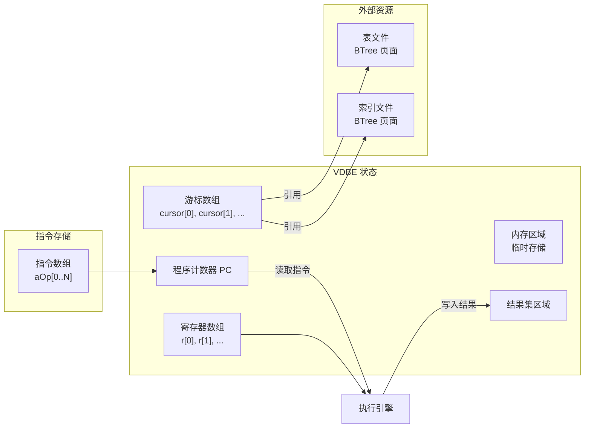
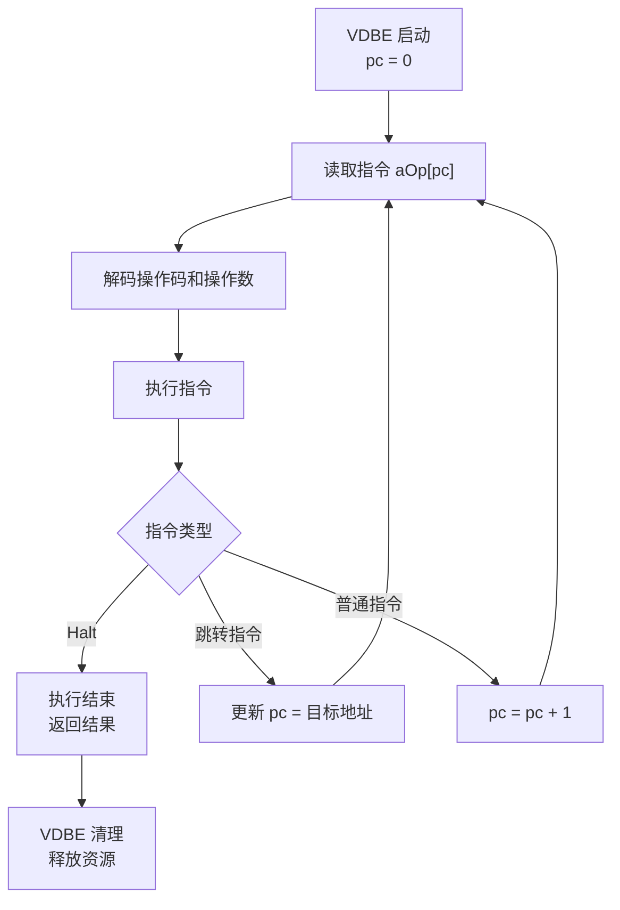
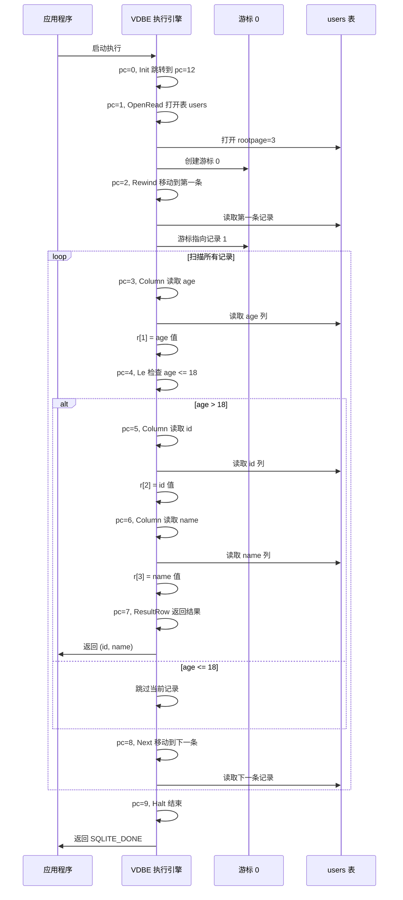
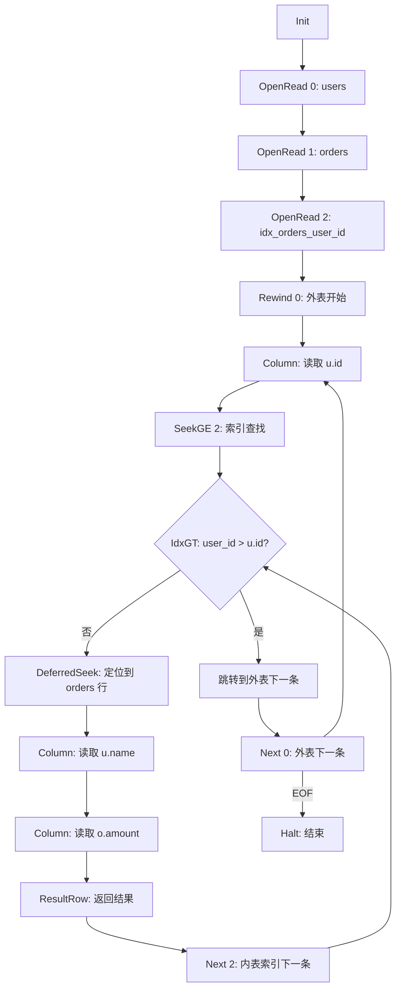
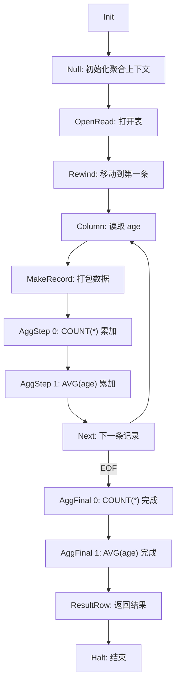
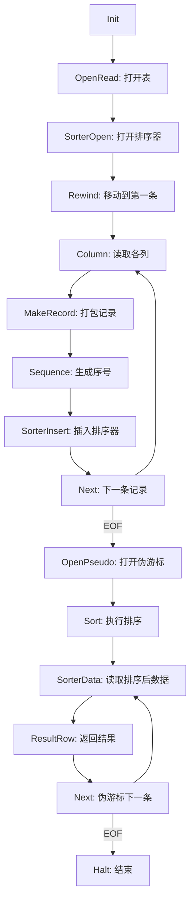

# SQLite3 执行器（VDBE 虚拟机）

## 学习目标

1. 深入理解 SQLite3 VDBE 虚拟机的寄存器架构与执行循环
2. 掌握核心 VDBE 指令的类型与语义
3. 能够手动执行一个完整查询的 VDBE 字节码追踪
4. 对比 SQLite VDBE 与 PostgreSQL Volcano 模型的本质差异

## 核心概念

| 概念 | 说明 |
|------|------|
| VDBE | Virtual Database Engine，SQLite 的执行引擎，是一个基于寄存器的虚拟机 |
| 寄存器 | VDBE 的数据存储单元，可存储任意类型值 |
| 游标 | 指向表/索引的迭代器，用于遍历记录 |
| PC | Program Counter，程序计数器，指向当前执行的指令 |
| 指令 | VDBE 字节码的操作单元，包含操作码和操作数 |
| 内存单元 | VDBE 的内存区域，用于存储中间结果 |
| 执行循环 | Fetch-Decode-Execute 循环 |

## 主体内容

### 1. VDBE 是什么

VDBE（Virtual Database Engine）是 SQLite 的核心执行引擎。与传统数据库的 Volcano 迭代器模型不同，VDBE 是一个**基于寄存器的虚拟机**。

**VDBE 与传统执行模型的对比**：

| 维度 | Volcano 模型（PG/MySQL） | VDBE 模型（SQLite） |
|------|-------------------------|---------------------|
| 执行单元 | 算子树（迭代器链） | 字节码程序 |
| 数据流 | pull 模式，每个算子调用 next() | push 模式，指令主动处理数据 |
| 状态管理 | 分散在各算子中 | 集中在 VDBE 寄存器和游标 |
| 中间结果 | 通过函数参数传递 | 存储在寄存器中 |
| 控制流 | 函数调用栈 | 显式跳转指令 |
| 优化机会 | 算子边界处 | 全局优化（如循环融合） |

**VDBE 的核心优势**：

1. **紧凑性**：字节码程序体积小，适合嵌入式环境
2. **可移植性**：字节码跨平台，无需重新编译
3. **优化灵活性**：代码生成器可以自由重组指令，实现跨算子优化
4. **调试友好**：EXPLAIN 直接展示字节码，便于理解执行流程

### 2. VDBE 状态结构

VDBE 的核心状态由以下组件构成：

```c
struct Vdbe {
    Op *aOp;              // 指令数组（程序）
    int pc;               // 程序计数器
    Mem *aMem;            // 寄存器数组
    int nMem;             // 寄存器数量
    VdbeCursor **apCsr;   // 游标数组
    int nCursor;          // 游标数量
    Mem *pResultSet;      // 结果集寄存器起始位置
    int nResultColumn;    // 结果列数
    // ... 其他状态
};
```

**寄存器（Mem 结构）**：

```c
struct Mem {
    union {
        int i;            // 整数值
        double r;         // 浮点值
        char *z;          // 字符串值
        sqlite3_blob *pBlob; // BLOB 值
        // ... 其他类型
    } u;
    u16 flags;            // 类型标志
    int n;                // 字符串/BLOB 长度
    // ... 其他字段
};
```

**VDBE 状态示意图**：



### 3. 执行循环

VDBE 的核心是一个无限循环，不断取指令、解码、执行：



**简化的执行循环伪代码**：

```c
int sqlite3VdbeExec(Vdbe *p) {
    int pc = 0;
    Op *aOp = p->aOp;
    Mem *aMem = p->aMem;

    while (1) {
        Op *pOp = &aOp[pc];

        switch (pOp->opcode) {
            case OP_OpenRead:
                // 打开表/索引，创建游标
                break;
            case OP_Column:
                // 从当前行读取列值到寄存器
                break;
            case OP_Next:
                // 移动游标到下一行
                break;
            case OP_ResultRow:
                // 返回结果行给应用
                break;
            case OP_Halt:
                // 执行结束
                return SQLITE_DONE;
            // ... 其他指令
        }

        // 更新 PC
        if (pOp->opcode != OP_Jump) {
            pc++;
        }
    }
}
```

### 4. 核心 VDBE 指令分类

#### 4.1 表操作指令

| 指令 | 格式 | 说明 |
|------|------|------|
| OpenRead | P1=rootpage, P2=P, P3= | 打开表或索引，P1 是游标编号，P2 是 rootpage |
| OpenWrite | P1=rootpage, P2=P, P3= | 打开表或索引用于写入 |
| Close | P1=cursor | 关闭游标 |
| SeekGE | P1=cursor, P2=target, P3=reg | 在索引中查找 >= reg 的位置 |
| SeekGT | P1=cursor, P2=target, P3=reg | 在索引中查找 > reg 的位置 |
| SeekLE | P1=cursor, P2=target, P3=reg | 在索引中查找 <= reg 的位置 |
| SeekLT | P1=cursor, P2=target, P3=reg | 在索引中查找 < reg 的位置 |
| NoConflict | P1=cursor, P2=target, P3= | 检查是否存在冲突（UNIQUE 约束） |

#### 4.2 游标移动指令

| 指令 | 格式 | 说明 |
|------|------|------|
| Rewind | P1=cursor, P2=target, P3= | 将游标移动到第一条记录，空则跳转 |
| Last | P1=cursor, P2=target, P3= | 将游标移动到最后一条记录 |
| Next | P1=cursor, P2=target, P3= | 移动到下一条记录，EOF 则跳转 |
| Prev | P1=cursor, P2=target, P3= | 移动到上一条记录 |
| SeekEnd | P1=cursor | 将游标移动到末尾（用于插入） |

#### 4.3 数据访问指令

| 指令 | 格式 | 说明 |
|------|------|------|
| Column | P1=cursor, P2=column, P3=reg | 读取当前行的指定列到寄存器 |
| MakeRecord | P1=start_reg, P2=count, P3=result | 将多个寄存器打包成一个记录 |
| ResultRow | P1=start_reg, P2=count | 将寄存器范围作为结果行返回 |
| Affinity | P1=start_reg, P2=count, P3=affinity | 对寄存器应用类型亲和性 |

#### 4.4 算术与比较指令

| 指令 | 格式 | 说明 |
|------|------|------|
| Add | P1=r1, P2=r2, P3=result | result = r1 + r2 |
| Subtract | P1=r1, P2=r2, P3=result | result = r1 - r2 |
| Multiply | P1=r1, P2=r2, P3=result | result = r1 × r2 |
| Divide | P1=r1, P2=r2, P3=result | result = r1 / r2 |
| Eq | P1=r1, P2=target, P3=r2 | 如果 r1 == r2，跳转到 target |
| Ne | P1=r1, P2=target, P3=r2 | 如果 r1 != r2，跳转到 target |
| Lt | P1=r1, P2=target, P3=r2 | 如果 r1 < r2，跳转到 target |
| Le | P1=r1, P2=target, P3=r2 | 如果 r1 <= r2，跳转到 target |
| Gt | P1=r1, P2=target, P3=r2 | 如果 r1 > r2，跳转到 target |
| Ge | P1=r1, P2=target, P3=r2 | 如果 r1 >= r2，跳转到 target |

#### 4.5 聚合指令

| 指令 | 格式 | 说明 |
|------|------|------|
| AggStep | P1=func, P2=reg, P3=agg_ctx | 执行一步聚合（如累加） |
| AggFinal | P1=agg_ctx, P2=reg, P3=func | 完成聚合，输出结果到寄存器 |
| AggValue | P1=agg_ctx, P2=reg, P3= | 将聚合上下文值移动到寄存器 |

#### 4.6 排序指令

| 指令 | 格式 | 说明 |
|------|------|------|
| Sort | P1=cursor | 对游标指向的数据排序 |
| SorterInsert | P1=cursor, P2=reg | 向排序器插入记录 |
| SorterData | P1=cursor, P2=reg | 从排序器读取数据 |
| SorterCompare | P1=cursor, P2=target, P3=reg | 比较排序器中的值 |
| SorterOpen | P1=cursor, P2=P | 打开排序器 |

#### 4.7 事务指令

| 指令 | 格式 | 说明 |
|------|------|------|
| Transaction | P1=db, P2=wrflag | 开始事务 |
| Commit | P1=db, P2= | 提交事务 |
| AutoCommit | P1=db, P2=autocommit | 设置自动提交模式 |
| Checkpoint | P1=db, P2=mode | 执行检查点 |

### 5. 完整查询执行追踪

**查询**：`SELECT id, name FROM users WHERE age > 18`

**EXPLAIN 输出**：

```
addr  opcode         p1    p2    p3    p4
----  -------------  ----  ----  ----  ---------
0     Init           0     12    0     -- 初始化，跳转到 Halt
1     OpenRead       0     3     0     -- 打开表 users（rootpage=3）
2     Rewind         0     11    0     -- 移动到第一条记录，空则跳转
3     Column         0     2     1     -- 读取 age 列到寄存器 r[1]
4     Le             0     10    18    -- if r[1] <= 18, 跳转到地址 10
5     Column         0     0     2     -- 读取 id 列到寄存器 r[2]
6     Column         0     1     3     -- 读取 name 列到寄存器 r[3]
7     ResultRow      2     2     0     -- 返回 r[2..3] 作为结果行
8     Next           0     3     0     -- 移动到下一条记录，EOF 则跳转
9     Halt           0     0     0     -- 结束
10    Next           0     3     0     -- 移动到下一条记录
11    Halt           0     0     0     -- 结束
12    Noop           0     0     0     -- 程序入口
```

**执行追踪**：



### 6. 嵌套循环连接的 VDBE 执行

**查询**：`SELECT u.name, o.amount FROM users u JOIN orders o ON u.id = o.user_id`

**EXPLAIN 输出**：

```
addr  opcode         p1    p2    p3    p4
----  -------------  ----  ----  ----  ---------
0     Init           0     18    0
1     OpenRead       0     3     0     -- 打开表 users（rootpage=3）
2     OpenRead       1     5     0     -- 打开表 orders（rootpage=5）
3     OpenRead       2     7     0     -- 打开索引 idx_orders_user_id（rootpage=7）
4     Rewind         0     17    0     -- 外表 users 开始扫描
5     Column         0     0     1     -- 读取 u.id 到 r[1]
6     SeekGE         2     16    1     -- 在索引中查找 user_id >= r[1]
7     IdxGT          2     16    1     -- 检查 user_id > r[1]，则跳转
8     DeferredSeek   2     1     0     -- 从索引定位到 orders 表行
9     Column         0     1     2     -- 读取 u.name 到 r[2]
10    Column         1     2     3     -- 读取 o.amount 到 r[3]
11    ResultRow      2     2     0     -- 返回 (u.name, o.amount)
12    Next           2     7     0     -- 内表索引下一条
13    Prev           0     5     0     -- 外表下一条（循环回退）
14    Next           0     5     0     -- 外表下一条
15    Halt           0     0     0
16    Close          2     0     0
17    Halt           0     0     0
```

**嵌套循环 VDBE 流程图**：



### 7. 聚合执行流程

**查询**：`SELECT COUNT(*), AVG(age) FROM users`

**EXPLAIN 输出**：

```
addr  opcode         p1    p2    p3    p4
----  -------------  ----  ----  ----  ---------
0     Init           0     15    0
1     Null           0     1     2     -- 初始化 r[1]=NULL, r[2]=NULL
2     OpenRead       0     3     0     -- 打开表 users
3     Rewind         0     13    0     -- 移动到第一条
4     Column         0     2     3     -- 读取 age 到 r[3]
5     MakeRecord     3     1     4     -- 打包 age 到 r[4]
6     AggStep        0     4     1     -- COUNT(*) 累加
7     AggStep        1     3     2     -- AVG(age) 累加
8     Next           0     4     0     -- 下一条记录
9     AggFinal       0     1     5     -- COUNT(*) 完成，r[5] = count
10    AggFinal       1     2     6     -- AVG(age) 完成，r[6] = avg
11    ResultRow      5     2     0     -- 返回 (count, avg)
12    Halt           0     0     0
```

**聚合执行流程**：



### 8. 排序执行流程

**查询**：`SELECT * FROM users ORDER BY age DESC`

**EXPLAIN 输出**：

```
addr  opcode         p1    p2    p3    p4
----  -------------  ----  ----  ----  ---------
0     Init           0     15    0
1     OpenRead       0     3     0     -- 打开表 users
2     SorterOpen     1     0     0     -- 打开排序器
3     Rewind         0     11    0     -- 移动到第一条
4     Column         0     0     1     -- 读取 id
5     Column         0     1     2     -- 读取 name
6     Column         0     2     3     -- 读取 age
7     MakeRecord     1     3     4     -- 打包 (id, name, age)
8     Sequence       0     5     0     -- 生成序号（用于稳定排序）
9     SorterInsert   1     4     0     -- 插入排序器
10    Next           0     4     0     -- 下一条记录
11    OpenPseudo     2     4     3     -- 打开伪游标（读取排序结果）
12    Sort           1     0     0     -- 执行排序
13    SorterData     1     4     2     -- 读取排序后的数据
14    ResultRow      4     3     0     -- 返回结果
15    Next           2     13    0     -- 伪游标下一条
16    Halt           0     0     0
```

**排序执行流程**：



### 9. 三大数据库执行模型对比

| 维度 | PostgreSQL Volcano | MySQL | SQLite VDBE |
|------|-------------------|-------|-------------|
| 执行模型 | 迭代器模型（Volcano） | 混合模型 | 寄存器虚拟机 |
| 数据流 | Pull 模式 | Push + Pull | Push 模式 |
| 状态存储 | 分散在各算子 | 分散在各算子 | 集中在寄存器 |
| 中间结果 | 函数参数传递 | 内存区域 | 寄存器传递 |
| 控制流 | 函数调用栈 | 函数调用 + 跳转 | 显式跳转指令 |
| 优化边界 | 算子边界 | 算子边界 | 全局优化 |
| JIT 编译 | 支持（LLVM） | 不支持 | 不支持 |
| 并行执行 | 支持并行算子 | 部分支持 | 不支持 |
| 向量化执行 | 支持 | 不支持 | 不支持 |
| 内存管理 | 上下文机制 | 内存池 | 寄存器自动管理 |

**关键差异总结**：

1. **Volcano 模型**：每个算子是一个迭代器，通过 `next()` 调用拉取数据，适合复杂查询和并行执行
2. **VDBE 模型**：所有执行逻辑扁平化为字节码，适合嵌入式场景和紧凑代码
3. **SQLite 无 JIT**：VDBE 是解释执行，没有即时编译优化，但代码体积小
4. **SQLite 无并行**：VDBE 是单线程执行，无法利用多核（PG 支持并行扫描、并行连接）

## 要点总结

1. **VDBE 是寄存器虚拟机**：与 Volcano 迭代器模型本质不同，基于 push 数据流和显式跳转
2. **核心状态：PC + 寄存器 + 游标**：所有执行状态集中管理，而非分散在算子中
3. **指令集丰富**：涵盖表操作、游标移动、数据访问、算术比较、聚合、排序、事务等
4. **嵌套循环是唯一连接方式**：VDBE 不支持哈希连接和归并连接
5. **ResultRow 是唯一输出点**：结果通过回调返回应用程序，非 pull 模式
6. **EXPLAIN 输出字节码**：可直接看到 VDBE 指令，便于理解执行流程

## 思考题

1. VDBE 的寄存器架构与栈式虚拟机（如 JVM）相比，有什么优势和劣势？为什么 SQLite 选择寄存器架构？
2. 如果要在 VDBE 中支持哈希连接，需要新增哪些指令？如何与现有嵌套循环指令配合？
3. VDBE 的 ResultRow 指令通过回调返回数据，这种设计与 PostgreSQL 的 Materialize 算子（物化中间结果）有什么性能差异？
4. SQLite 为什么不实现 JIT 编译？在什么场景下 JIT 会显著提升性能？
5. 对比 PostgreSQL 的并行执行能力，VDBE 的单线程执行在什么场景下会成为瓶颈？如果要让 SQLite 支持并行扫描，需要修改哪些组件？
