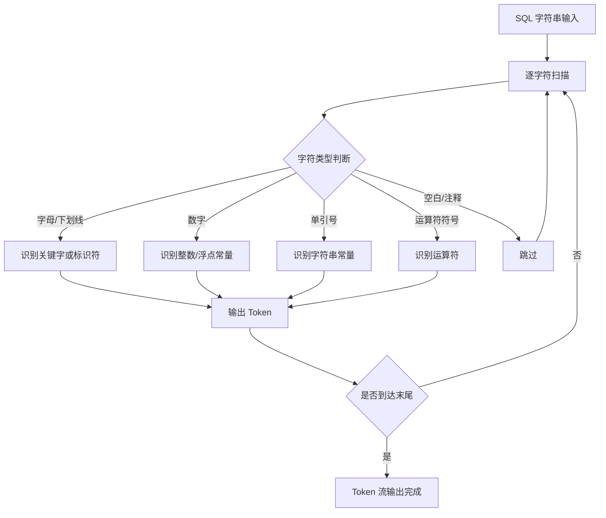
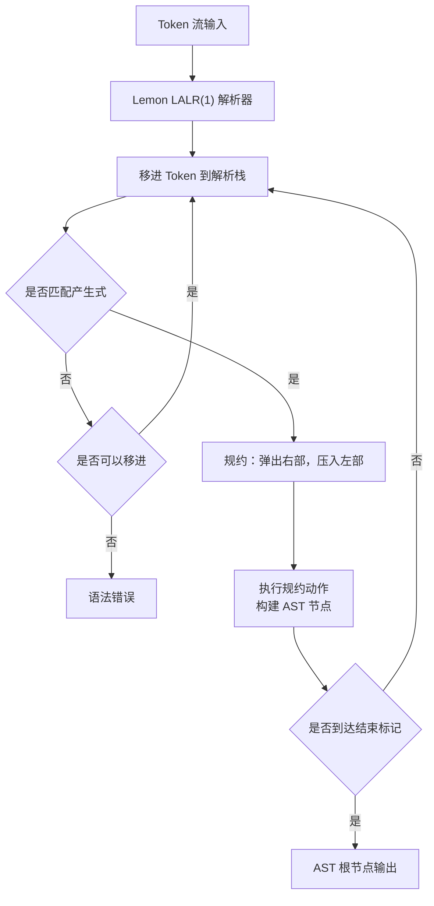
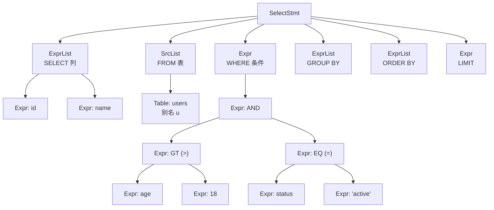
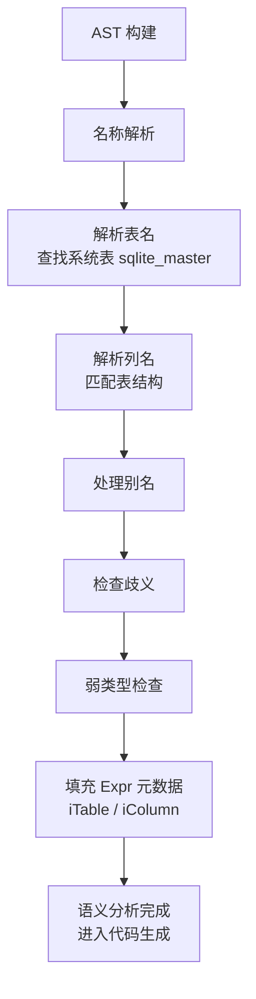

# SQLite3 解析器

## 学习目标

1. 理解 SQLite3 的 SQL 解析流水线：Tokenizer -> Parser -> AST
2. 掌握 Lemon 解析器生成器的特点与优势
3. 了解 AST 的核心结构及语义分析过程
4. 对比 SQLite、PostgreSQL、MySQL 三者的解析器架构差异

## 核心概念

| 概念 | 说明 |
|------|------|
| Tokenizer | 将 SQL 字符串拆分为 token 流（词法分析） |
| Lemon Parser | SQLite 专用的 LALR(1) 解析器生成器 |
| AST | 抽象语法树，解析器的输出结构 |
| 语义分析 | 名称解析、类型检查（弱类型） |
| 代码生成器 | 将 AST 转换为 VDBE 字节码（非独立优化阶段） |

## 主体内容

### 1. Tokenizer：SQL 字符串 -> Token 流

SQLite 的 Tokenizer 是手写的（非 flex 等工具生成），直接嵌入在 `tokenize.c` 中。

**核心职责**：
- 逐字符扫描 SQL 字符串
- 识别关键字（SELECT、FROM、WHERE 等）、标识符、常量、运算符
- 输出 token 流给 Parser

**Token 类型**：

| 类型 | 示例 | Token 值 |
|------|------|----------|
| 关键字 | SELECT, FROM, WHERE | TK_SELECT, TK_FROM, TK_WHERE |
| 标识符 | users, age | TK_ID |
| 整数常量 | 18, 100 | TK_INTEGER |
| 字符串常量 | 'hello' | TK_STRING |
| 运算符 | >, =, + | TK_GT, TK_EQ, TK_PLUS |
| 标点 | (, ), , | TK_LP, TK_RP, TK_COMMA |
| 星号 | * | TK_STAR |

**Tokenizer 处理流程**：



**示例：Tokenize "SELECT * FROM users WHERE age > 18"**

```
输入: SELECT * FROM users WHERE age > 18

Token 流:
  TK_SELECT  "SELECT"
  TK_STAR    "*"
  TK_FROM    "FROM"
  TK_ID      "users"
  TK_WHERE   "WHERE"
  TK_ID      "age"
  TK_GT      ">"
  TK_INTEGER "18"
```

### 2. Lemon 解析器生成器

Lemon 是 SQLite 作者 D. Richard Hipp 开发的 LALR(1) 解析器生成器，是 SQLite 解析器的核心工具。

**Lemon 与 YACC/Bison 的关键区别**：

| 特性 | Lemon | YACC/Bison |
|------|-------|------------|
| 全局状态 | 无全局状态，可重入 | 使用全局变量 yylval |
| 线程安全 | 天然线程安全 | 需要额外处理 |
| 错误消息 | 更友好的错误提示 | 较简略的错误提示 |
| 文法规则 | `%left` 等声明在文法文件中 | 声明在单独的声明段 |
| 栈溢出 | 自动检测并恢复 | 可能导致崩溃 |
| 生成代码 | 更干净、可读性更好 | 包含大量模板代码 |
| 解析器接口 | 通过回调函数传递结果 | 通过全局变量传递 |

**Lemon 的核心优势**：
1. **可重入性**：解析器不依赖任何全局状态，多个解析器实例可同时运行
2. **更好的错误处理**：当语法错误发生时，Lemon 能提供更精确的错误位置和提示
3. **内存安全**：自动检测解析栈溢出，不会因深度递归而崩溃
4. **代码质量**：生成的 C 代码更简洁，便于嵌入和调试

**Lemon 文法文件结构**（`parse.y`）：

```
// 声明段
%left OR.
%left AND.
%left EQ NE.
%left LT GT LE GE.
%left PLUS MINUS.

// 文法规则段
cmd ::= select.
select ::= SELECT selcollist FROM tablelist where_opt.

where_opt ::= .
where_opt ::= WHERE expr.

expr ::= expr AND expr.
expr ::= expr OR expr.
expr ::= expr LT expr.
expr ::= expr GT expr.
expr ::= INTEGER.
expr ::= ID.
```

**Parser 处理流程**：



### 3. AST 结构

SQLite 的 AST 由多个核心节点类型组成，定义在 `parse.y` 的规约动作中。

**核心 AST 节点类型**：

| 节点类型 | 对应结构体 | 说明 |
|----------|-----------|------|
| SelectStmt | Select | SELECT 语句 |
| InsertStmt | Insert | INSERT 语句 |
| UpdateStmt | Update | UPDATE 语句 |
| DeleteStmt | Delete | DELETE 语句 |
| CreateTable | CreateTable | CREATE TABLE 语句 |
| Expr | Expr | 表达式（通用） |
| SrcList | SrcList | FROM 子句的表列表 |
| IdList | IdList | 标识符列表 |
| ColumnDef | Column | 列定义 |

**SelectStmt 结构**：

```c
struct Select {
    ExprList *pEList;      // SELECT 列列表
    SrcList *pSrc;         // FROM 子句
    Expr *pWhere;          // WHERE 子句
    ExprList *pGroupBy;    // GROUP BY 子句
    Expr *pHaving;         // HAVING 子句
    ExprList *pOrderBy;    // ORDER BY 子句
    Select *pPrior;        // 前一个 SELECT（复合查询）
    Expr *pLimit;          // LIMIT 子句
    Expr *pOffset;         // OFFSET 子句
    int op;                // 复合查询类型（UNION, INTERSECT 等）
};
```

**Expr 结构**（通用表达式节点）：

```c
struct Expr {
    int op;                // 运算符类型（TK_AND, TK_OR, TK_GT 等）
    Expr *pLeft;           // 左子表达式
    Expr *pRight;          // 右子表达式
    ExprList *pList;       // 函数参数列表
    Token token;           // 原始 token
    int iTable;            // 所属表的索引（语义分析填充）
    int iColumn;           // 所属列的索引（语义分析填充）
    AggInfo *pAggInfo;     // 聚合信息
};
```

**AST 结构示意图**：



### 4. 语义分析

语义分析在 AST 构建后、代码生成前执行，主要完成以下任务：

**名称解析**：
- 将标识符绑定到具体的表和列
- 处理表别名（`SELECT u.name FROM users u`）
- 检查列名歧义（多表同名列）
- 填充 `Expr.iTable` 和 `Expr.iColumn`

**类型检查（弱类型）**：
- SQLite 是动态类型系统，类型检查非常宽松
- 不强制类型匹配，运行时自动转换
- 仅检查明显的类型错误（如对非聚合函数使用 HAVING）

**语义分析流程**：



### 5. 完整解析示例

**输入 SQL**：`SELECT * FROM users WHERE age > 18`

**Step 1: Tokenize**

```
TK_SELECT  →  TK_STAR  →  TK_FROM  →  TK_ID("users")  →  TK_WHERE  →  TK_ID("age")  →  TK_GT  →  TK_INTEGER("18")
```

**Step 2: Parse（Lemon 规约过程）**

```
1. 移进 TK_SELECT
2. 移进 TK_STAR
3. 移进 TK_FROM
4. 移进 TK_ID("users")
5. 规约: TK_ID → table_name
6. 规约: table_name → tablelist
7. 移进 TK_WHERE
8. 移进 TK_ID("age")
9. 规约: TK_ID → expr
10. 移进 TK_GT
11. 移进 TK_INTEGER("18")
12. 规约: TK_INTEGER → expr
13. 规约: expr GT expr → expr
14. 规约: WHERE expr → where_opt
15. 规约: SELECT STAR FROM tablelist where_opt → select
16. 规约: select → cmd
```

**Step 3: AST 输出**

```
SelectStmt:
  pEList: [Expr(STAR)]
  pSrc:   [SrcList(Table: "users")]
  pWhere: Expr(GT, left=Expr(ID:"age"), right=Expr(INTEGER:18))
```

### 6. 三大数据库解析器对比

| 维度 | SQLite Lemon | PostgreSQL flex/bison | MySQL |
|------|-------------|----------------------|-------|
| 词法分析器 | 手写 Tokenizer | flex 生成 | 手写 Lexer |
| 语法分析器 | Lemon 生成 | bison 生成 | 手写 + YACC |
| 可重入性 | 天然可重入 | 需要额外处理 | 部分可重入 |
| 错误消息 | 友好、精确 | 标准 bison 错误 | 自定义错误处理 |
| AST 表示 | C 结构体 | bison 联合体 | AST 节点类 |
| 优化器集成 | 无独立阶段，代码生成时优化 | 独立优化器阶段 | 独立优化器阶段 |
| 线程安全 | 天然安全 | 需要封装 | 部分安全 |
| 文法文件 | parse.y | gram.y | sql_yacc.yy |
| 生成代码量 | 较小 | 中等 | 较大 |

**关键差异总结**：
- **SQLite**：解析与优化紧密耦合，没有独立的优化器阶段，解析后直接进入代码生成
- **PostgreSQL**：经典三阶段架构（解析 -> 分析 -> 优化），flex/bison 生成，有独立的语义分析和查询优化阶段
- **MySQL**：混合架构，手写词法分析 + YACC 语法分析，有独立的优化器但实现较简单

## 要点总结

1. **Tokenizer 是手写的**：SQLite 没有使用 flex 等工具，而是手写了一个高效的词法分析器
2. **Lemon 是核心**：Lemon 解析器生成器是 SQLite 的独特选择，提供可重入、线程安全、友好错误消息
3. **AST 即时构建**：Lemon 在规约时直接构建 AST 节点，而非先构建解析树再转换
4. **弱类型语义**：SQLite 的语义分析非常宽松，类型检查在运行时完成
5. **无独立优化阶段**：与 PG/MySQL 不同，SQLite 的"优化"发生在代码生成阶段，没有独立的查询优化器

## 思考题

1. 为什么 SQLite 选择 Lemon 而不是广泛使用的 YACC/Bison？可重入性在嵌入式场景中有什么特殊价值？
2. SQLite 的弱类型系统对解析器的语义分析有什么影响？与 PostgreSQL 的强类型系统相比，各有什么优劣？
3. 如果要在 SQLite 中添加一个新的 SQL 语法（如 WINDOW FUNCTION），需要修改哪些文件？修改流程是什么？
4. Lemon 的 LALR(1) 限制对 SQLite 的 SQL 语法设计有什么约束？是否存在无法用 LALR(1) 表达的 SQL 语法？
5. 对比 PostgreSQL 的三阶段解析架构（解析 -> 分析 -> 优化），SQLite 将优化融入代码生成的设计有什么优势和劣势？
