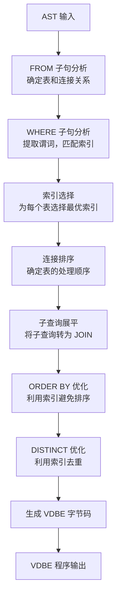
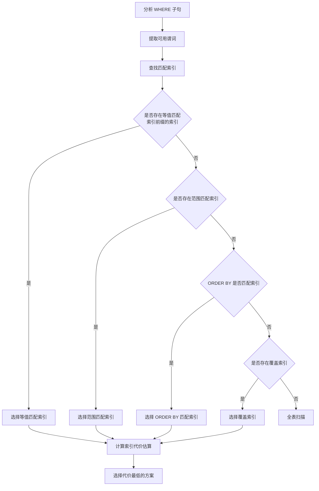
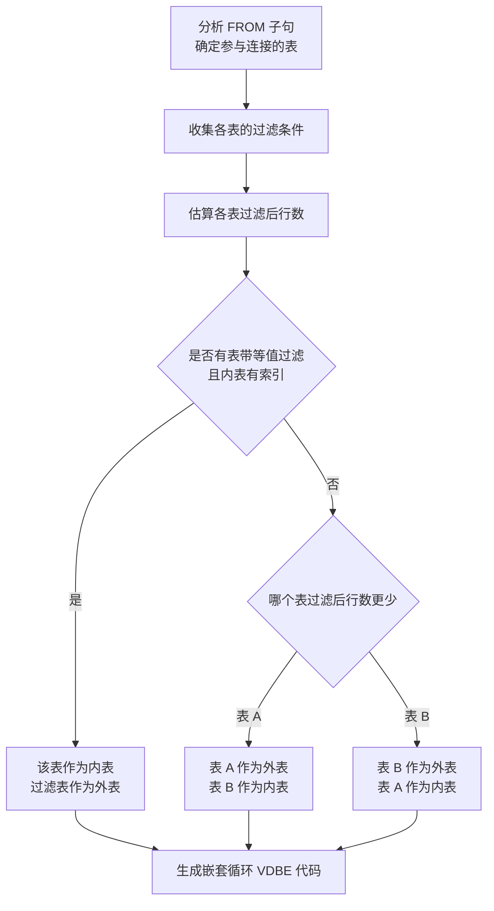
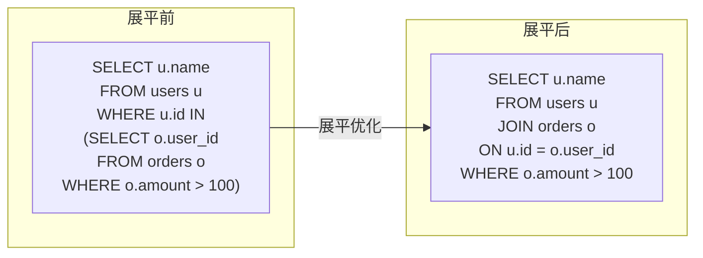
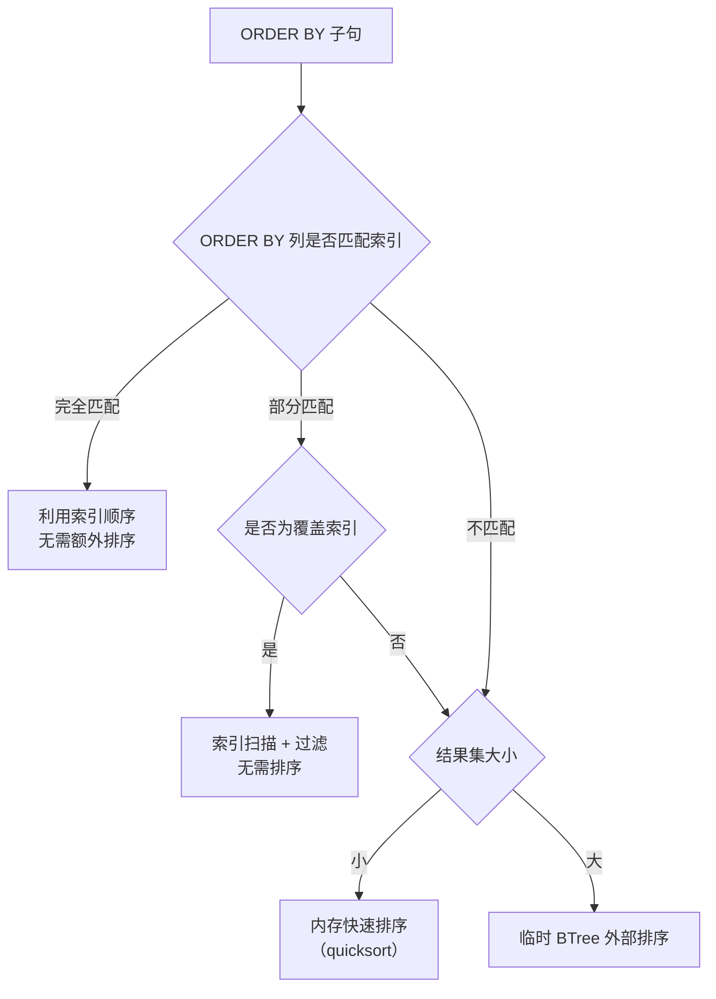

# SQLite3 查询规划器

## 学习目标

1. 理解 SQLite3 查询规划器的独特架构：优化融入代码生成，无独立优化阶段
2. 掌握索引选择、连接排序、子查询展平的核心策略
3. 了解 DISTINCT/ORDER BY/LIMIT 等优化手段
4. 对比 SQLite 启发式规划与 PostgreSQL 代价优化的本质差异

## 核心概念

| 概念 | 说明 |
|------|------|
| 代码生成即优化 | SQLite 没有独立优化器，优化决策在生成 VDBE 字节码时做出 |
| 启发式规划 | 基于规则而非统计信息的查询规划 |
| 索引选择 | 根据 WHERE 谓词和 ORDER BY 选择最优索引 |
| 连接排序 | 启发式：小表驱动大表，左深树 |
| 子查询展平 | 将子查询转换为 JOIN 以提升性能 |
| 覆盖索引 | 索引包含所有查询列，避免回表 |
| EXPLAIN | 输出 VDBE 字节码，展示查询计划 |

## 主体内容

### 1. 无独立优化器：代码生成即优化

SQLite 的查询规划与 PostgreSQL/MySQL 有本质区别——**没有独立的优化器阶段**。

**传统数据库的三阶段架构**：
```
解析 -> 优化（独立阶段）-> 执行
```

**SQLite 的两阶段架构**：
```
解析 -> 代码生成（优化在此完成）-> VDBE 执行
```

**代码生成器流程**：



**为什么 SQLite 不需要独立优化器**：
1. **嵌入式场景**：SQLite 运行在应用进程内，优化开销直接影响应用响应
2. **简单查询为主**：大多数 SQLite 查询较简单，复杂优化收益有限
3. **无统计信息**：SQLite 不维护表级统计信息（如 PG 的 pg_statistic），无法做代价估算
4. **代码体积约束**：独立优化器会增加代码体积，违背 SQLite 轻量设计哲学

### 2. 索引选择

索引选择是 SQLite 查询规划最核心的决策，发生在代码生成阶段。

**索引选择依据**：

| 依据 | 说明 | 优先级 |
|------|------|--------|
| WHERE 等值谓词 | `col = value`，精确匹配索引前缀 | 最高 |
| WHERE 范围谓词 | `col > value`、`col BETWEEN` | 高 |
| ORDER BY 匹配 | 索引顺序与 ORDER BY 一致 | 中 |
| 覆盖索引 | 索引包含所有查询列 | 中 |
| WHERE IN 谓词 | `col IN (values)` | 低 |

**索引选择流程**：



**索引代价估算**（非统计信息，基于启发式）：

SQLite 使用简单的启发式规则估算代价，而非 PG 那样的统计信息驱动：

```
代价 ≈ 估计扫描行数 × 常数

等值查询: 估计行数 ≈ 总行数 / distinct值数量（来自索引元数据）
范围查询: 估计行数 ≈ 总行数 / 3（启发式假设）
全表扫描: 估计行数 = 总行数
```

**索引选择示例**：

```sql
-- 表: users(id INTEGER PRIMARY KEY, name TEXT, age INTEGER, email TEXT)
-- 索引: idx_age ON users(age), idx_name_age ON users(name, age)

-- 查询 1: 等值匹配 -> 选择 idx_age
SELECT * FROM users WHERE age = 25;

-- 查询 2: 复合索引前缀匹配 -> 选择 idx_name_age
SELECT * FROM users WHERE name = 'Alice' AND age > 20;

-- 查询 3: ORDER BY 匹配 -> 选择 idx_name_age（避免排序）
SELECT * FROM users ORDER BY name, age;

-- 查询 4: 无匹配索引 -> 全表扫描
SELECT * FROM users WHERE email = 'a@b.com';
```

**EXPLAIN 输出解读**：

```sql
EXPLAIN SELECT * FROM users WHERE age = 25;
```

```
addr  opcode         p1    p2    p3    p4
----  -------------  ----  ----  ----  ---------
0     OpenRead       0     3     0     -- 打开表 users（rootpage=3）
1     OpenRead       1     4     0     -- 打开索引 idx_age（rootpage=4）
2     SeekGE         1     7     1     -- 在索引中查找 age >= 25
3     IdxGT          1     7     1     -- 检查 age > 25 则跳转
4     DeferredSeek   1     0     0     -- 从索引定位到表行
5     Column         0     0     0     -- 读取 id
6     Column         0     1     0     -- 读取 name
7     Column         0     2     0     -- 读取 age
8     ResultRow      5     3     0     -- 返回结果行
9     Next           1     3     0     -- 索引下一条
10    Halt           0     0     0     -- 结束
```

### 3. 连接排序

SQLite 只支持嵌套循环连接（Nested Loop Join），连接排序决定了哪个表作为外表（驱动表）。

**连接排序启发式规则**：

1. **小表驱动大表**：行数少的表作为外表
2. **有索引的表作为内表**：内表可以利用索引快速查找
3. **WHERE 过滤多的表优先**：过滤后行数少的表作为外表
4. **左深树**：只考虑左深连接树，不考虑 bushy tree

**连接排序决策树**：



**连接排序示例**：

```sql
-- orders 有 10000 行，users 有 100 行
-- idx_orders_user_id ON orders(user_id)

SELECT u.name, o.amount
FROM users u, orders o
WHERE u.id = o.user_id AND u.age > 18;
```

**SQLite 的选择**：
- users 过滤后约 50 行（age > 18 过滤一半）
- orders 有索引 idx_orders_user_id
- **决策**：users 作为外表，orders 作为内表（利用索引查找）

**EXPLAIN 输出**：

```
0   OpenRead       0    5     0     -- 打开 users 表
1   OpenRead       1    6     0     -- 打开 orders 表
2   OpenRead       2    7     0     -- 打开 idx_orders_user_id
3   Rewind         0    12    0     -- 外表 users 开始扫描
4   Column         0    2     0     -- 读取 age
5   GT             0    11    18    -- age > 18?
6   Column         0    0     0     -- 读取 id
7   SeekGE         2    11    0     -- 索引查找 orders.user_id
8   IdxGT          2    11    0     -- 检查 user_id 匹配
9   Column         1    2     0     -- 读取 amount
10  ResultRow      ...   ...   ...  -- 返回结果
11  Next           2    8     0     -- 内表下一条
12  Next           0    4     0     -- 外表下一条
```

### 4. 子查询展平

子查询展平（Subquery Flattening）是 SQLite 最重要的优化之一，将相关子查询转换为 JOIN。

**展平条件**（必须全部满足）：

1. 子查询是 SELECT 语句（非 UNION/INTERSECT 等）
2. 子查询没有使用聚合函数
3. 子查询没有 DISTINCT
4. 子查询没有 LIMIT/OFFSET
5. 外查询没有使用聚合函数
6. 子查询的 FROM 子句不是递归 CTE
7. 展平后不会导致结果集变化

**子查询展平示例**：



**展平前后 VDBE 对比**：

| 维度 | 展平前（子查询） | 展平后（JOIN） |
|------|-----------------|---------------|
| 扫描次数 | 外表每行执行一次子查询 | 一次嵌套循环 |
| 索引利用 | 子查询可利用索引 | JOIN 可利用索引 |
| 时间复杂度 | O(N × M) | O(N × log M)（有索引时） |
| 内存使用 | 需要存储子查询中间结果 | 流式处理 |

**不可展平的子查询**：

```sql
-- 有聚合函数，不可展平
SELECT u.name, (SELECT COUNT(*) FROM orders o WHERE o.user_id = u.id)
FROM users u;

-- 有 DISTINCT，不可展平
SELECT * FROM users WHERE id IN (SELECT DISTINCT user_id FROM orders);

-- 有 LIMIT，不可展平
SELECT * FROM users WHERE id IN (SELECT user_id FROM orders LIMIT 10);
```

### 5. DISTINCT 优化

**优化策略**：

1. **索引去重**：如果 SELECT 列与某个唯一索引的列完全匹配，DISTINCT 可省略
2. **排序去重**：先排序，再去除相邻重复行
3. **临时 BTree 去重**：使用临时 BTree 记录已见行

```sql
-- 优化：id 是主键（唯一），DISTINCT 自动省略
SELECT DISTINCT id FROM users;

-- 优化：idx_name 是唯一索引，DISTINCT 自动省略
SELECT DISTINCT name FROM users WHERE name IS NOT NULL;

-- 无优化：需要临时 BTree 去重
SELECT DISTINCT age FROM users;
```

### 6. ORDER BY 优化

**优化策略**：

1. **索引排序**：如果 ORDER BY 列与索引顺序一致，利用索引避免排序
2. **覆盖索引排序**：索引包含 ORDER BY 列和 SELECT 列，无需回表
3. **外部排序**：结果集较大时使用临时 BTree 排序

```sql
-- 优化：idx_name_age 与 ORDER BY 一致，无需排序
SELECT name, age FROM users ORDER BY name, age;

-- 优化：覆盖索引，无需回表和排序
SELECT name FROM users ORDER BY name;

-- 无优化：需要排序
SELECT * FROM users ORDER BY email;
```

**排序方式选择**：



### 7. 无代价优化的影响

SQLite 不维护统计信息，无法像 PostgreSQL 那样做精确的代价估算。

**SQLite 的代价估算方式**：

| 信息来源 | 说明 |
|----------|------|
| 索引元数据 | 索引的列数、唯一性 |
| 页面数量 | 表/索引的磁盘页面数（近似行数） |
| 启发式假设 | 范围查询返回 1/3 行，等值查询返回 1/distinct 行 |

**与 PostgreSQL 代价优化的对比**：

| 维度 | SQLite | PostgreSQL |
|------|--------|------------|
| 统计信息 | 无（仅页面数和索引元数据） | 丰富（pg_statistic，MCV、直方图、相关性） |
| 代价模型 | 简单启发式 | CPU + IO 代价模型 |
| 连接算法 | 仅嵌套循环 | 嵌套循环、哈希连接、归并连接 |
| 连接排序 | 启发式 | 动态规划/遗传算法 |
| 索引选择 | 规则优先 | 代价优先 |
| 参数化计划 | 无 | 有（generic/custom plan） |
| 计划缓存 | 无（每次重新生成） | 有（prepared statement 缓存） |

**SQLite 规划器的局限**：

1. **无法处理数据倾斜**：不知道某些值出现频率远高于其他值
2. **连接算法单一**：只有嵌套循环，无法选择更优的哈希/归并连接
3. **无法自适应**：查询计划在编译时确定，运行时无法调整
4. **多列相关性未知**：不知道两列是否相关，可能低估/高估选择性

### 8. EXPLAIN 与 EXPLAIN QUERY PLAN

**EXPLAIN**：输出 VDBE 字节码（详细）

```sql
EXPLAIN SELECT * FROM users WHERE age > 18;
```

**EXPLAIN QUERY PLAN**：输出高级查询计划（简洁）

```sql
EXPLAIN QUERY PLAN SELECT * FROM users WHERE age > 18;
```

```
QUERY PLAN
`--SCAN users
```

```sql
EXPLAIN QUERY PLAN SELECT * FROM users WHERE age = 18;
```

```
QUERY PLAN
`--SEARCH users USING INDEX idx_age (age=?)
```

```sql
EXPLAIN QUERY PLAN SELECT u.name, o.amount
FROM users u
JOIN orders o ON u.id = o.user_id;
```

```
QUERY PLAN
|--SCAN users u
`--SEARCH orders o USING INDEX idx_orders_user_id (user_id=?)
```

**EXPLAIN QUERY PLAN 输出解读**：

| 关键字 | 含义 |
|--------|------|
| SCAN table | 全表扫描 |
| SEARCH table USING INDEX | 索引查找 |
| USING COVERING INDEX | 覆盖索引（不回表） |
| USING INDEX idx FOR ORDER-BY | 利用索引排序 |
| TEMP B-TREE FOR ORDER BY | 临时 BTree 排序 |
| TEMP B-TREE FOR DISTINCT | 临时 BTree 去重 |
| SUBQUERY | 子查询（未展平） |

## 要点总结

1. **无独立优化器**：SQLite 的优化融入代码生成，这是嵌入式数据库的合理选择
2. **启发式规划**：基于规则而非统计信息，简单但可能不够精确
3. **索引选择是核心**：等值匹配 > 范围匹配 > ORDER BY 匹配 > 覆盖索引
4. **子查询展平是关键优化**：将 IN 子查询转为 JOIN，大幅提升性能
5. **只有嵌套循环连接**：这是最大的局限，大数据量连接性能受限
6. **EXPLAIN 输出 VDBE 字节码**：与 PG 的计划树输出形式完全不同

## 思考题

1. 为什么 SQLite 选择不维护统计信息？在嵌入式场景中，统计信息的维护成本和收益如何权衡？
2. 如果 SQLite 要支持哈希连接，需要修改哪些模块？VDBE 需要增加哪些指令？
3. 子查询展平的条件中，为什么有聚合函数的子查询不能展平？如果强行展平会导致什么问题？
4. 在没有统计信息的情况下，SQLite 如何估算"过滤后行数"？这种估算在什么场景下会严重偏离实际？
5. 对比 PostgreSQL 的动态规划连接排序和 SQLite 的启发式排序，在 3 表连接的场景下，两者可能产生多大的性能差异？
