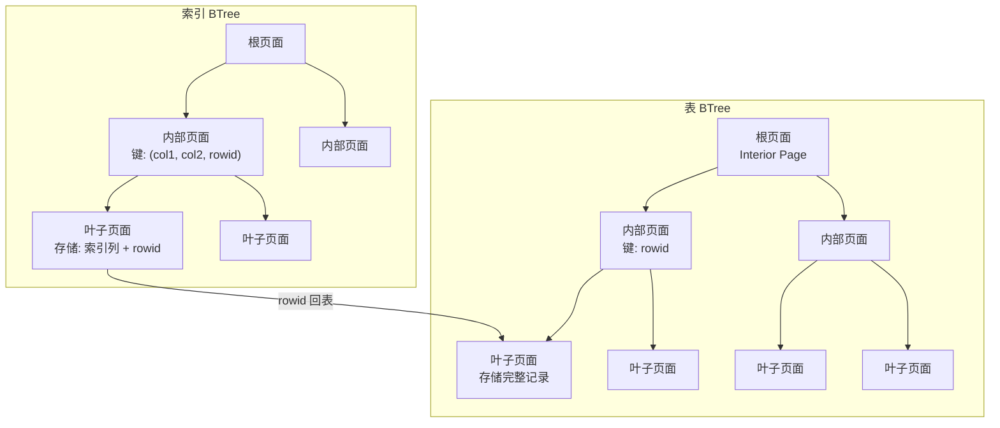
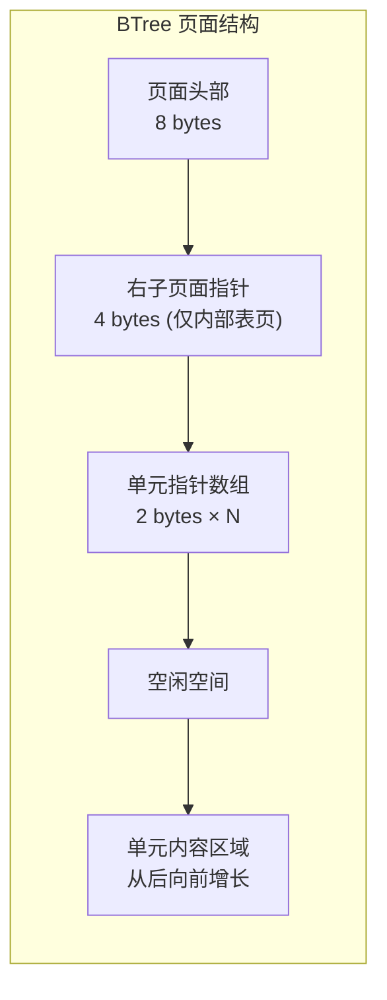
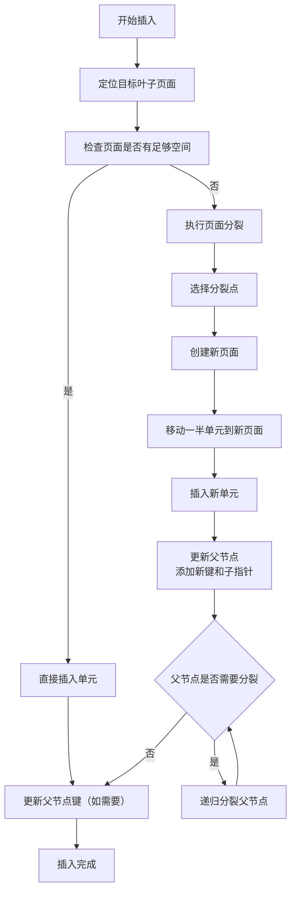
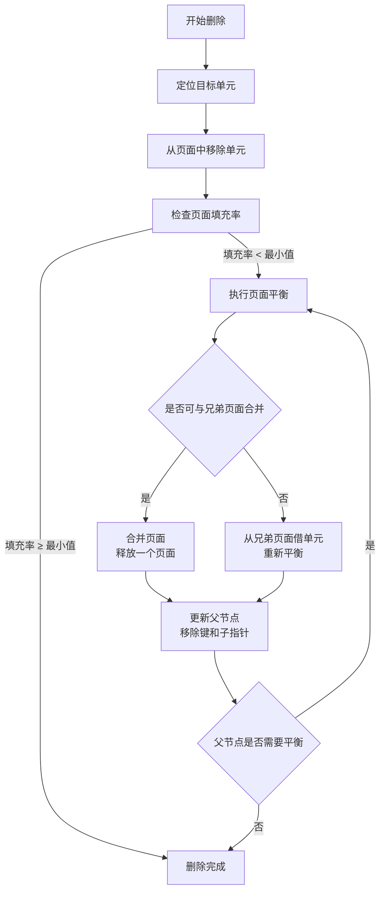
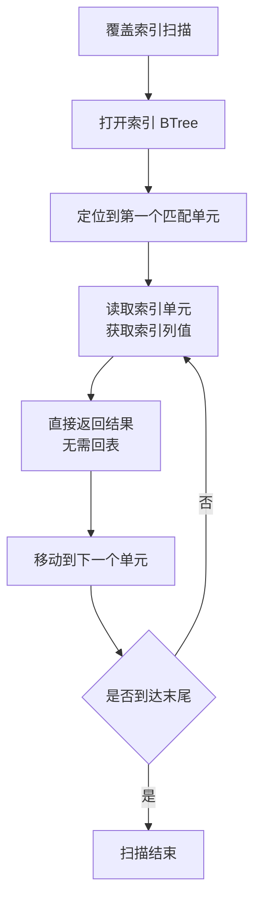

# SQLite3 BTree 索引

## 学习目标

1. 深入理解 SQLite3 的 BTree 存储结构：表 BTree 与索引 BTree 的区别
2. 掌握 BTree 页面结构、单元格式、溢出处理机制
3. 了解插入、删除、平衡操作的核心流程
4. 理解覆盖索引、部分索引、表达式索引等高级特性
5. 对比 SQLite、PostgreSQL、MySQL 三者的 BTree 实现差异

## 核心概念

| 概念 | 说明 |
|------|------|
| 表 BTree | 存储表数据的 BTree，以 rowid 或主键为键 |
| 索引 BTree | 存储索引数据的 BTree，以索引列为键 |
| Interior Page | BTree 内部节点，存储键和子页面指针 |
| Leaf Page | BTree 叶子节点，存储实际数据 |
| Cell | 页面中的最小存储单元，包含键和载荷 |
| Payload | 单元中的实际数据部分 |
| Overflow | 当载荷超过页面容量时，溢出到其他页面 |
| Balance | BTree 平衡操作，维护页面填充率 |
| Covering Index | 覆盖索引，包含查询所需所有列，无需回表 |

## 主体内容

### 1. 每个 SQLite 表和索引都是 BTree

SQLite 的核心存储结构是 BTree（准确说是 B+Tree 的变体），每个表和索引都有独立的 BTree。

**表 BTree 与索引 BTree 的区别**：

| 维度 | 表 BTree | 索引 BTree |
|------|----------|-----------|
| 存储内容 | 完整行数据 | 仅索引列 + rowid |
| 键 | rowid（或主键） | 索引列值 + rowid |
| 叶子节点 | 存储完整记录 | 存储索引键 + rowid 指针 |
| 默认创建 | 每个表自动创建 | 手动 CREATE INDEX |
| 聚簇特性 | WITHOUT ROWID 表为聚簇索引 | 非聚簇，需回表 |

**BTree 结构图**：



### 2. BTree 页面结构

SQLite BTree 页面分为 Interior Page（内部页面）和 Leaf Page（叶子页面）。

**页面头部结构**（8 字节）：

| 偏移 | 大小 | 字段 | 说明 |
|------|------|------|------|
| 0 | 1 | page_type | 页面类型（0x02=interior index, 0x05=interior table, 0x0A=leaf index, 0x0D=leaf table） |
| 1 | 2 | first_freeblock | 第一个空闲块偏移 |
| 3 | 2 | num_cells | 单元数量 |
| 5 | 2 | cell_content_start | 单元内容起始位置 |
| 7 | 1 | fragmented_bytes | 碎片字节数 |

**注意**：Interior Table Page 在页头之后有额外的 4 字节右子页面指针。

**页面布局示意图**：



**Cell 格式**：

- **表叶子页 Cell**：`payload_length(varint) + rowid(varint) + payload(data) + overflow_pointer(4 bytes, optional)`
- **索引叶子页 Cell**：`payload_length(varint) + payload(key_data + rowid) + overflow_pointer(4 bytes, optional)`
- **内部页 Cell**：`left_child_page(4 bytes) + key_length(varint) + key(data)`

### 3. 载荷与溢出处理

**溢出触发条件**：当载荷（payload）超过页面可容纳的最大本地大小时，超出部分存储在溢出页面链表中。

**溢出页面结构**：前 4 字节为下一溢出页面指针，其余空间存储载荷数据。

**溢出链表示意图**：


### 4. BTree 插入流程

**插入步骤**：



**页面分裂详解**：

```
分裂前（叶子页面满）:
+------------------------------------------+
| Cell1 | Cell2 | Cell3 | Cell4 | Cell5   |
+------------------------------------------+

分裂后（创建新页面，平衡单元）:
原页面:
+-----------------------+
| Cell1 | Cell2 | Cell3 |
+-----------------------+

新页面:
+-----------------------+
| Cell4 | Cell5         |
+-----------------------+

父节点添加新键:
+------------------------------------------+
| ... | Key(Cell3) | Ptr(原页面) | Ptr(新页面) |
+------------------------------------------+
```

### 5. BTree 删除与平衡流程

**删除步骤**：



**平衡策略特点**：
- 懒惰平衡：只在必要时才执行平衡操作
- 允许低填充率：不追求严格的平衡，减少页面移动开销
- 适合读多写少：SQLite 典型工作负载

### 6. 覆盖索引（Covering Index）

**覆盖索引定义**：索引包含查询所需的所有列，无需回表访问表 BTree。

**覆盖索引示例**：

```sql
-- 表: users(id, name, age, email)
-- 索引: idx_name_age ON users(name, age)

-- 覆盖索引（无需回表）
SELECT name, age FROM users WHERE name = 'Alice';
-- VDBE: 仅访问索引 BTree，不访问表 BTree

-- 非覆盖索引（需要回表）
SELECT name, email FROM users WHERE name = 'Alice';
-- VDBE: 访问索引 BTree 获取 rowid，再访问表 BTree 获取 email
```

**覆盖索引扫描流程**：



### 7. 部分索引、表达式索引与 UNIQUE 约束

**部分索引**：仅对满足特定条件的行建立索引。

```sql
CREATE INDEX idx_active_users ON users(email) WHERE active = 1;
```

**表达式索引**：对表达式结果建立索引。

```sql
CREATE INDEX idx_lower_name ON users(LOWER(name));
CREATE INDEX idx_json_extract ON events(json_extract(data, '$.user_id'));
```

**UNIQUE 约束自动创建唯一 BTree 索引**：

```sql
CREATE TABLE users (
    id INTEGER PRIMARY KEY,
    email TEXT UNIQUE,  -- 自动创建唯一索引 sqlite_autoindex_users_1
    name TEXT
);
```

### 8. PRIMARY KEY 与 WITHOUT ROWID 表

**普通表（有 rowid）**：PRIMARY KEY 创建一个唯一索引，表 BTree 以 rowid 为键。

**WITHOUT ROWID 表（聚簇索引）**：

```sql
CREATE TABLE users (
    id INTEGER PRIMARY KEY,
    name TEXT
) WITHOUT ROWID;
-- 表 BTree 直接以 id 为键，数据存储在叶子节点
-- 无需额外的主键索引
```

**WITHOUT ROWID 表结构**：

```mermaid
flowchart TD
    subgraph WITHOUT ROWID 表 BTree
        ROOT["根页面<br/>键: id"] --> INT["内部页面"]
        INT --> LEAF["叶子页面<br/>存储: (id, name)"]
    end

    subgraph 对比：有 rowid 的表
        TABLE_ROOT["表 BTree<br/>键: rowid"] --> TABLE_LEAF["叶子页面<br/>存储: (rowid, id, name)"]
        IDX_ROOT["主键索引<br/>键: id"] --> IDX_LEAF["叶子页面<br/>存储: (id, rowid)"]
        IDX_LEAF -->|"rowid 回表"| TABLE_LEAF
    end
```

### 9. 三大数据库 BTree 对比

| 维度 | SQLite BTree | PostgreSQL Lehman & Yao BTree | MySQL InnoDB B+Tree |
|------|-------------|------------------------------|---------------------|
| 树类型 | BTree 变体 | B+Tree（Lehman & Yao 并发算法） | B+Tree |
| 页面大小 | 可配置（512-65536，默认 4096） | 固定 8KB | 固定 16KB |
| 聚簇索引 | WITHOUT ROWID 表支持 | 无（Heap 表） | 主键自动聚簇 |
| 溢出处理 | Overflow 页面链表 | TOAST 表 | Overflow 页面 |
| 并发控制 | 整表锁（写）/ 页面锁（WAL） | Latch + Lock-coupling | Latch + Lock-coupling |
| 平衡策略 | 懒惰平衡，允许低填充率 | 严格平衡（50% 最小） | 严格平衡 |
| 覆盖索引 | 支持 | 支持（Index-only scan） | 支持 |
| 部分索引 | 支持 | 支持 | 不支持 |
| 表达式索引 | 支持 | 支持（函数索引） | 支持（8.0+ 函数索引） |
| 页面分裂 | 中间分裂 | 中间分裂 | 中间分裂 |
| 页面合并 | 可选（懒惰） | 主动合并 | 主动合并 |

**关键差异总结**：
- SQLite 是最简单的 BTree 实现，无复杂并发控制，适合嵌入式单线程场景
- PostgreSQL 是最复杂的 BTree 实现，Lehman & Yao 算法支持高并发
- MySQL InnoDB 是聚簇 B+Tree，主键聚簇存储，二级索引存储主键值

## 要点总结

1. **表和索引都是 BTree**：每个表和索引都有独立的 BTree
2. **页面结构灵活**：Interior Page 存储键和子指针，Leaf Page 存储实际数据，支持溢出页面链表
3. **插入触发分裂**：页面满时分裂，平衡单元到新页面，可能递归分裂父节点
4. **删除触发平衡**：页面填充率过低时合并或借单元，懒惰平衡策略
5. **覆盖索引避免回表**：索引包含查询所有列时，仅访问索引 BTree
6. **部分索引减小体积**：仅索引满足条件的行，适合稀疏数据
7. **WITHOUT ROWID 实现聚簇**：表 BTree 以主键为键，无需回表

## 思考题

1. SQLite 的 BTree 为什么不采用 PostgreSQL 的 Lehman & Yao 并发算法？在嵌入式场景中，整表锁的性能影响有多大？
2. WITHOUT ROWID 表的聚簇索引设计，在什么场景下比 MySQL InnoDB 的聚簇索引更优？什么场景下更劣？
3. 覆盖索引扫描时，如果索引列包含大对象（BLOB/TEXT），索引体积会显著增大。SQLite 如何平衡索引大小和覆盖索引收益？
4. 部分索引的 WHERE 条件在插入时检查。如果插入的行不满足条件，索引不需要更新。这种设计在并发场景下有什么潜在问题？
5. 对比 PostgreSQL 的 TOAST 表和 SQLite 的溢出页面链表，两者在大对象存储上的性能差异是什么？哪种设计更适合嵌入式场景？