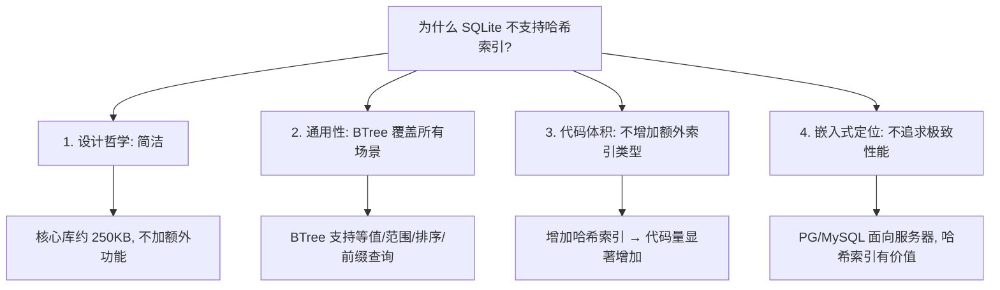
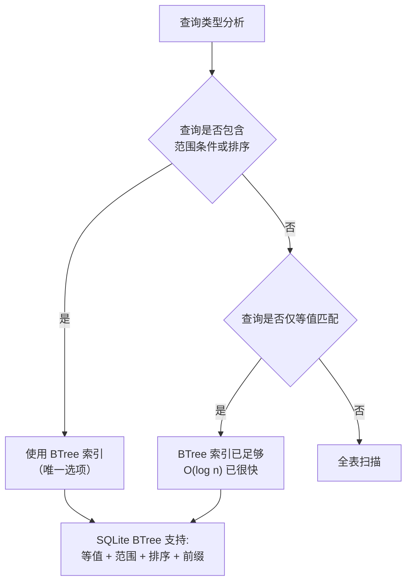

# SQLite3 哈希索引（无原生支持）

## 学习目标

1. 理解 SQLite3 没有原生哈希索引的原因与设计决策
2. 掌握 BTree 索引如何替代哈希索引的功能
3. 了解通过扩展模拟哈希索引的方法
4. 对比 PostgreSQL、MySQL、SQLite 三者的哈希索引支持差异
5. 学习在 SQLite 中实现等值查询优化的最佳实践

## 核心概念

| 概念 | 说明 |
|------|------|
| 哈希索引 | 基于哈希表实现的索引，等值查询 O(1)，不支持范围查询 |
| BTree 索引 | SQLite 唯一支持的索引类型，等值查询 O(log n)，支持范围查询 |
| 表达式索引 | 对表达式结果建立索引，可模拟哈希索引语义 |
| 自适应哈希索引 | MySQL InnoDB 自动维护的热点索引，用户不可控 |
| 哈希冲突 | 两个不同输入产生相同哈希值，需通过原始值验证解决 |

## 主体内容

### 1. SQLite 无原生哈希索引

**设计决策**：SQLite 不提供原生哈希索引类型，所有索引都使用 BTree 实现。

**原因分析**：



**BTree 索引的等值查询性能**：

```sql
-- SQLite 使用 BTree 索引实现等值查询
CREATE INDEX idx_users_email ON users(email);

-- 等值查询（O(log n)）
EXPLAIN QUERY PLAN
SELECT * FROM users WHERE email = 'alice@example.com';
-- QUERY PLAN
-- `--SEARCH users USING INDEX idx_users_email (email=?)

-- 范围查询（O(log n + k)）—— 哈希索引不支持
EXPLAIN QUERY PLAN
SELECT * FROM users WHERE email > 'a' AND email < 'b';
-- QUERY PLAN
-- `--SEARCH users USING INDEX idx_users_email (email>? AND email<?)
```

### 2. BTree 索引 vs 哈希索引对比

**BTree vs Hash 索引决策流程**：



**特性对比表**：

| 维度 | BTree 索引 | 哈希索引 | SQLite 选择 |
|------|-----------|---------|------------|
| 等值查询 | O(log n) | O(1) | BTree（足够快） |
| 范围查询 | O(log n + k) | 不支持 | BTree（必须支持） |
| 排序查询 | 有序遍历 | 不支持 | BTree（必须支持） |
| 前缀查询 | 支持 | 不支持 | BTree（必须支持） |
| 空间占用 | 较大 | 较小 | BTree |
| 维护成本 | 高（需平衡） | 低 | BTree |
| 并发友好 | 高 | 中 | BTree |

### 3. 在 SQLite 中模拟哈希索引

**方法 1：使用哈希值列 + 索引**

```sql
-- 创建哈希值列
CREATE TABLE users (
    id INTEGER PRIMARY KEY,
    email TEXT,
    email_hash INTEGER  -- 存储 email 的哈希值
);

-- 创建哈希值索引
CREATE INDEX idx_users_email_hash ON users(email_hash);

-- 插入数据时计算哈希值
INSERT INTO users (email, email_hash)
VALUES ('alice@example.com', hash('alice@example.com'));

-- 等值查询
SELECT * FROM users
WHERE email_hash = hash('alice@example.com')
  AND email = 'alice@example.com';  -- 验证原始值（防哈希冲突）
```

**方法 2：使用表达式索引（SQLite 3.32+）**

```sql
-- 创建表达式索引（类似哈希索引）
CREATE INDEX idx_users_email_hash ON users(hash(email));

-- 查询使用表达式
EXPLAIN QUERY PLAN
SELECT * FROM users WHERE hash(email) = hash('alice@example.com');
-- QUERY PLAN
-- `--SEARCH users USING INDEX idx_users_email_hash
```

**哈希函数选择**：

```sql
-- 使用内置的 hash 函数
SELECT hash('alice@example.com');  -- 返回整数哈希值

-- 或使用自定义函数注册（C 扩展）
sqlite3_create_function(db, "my_hash", 1, SQLITE_UTF8, NULL,
    my_hash_func, NULL, NULL);
```

### 4. PG 和 MySQL 的哈希索引对比

**PostgreSQL 的哈希索引**：

```sql
-- PostgreSQL 创建哈希索引
CREATE INDEX idx_users_email_hash ON users USING hash(email);

-- 特点：支持等值查询（=），不支持范围查询和排序
-- PG 10+ 使用线性哈希实现，崩溃后自动重建
```

**MySQL 的哈希索引**：

```sql
-- MySQL Memory 引擎支持哈希索引
CREATE TABLE users (
    id INT PRIMARY KEY,
    email VARCHAR(100),
    INDEX idx_email USING HASH (email)
) ENGINE = MEMORY;

-- InnoDB 不支持显式哈希索引，但支持自适应哈希索引（AHI）
-- AHI 自动识别热点索引页，自动建立哈希映射，用户不可控
```

**三数据库对比**：

| 维度 | PostgreSQL | MySQL (InnoDB) | SQLite |
|------|------------|----------------|--------|
| 原生哈希索引 | 支持 | 不支持（仅 MEMORY 引擎） | 不支持 |
| 实现方式 | 线性哈希（PG 10+） | 自适应哈希索引（自动） | 无 |
| 等值查询 | O(1) | O(1)（自动优化） | O(log n) |
| 范围查询 | 不支持 | 不支持 | 支持 |
| 控制粒度 | 用户创建 | 系统自动 | 无 |

### 5. SQLite 中等值查询优化最佳实践

```sql
-- 1. 使用 PRIMARY KEY 或 UNIQUE 约束
CREATE TABLE users (
    id INTEGER PRIMARY KEY,  -- 自动创建 BTree 索引
    email TEXT UNIQUE,       -- 自动创建 BTree 索引
    name TEXT
);

-- 2. 等值查询，使用 Rowid（最快速）
SELECT * FROM users WHERE id = 100;  -- O(log n) 直接 BTree 查找

-- 3. 等值查询，使用索引列
SELECT * FROM users WHERE email = 'alice@example.com';  -- O(log n)

-- 4. 避免全表扫描
EXPLAIN QUERY PLAN
SELECT * FROM users WHERE name = 'Alice';  -- 无索引 → SCAN

-- 5. 创建索引
CREATE INDEX idx_users_name ON users(name);  -- 再查询 → SEARCH

-- 6. 使用覆盖索引
CREATE INDEX idx_users_email_name ON users(email, name);
SELECT email, name FROM users WHERE email = 'alice@example.com';  -- 覆盖索引
```

## 要点总结

1. **SQLite 无原生哈希索引**：所有索引都是 BTree，这是经过深思熟虑的设计决策
2. **BTree 足够通用**：等值、范围、排序、前缀查询全部支持，哈希索引仅支持等值
3. **模拟哈希索引**：通过哈希值列或表达式索引实现，但需处理哈希冲突
4. **哈希索引的局限性**：不支持范围查询和排序，与 SQLite 的通用诉求不符
5. **PG 原生支持哈希索引**，MySQL 仅 MEMORY 引擎支持，InnoDB 自适应哈希索引系统自动管理
6. **优化建议**：使用 PRIMARY KEY/UNIQUE 约束，创建恰当索引，优先使用覆盖索引

## 思考题

1. 设计决策：SQLite 不实现哈希索引的原因是什么？这个设计决策在嵌入式场景下是否合理？
2. 模拟哈希索引：使用哈希值列 + 索引模拟哈希索引，有哪些注意事项（哈希冲突、碰撞处理）？
3. 性能对比：BTree 索引的 O(log n) 等值查询在 SQLite 中是否足够快？在什么场景下需要 O(1) 的哈希索引？
4. 自适应哈希索引：MySQL InnoDB 的自适应哈希索引如何工作？SQLite 是否有类似的优化？
5. 表达式索引：SQLite 的表达式索引能否完全替代哈希索引？有什么限制？