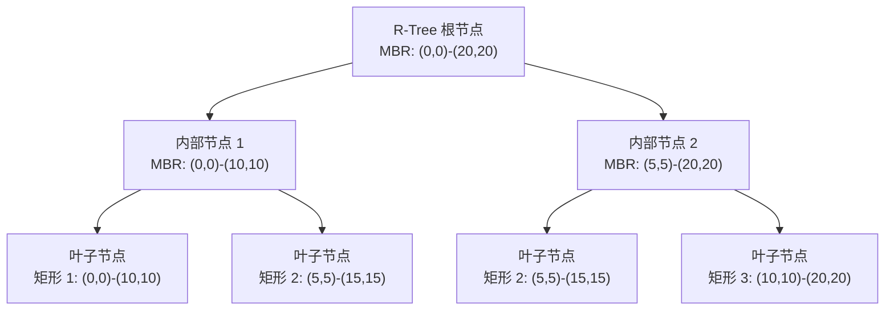
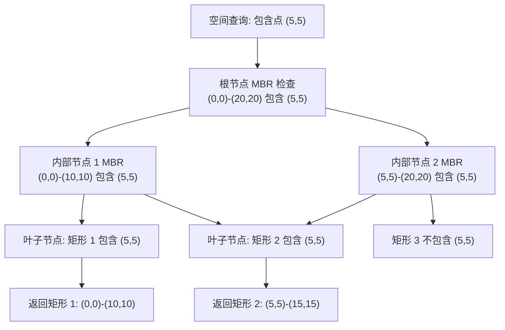
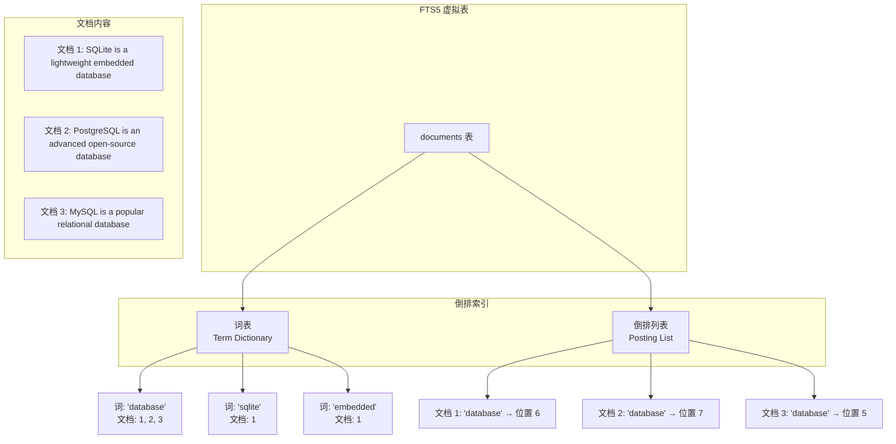
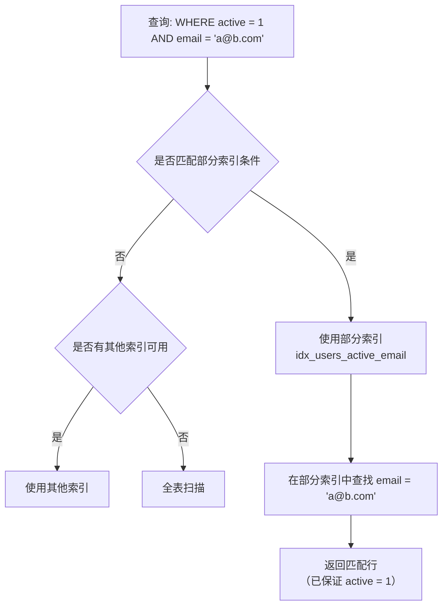
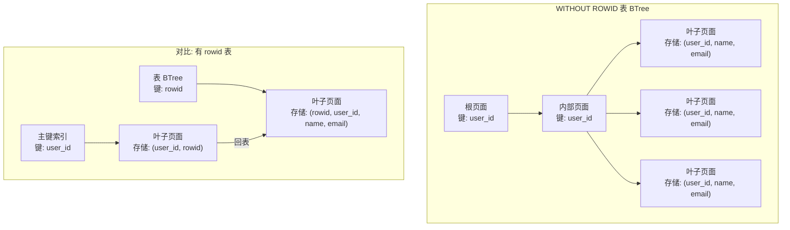

# SQLite3 其他索引类型

## 学习目标

1. 掌握 SQLite3 的 R-Tree 空间索引扩展模块
2. 理解 SQLite3  的 FTS 全文搜索（FTS3/FTS4/FTS5）
3. 掌握表达式索引和部分索引的使用方法
4. 理解 WITHOUT ROWID 表（索引组织表）的设计
5. 对比 PostgreSQL、MySQL 与 SQLite 的高级索引特性差异

## 核心概念

| 概念 | 说明 |
|------|------|
| R-Tree | 空间索引扩展，基于 R-Tree 算法，支持矩形范围查询 |
| FTS/FTS5 | 全文搜索扩展，基于倒排索引，支持 BM25 排序 |
| 倒排索引 | 从词到文档的映射，每个词记录出现位置 |
| 表达式索引 | 对表达式结果建立索引，如 LOWER(name) |
| 部分索引 | 仅对满足 WHERE 条件的行建立索引 |
| WITHOUT ROWID | 索引组织表，表数据按主键聚簇存储 |

## 主体内容

### 1. R-Tree 空间索引

R-Tree 是 SQLite 的扩展模块，用于空间数据索引，基于 R-Tree 算法实现。

**启用 R-Tree 扩展**：

```bash
# 编译时启用 R-Tree
gcc -DSQLITE_ENABLE_RTREE shell.c sqlite3.c -o sqlite3

# 或使用时加载扩展
sqlite3 test.db
.load ./rtree
```

**创建 R-Tree 虚拟表**：

```sql
-- 创建 R-Tree 表（存储矩形范围）
CREATE VIRTUAL TABLE locations USING rtree(
    id,          -- 主键
    min_x, max_x, -- X 轴范围
    min_y, max_y  -- Y 轴范围
);

-- 插入空间数据（矩形）
INSERT INTO locations VALUES
    (1, 0, 10, 0, 10),   -- 矩形: (0,0) ~ (10,10)
    (2, 5, 15, 5, 15),   -- 矩形: (5,5) ~ (15,15)
    (3, 10, 20, 10, 20); -- 矩形: (10,10) ~ (20,20)

-- 查询包含点 (5, 5) 的矩形
SELECT * FROM locations
WHERE min_x <= 5 AND max_x >= 5
  AND min_y <= 5 AND max_y >= 5;
```

**R-Tree 结构**：



**R-Tree 查询流程**：



**R-Tree 特点**：

| 维度 | 说明 |
|------|------|
| 适用场景 | 地理信息系统、位置服务、碰撞检测 |
| 查询类型 | 范围查询、包含查询、相交查询 |
| 性能 | O(log n) 平均查询时间 |
| 限制 | 仅支持矩形（点用 min=max 表示） |
| 维度 | 支持 1-5 维（常用 2D 和 3D） |

### 2. FTS 全文搜索（Full-Text Search）

FTS3/FTS4/FTS5 是 SQLite 的全文搜索扩展，基于倒排索引实现。

**FTS5 索引结构**：



**创建 FTS5 虚拟表**：

```sql
-- 创建 FTS5 表
CREATE VIRTUAL TABLE documents USING fts5(
    title,
    content,
    tokenize = 'porter unicode61'  -- 分词器
);

-- 插入文档
INSERT INTO documents (title, content) VALUES
    ('SQLite Introduction', 'SQLite is a lightweight embedded database'),
    ('PostgreSQL Guide', 'PostgreSQL is an advanced open-source database'),
    ('MySQL Tutorial', 'MySQL is a popular relational database');

-- 全文搜索
SELECT * FROM documents WHERE documents MATCH 'database';

-- BM25 排序（相关性）
SELECT title, bm25(documents) AS score
FROM documents
WHERE documents MATCH 'database'
ORDER BY score;
```

**FTS5 查询语法**：

| 语法 | 示例 | 说明 |
|------|------|------|
| 基本查询 | MATCH 'database' | 包含指定词 |
| AND 查询 | MATCH 'sqlite AND database' | 同时包含多个词 |
| OR 查询 | MATCH 'sqlite OR mysql' | 包含任意词 |
| NOT 查询 | MATCH 'database NOT mysql' | 排除包含某词 |
| 前缀查询 | MATCH 'data*' | 以指定前缀开头的词 |
| 短语查询 | MATCH '"embedded database"' | 精确短语匹配 |
| NEAR 查询 | MATCH 'sqlite NEAR database' | 词在附近出现 |

**FTS 版本对比**：

| 维度 | FTS3/FTS4 | FTS5 |
|------|----------|------|
| 发布年份 | 2007/2011 | 2015 |
| 性能 | 较慢 | 快 20-50% |
| 查询语法 | 基础 | 增强（NEAR, 列查询等） |
| 分词器 | 简单 | 支持 Unicode、porter stemmer |
| 排序 | 无 | BM25 排序 |
| 推荐 | 不推荐（过时） | 推荐 |

### 3. 表达式索引

**定义**：索引可以创建在表达式上，而非仅列名。

```sql
-- 创建表达式索引（对 LOWER(email) 建立索引）
CREATE INDEX idx_users_email_lower ON users(LOWER(email));

-- 查询时使用表达式
EXPLAIN QUERY PLAN
SELECT * FROM users WHERE LOWER(email) = 'alice@example.com';
-- QUERY PLAN
-- `--SEARCH users USING INDEX idx_users_email_lower

-- 大小写不敏感查询
CREATE TABLE users (
    id INTEGER PRIMARY KEY,
    email TEXT
);
CREATE INDEX idx_users_email_ci ON users(LOWER(email));

INSERT INTO users (email) VALUES ('Alice@Example.com');
INSERT INTO users (email) VALUES ('bob@example.com');

-- 查询（大小写不敏感）
SELECT * FROM users WHERE LOWER(email) = 'alice@example.com';
-- 返回: Alice@Example.com
```

**表达式索引的应用场景**：

| 场景 | 表达式索引 | 说明 |
|------|-----------|------|
| 大小写不敏感 | LOWER(email) | 对大小写进行归一化 |
| 日期提取 | year(date_column) | 按年份查询 |
| 数学运算 | abs(value) | 绝对值查询 |
| JSON 查询 | json_extract(data, '$.key') | JSON 路径查询 |
| 字符串处理 | substr(name, 1, 1) | 首字母查询 |

**表达式索引限制**：
- 查询必须使用完全相同的表达式
- 表达式必须是确定性的（相同输入始终产生相同输出）
- 不能引用其他表的列

### 4. 部分索引（Partial Index）

**定义**：部分索引仅包含满足 WHERE 条件的行，减少索引体积。

```sql
-- 创建部分索引（仅索引活跃用户）
CREATE INDEX idx_users_active_email ON users(email)
WHERE active = 1;

-- 查询时自动使用部分索引（查询条件蕴含索引条件）
SELECT * FROM users
WHERE active = 1 AND email = 'alice@example.com';
```

**部分索引扫描流程**：



**部分索引应用场景**：

```sql
-- 1. 仅索引特定状态的行
CREATE INDEX idx_orders_pending ON orders(user_id)
WHERE status = 'pending';

-- 2. 仅索引非空值
CREATE INDEX idx_users_phone ON users(phone)
WHERE phone IS NOT NULL;

-- 3. 仅索引特定时间范围
CREATE INDEX idx_logs_2024 ON logs(timestamp)
WHERE timestamp >= '2024-01-01' AND timestamp < '2025-01-01';
```

### 5. WITHOUT ROWID 表（索引组织表）

**定义**：WITHOUT ROWID 表是索引组织表，表数据按主键聚簇存储，类似 MySQL InnoDB 的聚簇索引。

```sql
-- 创建 WITHOUT ROWID 表
CREATE TABLE users (
    user_id TEXT PRIMARY KEY,  -- 主键即聚集键
    name TEXT,
    email TEXT
) WITHOUT ROWID;

-- 查询
EXPLAIN QUERY PLAN
SELECT * FROM users WHERE user_id = 'user123';
-- QUERY PLAN
-- `--SEARCH TABLE users USING INDEX PRIMARY KEY (user_id=?)
```

**WITHOUT ROWID 表结构**：



**WITH ROWID vs WITHOUT ROWID**：

| 维度 | WITH ROWID | WITHOUT ROWID |
|------|-----------|---------------|
| 主键存储 | 隐式 Rowid（64 位整数） | 显式 PRIMARY KEY |
| 表 BTree 键 | Rowid | PRIMARY KEY |
| 主键查询 | 需通过二级索引回表 | 直接 BTree 查找 |
| 二级索引存储 | 存储 Rowid（4-8 字节） | 存储 PRIMARY KEY（可能较大） |
| 插入性能 | 快（Rowid 自增，顺序插入） | 可能慢（随机主键插入） |
| 适用场景 | 无自然主键 | 有自然主键（如 UUID） |

### 6. 三大数据库高级索引对比

**PostgreSQL 空间索引对比**：

| 维度 | SQLite R-Tree | PostgreSQL GiST | PostgreSQL SP-GiST |
|------|--------------|----------------|-------------------|
| 数据结构 | R-Tree | R-Tree 变体 | 四叉树/kd-tree |
| 空间类型 | 矩形 | 任意几何类型（PostGIS） | 点、多边形等 |
| 查询类型 | 相交、包含 | 相交、包含、距离、最近邻 | 相交、最近邻 |
| 扩展性 | 固定 | 通过 PostGIS 扩展 | 通过 PostGIS 扩展 |
| 性能 | 中等 | 强（PostGIS 优化） | 强（空间划分高效） |

**全文搜索对比**：

| 维度 | SQLite FTS5 | PostgreSQL GIN + tsvector | MySQL FULLTEXT |
|------|------------|--------------------------|----------------|
| 索引结构 | 倒排索引 | GIN 倒排索引 | 倒排索引 |
| 分词器 | porter, unicode61 | 多种配置（parser 扩展） | 内置分词器 |
| 排序 | BM25 | ts_rank, ts_rank_cd | 相关性排序 |
| 查询语法 | MATCH + 丰富语法 | @@ + tsquery | MATCH AGAINST |
| 性能 | 快（嵌入式） | 强（服务器级） | 中 |
| 扩展性 | 低（单进程） | 高（并行查询） | 中 |

**三数据库高级索引统一对比**：

| 索引类型 | PostgreSQL | MySQL | SQLite |
|---------|------------|-------|--------|
| BTree | 支持 | 支持 | 支持（唯一原生索引类型） |
| Hash | 支持 | 仅 MEMORY 引擎 | 不支持 |
| GiST | 支持 | 不支持 | 不支持 |
| SP-GiST | 支持 | 不支持 | 不支持 |
| GIN | 支持 | 不支持 | 不支持 |
| BRIN | 支持 | 不支持 | 不支持 |
| 全文搜索 | 内置（GIN + tsvector） | 内置（FULLTEXT） | FTS5 扩展 |
| 空间索引 | PostGIS（GiST） | SPATIAL（R-Tree） | R-Tree 扩展 |
| 表达式索引 | 支持 | 支持（8.0+） | 支持 |
| 部分索引 | 支持 | 不支持 | 支持 |
| 聚簇索引 | 不支持 | 支持（InnoDB） | WITHOUT ROWID |

## 要点总结

1. **R-Tree 空间索引**：通过扩展模块支持空间查询，适用于 GIS 和位置服务
2. **FTS5 全文搜索**：基于倒排索引，支持 BM25 排序，是 SQLite 最强大的扩展之一
3. **表达式索引**：对表达式结果建立索引，优化大小写不敏感查询、JSON 查询等
4. **部分索引**：仅索引满足条件的行，减少索引体积，提升维护性能
5. **WITHOUT ROWID 表**：表数据按主键聚簇存储，类似 MySQL InnoDB 聚簇索引
6. **扩展机制**：SQLite 通过虚拟表（Virtual Table）机制实现 R-Tree 和 FTS 等高级索引

## 思考题

1. R-Tree vs GiST：SQLite 的 R-Tree 与 PostgreSQL 的 GiST 空间索引相比，各自的优劣是什么？为什么 SQLite 不实现 GiST？
2. FTS5 vs GIN：SQLite 的 FTS5 与 PostgreSQL 的 GIN 全文搜索相比，性能和功能有什么差异？在嵌入式场景中 FTS5 是否足够？
3. WITHOUT ROWID 选择：在什么场景下选择 WITHOUT ROWID 表？什么场景下使用默认的 ROWID 表？UUID 主键是否适合 WITHOUT ROWID？
4. 部分索引优化：部分索引在什么场景下能显著提升性能？如何评估是否应该使用部分索引？部分索引是否需要定期重建？
5. 表达式索引限制：SQLite 的表达式索引要求查询使用完全相同的表达式，这种严格匹配在什么场景下会导致索引无法使用？