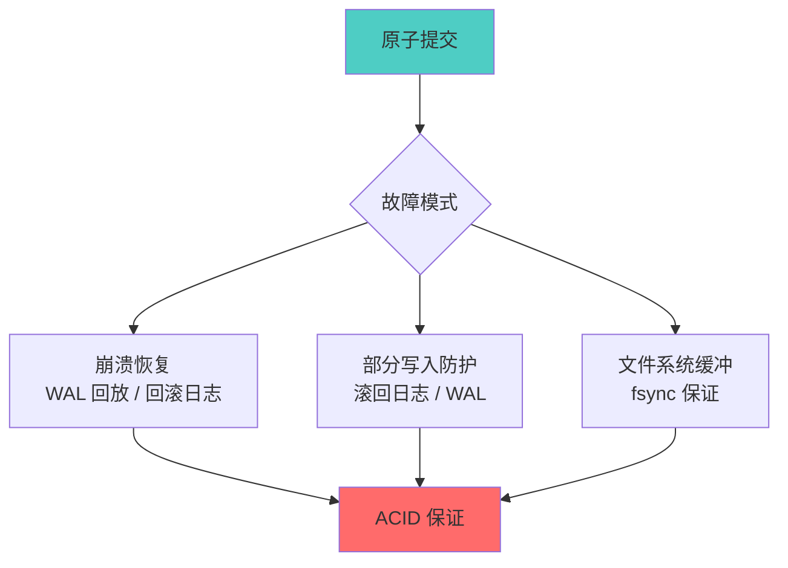

# SQLite3 核心特性

## 学习目标

1. 掌握 SQLite3 的**核心特性**及其设计哲学
2. 理解 SQLite 的**零配置**、**零依赖**、**零管理**理念
3. 了解 SQLite 的**极限**与**适用边界**
4. 熟悉 SQLite 的**扩展机制**（Extension）
5. 掌握 SQLite 的**约束**与**限制**

---

## 核心概念

### 1. 零配置架构（Zero-Configuration）

**定义**：SQLite 不需要任何配置即可使用——无需安装、无需启动服务、无需创建数据库。

**对比 PostgreSQL/MySQL**：

| 步骤 | PostgreSQL/MySQL | SQLite |
|------|------------------|--------|
| 安装 | 需要安装包管理器 | 拷贝一个 `.dll`/`.so` 文件 |
| 配置 | 编辑 `postgresql.conf`/`my.cnf` | 零配置 |
| 启动 | `systemctl start postgresql` | 无需启动 |
| 创建数据库 | `CREATE DATABASE` | `sqlite3_open("test.db")` |
| 用户管理 | 角色/权限系统 | 无（依赖文件权限） |
| 备份 | `pg_dump`/`mysqldump` | 拷贝文件 |

---

### 2. 零依赖（Zero Dependencies）

**技术实现**：
- 核心库代码约 140KB（ARM64 编译后），约 250KB（x86-64）
- 所有功能在单个库文件中实现
- 无外部依赖（没有 C 标准库以外的依赖）
- 使用 `sqlite3_compileoption_used()` 确认编译选项

**编译选项**：

```c
// 检查编译选项
printf("Has FTS5: %d\n", sqlite3_compileoption_used("SQLITE_ENABLE_FTS5"));
printf("Has JSON1: %d\n", sqlite3_compileoption_used("SQLITE_ENABLE_JSON1"));
printf("Thread-safe: %d\n", sqlite3_compileoption_used("SQLITE_THREADSAFE"));
```

**典型编译标志**：

| 标志 | 说明 | 默认 |
|------|------|------|
| `SQLITE_THREADSAFE` | 线程安全模式 | 1（启用） |
| `SQLITE_ENABLE_FTS5` | 全文搜索 | 0（需手动启用） |
| `SQLITE_ENABLE_JSON1` | JSON 支持 | 1（自 3.38.0） |
| `SQLITE_ENABLE_RTREE` | 空间索引 | 0（需手动启用） |
| `SQLITE_OMIT_LOAD_EXTENSION` | 禁用扩展加载 | 0（默认允许） |

---

### 3. 单文件事务（Single-File Transactions）

**核心机制**：SQLite 保证即使在**崩溃**或**断电**场景下，数据库文件始终处于一致状态。

**实现方式**：



**ACID 在 SQLite 中的实现**：

| 特性 | 实现机制 |
|------|----------|
| 原子性 | 回滚日志（Rollback Journal）或 WAL |
| 一致性 | 完整性约束 + 原子提交 |
| 隔离性 | 5 级锁状态机 + 事务模式 |
| 持久性 | `fsync()` 调用（或 PRAGMA synchronous） |

---

### 4. 数据库大小限制

**理论极限**：

| 维度 | 最大值 | 说明 |
|------|--------|------|
| 数据库大小 | 约 281 TB | 2^48 页面 × 65536 字节/页 |
| 页面大小 | 65536 字节 | 实际限制 512~65536 |
| 表列数 | 32767 | 受 SQLITE_MAX_COLUMN 限制 |
| 行大小 | 约 1 GB | 实际受页面大小限制 |
| 字符串长度 | 约 1 GB | 约 10 亿字节 |
| 附加数据库 | 125 | 使用 `ATTACH DATABASE` |
| 并发读取 | 无限制 | 受 OS 文件锁限制 |

**实际限制（受 OS 文件系统限制）**：

| 文件系统 | 最大文件大小 | SQLite 实际限制 |
|----------|-------------|-----------------|
| FAT32 | 4 GB | 4 GB |
| ext4 | 16 TB | 16 TB |
| NTFS | 256 TB | 281 TB |
| APFS | 8 EB | 281 TB |

**性能建议**：
- 数据库 < 1 GB — 最佳性能
- 1 GB ~ 10 GB — 可接受（需优化）
- > 10 GB — 考虑使用 PG/MySQL

---

### 5. 并发控制

**SQLite 的并发模型**：

```mermaid
graph TB
    A[SQLite 并发模型] --> B[单写者 + 多读者]
    A --> C[WAL 模式: 读写并发]
    A --> D[DELETE 模式: 读排斥写]

    B --> E[写操作: 独占锁]]
    B --> F[读操作: 共享锁]

    C --> G[写者写 WAL]
    C --> H[读者读数据库 / WAL]

    D --> I[写者等待读者释放]
    D --> J[读者等待写者完成]

    style A fill:#e1f5ff
    style E fill:#ff6b6b
    style F fill:#4ecdc4
```

**对比 PostgreSQL/MySQL**：

| 维度 | PostgreSQL | MySQL | SQLite |
|------|------------|-------|--------|
| 并发模型 | 多读多写 | 多读多写 | 单写多读 |
| 锁粒度 | 行级锁 | 行级锁（InnoDB） | 数据库级锁 |
| 写阻塞 | 读不阻塞写，写不阻塞读 | 写等待行锁 | 写阻塞读（DELETE 模式） |
| 读阻塞 | 从不阻塞 | 从不阻塞（MVCC） | 写阻塞读（DELETE 模式） |
| 优化 | 无 | 无 | WAL 模式降低阻塞 |

---

### 6. 安全特性

**SQLite 的安全机制**：

1. **文件权限**：依赖操作系统文件权限（`chmod`/`chown`）
2. **加密**：SQLite 本身不提供加密，但通过扩展支持：
   - `SEE`（SQLite Encryption Extension）— 官方付费扩展
   - `SQLCipher` — 开源 AES-256 加密
3. **SQL 注入防护**：使用参数化查询（`sqlite3_bind_*`）
4. **沙箱**：可禁用危险操作（`sqlite3_db_config(db, SQLITE_DBCONFIG_DEFENSIVE, 1, NULL)`）

**安全最佳实践**：

```c
// 参数化查询（防 SQL 注入）
sqlite3_stmt *stmt;
sqlite3_prepare_v2(db, "SELECT * FROM users WHERE id = ?", -1, &stmt, NULL);
sqlite3_bind_int(stmt, 1, user_id);

// 启用防御模式
sqlite3_db_config(db, SQLITE_DBCONFIG_DEFENSIVE, 1, NULL);

// 禁用扩展加载
sqlite3_enable_load_extension(db, 0);
```

---

### 7. PRAGMA 命令

**PRAGMA 是 SQLite 的配置接口**，用于控制运行时行为。

**常用 PRAGMA**：

```sql
-- 页面大小（必须在创建数据库前设置）
PRAGMA page_size = 4096;

-- 缓存大小（页数）
PRAGMA cache_size = -64000;  -- 负值表示 KB，64 MB

-- 同步模式（持久性级别）
PRAGMA synchronous = FULL;     -- 最安全
PRAGMA synchronous = NORMAL;   -- 平衡
PRAGMA synchronous = OFF;      -- 最快（可能丢失数据）

-- 事务模式
PRAGMA journal_mode = WAL;      -- WAL 模式
PRAGMA journal_mode = DELETE;    -- 回滚日志模式
PRAGMA journal_mode = MEMORY;    -- 内存日志

-- 外键约束
PRAGMA foreign_keys = ON;

-- 内存使用
PRAGMA memory_limit = 1048576;  -- 1 MB 内存上限

-- 临时文件目录
PRAGMA temp_store = MEMORY;     -- 临时表存储在内存中
PRAGMA temp_store = FILE;       -- 临时表存储在文件中
```

---

### 8. 扩展机制

**SQLite 支持多种扩展方式**：

**1. 加载扩展（Loadable Extension）**：

```c
// 动态加载扩展
sqlite3_load_extension(db, "my_extension.so", NULL, NULL);

// 在 SQL 中创建新函数
// C 代码实现扩展
static void my_function(sqlite3_context *ctx, int argc, sqlite3_value **argv) {
    const char *input = sqlite3_value_text(argv[0]);
    // ... 处理
    sqlite3_result_text(ctx, result, -1, SQLITE_TRANSIENT);
}

// 注册扩展入口
int sqlite3_extension_init(sqlite3 *db, char **pzErrMsg, const sqlite3_api_routines *pApi) {
    SQLITE_EXTENSION_INIT2(pApi);
    sqlite3_create_function(db, "my_function", 1, SQLITE_UTF8, NULL, my_function, NULL, NULL);
    return SQLITE_OK;
}
```

**2. 虚拟表（Virtual Table）**：

```sql
-- 创建虚拟表（使用 FTS5 搜索引擎）
CREATE VIRTUAL TABLE documents USING fts5(title, content);

-- 全文搜索
SELECT * FROM documents WHERE documents MATCH 'sqlite';

-- 创建虚拟表（使用 R-Tree 空间索引）
CREATE VIRTUAL TABLE locations USING rtree(
    id,          -- 主键
    min_x, max_x, -- X 轴范围
    min_y, max_y  -- Y 轴范围
);

-- 空间查询
SELECT * FROM locations WHERE min_x >= 0 AND max_x <= 100;
```

**3. 自定义函数**：

```sql
-- 创建自定义函数（需通过 C 扩展）
-- 在 SQL 中使用
SELECT my_function(column1) FROM my_table;
```

---

## 要点总结

1. **零配置、零依赖**：SQLite 的设计哲学——只需一个库文件
2. **单文件事务**：ACID 保证即使在崩溃场景下也不丢失数据
3. **并发模型简单**：单写者 + 多读者（WAL 模式下读写可并发）
4. **大小限制明确**：理论 281 TB，实际推荐 < 1 GB
5. **扩展机制丰富**：加载扩展、虚拟表、自定义函数
6. **PRAGMA 配置**：通过 PRAGMA 命令控制运行时行为
7. **安全依赖文件系统**：无内置用户管理，依赖文件权限

---

## 思考题

1. **零配置哲学**：零配置在哪些场景下是优势，哪些场景下是劣势？能否举出具体例子？
2. **并发限制**：SQLite 的数据库级锁在实际应用中如何影响性能？如何通过 WAL 模式缓解？
3. **大小限制**：281 TB 的理论上限在实际中很难达到，主要原因是什么？SQLite 在大数据场景下的替代方案是什么？
4. **扩展机制**：在什么场景下适合使用 SQLite 扩展？能否举出 FTS5 和 R-Tree 的实际应用？
5. **安全模型**：SQLite 没有内置用户管理，如何保障多用户环境下的数据安全？

---

## 参考资源

- [SQLite 特性](https://www.sqlite.org/features.html)
- [SQLite 限制](https://www.sqlite.org/limits.html)
- [SQLite 安全](https://www.sqlite.org/security.html)
- [PRAGMA 文档](https://www.sqlite.org/pragma.html)
- [SQLite 扩展](https://www.sqlite.org/loadext.html)
- [SQLite 虚拟表](https://www.sqlite.org/vtab.html)