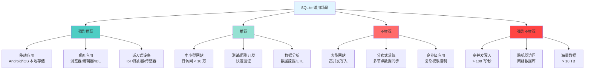
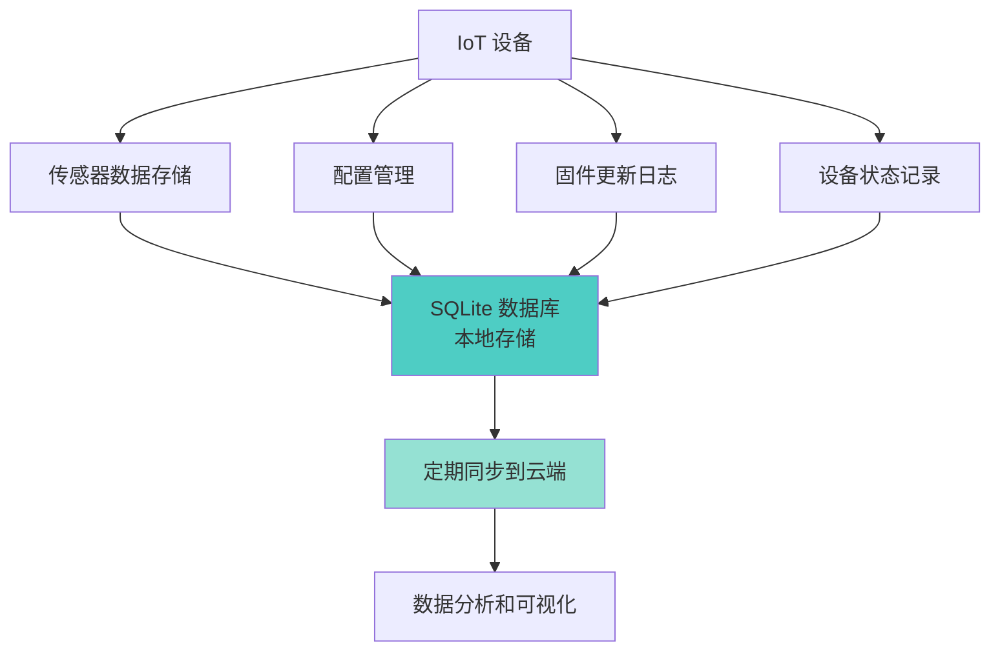
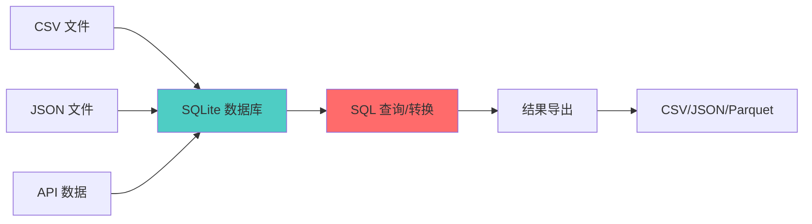
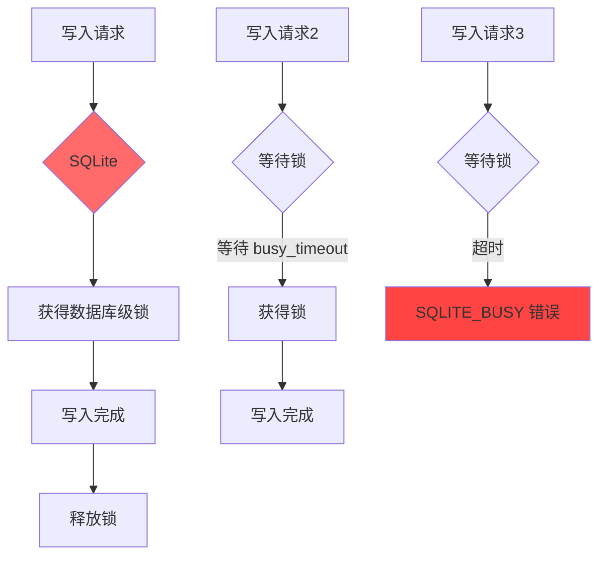

# SQLite3 使用场景

## 学习目标

1. 理解 SQLite3 的**适用场景**与**不适用场景**
2. 掌握 SQLite 在**移动端**、**桌面端**、**嵌入式**设备中的应用
3. 了解 SQLite 在**Web 开发**中的角色（与 PG/MySQL 的边界）
4. 熟悉 SQLite 的**行业案例**与**最佳实践**
5. 学会**评估**何时使用 SQLite，何时切换到 PG/MySQL

---

## 核心概念

### 1. 适用场景分类



---

### 2. 移动端应用（Android/iOS）

**Android 默认数据库**：

```java
// Android 使用 SQLite 作为默认数据库
public class MyDatabaseHelper extends SQLiteOpenHelper {
    private static final String DATABASE_NAME = "mydb.db";
    private static final int DATABASE_VERSION = 1;

    @Override
    public void onCreate(SQLiteDatabase db) {
        db.execSQL("CREATE TABLE users (id INTEGER PRIMARY KEY, name TEXT, age INTEGER)");
    }
}

// 插入数据
ContentValues values = new ContentValues();
values.put("name", "Alice");
values.put("age", 30);
db.insert("users", null, values);
```

**iOS 默认数据库**：

```swift
// iOS 使用 SQLite 或 Core Data（底层也是 SQLite）
import SQLite3

let db = try Database("mydb.sqlite3")
try db.run("CREATE TABLE users (id INTEGER PRIMARY KEY, name TEXT, age INTEGER)")

// 插入数据
try db.run("INSERT INTO users (name, age) VALUES (?, ?)", "Alice", 30)
```

**移动端优势**：
- **离线存储**：无需网络连接即可读写
- **低内存占用**：库文件约 250KB
- **电池友好**：无网络连接消耗
- **数据安全**：本地加密（SQLCipher）
- **备份简单**：拷贝一个文件

**移动端最佳实践**：
- 使用 WAL 模式提升并发
- 设置 `PRAGMA synchronous = NORMAL` 平衡性能与安全
- 避免在主线程执行长时间查询
- 定期 `VACUUM` 回收空间

---

### 3. 桌面应用

**常见应用案例**：

| 应用 | 用途 | 说明 |
|------|------|------|
| Chrome/Firefox | 书签/历史记录/密码 | 每个浏览器配置文件一个 SQLite 数据库 |
| Slack | 本地消息缓存 | 离线消息存储 |
| iTunes | 媒体库索引 | 歌曲/专辑/播放列表元数据 |
| Skype | 聊天记录 | 对话历史 |
| Dropbox | 文件索引 | 本地文件缓存 |
| Adobe Photoshop | 首选项 | 用户设置存储 |

**桌面应用优势**：
- **零运维**：无需安装数据库服务
- **跨平台**：Windows/macOS/Linux 一致
- **嵌入应用**：随应用分发，无额外依赖
- **数据安全**：应用沙箱隔离

---

### 4. 嵌入式设备（IoT）

**典型应用场景**：



**嵌入式设备优势**：
- **代码体积小**：约 250KB，适合闪存有限的设备
- **无外部依赖**：不需要 C++ 运行时、不需要网络库
- **低功耗**：无网络 I/O，仅本地文件访问
- **可定制编译**：通过编译选项裁减功能

**嵌入式设备实际案例**：

```bash
# 路由器固件使用 SQLite（OpenWrt）
# 编译时裁减
./configure \
    --enable-static \
    --disable-readline \
    --disable-threadsafe \
    CFLAGS="-Os -DSQLITE_OMIT_LOAD_EXTENSION -DSQLITE_THREADSAFE=0"

# 编译后大小：约 80KB
ls -lh sqlite3.o
# -rw-r--r-- 1 root root 80K Jul 15 10:00 sqlite3.o
```

---

### 5. Web 开发（中小型网站）

**SQLite 在 Web 中的应用**：

```python
# Flask + SQLite 示例
import sqlite3
from flask import Flask, g

app = Flask(__name__)
DATABASE = 'app.db'

def get_db():
    db = getattr(g, '_database', None)
    if db is None:
        db = g._database = sqlite3.connect(DATABASE)
    return db

@app.route('/users')
def get_users():
    cur = get_db().execute('SELECT * FROM users')
    return {'users': cur.fetchall()}

@app.teardown_appcontext
def close_connection(exception):
    db = getattr(g, '_database', None)
    if db is not None:
        db.close()
```

**Web 应用最佳实践**：

| 流量级别 | 建议 | 说明 |
|----------|------|------|
| 日访问 < 1 万 | SQLite 原生 | 零配置，无需额外组件 |
| 日访问 1 万 ~ 10 万 | SQLite + WAL | 启用 WAL 模式提升并发 |
| 日访问 > 10 万 | 切换到 PG/MySQL | 需要更好的并发控制 |

**Web 应用注意事项**：
- 使用 `WAL` 模式（`PRAGMA journal_mode=WAL`）
- 启用连接池（`sqlite3.enable_shared_cache = True`）
- 设置 `busy_timeout` 避免死锁
- 使用 `EXPLAIN` 分析查询性能

---

### 6. 数据分析/ETL

**SQLite 在数据分析场景的优势**：

```bash
# 快速分析 CSV 数据
sqlite3 analysis.db

sqlite> .mode csv
sqlite> .import sales_2024.csv sales

sqlite> -- 即时查询，无需创建表
sqlite> SELECT strftime('%Y-%m', date) AS month,
       SUM(amount) AS total
FROM sales
GROUP BY month
ORDER BY month;

sqlite> -- 导出结果
sqlite> .output monthly_report.csv
sqlite> SELECT month, total FROM monthly_sales;
```

**ETL 管道**：



---

### 7. 不适用场景（详细分析）

**1. 高并发写入场景**：



**性能数据**：

| 场景 | PostgreSQL | MySQL | SQLite |
|------|------------|-------|--------|
| 单连接写入 | ~10,000/s | ~15,000/s | ~50,000/s |
| 多连接写入 (10 线程) | ~50,000/s | ~80,000/s | ~500/s |
| 读写并发 | 优秀 | 优秀 | 良好（WAL） |
| 连接数扩展 | 线性 | 线性 | 不扩展 |

**2. 分布式场景**：

| 需求 | 方案 | 说明 |
|------|------|------|
| 主从复制 | 不支持 | 无原生复制功能 |
| 分片 | 不支持 | 单文件限制 |
| 多数据中心 | 不支持 | 无网络协议 |
| 故障转移 | 不支持 | 无集群概念 |

**3. 海量数据场景**：

| 维度 | 表现 | 原因 |
|------|------|------|
| 查询性能 | 线性下降 | 单文件，无法并行 |
| 索引维护 | 性能瓶颈 | 插入/更新需维护 BTree |
| 备份 | 时间长 | 大文件拷贝慢 |
| 分析查询 | 内存受限 | 全部在内存中处理 |

---

### 8. 行业案例

**实际使用 SQLite 的知名项目**：

| 项目 | 用途 | 用户规模 |
|------|------|----------|
| Android | 系统默认数据库 | 数十亿设备 |
| Mozilla Firefox | 书签/历史/密码 | 数亿用户 |
| Google Chrome | 书签/历史/缓存 | 数十亿用户 |
| Apple iOS/macOS | 系统组件数据库 | 数十亿设备 |
| Skype | 聊天记录 | 数亿用户 |
| Dropbox | 文件索引 | 数亿用户 |
| TurboTax | 税务数据 | 数千万用户 |
| Balance | 个人理财 | 数百万用户 |

---

## 要点总结

1. **移动端首选**：Android/iOS 默认数据库，离线存储
2. **桌面应用标配**：Chrome/Firefox/Slack 等广泛使用
3. **嵌入式设备理想**：代码小、无依赖、低功耗
4. **中小型网站可用**：日访问 < 10 万可用，WAL 模式提升并发
5. **数据分析工具**：快速导入/导出，适合 ETL 管道
6. **不适用高并发**：写入并发受限，不适用于分布式系统
7. **不适用海量数据**：> 10 GB 需考虑迁移

---

## 思考题

1. **何时升级**：SQLite 适合到什么规模？什么情况下需要从 SQLite 迁移到 PostgreSQL？
2. **移动端挑战**：移动端使用 SQLite 有哪些常见陷阱？（提示：并发、内存、存储空间）
3. **Web 应用边界**：在 Web 开发中，SQLite 的适用边界在哪里？如何判断是否需要切换？
4. **嵌入式优化**：嵌入式设备上如何裁减 SQLite 以减小体积？（提示：编译选项、功能选择）
5. **混合架构**：能否用 SQLite 作为本地缓存，PostgreSQL 作为后端存储？这种架构有哪些挑战？

---

## 参考资源

- [SQLite 适用场景](https://www.sqlite.org/whentouse.html)
- [SQLite 在 Android 中的使用](https://developer.android.com/training/data-storage/sqlite)
- [SQLite 在 iOS 中的使用](https://developer.apple.com/documentation/sqlite)
- [SQLite 性能优化](https://www.sqlite.org/speed.html)
- [SQLite 在 Web 中的应用](https://www.sqlite.org/sqliteweb.html)