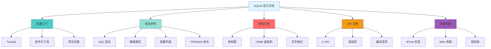
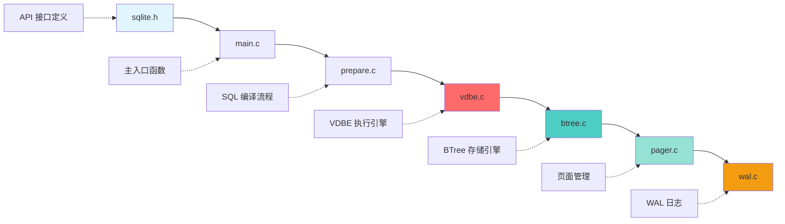

# SQLite3 学习资源

## 学习目标

1. 掌握 SQLite3 的**官方文档**结构与使用方法
2. 了解 SQLite3 的**权威书籍**与**推荐教程**
3. 熟悉 SQLite3 的**开源项目**与**实践案例**
4. 学会从**源码阅读**深入理解 SQLite
5. 了解 SQLite3 的**社区资源**与**调试工具**

---

## 核心概念

### 1. 官方文档结构

**SQLite 官方网站**：https://www.sqlite.org/

**文档组织结构**：



**关键文档清单**：

| 文档名称 | URL | 说明 |
|---------|-----|------|
| SQLite 入门教程 | https://www.sqlite.org/tutorial.html | 5 分钟快速入门 |
| SQL 语法 | https://www.sqlite.org/lang.html | 所有 SQL 语句语法 |
| 数据类型 | https://www.sqlite.org/datatype3.html | 动态类型系统详解 |
| C API 参考 | https://www.sqlite.org/c3ref/intro.html | 完整 API 文档 |
| VDBE 操作码 | https://www.sqlite.org/opcode.html | 所有 VDBE 指令 |
| 文件格式 | https://www.sqlite.org/fileformat.html | 数据库文件二进制格式 |
| 架构概览 | https://www.sqlite.org/arch.html | 8 层架构详解 |
| BTree 模块 | https://www.sqlite.org/btreemodule.html | BTree 实现详解 |
| WAL 机制 | https://www.sqlite.org/wal.html | WAL 原理与使用 |
| 锁机制 | https://www.sqlite.org/lockingv3.html | 5 级锁详解 |

---

### 2. 权威书籍推荐

**核心书籍**：

| 书名 | 作者 | 说明 |
|------|------|------|
| **《Using SQLite》** | Jay A. Kreibich | 最全面的 SQLite 实践指南 |
| **《The Definitive Guide to SQLite》** | Michael Owens | SQLite 权威指南（较老但经典） |
| **《SQLite Database System Design and Implementation》** | Sibsankar Haldar | 深入源码的实现分析 |
| **《Database Design for Mere Mortals》** | Michael J. Hernandez | 数据库设计通用原则（适用 SQLite） |

**在线书籍**：

1. **SQLite 官方文档**（最权威）：
   - https://www.sqlite.org/docs.html

2. **SQLite Tutorial**（教程网站）：
   - https://www.sqlitetutorial.net/
   - 涵盖基础到高级，包含大量示例

3. **SQLite 源码注释**（深入理解）：
   - https://www.sqlite.org/src/doc/trunk/src/sqliteInt.h

---

### 3. 开源项目与实践案例

**SQLite 源码**：

```bash
# 克隆 SQLite 源码
git clone https://www.sqlite.org/src

# 查看 VDBE 实现
less src/vdbe.c

# 查看 BTree 实现
less src/btree.c

# 查看 WAL 实现
less src/wal.c

# 查看 Pager 实现
less src/pager.c

# 查看 Parser（Lemon 生成）
less src/parse.y
```

**SQLite 扩展项目**：

| 项目 | 说明 | GitHub |
|------|------|--------|
| **SQLCipher** | 加密 SQLite（AES-256） | https://github.com/sqlcipher/sqlcipher |
| **sqlite-orm** | C++ ORM 封装 | https://github.com/fnc12/sqlite_orm |
| **sqlite-utils** | Python CLI 工具 | https://github.com/simonw/sqlite-utils |
| **Datasette** | SQLite 数据发布工具 | https://github.com/simonw/datasette |
| **sqlean** | SQLite 扩展集合 | https://github.com/nalgeon/sqlean |

**实践案例**：

1. **移动应用**：
   - Android: `packages/providers/ContactsProvider`（联系人数据库）
   - iOS: `Core Data` 框架（底层 SQLite）

2. **桌面应用**：
   - Firefox: `places.sqlite`（书签和历史）
   - Chrome: `History` 文件（浏览历史）

3. **Web 应用**：
   - Django: 默认使用 SQLite 开发环境
   - Flask: 常用 SQLite 作为小型应用数据库

---

### 4. 源码阅读路径

**推荐阅读顺序**：



**关键文件说明**：

| 文件 | 行数 | 说明 |
|------|------|------|
| `sqlite.h.in` | ~12000 | API 接口定义（生成 sqlite.h） |
| `sqliteInt.h` | ~5000 | 内部数据结构定义 |
| `main.c` | ~4000 | 主入口函数 `sqlite3_open`、`sqlite3_close` |
| `prepare.c` | ~3000 | SQL 编译流程 `sqlite3_prepare_v2` |
| `vdbe.c` | ~15000 | VDBE 执行引擎（最大文件） |
| `vdbeapi.c` | ~2000 | VDBE API 接口 `sqlite3_step` |
| `btree.c` | ~8000 | BTree 存储引擎 |
| `pager.c` | ~6000 | 页面管理与事务 |
| `wal.c` | ~5000 | WAL 日志实现 |
| `parse.y` | ~3000 | Lemon 解析器语法文件 |
| `resolve.c` | ~3000 | 名称解析与语义分析 |
| `expr.c` | ~2000 | 表达式处理 |

**阅读技巧**：

1. **从 API 入手**：
   - 先读 `sqlite.h.in`，理解所有公开 API
   - 追踪 `sqlite3_open` → `sqlite3_prepare_v2` → `sqlite3_step` 流程

2. **理解 VDBE**：
   - `vdbe.c` 是核心，重点读 `sqlite3VdbeExec` 函数
   - 每条指令对应一个 case 分支

3. **深入存储**：
   - `btree.c` 理解 BTree 插入/删除/查询
   - `pager.c` 理解页面缓存与锁机制
   - `wal.c` 理解 WAL 写入与回放

4. **调试技巧**：
   ```c
   // 编译时启用调试
   gcc -DSQLITE_DEBUG -DSQLITE_ENABLE_EXPLAIN_COMMENTS \
       -DSQLITE_THREADSAFE=0 sqlite3.c shell.c -o sqlite3

   // 使用 .testctrl 调试命令
   sqlite> .testctrl assert 1
   sqlite> .testctrl prng_save
   sqlite> .testctrl prng_restore
   ```

---

### 5. 社区资源与工具

**社区论坛**：

- **SQLite 官方论坛**：https://sqlite.org/forum/
- **Stack Overflow**：标签 `sqlite`
- **Reddit**：r/sqlite

**调试工具**：

1. **sqlite3 命令行工具**：
   ```bash
   # 启用调试输出
   sqlite3 -header -column test.db

   # 查看查询计划
   sqlite> EXPLAIN QUERY PLAN SELECT * FROM users;

   # 查看数据库信息
   sqlite> .schema
   sqlite> .tables
   sqlite> .indexes
   ```

2. **DB Browser for SQLite**（可视化工具）：
   - https://sqlitebrowser.org/
   - 图形化浏览 SQLite 数据库

3. **sqlite-web**（Web 界面）：
   ```bash
   pip install sqlite-web
   sqlite_web test.db
   ```

4. **Datasette**（数据发布）：
   ```bash
   pip install datasette
   datasette test.db
   # 打开 http://127.0.0.1:8001
   ```

**性能分析工具**：

```bash
# 内置性能分析
sqlite3 test.db <<EOF
.timer on
SELECT COUNT(*) FROM large_table;
.timer off
EOF

# 输出：
-- Run Time: real 0.123 user 0.045 sys 0.030

# 使用 sqlite3_status
sqlite3 test.db "SELECT * FROM pragma_compile_options;"
```

---

### 6. 学习路径建议

**初级路径**（1~2 周）：


**中级路径**（3~6 个月）：


**高级路径**（6~12 个月）：


---

## 要点总结

1. **官方文档最权威**：https://www.sqlite.org/docs.html
2. **源码是最好的老师**：从 `sqlite.h.in` → `vdbe.c` → `btree.c` → `pager.c`
3. **开源项目丰富**：SQLCipher、sqlite-orm、Datasette 等
4. **社区活跃**：官方论坛、Stack Overflow、Reddit
5. **工具齐全**：sqlite3 CLI、DB Browser、Datasette、sqlite-web
6. **学习路径清晰**：初级（API）→ 中级（调优）→ 高级（源码）

---

## 思考题

1. **文档选择**：在遇到问题时，如何快速定位到官方文档的对应章节？
2. **源码阅读策略**：SQLite 源码约 15 万行，如何制定高效的阅读计划？
3. **调试技巧**：如何使用 `.testctrl` 命令调试 SQLite 内部状态？
4. **扩展开发**：在什么场景下需要开发自定义扩展？如何入手？
5. **性能分析**：如何使用 SQLite 的内置工具分析查询性能瓶颈？

---

## 参考资源

- [SQLite 官方文档](https://www.sqlite.org/docs.html)
- [SQLite 源码](https://www.sqlite.org/src)
- [SQLite Tutorial](https://www.sqlitetutorial.net/)
- [SQLite Forum](https://sqlite.org/forum/)
- [DB Browser for SQLite](https://sqlitebrowser.org/)
- [Datasette](https://datasette.io/)
- [SQLCipher](https://www.zetetic.net/sqlcipher/)