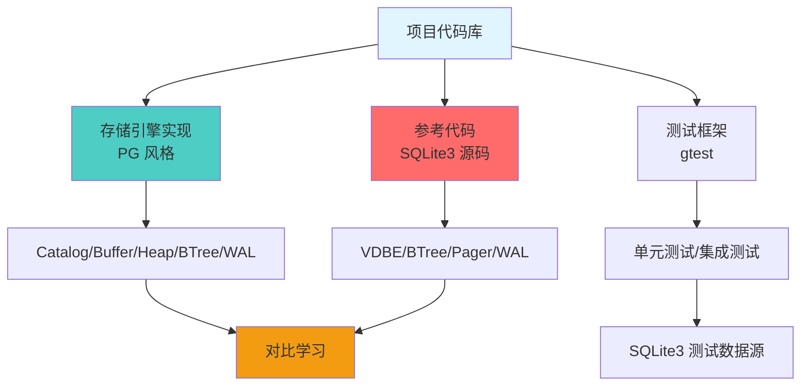
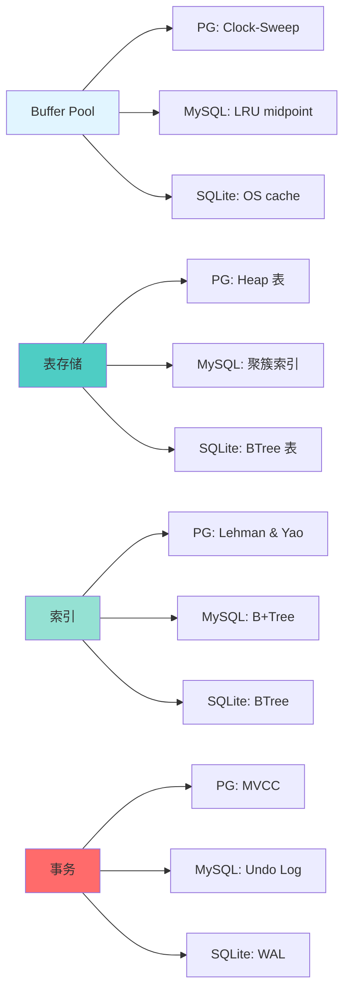

# SQLite3 与项目连接

## 学习目标

1. 理解 SQLite3 在**本项目中**的应用场景
2. 掌握 SQLite3 与**现有代码库**的集成方法
3. 了解如何使用 SQLite3 作为**测试数据库**
4. 学会将 SQLite3 与**存储引擎**对比学习
5. 明确 SQLite3 在**项目架构**中的定位

---

## 核心概念

### 1. 项目中的 SQLite3 应用

**项目背景**：
- 本项目实现了 PostgreSQL 风格的存储引擎（`engineering/src/db/`）
- 包含 Catalog、Buffer Pool、Heap AM、BTree AM、WAL 等模块
- SQLite3 可作为**参考实现**和**对比学习对象**

**SQLite3 在项目中的角色**：



---

### 2. SQLite3 作为测试数据库

**使用场景**：
- 为存储引擎测试提供**参考数据**
- 验证 SQL 语义正确性
- 性能对比基准

**集成方法**：

```c
// 在测试中使用 SQLite3 生成测试数据
#include <sqlite3.h>

TEST(StorageEngine, CompareWithSQLite) {
    // 1. 创建 SQLite3 数据库
    sqlite3 *db;
    sqlite3_open(":memory:", &db);

    // 2. 创建测试表
    sqlite3_exec(db, "CREATE TABLE test (id INTEGER PRIMARY KEY, name TEXT)", NULL, NULL, NULL);

    // 3. 插入测试数据
    sqlite3_exec(db, "INSERT INTO test VALUES (1, 'Alice')", NULL, NULL, NULL);
    sqlite3_exec(db, "INSERT INTO test VALUES (2, 'Bob')", NULL, NULL, NULL);

    // 4. 查询数据（参考结果）
    sqlite3_stmt *stmt;
    sqlite3_prepare_v2(db, "SELECT * FROM test", -1, &stmt, NULL);

    while (sqlite3_step(stmt) == SQLITE_ROW) {
        int id = sqlite3_column_int(stmt, 0);
        const char *name = sqlite3_column_text(stmt, 1);
        printf("SQLite: id=%d, name=%s\n", id, name);
    }

    // 5. 使用项目存储引擎执行相同操作
    kv_t *kv = kv_open("test.db");
    table_t *table = table_open(kv, "test");
    // ... 插入和查询

    // 6. 对比结果
    // ...

    sqlite3_finalize(stmt);
    sqlite3_close(db);
    kv_close(kv);
}
```

---

### 3. SQLite3 与存储引擎对比学习

**对比维度**：

| 维度 | PostgreSQL（项目实现） | MySQL | SQLite3 |
|------|----------------------|-------|---------|
| **架构** | 客户端-服务器 | 客户端-服务器 | 嵌入式（库） |
| **Buffer Pool** | Clock-Sweep 算法 | LRU midpoint | 依赖 OS page cache |
| **表存储** | Heap 表（顺序页） | 聚簇索引（IOT） | BTree 表 |
| **索引结构** | Lehman & Yao BTree | B+Tree | BTree |
| **事务模型** | MVCC（xmin/xmax） | MVCC（Undo Log） | WAL / 回滚日志 |
| **锁机制** | 轻量锁 | Next-Key Lock | 5 级锁状态机 |
| **执行模型** | Volcano 迭代器 | Volcano 迭代器 | VDBE 虚拟机 |
| **日志系统** | WAL（XLOG） | Redo Log + binlog | WAL / 回滚日志 |

**对比学习路径**：



---

### 4. 项目中的 SQLite3 相关代码

**参考代码路径**：

```bash
# SQLite3 源码（如果项目包含）
reference/open-source/sqlite3/  # Git 子模块（如果有）

# SQLite3 相关测试
engineering/test/db/sqlite3/    # 可创建 SQLite3 集成测试

# SQLite3 相关工具
engineering/tools/sqlite3_tool.c  # 可创建 SQLite3 CLI 工具
```

**项目中的潜在应用**：

1. **KV 存储引擎对比**：
   ```c
   // 对比 kv_engine 与 SQLite3 性能
   void benchmark_kv_vs_sqlite() {
       // KV 引擎插入
       kv_t *kv = kv_open("test.db");
       clock_t start = clock();
       for (int i = 0; i < 100000; i++) {
           kv_put(kv, key, value);
       }
       printf("KV 插入耗时: %f 秒\n", (clock() - start) / CLOCKS_PER_SEC);

       // SQLite3 插入
       sqlite3 *db;
       sqlite3_open("test_sqlite.db", &db);
       start = clock();
       sqlite3_exec(db, "BEGIN TRANSACTION", NULL, NULL, NULL);
       for (int i = 0; i < 100000; i++) {
           sqlite3_exec(db, "INSERT INTO kv (key, value) VALUES (?, ?)", ...);
       }
       sqlite3_exec(db, "COMMIT", NULL, NULL, NULL);
       printf("SQLite 插入耗时: %f 秒\n", (clock() - start) / CLOCKS_PER_SEC);
   }
   ```

2. **BTree 实现对比**：
   ```c
   // 对比项目 BTree 与 SQLite3 BTree
   void compare_btree() {
       // 项目 BTree
       btree_t *btree = btree_create();
       btree_insert(btree, key, value);

       // SQLite3 BTree
       sqlite3 *db;
       sqlite3_btree *sqlite_btree;
       sqlite3BtreeOpen("test.db", &sqlite_btree);
       sqlite3BtreeInsert(sqlite_btree, key, value);

       // 对比性能、内存占用
   }
   ```

3. **WAL 实现对比**：
   ```c
   // 对比项目 WAL 与 SQLite3 WAL
   void compare_wal() {
       // 项目 WAL
       wal_t *wal = wal_open("test.wal");
       wal_write(wal, record);

       // SQLite3 WAL
       sqlite3 *db;
       sqlite3_open("test.db", &db);
       sqlite3_exec(db, "PRAGMA journal_mode=WAL", NULL, NULL, NULL);
       // 写入触发 WAL

       // 对比写入性能、恢复速度
   }
   ```

---

### 5. 项目扩展方向

**潜在扩展**：

1. **SQLite3 集成测试框架**：
   ```c
   // 创建 SQLite3 测试框架
   // engineering/test/db/sqlite3/test_sqlite_integration.cpp

   TEST(SQLite3Integration, CompareInsertPerformance) {
       // 对比项目存储引擎与 SQLite3 插入性能
   }

   TEST(SQLite3Integration, CompareQueryCorrectness) {
       // 对比查询结果正确性
   }
   ```

2. **SQLite3 数据导入工具**：
   ```c
   // 从 SQLite3 导入数据到项目存储引擎
   // engineering/tools/sqlite_import.c

   int import_from_sqlite(const char *sqlite_db, const char *target_db) {
       sqlite3 *src;
       kv_t *dst;

       sqlite3_open(sqlite_db, &src);
       dst = kv_open(target_db);

       // 遍历 SQLite 表
       sqlite3_exec(src, "SELECT * FROM users", callback, dst, NULL);

       return 0;
   }
   ```

3. **SQLite3 查询兼容层**：
   ```c
   // 实现 SQLite3 兼容的查询接口
   // engineering/include/db/sqlite_compat.h

   typedef struct sqlite3_compat {
       kv_t *kv;
       // ... 其他字段
   } sqlite3_compat;

   int sqlite3_compat_exec(sqlite3_compat *db, const char *sql) {
       // 解析 SQL
       // 使用项目存储引擎执行
       // 返回结果
   }
   ```

4. **SQLite3 扩展开发**：
   ```c
   // 为 SQLite3 开发自定义扩展
   // engineering/sdk/sqlite_extensions/

   // 示例：自定义聚合函数
   static void my_aggregate_step(sqlite3_context *ctx, int argc, sqlite3_value **argv) {
       // 实现聚合逻辑
   }

   static void my_aggregate_final(sqlite3_context *ctx) {
       // 返回最终结果
   }

   // 注册扩展
   int sqlite3_extension_init(sqlite3 *db, ...) {
       sqlite3_create_function(db, "my_aggregate", 1, SQLITE_UTF8, NULL,
                               NULL, my_aggregate_step, my_aggregate_final);
   }
   ```

---

### 6. 学习成果检验

**实践项目建议**：

1. **BTree 可视化工具**：
   - 读取 SQLite3 数据库文件
   - 可视化 BTree 结构
   - 对比项目 BTree 实现

2. **WAL 回放工具**：
   - 解析 SQLite3 WAL 文件
   - 模拟崩溃恢复
   - 对比项目 WAL 实现

3. **性能基准测试**：
   - 对比 SQLite3、项目存储引擎、PostgreSQL 性能
   - 生成性能报告

4. **SQL 兼容层**：
   - 实现 SQLite3 兼容的 C API
   - 底层使用项目存储引擎

---

## 要点总结

1. **SQLite3 作为参考**：学习嵌入式数据库设计，对比项目存储引擎
2. **测试数据源**：使用 SQLite3 生成测试数据，验证正确性
3. **对比学习**：PG vs MySQL vs SQLite 三种架构对比
4. **扩展方向**：集成测试、数据导入、兼容层、扩展开发
5. **实践项目**：BTree 可视化、WAL 回放、性能基准

---

## 思考题

1. **架构选择**：为什么项目选择 PostgreSQL 风格存储引擎，而不是 SQLite3 风格？各自的优劣是什么？
2. **集成策略**：在什么场景下适合将 SQLite3 集成到项目中？需要考虑哪些兼容性问题？
3. **性能对比**：如何设计公平的性能对比实验？需要控制哪些变量？
4. **扩展开发**：如果需要为 SQLite3 开发自定义扩展，如何与项目存储引擎协同工作？
5. **学习路径**：如何通过对比学习（PG vs MySQL vs SQLite）深入理解数据库系统？

---

## 参考资源

- [SQLite3 源码](https://www.sqlite.org/src)
- [SQLite3 文件格式](https://www.sqlite.org/fileformat.html)
- [SQLite3 BTree 实现](https://www.sqlite.org/btreemodule.html)
- [项目存储引擎文档](docs/storage-architecture.md)
- [PostgreSQL 架构对比](docs/db_wiki/01_relational/postgres/01_architecture.md)