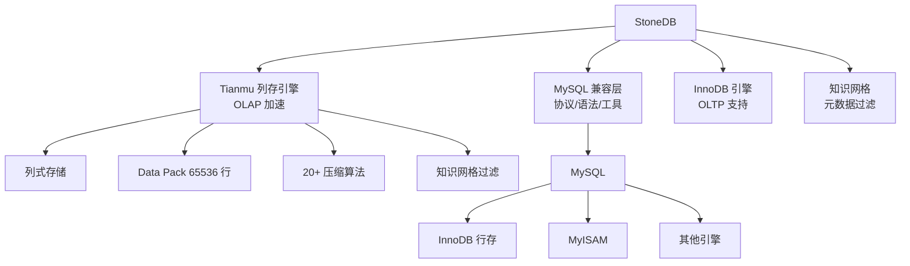
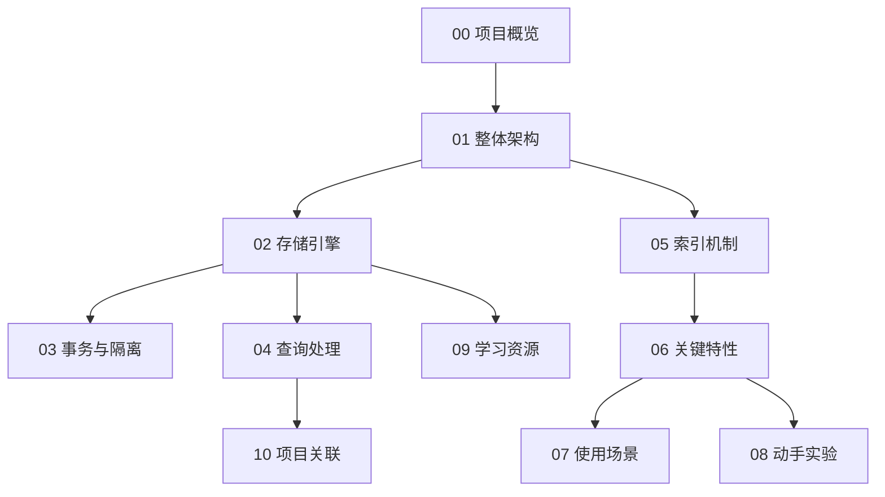

# StoneDB 项目概览

## 学习目标

- 了解 StoneDB 的项目定位、历史脉络与社区生态
- 掌握 StoneDB 的核心设计理念与适用场景
- 建立对 StoneDB 全栈模块的整体认知框架

## 项目定位

> StoneDB 是一个基于 MySQL 内核构建的、兼容 MySQL 协议的开源 HTAP 数据库，由石原子科技（StoneAtom）设计开发。

**基本信息**：

- 开发方：石原子科技（StoneAtom）
- 首次发布：2022 年
- 开源协议：GPL v2
- 最新版本：StoneDB 5.7（基于 MySQL 5.7）
- GitHub Stars：约 1.5k（[stoneatom/stonedb](https://github.com/stoneatom/stonedb)）
- 官方网站：[https://stonedb.io](https://stonedb.io)

## 核心设计理念

StoneDB 的设计哲学可以概括为三点：**MySQL 全兼容**、**列存引擎加速分析**、**知识网格过滤**。

第一，**MySQL 全兼容**。StoneDB 直接基于 MySQL 5.6/5.7 内核改造，完全兼容 MySQL 协议、SQL 语法和生态工具（Navicat、Workbench、mysqldump 等）。用户无需修改任何代码即可将现有 MySQL 应用切换到 StoneDB。

第二，**列存引擎（Tianmu）加速分析**。StoneDB 自研了名为 Tianmu 的列式存储引擎，替代 InnoDB 作为 OLAP 负载的存储后端。列存带来的天然优势包括：高压缩比（40:1）、只读取需要的列、数据按类型密集存储。

第三，**知识网格（Knowledge Grid）过滤**。Tianmu 引擎的核心创新——数据被切分为 65536 行一组的 Data Pack，上层维护 Data Pack Node（MIN/MAX/SUM/COUNT 等元数据）和 Knowledge Node（直方图/CMAP/Pack-to-Pack 等），查询时先用元数据过滤掉无关 Data Pack，大幅减少解压和 I/O。

## 适用场景

StoneDB 在以下场景中表现出色：

- **HTAP 混合负载**：需要同时处理 TP 和 AP 的中小规模系统
- **MySQL 升级分析能力**：现有 MySQL 用户需要分析查询加速，但不希望改代码
- **大表聚合查询**：数十亿行级别的 COUNT/SUM/AVG/GROUP BY
- **日志/监控分析**：列存 + 高压缩比，适合存储大量带时间戳的指标数据
- **数据归档**：40:1 压缩比大幅降低存储成本

不擅长的场景：

- **高并发 OLTP**：列存引擎在点查方面不如 InnoDB
- **跨数据中心分布式**：StoneDB 目前无原生分布式能力
- **实时写入后立即分析**：列存引擎更适合批量导入后分析

## 学习路线图

## 要点总结

- StoneDB 是 MySQL 兼容的 HTAP 数据库，核心创新是 Tianmu 列存引擎
- 知识网格（Knowledge Grid）通过元数据过滤大幅减少 I/O
- 列存 + 20+ 压缩算法实现最高 40:1 压缩比
- 适合 MySQL 用户的 AP 加速场景，不适合高并发 OLTP

## 思考题

1. StoneDB 选择基于 MySQL 5.7 而非独立实现，有哪些优势与约束？
2. 知识网格的 Data Pack 大小为什么是 65536 行？这个数字的考量是什么？
3. 列存引擎在哪些场景下会劣于行存？StoneDB 如何通过混合存储解决？