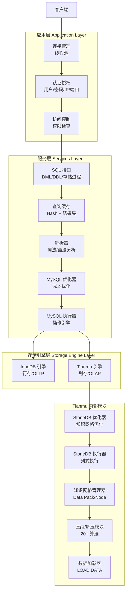
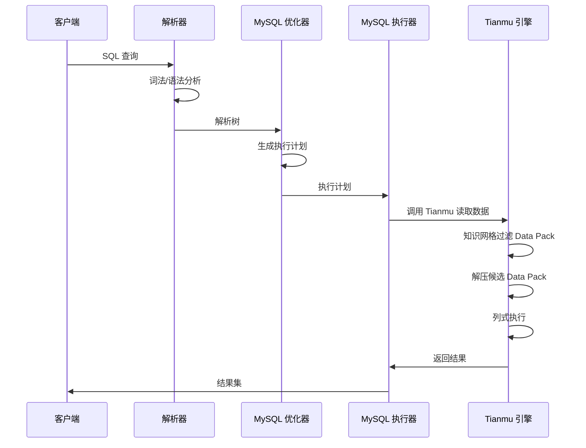
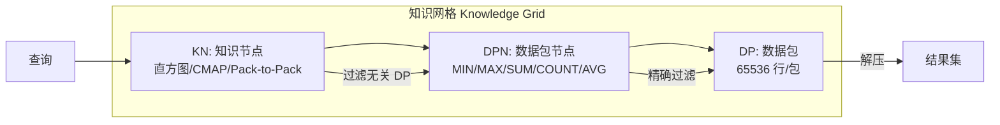
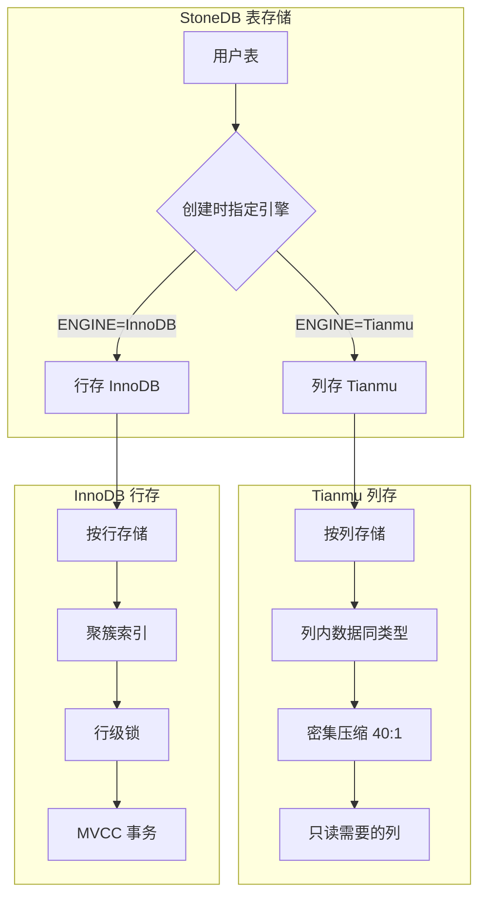

# StoneDB 整体架构

## 学习目标

- 理解 StoneDB 的三层逻辑架构设计
- 掌握 Tianmu 引擎与 MySQL 内核的集成方式
- 了解知识网格在查询路径中的位置

## 核心概念

- **三层架构**：应用层（连接管理/认证/访问控制）→ 服务层（SQL 接口/解析器/优化器）→ 存储引擎层（Tianmu/InnoDB）
- **Tianmu 引擎**：StoneDB 自研的列式存储引擎，用于 OLAP 加速
- **知识网格**：由 Data Pack Node + Knowledge Node 组成的两级元数据系统
- **双引擎架构**：InnoDB 处理 OLTP、Tianmu 处理 OLAP，用户可指定表使用哪种引擎

## 三层架构

## 查询处理流程

## 知识网格架构

## 双引擎存储策略

## 要点总结

- StoneDB 采用三层架构：应用层 → 服务层 → 存储引擎层
- Tianmu 是自研列存引擎，与 InnoDB 共存，用户通过 `ENGINE=Tianmu` 指定
- 知识网格是 Tianmu 的核心：Data Pack Node（元数据）+ Knowledge Node（高级过滤信息）
- 查询先经过知识网格过滤，再解压必要的 Data Pack，大幅减少 I/O

## 思考题

1. StoneDB 将优化器分为 MySQL 优化器和 StoneDB 优化器两部分，这种分工是如何协作的？
2. 知识网格的过滤能力依赖于 Data Pack 粒度的统计信息，如果数据分布极不均匀，过滤效果会怎样？
3. 在双引擎架构下，跨引擎 JOIN（Tianmu 表 JOIN InnoDB 表）是如何实现的？