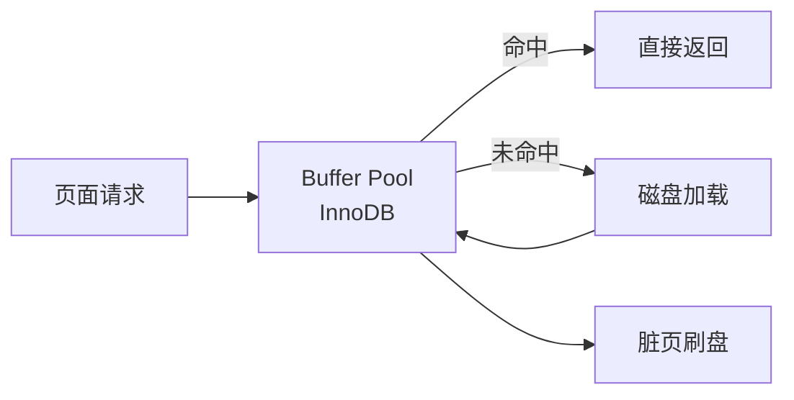
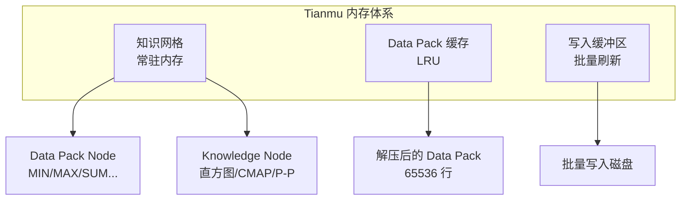
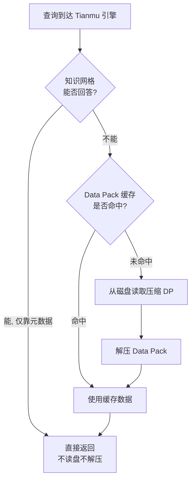

# 存储架构 — Buffer Pool

## 学习目标

- 理解 StoneDB 中双引擎对 Buffer Pool 的不同使用方式
- 掌握 Tianmu 引擎的知识网格缓存策略

## 核心概念

- **InnoDB Buffer Pool**：MySQL 原生 Buffer Pool，用于缓存行存数据页
- **Tianmu 内存管理**：Tianmu 引擎独立管理内存，不依赖 InnoDB Buffer Pool
- **Data Pack 缓存**：解压后的 Data Pack 在内存中缓存
- **知识网格常驻内存**：Data Pack Node 和 Knowledge Node 通常常驻内存

## InnoDB Buffer Pool（OLTP 路径）

使用 `ENGINE=InnoDB` 创建的表，走标准 MySQL Buffer Pool 机制：

- 配置参数：`innodb_buffer_pool_size`
- 替换策略：LRU（改进版，带 midpoint）
- 单位：16KB 页面

## Tianmu 内存管理（OLAP 路径）

Tianmu 引擎不通过 InnoDB Buffer Pool 管理数据，而是自己维护一套内存系统：

### 知识网格（常驻）

知识网格是 Tianmu 的"元数据缓存"：

- **Data Pack Node**：每个 Data Pack 的 MIN/MAX/SUM/COUNT/AVG 等统计信息
- **Knowledge Node**：直方图、CMAP、Pack-to-Pack 矩阵
- 大小：通常只占原始数据的 1% 以下
- 策略：启动时加载，常驻内存，随数据变更增量更新

### Data Pack 缓存

当查询需要解压 Data Pack 时，解压后的数据缓存在内存中：

- 缓存单位：一个完整的 Data Pack（65536 行 × 列宽）
- 替换策略：LRU
- 缓存上限：通过 `tianmu_buffer_size` 或类似参数控制

## 缓存查询路径

## 要点总结

- InnoDB 表走标准 MySQL Buffer Pool，Tianmu 表独立管理内存
- Tianmu 的知识网格常驻内存，仅占原始数据 1% 以下
- Data Pack 缓存采用 LRU 策略，存储解压后的数据
- 大多数聚合查询仅靠知识网格即可回答，无需解压数据

## 思考题

1. Tianmu 不依赖 InnoDB Buffer Pool 的设计带来了哪些利弊？
2. 知识网格常驻内存对于 10TB 级别的数据而言，内存开销大概是多大？
3. 如果 Data Pack 缓存频繁 LRU 颠簸，应该调整哪些参数？