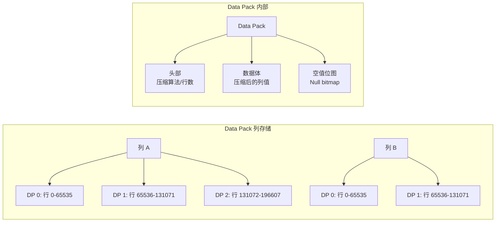
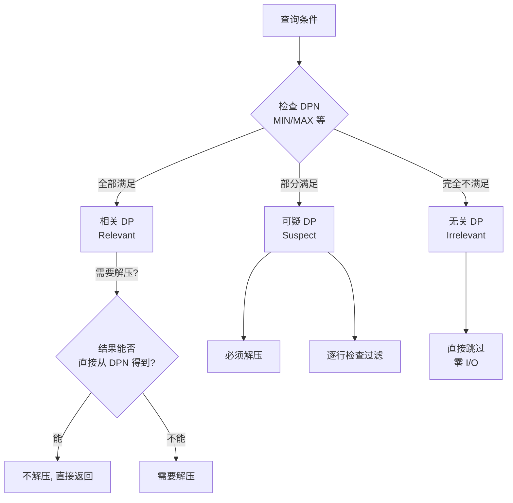
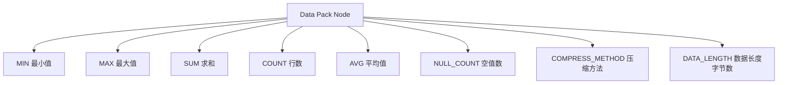

# 存储架构 — Data Pack

## 学习目标

- 理解 StoneDB Data Pack 的设计原理与内部结构
- 掌握 Data Pack 的分类与过滤机制

## 核心概念

- **Data Pack（DP）**：Tianmu 列存的最小数据单元，每 65536 行数据切为一个 DP
- **Data Pack Node（DPN）**：DP 的元数据节点，存 MIN/MAX/SUM/COUNT/AVG 等统计信息
- **相关/无关/可疑**：基于粗糙集理论对 DP 的三分类

## Data Pack 结构



Data Pack 的设计是"行组"粒度的列存单元：

- **为什么是 65536 行**：2^16，DPN 中用 16 位即可索引行偏移；大小适中，既享受列存压缩优势，又不至于解压代价过高
- **压缩粒度**：以 DP 为单位压缩，不同列的 DP 使用不同的压缩算法
- **空值处理**：每个 DP 附带一个 Null Bitmap

## Data Pack 三分类

基于粗糙集理论，Tianmu 将 Data Pack 分为三类：



### 相关 Data Pack（Relevant）

DPN 的统计信息表明该 DP 内所有数据都满足查询条件。例如查询 `WHERE age > 10`，DPN 显示 MIN=20、MAX=100，则整个 DP 都相关。

处理方式：
- 如果查询可以直接从 DPN 获得结果（如 `MIN(age)`），不解压，直接从 DPN 返回
- 否则需要解压，但无需逐行过滤

### 无关 Data Pack（Irrelevant）

DPN 的统计信息表明该 DP 内没有任何数据满足查询条件。例如查询 `WHERE age > 100`，DPN 显示 MAX=50，则整个 DP 无关，直接跳过，零 I/O。

### 可疑 Data Pack（Suspect）

DPN 的统计信息表明该 DP 内部分数据满足条件。例如查询 `WHERE age > 30`，DPN 显示 MIN=20、MAX=50，则 DP 中只有部分行满足条件。

处理方式：
- 必须解压
- 需要逐行检查过滤

## 数据包节点的元数据

每个 DPN 包含以下信息：



这些元数据使 Tianmu 能在不解压 DP 的情况下回答大量聚合查询：

```sql
-- 直接从 DPN 回答，无需解压
SELECT COUNT(*) FROM t;          -- 在 DPN 的 COUNT 汇总
SELECT MAX(age) FROM t;          -- 在 DPN 的 MAX 汇总
SELECT MIN(salary) FROM t;       -- 在 DPN 的 MIN 汇总
```

## 要点总结

- Data Pack 是 65536 行一组的列存单元，兼顾压缩率与解压粒度
- DPN（数据包节点）记录 MIN/MAX/SUM/COUNT 等统计信息，常驻内存
- DP 三分类（相关/无关/可疑）基于粗糙集理论，让查询尽可能避免解压
- 聚合查询可以直接从 DPN 回答，完全不涉及 I/O

## 思考题

1. 为什么选择 65536 行而不是更大的 1M 行作为 Data Pack 的大小？
2. 如果一个表频繁插入新数据，DP 是立即构建还是等积累到 65536 行才构建？最后一个不完整的 DP 如何处理？
3. DPN 的 SUM 值对于 `WHERE` 条件过滤没有帮助，是否有比 SUM 更好的元数据统计项？