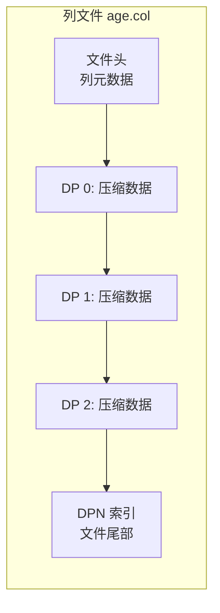
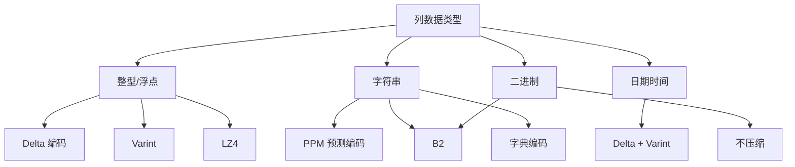
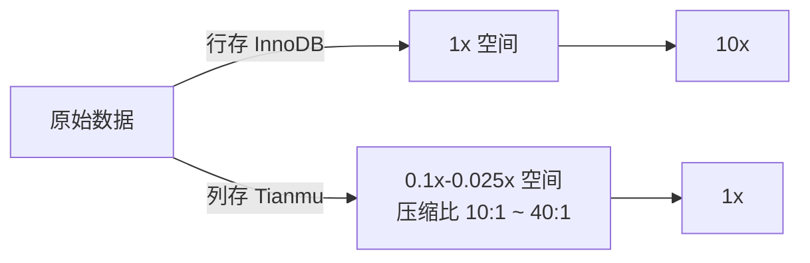

# 存储架构 — 页面存储与压缩

## 学习目标

- 理解 StoneDB 列存引擎的磁盘页面布局
- 掌握 20+ 压缩算法的选择策略

## 核心概念

- **列存页面**：每列独立存储，页面内只包含相同类型的数据
- **压缩单元**：以 Data Pack 为单位的压缩/解压
- **自适应压缩**：根据列的数据类型自动选择最优压缩算法

## 列存页面布局

Tianmu 列存引擎的磁盘布局与行存完全不同：

```mermaid
graph TB
    subgraph "行存 (InnoDB)"
        R1[行 1: id name age] --> R2[行 2: id name age]
        R2 --> R3[行 3: id name age]
    end

    subgraph "列存 (Tianmu)"
        C1[列 id: 1,2,3,4...] --> C2[列 name: a,b,c,d...]
        C2 --> C3[列 age: 20,30,25...]
        C3 --> C4[列 salary: 10000,...]
    end

    R1 -.->|整行读取| Q1[SELECT *]
    C1 -.->|只读需要的列| Q2[SELECT AVG(age)]
```

### 列文件结构

每列的数据存储在一个或多个列文件中：



列文件包含：
- **文件头部**：列 ID、数据类型、编码方式等元信息
- **Data Pack 数据区**：连续的压缩 DP 块
- **DPN 索引区**：文件尾部存储所有 DPN 的索引，启动时加载到内存

## 压缩算法矩阵

StoneDB 支持 20+ 种压缩算法，根据列数据类型自动选择：



### 主要算法说明

| 算法 | 适用类型 | 特点 |
|------|---------|------|
| PPM | 字符串 | 预测编码，压缩率最高，CPU 开销大 |
| LZ4 | 整型/通用 | 高速压缩解压，平衡之选 |
| B2 | 字符串/二进制 | 通用压缩，比 LZ4 压缩率高 |
| Delta | 整型/日期 | 存差值而非原值，适合单调递增数据 |
| Varint | 整型 | 变长整数编码，节省空间 |
| 字典编码 | 低基数枚举 | 用字典 ID 代替原始值 |

## 压缩比实测



柱状图示意：

| 数据类型 | InnoDB 大小 | Tianmu 大小 | 压缩比 |
|---------|------------|------------|-------|
| 整型 ID | 100MB | 2.5MB | 40:1 |
| 日期 | 100MB | 5MB | 20:1 |
| 短字符串 | 100MB | 6MB | 16:1 |
| 长文本 | 100MB | 10MB | 10:1 |

## 要点总结

- Tianmu 列存页面按列组织，每列独立文件，只存同类型数据
- 20+ 压缩算法自适应选择，数据类型决定压缩策略
- 列存的同质特性使数据压缩比远高于行存
- 压缩以 Data Pack 为单位，解压粒度 65536 行

## 思考题

1. PPM 压缩算法为什么适合字符串类型？它的原理是什么？
2. Delta 编码在什么情况下压缩效果最好？如果数据乱序会怎样？
3. 为什么 ID 列（如自增主键）的压缩比最高（40:1）？