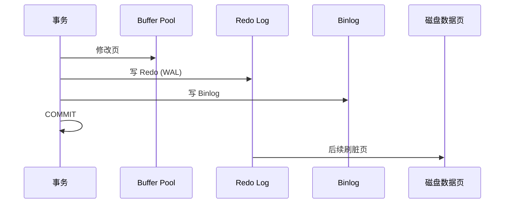
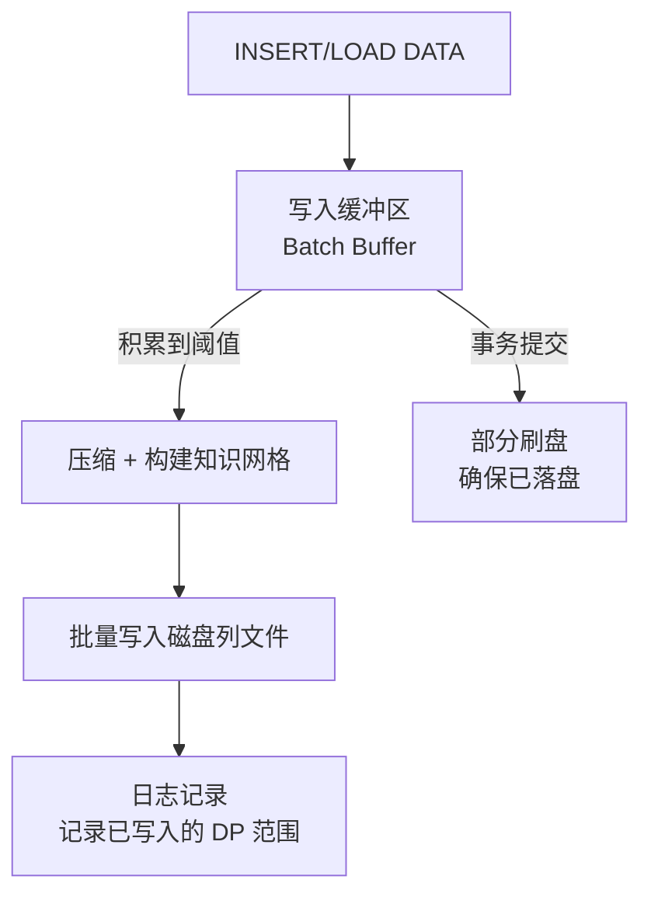
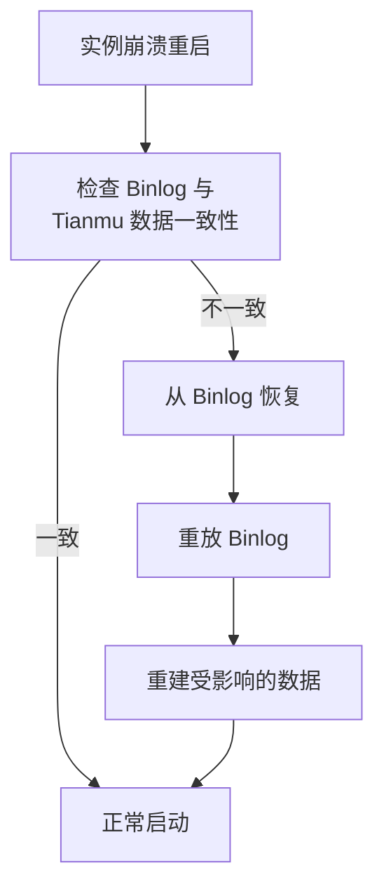

# 存储架构 — WAL 与持久化

## 学习目标

- 理解 StoneDB 在 MySQL WAL 基础上的扩展
- 掌握 Tianmu 引擎的批量写入与崩溃恢复策略

## 核心概念

- **MySQL Redo Log**：InnoDB 的 WAL，记录物理页修改，用于崩溃恢复
- **Binlog**：MySQL 的逻辑日志，用于复制和 PITR
- **Tianmu 批量写入**：Tianmu 引擎不记录每行变更的 WAL，而是采用批量落盘策略

## MySQL 标准 WAL（InnoDB 路径）

InnoDB 表使用标准的 MySQL WAL 机制：
- **Redo Log**：物理日志，循环写入，用于崩溃恢复
- **Undo Log**：回滚日志，存储旧版本数据，用于 MVCC
- **Binlog**：逻辑日志，用于复制和时间点恢复
- **两阶段提交**：保证 Redo Log 和 Binlog 一致性

## Tianmu 写入路径

Tianmu 引擎的写入策略与 InnoDB 有本质区别：

### 批量写入

Tianmu 设计为面向批量写入优化：

- **INSERT**：单行 INSERT 性能较差（需要积累到 DP 满才压缩落盘）
- **LOAD DATA**：推荐的数据导入方式，直接按列批量构建 DP
- **Batch Buffer**：写入数据先进入缓冲区，积累到一定行数后压缩写入

### 事务与持久化

StoneDB 使用 Tianmu 引擎时的 ACID 保证：

- **原子性**：单个 DP 的写入是原子的，但跨 DP 操作需要更复杂的处理
- **持久性**：事务提交时确保 Binlog 已刷盘，Tianmu 数据在缓冲区中持久化
- **隔离性**：Tianmu 引擎的隔离级别与 InnoDB 不同

## 崩溃恢复

由于 Tianmu 不记录逐行 Redo Log，其崩溃恢复方式：

1. **Binlog 主导**：StoneDB 依赖 Binlog 作为主要恢复源
2. **数据校验**：启动时检查列文件的一致性
3. **Tianmu 日志**：Tianmu 维护一个轻量级的写入日志，记录已写入的 DP 范围

## 写入路径对比

| 维度 | InnoDB | Tianmu |
|------|--------|--------|
| 日志类型 | Redo Log（物理）+ Undo Log（逻辑） | Binlog + DP 写入日志 |
| 写入粒度 | 行级别 | Data Pack 级别 |
| 写入特点 | 随机小写 | 批量大块写入 |
| 刷新频率 | 每事务 fsync | 积累到阈值 fsync |
| 恢复速度 | Redo 回放所有事务 | 检查 DP 完整性 |
| 适合负载 | OLTP 高并发小写入 | OLAP 批量加载 |

## 要点总结

- InnoDB 表走标准 MySQL Redo Log + Binlog + Undo Log
- Tianmu 引擎采用批量写入策略，不记录逐行 Redo Log
- StoneDB 主要依赖 Binlog 进行崩溃恢复和时间点恢复
- LOAD DATA 是 Tianmu 推荐的数据写入方式，单行 INSERT 性能较差

## 思考题

1. Tianmu 引擎不记录逐行 Redo Log 的设计在崩溃恢复时有什么风险？
2. 如果 StoneDB 实例崩溃，最后一批未写入列文件的 Buffer 数据能否恢复？
3. 对于需要高可靠 OLTP + OLAP 混合的场景，StoneDB 的双引擎持久化策略是否足够安全？