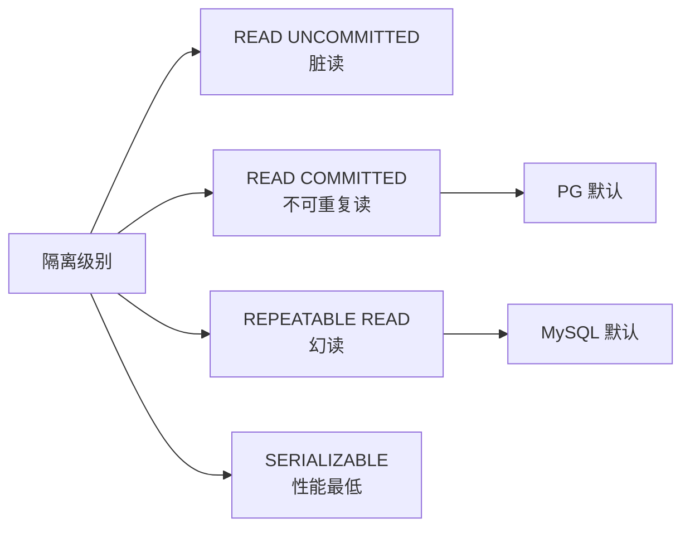
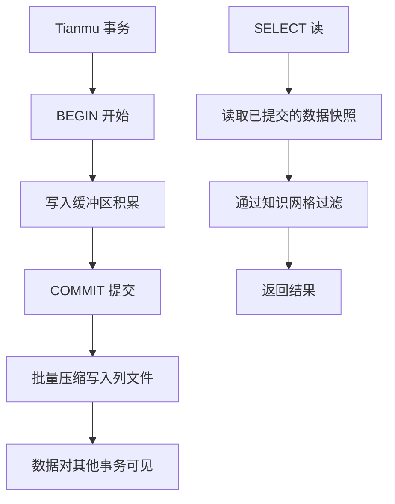
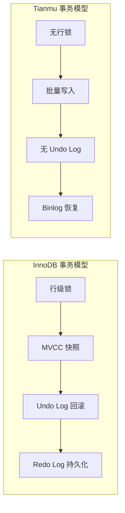

# 事务隔离

## 学习目标

- 理解 StoneDB 双引擎下事务隔离的差异
- 掌握 Tianmu 引擎的隔离级别实现

## 核心概念

- **InnoDB 事务**：完整的 ACID + MVCC + 行级锁
- **Tianmu 事务**：简化的隔离模型，更注重批量操作的原子性
- **隔离级别**：StoneDB 在不同引擎上支持不同的隔离级别

## InnoDB 隔离级别

InnoDB 表支持标准的 MySQL 事务隔离级别：

每个级别在 InnoDB 中的实现：

| 级别 | 实现机制 | 问题 |
|------|---------|------|
| READ UNCOMMITTED | 直接读最新版本 | 脏读 |
| READ COMMITTED | 每条语句重新创建 read view | 不可重复读 |
| REPEATABLE READ | 事务开始时创建 read view | 幻读（通过 Next-Key Lock 解决） |
| SERIALIZABLE | 所有 SELECT 加锁 | 性能最低 |

## Tianmu 隔离级别

Tianmu 引擎的隔离实现与 InnoDB 不同：

### Tianmu 的隔离特点

1. **读已提交（默认）**：SELECT 读取已提交的最新数据
2. **批量原子性**：单个 LOAD DATA 操作是原子的
3. **无行级锁**：Tianmu 不实现行级锁，通过批量写入规避并发问题

### 限制

- 不支持 SERIALIZABLE 级别
- 不支持跨引擎事务（Tianmu 表 + InnoDB 表在同一事务）
- 不支持 SAVEPOINT

## 双引擎事务处理的差异

| 特性 | InnoDB | Tianmu |
|------|--------|--------|
| 默认隔离级别 | REPEATABLE READ | READ COMMITTED |
| MVCC | 完整实现 | 简化版本 |
| 行级锁 | 支持 | 不支持 |
| 表级锁 | 支持 | 支持（DDL） |
| 死锁检测 | 支持 | 不支持 |
| 分布式事务 XA | 支持 | 有限支持 |

## 要点总结

- InnoDB 表支持完整的事务隔离级别（默认 REPEATABLE READ）
- Tianmu 表默认 READ COMMITTED，不支持行级锁和 SERIALIZABLE
- Tianmu 的事务模型围绕批量写入设计，不适合高并发小事务
- 跨引擎事务的支持有限，需要应用层协调

## 思考题

1. Tianmu 引擎不支持行级锁，在高并发写入场景下如何处理冲突？
2. 如果在一个事务中同时修改 InnoDB 表和 Tianmu 表，半途回滚会怎样？
3. 对于 HTAP 场景，OLTP 和 OLAP 路径的事务隔离应该如何协调？