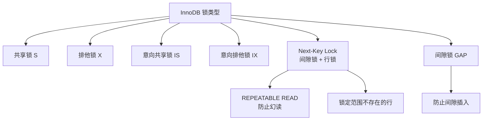
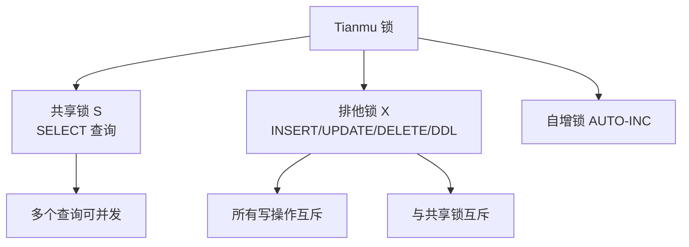
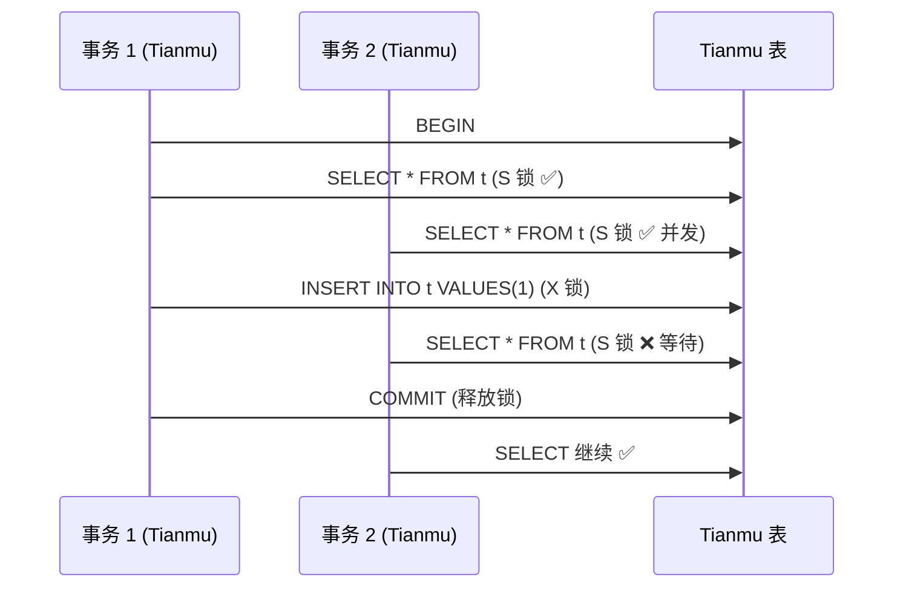

# 锁机制

## 学习目标

- 理解 StoneDB 中双引擎锁机制的差异
- 掌握 Tianmu 引擎的表级锁实现

## 核心概念

- **InnoDB 锁**：行级锁 + 表级锁 + Next-Key Lock
- **Tianmu 锁**：表级锁为主，无行级锁
- **意向锁**：InnoDB 中的锁层级协调机制

## InnoDB 锁体系

InnoDB 拥有 MySQL 标准的事务锁体系：

锁兼容性矩阵：

| 请求\已持有 | S | X | IS | IX |
|-----------|---|---|----|----|
| S | ✅ | ❌ | ✅ | ❌ |
| X | ❌ | ❌ | ❌ | ❌ |
| IS | ✅ | ❌ | ✅ | ✅ |
| IX | ❌ | ❌ | ✅ | ✅ |

## Tianmu 锁体系

Tianmu 引擎的锁模型更简单：

### Tianmu 锁策略

1. **查询不阻塞查询**：多个 SELECT 可并发执行
2. **写阻塞读写**：任何写入操作（INSERT/UPDATE/DELETE）获取表级排他锁
3. **DDL 阻塞所有操作**：ALTER TABLE 等 DDL 获取全局排他锁
4. **无死锁**：因为只有表级锁，锁获取顺序固定，不会死锁

## 锁差异对比

## 行存 vs 列存锁策略对比

| 维度 | InnoDB | Tianmu |
|------|--------|--------|
| 锁粒度 | 行级（默认） | 表级 |
| 并发查询 | ✅ 高并发 | ✅ 高并发 |
| 并发写 | ✅ 行级 | ❌ 单写 |
| 读写冲突 | ✅ 读写不互斥 | ❌ 写阻塞读 |
| 死锁 | ⚠️ 可能死锁 | ✅ 不会死锁 |
| 锁开销 | 大（维护大量锁） | 小（只有一个表锁） |

## 要点总结

- InnoDB 有完整的行级锁 + Next-Key Lock 体系，支持高并发写
- Tianmu 仅使用表级排他锁，写操作阻塞所有其他操作
- Tianmu 无死锁风险，但并发写入能力有限
- 选择引擎时需考虑工作负载的读写并发模式

## 思考题

1. Tianmu 的表级锁在 LOAD DATA 大量数据导入时，对正在执行的查询有何影响？
2. 如何设计应用层策略来缓解 Tianmu 写阻塞读的问题？
3. 在 HTAP 混合负载下，InnoDB 和 Tianmu 表的锁冲突如何协调？