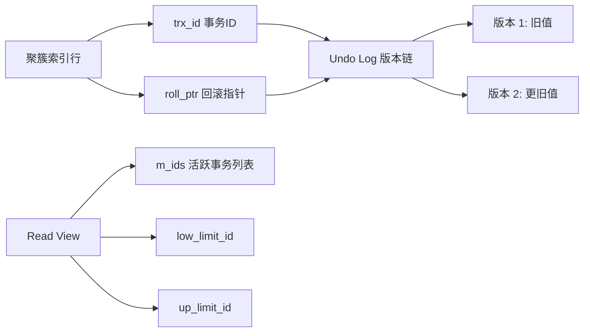
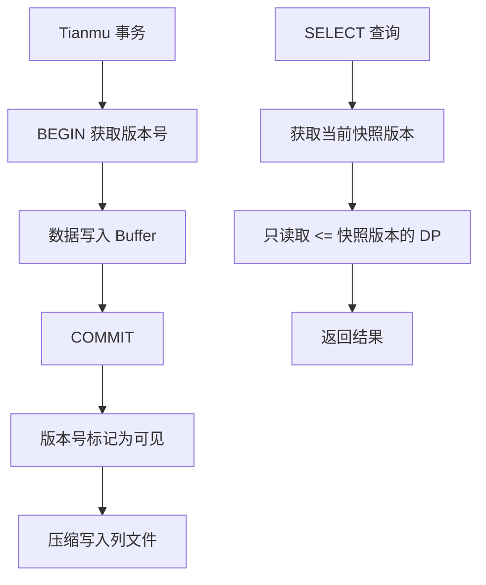
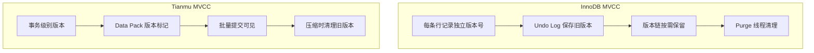
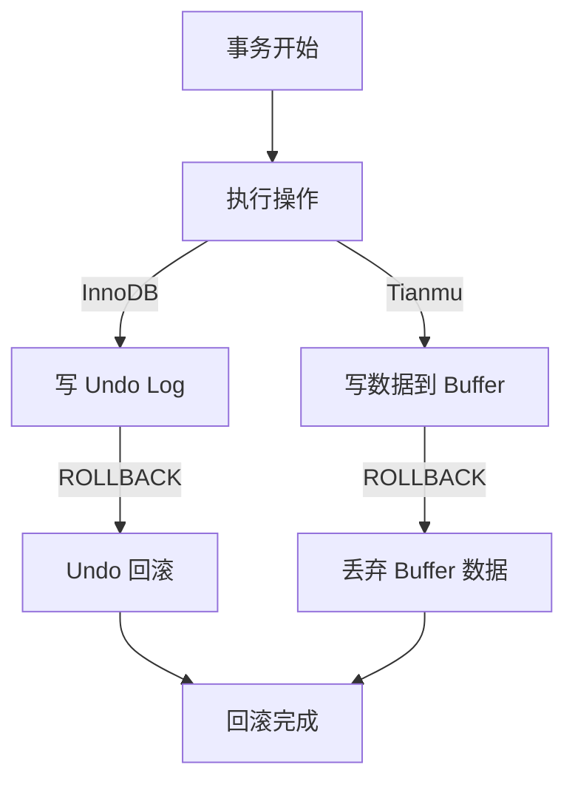

# MVCC 多版本并发控制

## 学习目标

- 理解 InnoDB MVCC 的实现机制
- 掌握 Tianmu 引擎的 MVCC 简化模型

## 核心概念

- **InnoDB MVCC**：基于 Undo Log 的多版本链 + Read View 快照
- **Tianmu MVCC**：基于版本号的事务快照 + 批量提交
- **Undo Log**：存储旧版本数据，支持回滚和 MVCC

## InnoDB MVCC

InnoDB 的 MVCC 实现：



可见性判断：

```sql
visible = (trx_id < up_limit_id)          -- 已提交事务
       OR (trx_id == 自己)                 -- 自己的修改
       OR (trx_id NOT IN m_ids)           -- 已提交但 ID 较大
```

## Tianmu MVCC

Tianmu 引擎的 MVCC 与 InnoDB 有本质区别：



### Tianmu 的快照实现

Tianmu 不维护行级版本链，而是使用 Data Pack 级别的版本控制：

1. **版本号分配**：每个事务在 BEGIN 时获取一个版本号
2. **写入数据**：新写入的数据带版本号标记
3. **提交可见**：COMMIT 后，该版本号的数据对所有新事务可见
4. **批量清理**：旧版本数据在下一次压缩/合并时清理

## MVCC 对比



| 维度 | InnoDB | Tianmu |
|------|--------|--------|
| 版本粒度 | 行级 | 事务级别 |
| 版本存储 | Undo Log | Data Pack 标记 |
| 可见性判断 | Read View + 版本链 | 版本号比较 |
| 清理机制 | Purge 后台线程 | 压缩/合并时清理 |
| 长事务影响 | Undo 膨胀 | 版本数据保留 |
| 回滚能力 | Undo Log 回滚 | 版本回退 |

## 回滚机制



## 要点总结

- InnoDB 拥有完整的行级 MVCC：Undo Log + Read View + Purge
- Tianmu 实现了简化的 MVCC：事务版本号 + DP 标记 + 批量可见
- Tianmu 的 MVCC 更适合批量写入场景，单行回滚成本较高
- 理解双引擎的 MVCC 差异对于设计 HTAP 数据流至关重要

## 思考题

1. Tianmu 不维护行级版本链，如果一个事务修改了 DP 中的部分行，如何保证未修改的行对其他事务可见？
2. 长时间运行的 SELECT 查询在 Tianmu 引擎下是否会阻止旧版本数据的清理？
3. 在 MVCC 实现上，列存数据库普遍比行存数据库更简化，这是由什么根本原因导致的？