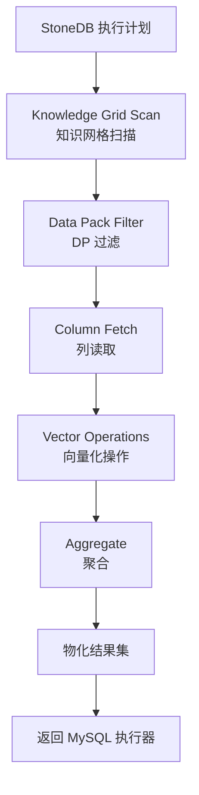
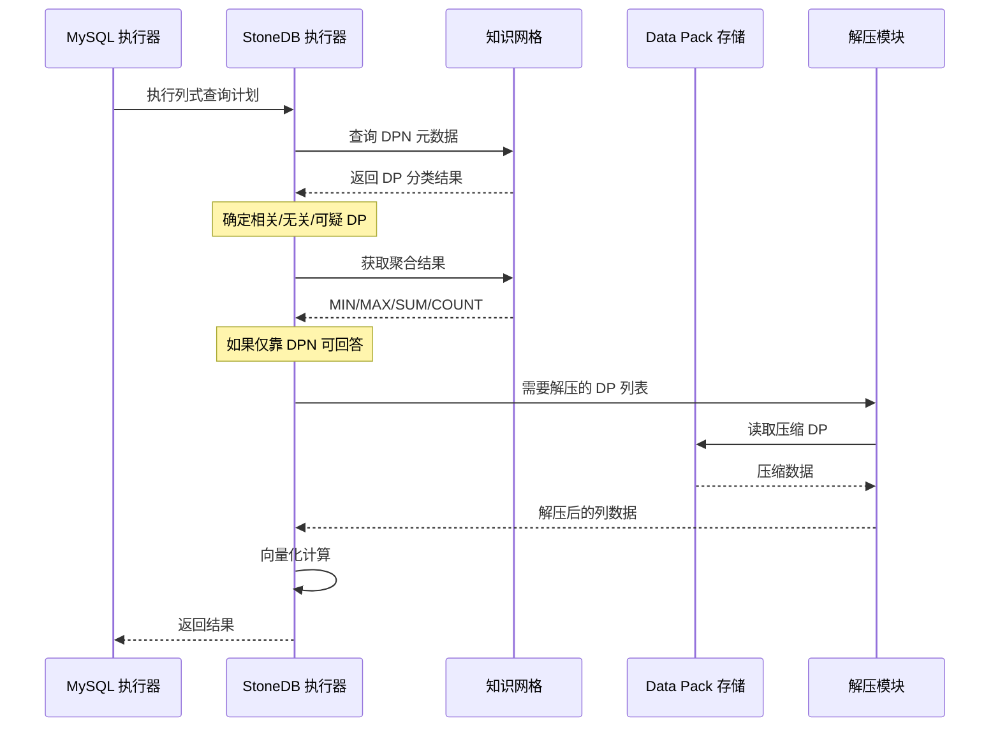
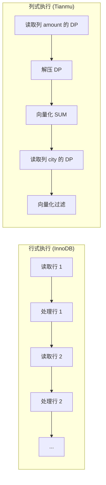

# 查询处理 — 执行器

## 学习目标

- 理解 StoneDB 列式执行器的工作方式
- 掌握知识网格驱动的执行流程

## 核心概念

- **StoneDB 执行器**：Tianmu 引擎的列式执行器，按列处理数据
- **向量化执行**：一次处理一批数据（Data Pack 级别），而非逐行
- **列式物化**：只在最后阶段物化结果集

## 执行器架构



## 执行流程详解



## 列式执行 vs 行式执行



### 列式执行的优势

1. **CPU 缓存友好**：连续内存访问，空间局部性好
2. **SIMD 向量化**：可利用 CPU 的 SIMD 指令并行处理
3. **减少数据搬运**：只读取需要的列，减少内存带宽消耗
4. **批量处理**：Data Pack 级别处理，减少函数调用开销

## 执行器操作原语

StoneDB 执行器包含以下列式操作原语：

| 原语 | 说明 | 示例 |
|------|------|------|
| KG_Scan | 知识网格扫描 | 返回满足条件的 DP 列表 |
| Column_Fetch | 读取列数据 | 从列文件读取指定 DP |
| Vector_Filter | 向量化过滤 | 条件过滤，返回位置掩码 |
| Vector_Aggr | 向量化聚合 | SUM/COUNT/AVG/MIN/MAX |
| Vector_Arith | 向量化算术 | 列间加减乘除 |
| Vector_Join | 向量化 JOIN | 利用 Pack-to-Pack 加速 |

## 执行示例

查询 `SELECT city, AVG(amount) FROM orders GROUP BY city`：

```mermaid
flowchart TD
    Q[查询] --> SCAN[1. KG_Scan: 扫描 orders 表]
    SCAN --> FETCH_C[2. Column_Fetch: 读取 city 列 DP]
    FETCH_C --> FETCH_A[3. Column_Fetch: 读取 amount 列 DP]
    FETCH_A --> AGGR[4. Vector_Aggr: 按 city 分组 AVG(amount)]
    AGGR --> RESULT[5. 返回结果集]
```

## 要点总结

- StoneDB 执行器是列式执行器，以 Data Pack 为单位处理数据
- 知识网格扫描是执行的第一步，也是最关键的一步，决定了需要解压哪些 DP
- 列式执行利用向量化、SIMD、缓存友好等特性提升性能
- 执行器操作原语封装了列式处理的核心操作

## 思考题

1. 列式执行器中，向量化过滤（Vector_Filter）返回的是"位置掩码"而非过滤后的行数据，这种设计有什么好处？
2. GROUP BY 操作在列式引擎中如何高效实现？与行式引擎的 Hash Aggregation 有何不同？
3. 如果查询同时涉及列存表和行存表的 JOIN，StoneDB 执行器如何处理？