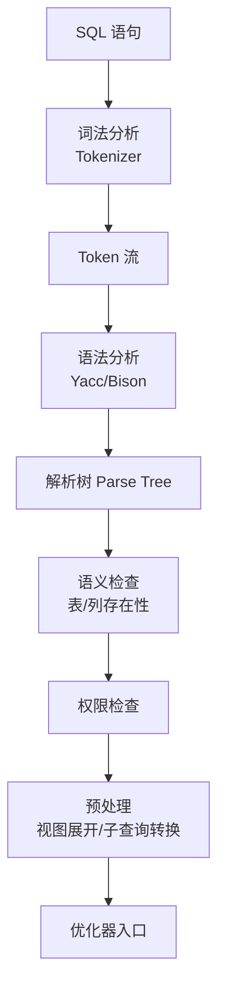
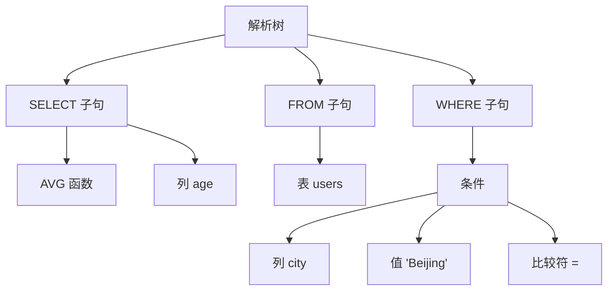
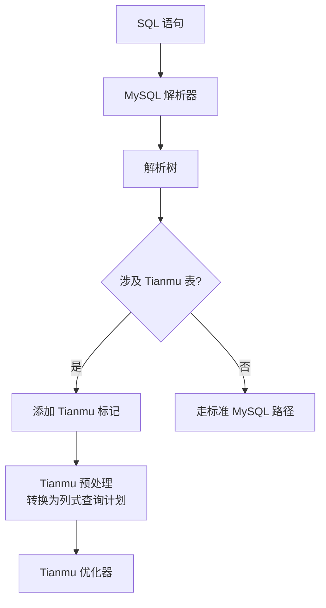

# 查询处理 — 解析器

## 学习目标

- 理解 StoneDB 查询解析器的工作流程
- 掌握 Tianmu 引擎如何扩展 MySQL 解析器

## 核心概念

- **MySQL 解析器**：词法分析 + 语法分析，生成解析树
- **StoneDB 扩展**：在 MySQL 解析树基础上，Tianmu 引擎添加自己的优化逻辑
- **预处理**：解析后检查表是否存在、列是否存在、权限校验

## 解析流程



### 词法分析

MySQL 的词法分析器将 SQL 字符串拆分为 Token：

```sql
SELECT AVG(age) FROM users WHERE city = 'Beijing'
-- Token: SELECT, AVG, (, age, ), FROM, users, WHERE, city, =, 'Beijing'
```

### 语法分析

使用 Yacc/Bison 生成语法分析器，检验 SQL 语法结构：

```sql
-- 合法: SELECT * FROM t WHERE id > 10
-- 非法: SELECT FROM WHERE (语法错误)
```

语法分析产生解析树（Parse Tree），每个节点代表一个 SQL 元素。

## 解析树结构



## StoneDB 的解析扩展

StoneDB 在 MySQL 解析器基础上，为 Tianmu 引擎添加了特殊处理：



### 引擎识别

解析器在预处理阶段确定表使用的存储引擎：

```sql
-- Tianmu 引擎表
CREATE TABLE t (id INT, name VARCHAR(100)) ENGINE=Tianmu;

-- 解析时发现 t 是 Tianmu 表，标记为列存路径
SELECT AVG(age) FROM t WHERE city = 'Beijing';
```

## 要点总结

- 解析器是 MySQL 标准的词法 + 语法分析器，生成解析树
- 解析树包含 SQL 查询的完整结构信息
- 解析后根据表定义的存储引擎，分流到不同处理路径
- Tianmu 引擎表在解析阶段被标记，后续走列存查询路径

## 思考题

1. 解析树和优化器使用的查询计划树（Query Plan）有什么区别？
2. StoneDB 如何判断一个 SQL 查询应该走 InnoDB 还是 Tianmu 引擎？
3. 如果查询中同时涉及 InnoDB 表和 Tianmu 表，解析器如何处理？