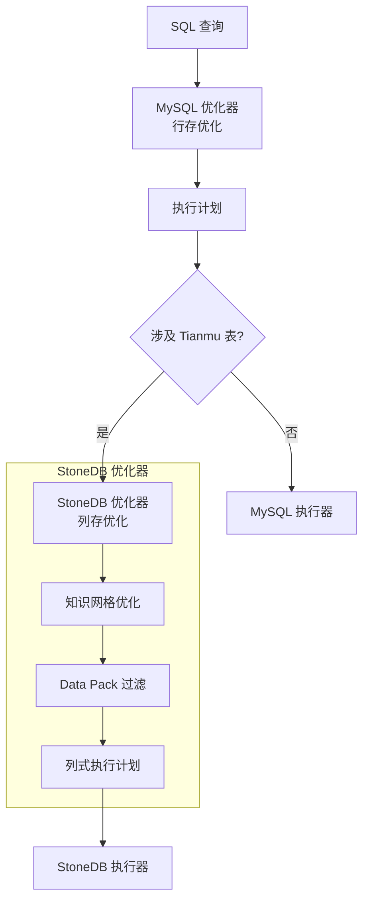
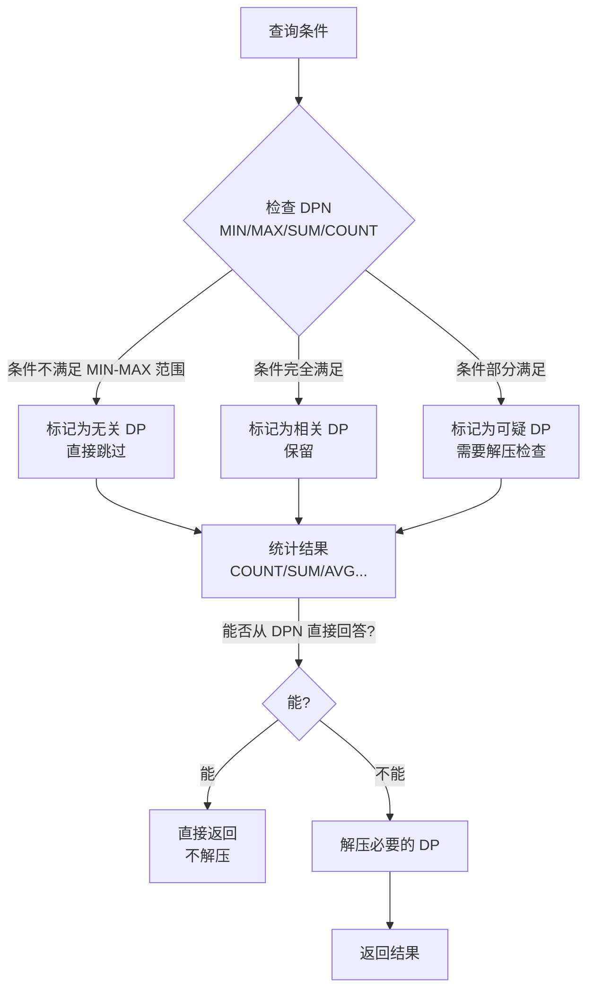
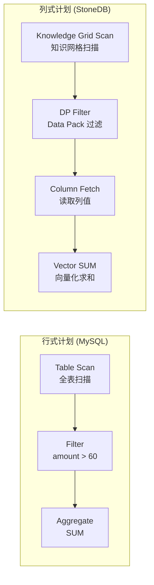

# 查询处理 — 优化器

## 学习目标

- 理解 StoneDB 双优化器的分工与协作
- 掌握知识网格优化器的核心算法

## 核心概念

- **MySQL 优化器**：成本模型 + 索引选择 + JOIN 排序
- **StoneDB 优化器**：知识网格优化 + 列式执行计划转换
- **知识网格优化**：利用 DPN 和 Knowledge Node 过滤无关 Data Pack

## 双优化器架构

### MySQL 优化器的角色

MySQL 优化器负责：
1. **表连接顺序**：决定 JOIN 表的顺序
2. **索引选择**：选择最优索引（InnoDB 表）
3. **访问方法**：全表扫描 vs 索引扫描
4. **成本估算**：基于统计信息估算执行成本

### StoneDB 优化器的角色

StoneDB 优化器在 MySQL 优化器之后运行，负责：
1. **知识网格过滤**：利用 DPN 和 Knowledge Node 过滤 Data Pack
2. **列式执行计划生成**：将标准的行式执行计划转换为列式操作
3. **表达式优化**：将 SQL 表达式转为列式执行的原语

## 知识网格优化流程

### 示例：知识网格过滤

表 `orders` 的列 `amount` 有 100 个 Data Pack：

| DP | MIN | MAX | SUM | COUNT |
|----|-----|-----|-----|-------|
| DP0 | 10 | 50 | 1500 | 50 |
| DP1 | 100 | 200 | 9000 | 60 |
| DP2 | 30 | 80 | 3300 | 55 |
| ... | ... | ... | ... | ... |

查询 `SELECT SUM(amount) FROM orders WHERE amount > 60`：

1. DP0：MAX=50 < 60 → **无关**，跳过
2. DP1：MIN=100 > 60 → **相关**，保留
3. DP2：MAX=80 > 60 且 MIN=30 < 60 → **可疑**，需要解压

最终结果：只解压 DP2，DP1 可直接从 DPN 累加 SUM。

## 列式执行计划

StoneDB 优化器将行式执行计划转换为列式原语：

## 要点总结

- StoneDB 有双优化器：MySQL 优化器处理整体执行计划，StoneDB 优化器处理列存优化
- 知识网格优化是核心：利用 DPN 的 MIN/MAX/SUM 等元数据过滤无关 Data Pack
- 大多数聚合查询可以直接从 DPN 回答，无需解压底层数据
- 列式执行计划将行式操作转换为列式原语，利用向量化执行

## 思考题

1. 知识网格过滤的精度取决于 DPN 的 MIN/MAX 范围，如果数据分布极不均匀，每个 DP 的 MIN-MAX 跨度很大，过滤效果会怎样？
2. StoneDB 优化器在 JOIN 查询中如何利用 Pack-to-Pack 信息加速？
3. 列式执行计划中的"向量化求和"相比行式逐行求和，核心优势在哪里？