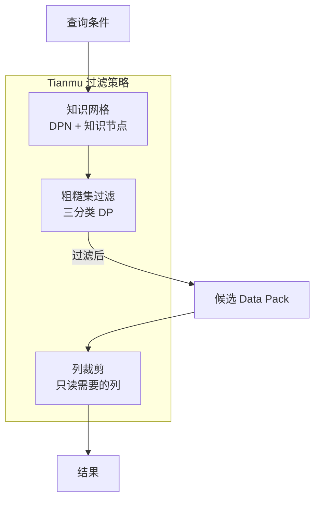
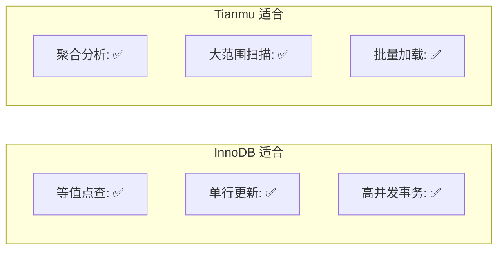

# 索引机制 — BTree 索引

## 学习目标

- 理解 StoneDB 引擎中 BTree 索引的使用方式
- 掌握 Tianmu 引擎的索引策略差异

## 核心概念

- **InnoDB BTree**：聚簇索引 + 二级索引，B+Tree 结构
- **Tianmu 索引**：Tianmu 引擎不维护传统 BTree 索引，依靠知识网格过滤
- **无索引列存**：列存通过列裁剪和知识网格替代索引的过滤功能

## InnoDB B+Tree 索引

使用 `ENGINE=InnoDB` 的表使用标准的 MySQL B+Tree 索引：

```mermaid
graph TB
    subgraph "B+Tree 结构"
        ROOT[根节点<br/>主键范围]
        ROOT --> L1[内部节点]
        ROOT --> L2[内部节点]
        L1 --> LEAF1[叶子节点<br/>(主键, 行数据)]
        L1 --> LEAF2[叶子节点]
        L2 --> LEAF3[叶子节点]
        L2 --> LEAF4[叶子节点]
    end
```

### 聚簇索引

InnoDB 的主键聚簇索引：

- 叶子节点存储完整行数据
- 按主键有序排列
- 二级索引的叶子节点存储主键值（回表）

### 二级索引

```mermaid
graph LR
    A[二级索引<br/>(name, pk)] -->|查询 name| B[找到主键值]
    B -->|回表| C[聚簇索引<br/>找到行数据]
```

## Tianmu 列存索引策略

Tianmu 引擎不维护 BTree 索引，而是通过以下机制实现过滤：



### 为什么不建索引？

列存引擎不需要传统索引的原因：

1. **知识网格替代索引过滤**：DPN 的 MIN/MAX 范围过滤比 BTree 索引更适合范围查询
2. **列裁剪减少 I/O**：只需读取查询涉及的列，而非整行
3. **压缩减少 I/O**：数据压缩后，读取的数据量大幅减少
4. **批量扫描更高效**：列存更适合全表扫描和大范围扫描

### 适用场景对比

| 场景 | InnoDB（有索引） | Tianmu（无索引） |
|------|-----------------|-----------------|
| 等值查询（WHERE id=1） | O(log N) 极快 | 需要全 DP 扫描 |
| 范围查询（WHERE age>30） | 索引范围扫描 | 知识网格过滤 |
| 聚合查询（AVG(salary)） | 全表扫描 | 知识网格直接回答 |
| 多条件过滤 | 复合索引 | 知识网格过滤 |



## 要点总结

- InnoDB 使用 B+Tree 聚簇索引 + 二级索引，适合点查和高并发事务
- Tianmu 引擎不维护 BTree 索引，通过知识网格实现数据过滤
- 列存通过列裁剪、压缩、知识网格替代传统索引的功能
- 选择引擎时需要考虑工作负载的查询模式

## 思考题

1. 如果 Tianmu 表上执行 `WHERE id=123` 这种等值查询，查询性能如何？与 InnoDB 索引相比差多少？
2. 能否在 Tianmu 表上显式创建索引？如果可以，会有什么效果？
3. 知识网格过滤与 BTree 索引在范围查询场景下，各自的优势和劣势是什么？