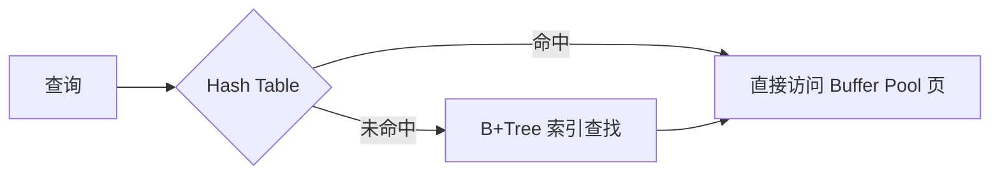
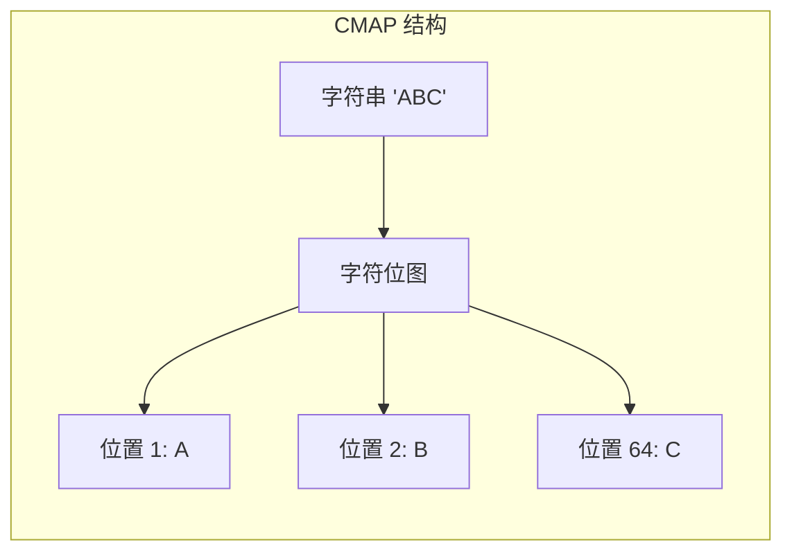

# 索引机制 — Hash 索引

## 学习目标

- 理解 InnoDB 自适应哈希索引的工作原理
- 掌握 Tianmu 引擎的内存哈希结构

## 核心概念

- **自适应哈希索引（AHI）**：InnoDB 自动构建的内存哈希索引
- **Tianmu 哈希结构**：用于知识网格中的快速查找

## InnoDB 自适应哈希索引

InnoDB 的 Adaptive Hash Index（AHI）是自动构建的：



### AHI 特性

- **自动构建**：InnoDB 监控索引访问模式，自动创建哈希索引
- **内存结构**：只存在于内存，不持久化
- **基于 B+Tree**：哈希索引指向 B+Tree 的叶子节点
- **分区**：AHI 被分区以减少锁竞争

### AHI 的触发条件

```sql
-- 等值查询频繁才会触发 AHI 构建
SELECT * FROM users WHERE id = 100;  -- 等值查询
SELECT * FROM users WHERE name = 'Alice';  -- 如果 name 有索引
```

## Tianmu 知识网格中的哈希结构

Tianmu 引擎在知识网格中使用哈希结构：

```mermaid
graph TD
    subgraph "Tianmu 哈希使用场景"
        H1[列值哈希<br/>字符串快速匹配]
        H2[DPN 哈希索引<br/>DP ID → DPN 位置]
        H3[Pack-to-Pack 矩阵<br/>二维位图]
    end

    H1 --> H1A[CMAP<br/>字符位图]
    H2 --> H2A[O(1) 访问 DPN]
    H3 --> H3A[JOIN 加速]
```

### CMAP（Character Map）

CMAP 是 Tianmu 用于字符串列的哈希结构：



CMAP 将字符串中前 64 个位置的字符映射为一个位图，用于快速判断 DP 是否包含特定字符串。

## Hash 索引对比

| 维度 | InnoDB AHI | Tianmu CMAP |
|------|-----------|-------------|
| 用途 | 加速 B+Tree 等值查询 | 判断 DP 是否包含目标值 |
| 构建方式 | 自动监控+构建 | 数据加载时自动创建 |
| 存储位置 | 内存 | 内存（知识网格） |
| 数据结构 | 哈希表 | 字符位图 |
| 适用条件 | 频繁等值访问 | 字符串列的过滤 |
| 持久化 | 不持久化 | 知识网格的一部分 |

## 要点总结

- InnoDB AHI 自动构建内存哈希索引，加速热点数据的等值访问
- Tianmu 不使用传统哈希索引，而是通过 CMAP 实现字符快速匹配
- Pack-to-Pack 矩阵使用位图实现快速 JOIN 条件过滤
- 哈希结构在 Tianmu 中是知识网格的组成部分，而非独立索引

## 思考题

1. InnoDB AHI 对写操作性能有什么潜在影响？
2. CMAP 只能覆盖前 64 个字符位置，如果字符串超过 64 字符且条件在尾部，会怎样？
3. Pack-to-Pack 矩阵在 JOIN 时如何快速判断两个 DP 是否存在匹配值？