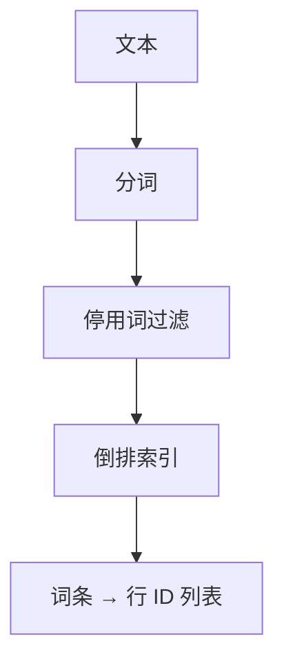
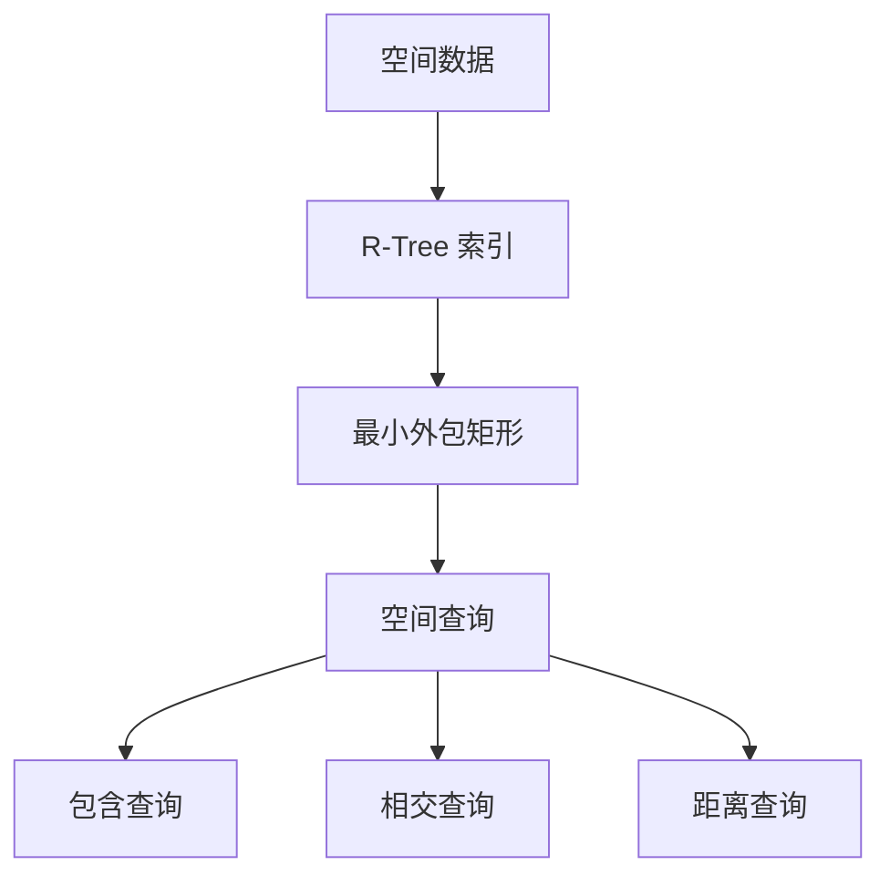
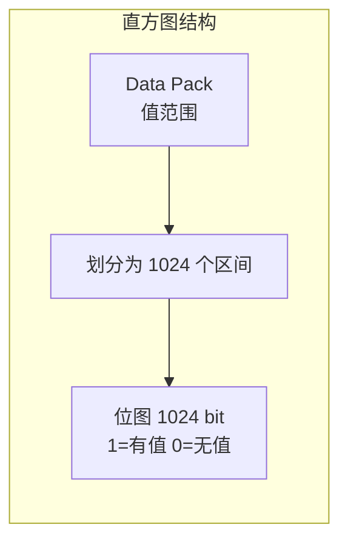
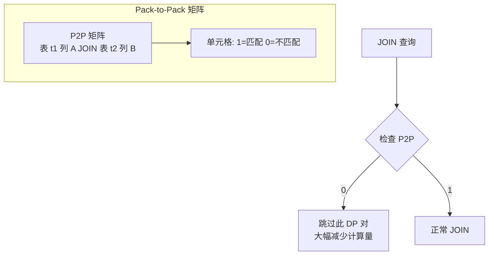

# 索引机制 — 其他索引与过滤

## 学习目标

- 了解 StoneDB 中其他可用的索引类型
- 掌握 Tianmu 引擎的辅助过滤技术

## 核心概念

- **全文索引**：MySQL InnoDB 支持的全文检索
- **空间索引**：InnoDB 的地理空间数据索引
- **直方图**：Tianmu 知识网格中用于数值列的概率分布信息
- **Pack-to-Pack**：Tianmu 中用于 JOIN 加速的位图矩阵

## 全文索引（InnoDB）

InnoDB 支持全文索引（FULLTEXT INDEX），用于文本搜索：



```sql
-- 创建全文索引
CREATE FULLTEXT INDEX idx_content ON articles(content);

-- 全文搜索
SELECT * FROM articles WHERE MATCH(content) AGAINST('数据库');
```

## 空间索引（InnoDB）

InnoDB 支持空间索引，用于地理空间数据：



```sql
CREATE SPATIAL INDEX idx_geo ON locations(geo_point);
SELECT * FROM locations WHERE ST_Contains(geom, POINT(116, 40));
```

## Tianmu 直方图（Histogram）

Tianmu 知识网格中的直方图是对数值列的概率分布估计：



直方图在查询过滤中的作用：

```sql
-- 表 orders 的列 amount，DP 0 的直方图
-- 区间 0: 值 0-10    → bit=1 (有值)
-- 区间 1: 值 11-20   → bit=0 (无值)
-- ...
-- 区间 1023: 值 10230-10240 → bit=1 (有值)

-- 查询: WHERE amount > 1000 AND amount < 2000
-- 直方图对照: 检查对应区间是否有值
-- 如果没有 → DP 直接跳过
```

直方图与 DPN 的 MIN/MAX 配合使用：

| 过滤层级 | 粒度 | 信息量 | 是否需要解压 |
|---------|------|--------|------------|
| DPN MIN/MAX | DP 级别 | 大致范围 | 否 |
| 直方图 | 区间级别 | 分布信息 | 否 |
| 解压过滤 | 行级别 | 精确值 | 是 |

## Pack-to-Pack（P2P）

Pack-to-Pack 是 Tianmu 专用于 JOIN 加速的结构：



Pack-to-Pack 矩阵的含义：

| | t2.DP0 | t2.DP1 | t2.DP2 | t2.DP3 |
|--|--------|--------|--------|--------|
| **t1.DP0** | 1 | 0 | 1 | 0 |
| **t1.DP1** | 0 | 1 | 0 | 1 |
| **t1.DP2** | 1 | 1 | 0 | 0 |

- 行：t1 表的列 A 的每个 DP
- 列：t2 表的列 B 的每个 DP
- 值：1 表示两个 DP 之间存在匹配值，0 表示不存在
- 构建时机：首次执行 JOIN 时自动构建

## 索引和过滤技术总结

| 技术 | 引擎 | 用途 | 粒度 |
|------|------|------|------|
| B+Tree 索引 | InnoDB | 点查/范围查 | 行级 |
| 全文索引 | InnoDB | 文本搜索 | 词条级 |
| 空间索引 | InnoDB | 地理数据 | R-Tree |
| AHI | InnoDB | 热点加速 | 自适应 |
| DPN MIN/MAX | Tianmu | DP 过滤 | DP 级 |
| 直方图 | Tianmu | 数值分布 | 区间级 |
| CMAP | Tianmu | 字符串匹配 | 字符级 |
| Pack-to-Pack | Tianmu | JOIN 加速 | DP 对级 |

## 要点总结

- InnoDB 支持 B+Tree、全文索引、空间索引等多种索引类型
- Tianmu 通过知识网格实现过滤：DPN（MIN/MAX）、直方图、CMAP、Pack-to-Pack
- 直方图将 DP 内值分为 1024 个区间，估计数据分布
- Pack-to-Pack 矩阵在 JOIN 查询中快速排除无匹配的 DP 对
- 知识网格的多级过滤让 Tianmu 能在不解压数据的情况下回答大量查询

## 思考题

1. 直方图有 1024 个区间，每个区间 1 bit，一个 DP 的直方图只需要 128 字节。这个设计对内存使用的意义是什么？
2. Pack-to-Pack 矩阵在表数据频繁更新时如何维护？全量重建还是增量更新？
3. 当 InnoDB 的 B+Tree 索引和 Tianmu 的知识网格都可用于过滤时，系统如何选择更优的路径？